2023年9月5日星期二


# preemption


搞清楚抢占和调度都是怎么发生？

## user-space preemption

用户进程抢占调度

### resume_userspace

根据sstatus.SPP，可知要返回*kernel*还是*userspace*

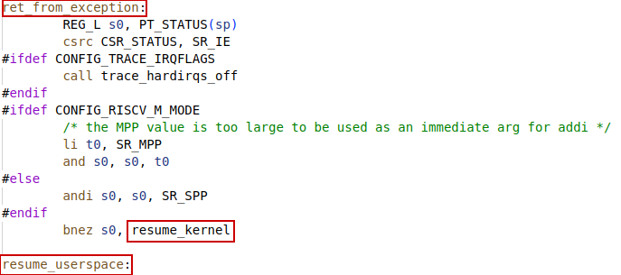


在中断或者异常响应结束，返回用户空间之前，会检查`current_thread_info->flags`，来确定是否有调度工作（work_pending）


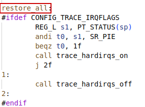

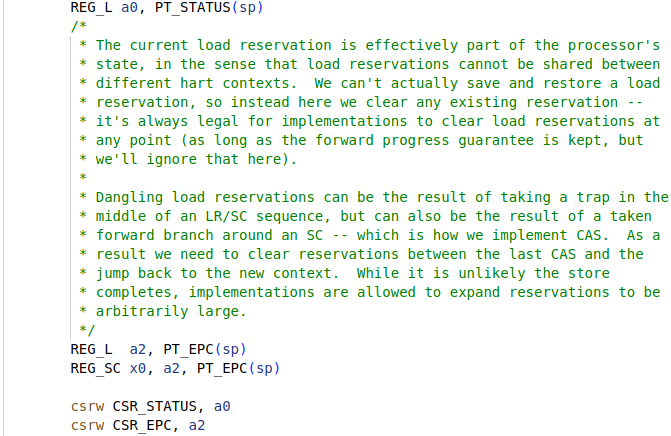

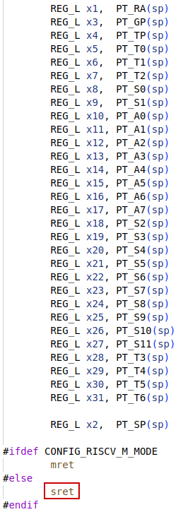


### work_pending

如果**current_thread_info->flags**中，`_TI_NEED_RESHED`标志置位，则进行调度(schedule)。否则调用`do_notify_resume`。(由于ra已经设置为ret_from_exception，所以这里都使用tail指令来跳转，而不是call)


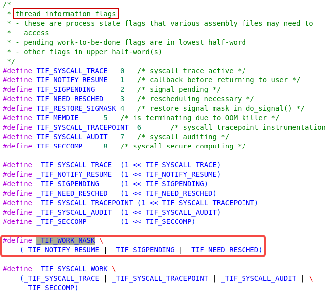


#### schedule()

This scheduler called in this occasion loop between `ret_from_exception` and returning to *userspace*.

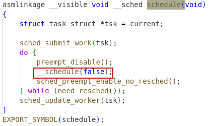


## kernel-space preemption

内核进程抢占调度

### resume_kernel

在中断或者异常响应处理结束前，会检查是否需要对**内核线程**进行抢占调度：


`CONFIG_PREEMPTION` : 代表是否支持**内核**抢占调度，如果支持则执行抢占调度，否则跳转到`restore_all`


assembler directive: `.set`

[Pseudo Ops (Using as) (sourceware.org)](https://sourceware.org/binutils/docs/as/Pseudo-Ops.html)

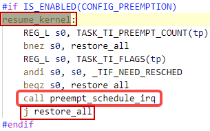


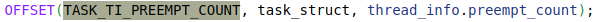

If the `thread_info.preempt_count` is not zero, preemption is not allowed, i.e., it will restore the previous context and continue what has been interrupted.


#### preempt_schedule_irq

This scheduler called in this occasion loop between `ret_from_exception` and returning to *kernel* space.

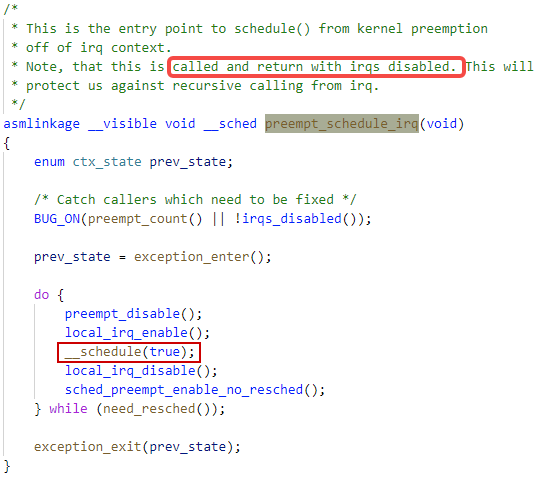


### preempt_count()


### CONFIG_PREEMPTION


PREEMPTION是由其它配置决定的，主要是PREEMT和ARCH_NO_PREEMPT，即硬件支不支持抢占。PREEMPT相当于**Preemptible Kernel**配置。PREEMPT_RT（realtime）如果支持的话，同样可以配置内核为抢占状态。


总共有三个抢占模式：（可能还有实时模式）


分别对应：

CONFIG_PREEMPT_NONE					（非抢占，用于server）

CONFIG_PREEMPT_VOLUNTARY			     （自愿抢占，桌面系统常用）

CONFIG_PREEMPT -> CONFIG_PREEMPTION 	（抢占）


如果没有配置`CONFIG_PREEMPT`，则Linux内核将不会具有抢占功能。如果还没有配置`CONFIG_PREEMPT_VOLUNTARY`则函数`might_sleep()`将近似等于空函数，即不能调用`_cond_resched()`来调度其它任务。也就不具备自主出让CPU的能力，只能完全执行完当前程序退出后，才能出让CPU给其它任务。


### `might_sleep()`


如果内核配置了PREEMPT功能，则也不再会包括具体的任务调度功能到`cond_resched()`函数中。


### `cond_resched()`

用来在非抢占内核中，主动让出CPU以调度用户空间的程序。


### `___might_sleep`

主要作用：协助debug内核


`___might_sleep`函数是用来debug内核的，如果不配置DEBUG_KERNEL则会被作为空函数编译：

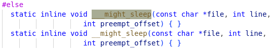


## __schedule

（`__schedule()`：主要的scheduler函数）

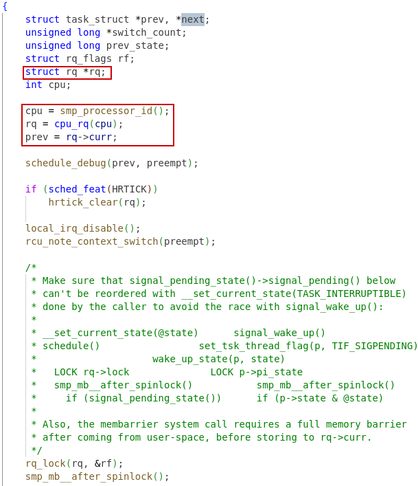


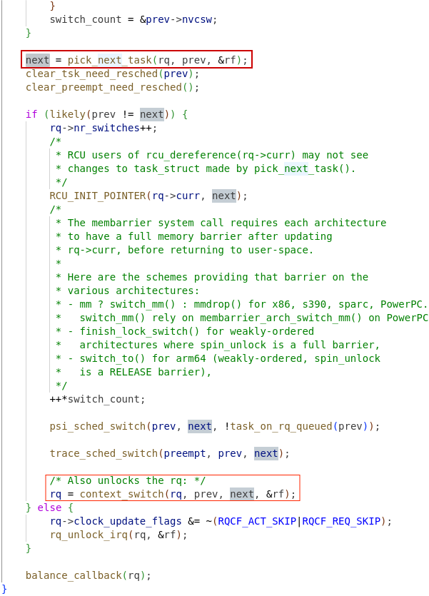


### context_switch

（线程）上下文切换包含地址空间的切换。

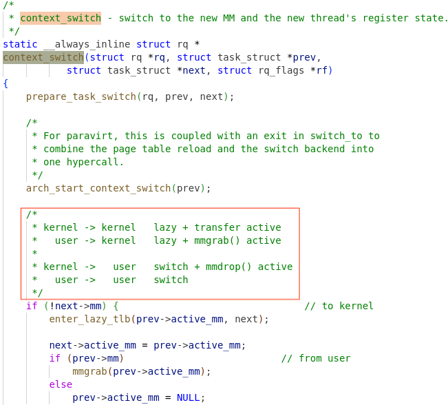

只有切换到user-space才需要做虚拟地址空间转换（switch_mm），内核空间被映射到了所有的user-space的高地址。只有这种情况下，内核地址段在所有的地址空间都是有效的。


#### address spaces

ref: linux/Documentation/vm/active_mm.rst

**address space**对应于`mm_struct`，因此每个用户进程对应一个address space。它们被称为”real address spaces”。而处于内核空间中的内核线程和中断/异常处理程序都没有对应的mm_struct，以及在用户进程中在内核态处理系统调用时，所以内核地址空间被称为”anonymous address spaces”。


lazy users: lazy context: kernel threads: mm_struct tsk->active_mm (tsk->mm==NULL): 

mm_count: lazy users + (mm_users? 1: 0)


real users: user thread context: “real threads”: mm_struct tsk->mm: 

mm_users: number of real users, i.e. threads in a user process


- Virtual Address Space
  - kernel space
  - user space
- Context
  - thread context
    - kernel thread(/**process** for historical reason) in kernel space
    - user thread in kernel/user space
    - work-queue in kernel space
  - interrupt context (always in kernel space)
    - hardware interrupt context
    - software interrupt context (softirqs / tasklets) atomic context


user space/ kernel space（用户空间，内核空间）是对虚拟地址空间而言的；user context/interrupt context是对是否有隶属的task struct而言的？因为task struct是用来存储上下文的基础。

上下文区别之一：中断上下文使用**当前线程**的内核栈，线程上下文使用自己的线程栈或者内核栈。

中断上下文不可抢占，也不可以主动调度

#### 中断上下文

- 虚拟地址空间：用户空间，内核空间
- 上下文：线程上下文，中断上下文

地址空间(address_space)跟代码的虚拟地址有关系。如果代码的虚拟地址在高1G（32位系统中），则位于内核空间，否则位于用户空间。

在`entry.S`文件中，`ENTRY(handle_exception)`指定了产生中断/异常时执行流跳转的位置。在进入中断处理全程中时，会保存中断现场到（线程的）内核栈；

在处理完中断/异常（`handle_arch_irq/handle_syscall/excp_vect_table`）后，从中断环境退出时，会先恢复用户/内核空间（`resume_userspace/resume_kernel`），再恢复其它的中断现场（`restore_all`），最终执行`sret`回到被中断前的位置。

执行**系统调用或者响应异常事件**时，执行的代码在`[handle_exception, sret]`区间，也是处于线程上下文，它的上下文可以存储于相应线程的task_struct的kernel stack，在执行过程中相应的preemption counter也不会被修改，因此也可以被调度。

在`[handle_exception, sret]`区间，即使是处理**中断事件**(handle_arch_irq)时，也不都是处于中断上下文。只有处于`irq_enter()`和`irq_exit()`之间的代码，才会因此其中增加preemption counter的值而进入**中断上下文**（interrupt context）。首先，中断事件产生时全局中断会被硬件关闭，这就阻止了被动抢占的可能（处理异常时，会恢复之前的全局中断的状态，即之前是开的就打开，之前是关的就还关着）。在中断例程执行过程中，都会保持全局中断的关闭，即使在执行softirq时，打开硬中断前，也会关闭softirq，即增加preemption counter的值。在执行完softirq减去 preemption counter中相应的值前，又会关闭硬中断，因此，整个中断事件处理过程都是不可调度的。但是只要preemption counter中的hardirq和softirq counter被清0，就代表着回到了**线程上下文**（thread context）。即使是响应中断事件，在`resume_kernel`或者`resume_userspace`阶段，都是可能被调度的。


##### in_interrupt


hardirqs, bottom halves, softirqs, tasklets, workqueue

user context, interrupt context, spinlock held

用户（进程）上下文（thread context）和中断上下文（interrupt context），应该是用来大概区分CPU资源的正常使用者，中断例程环境等和其它状态的区别。可以广义地将所有的状态全部分划分到这两种（所有线程，包括内核线程和用户线程均划分为user context，hardirqs和系统调用等异常划分为interrupt context，softirqs?）；也可以狭义地将它们定义为两种状态，剩下的其它状态分别为它们命名。


##### schedule occasion

如果线程切换只发生在中断返回时（`resume_userspace/resume_kernel`），那么跟线程交互的接口只有**中断入口及中断返回**（entry/sret），线程调度不直接作用到被中断的线程上。

- 对于**用户线程**，肯定是这样的。因为用户态只能通过系统调用trap到内核态，才能主动schedule，而被动schedule也只能是由中断或异常触发。
- 对于**内核线程**（/进程，历史原因可以这么叫），主动schedule时，会直接从**线程上下文**进行。

因此，线程调度只发生在内核态，swapping只会与task struct和kernel stack有关系。


#### task_struct

所有的内核线程使用同一个VMA空间（Virtual Memory Address space，会映射到每一个用户进程的VMA的高位区域），但是使用不同的task struct。Linux系统中的线程（Thread）是一种轻量级进程（Light Weight Process）。每一个进程/线程（LWP)相当于一个任务（task），进程/线程调度的对象是`task_struct`。当线程结束时，会释放相应的`task_struct`所占用的的空间。


在U模式下特殊寄存器`sscratch`指向当前进程/线程的`task_struct`，进入内核态后就读到tp寄存器中。LWP(Light Weight Process)相对就于一组（**`task_struct`+kernel stack**)。不管是内核进程，还是用户线程，都有一组（**`task_struct`+kernel stack** ），所以它们才能被schedule调度。

task_struct/kernel stack（内核栈）和线程/进程间的关系如下图所示：


##### context:

- interrupt context, the context is based on the **kernel stack** of the interrupted threads. So it must not be scheduled, or it will block threads randomly while interrupting them.
- kernel process context, all threads have **kernel stack** used in privilege mode.
- user thread context, only user threads have **user stack** to store function context and local variables


top程序中，统计负载时，都是怎么划分的呢？

Guess:

- usr: time spent in user mode
- sys: time spent in system mode, including kernel threads and system calls.
- irq: time spent in hardirq
- sirq: time spent in softirq


###  switch_to


线程切换时，需要保存和恢复线程上下文。

**线程上下文**保存在task->thread (`thread_struct`)中。线程切换一定发生在内核态，且在schedule函数中。在`switch_to`函数中，完成了**执行流**的切换（`__switch_to`函数中ra的值发生了切换，因此函数返回后就到了新线程中）。

根据C语言的编译规则，此时的需要保存的现场包括`sp`（内核栈指针），`s`寄存器和`ra`寄存器（调用`__switch_to`函数后的返回地址）。而其它`a`寄存器和`t`寄存器的**有效范围**，不超出`__switch_to`函数，因此不需要保存。


#### TASK_THREAD_RA

这个宏是由C文件中内联汇编成S文件，然后由脚本处理回.h头文件。所以在编译后的工程中才能找到。


### prepare_task_switch


### finish_task_switch


###  switch_mm


#### ASID


“mm context tagged TLBs”应该是指的ASID(Address specified Identifier)。从`switch_mm`的实现代码推断ASID的特性还未被内核（v5.10）利用起来。内核地址段还是固定地映射到所有的user-space空间中。


# explicit schedule() call


## schedule_timeout

```c
/**
 * schedule_timeout - sleep until timeout
 * @timeout: timeout value in jiffies
 *
 * Make the current task sleep until @timeout jiffies have elapsed.
 * The function behavior depends on the current task state
 * (see also set_current_state() description):
 *
 * %TASK_RUNNING - the scheduler is called, but the task does not sleep
 * at all. That happens because sched_submit_work() does nothing for
 * tasks in %TASK_RUNNING state.
 *
 * %TASK_UNINTERRUPTIBLE - at least @timeout jiffies are guaranteed to
 * pass before the routine returns unless the current task is explicitly
 * woken up, (e.g. by wake_up_process()).
 *
 * %TASK_INTERRUPTIBLE - the routine may return early if a signal is
 * delivered to the current task or the current task is explicitly woken
 * up.
 *
 * The current task state is guaranteed to be %TASK_RUNNING when this
 * routine returns.
 *
 * Specifying a @timeout value of %MAX_SCHEDULE_TIMEOUT will schedule
 * the CPU away without a bound on the timeout. In this case the return
 * value will be %MAX_SCHEDULE_TIMEOUT.
 *
 * Returns 0 when the timer has expired otherwise the remaining time in
 * jiffies will be returned. In all cases the return value is guaranteed
 * to be non-negative.
 */
signed long __sched schedule_timeout(signed long timeout)
{
	struct process_timer timer;
	unsigned long expire;

	switch (timeout)
	{
	case MAX_SCHEDULE_TIMEOUT:
		/*
		 * These two special cases are useful to be comfortable
		 * in the caller. Nothing more. We could take
		 * MAX_SCHEDULE_TIMEOUT from one of the negative value
		 * but I' d like to return a valid offset (>=0) to allow
		 * the caller to do everything it want with the retval.
		 */
		schedule();
		goto out;
	default:
		/*
		 * Another bit of PARANOID. Note that the retval will be
		 * 0 since no piece of kernel is supposed to do a check
		 * for a negative retval of schedule_timeout() (since it
		 * should never happens anyway). You just have the printk()
		 * that will tell you if something is gone wrong and where.
		 */
		if (timeout < 0) {
			printk(KERN_ERR "schedule_timeout: wrong timeout "
				"value %lx\n", timeout);
			dump_stack();
			current->state = TASK_RUNNING;
			goto out;
		}
	}

	expire = timeout + jiffies;

	timer.task = current;
	timer_setup_on_stack(&timer.timer, process_timeout, 0);
	__mod_timer(&timer.timer, expire, MOD_TIMER_NOTPENDING);
	schedule();
	del_singleshot_timer_sync(&timer.timer);

	/* Remove the timer from the object tracker */
	destroy_timer_on_stack(&timer.timer);

	timeout = expire - jiffies;

 out:
	return timeout < 0 ? 0 : timeout;
}
EXPORT_SYMBOL(schedule_timeout);
```


# Others

Guide to hacking the Linux kernel 

https://www.kernel.org/doc/html/v5.10/kernel-hacking/hacking.html#introduction


## Memory layout

kernel被映射到了所有进行的vm空间，这样可以避免进出内核态的flush TLB的代价。


highmem是指由于物理地址空间大于虚拟地址空间，而无法映射到vm空间的部分。对于32位系统，如上图示，内核直接映射的虚拟地址空间只有1G（如果要再分配给high_memory，则会更小一些）。如果物理内存大于1G，就需要配置CONFIG_HIGHMEM以使部分虚拟地扯空间临时映射到high memory的物理地址。虚拟地址空间中的内核部分就需要有一部分作为temporary mapping。


因此，下图memory layout中，lowmem就对应于已经映射到vm空间的部分。


对于单个程序，memory map如下图所示：


