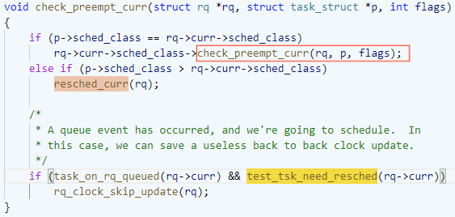
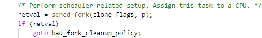
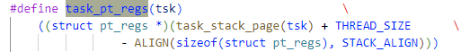
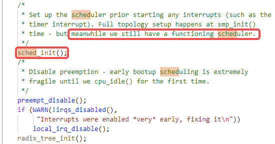
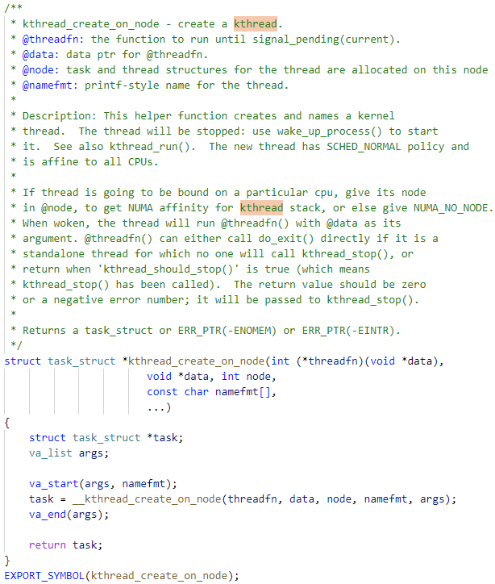

2023年7月6日星期四

## 进程树

0号进程在内核开始初始化的时候创建。在初始化结束时，转化为idle进程，以便系统没有其它任务时执行。

1号进程由0号进程通过`kernel_thread`函数创建。`kernel_init`函数运行第一个用户过程，然后孵化出其它用户进程，最终形成用户态进程树。

2号进程由0号进程能过`kernel_thread`函数创建。`kthreadd`负责内核态线程的调试和管理，是一个守护线程。内核相当于一个处于内核态的多线程进程（包含内核线程），且常驻内存永不退出。此外，内核还提供用户进程所需要的运行环境。

所有的线程都起于内核态，建立进程的过程是由内核来完成的，开始执行线程就是从调度器返回用户态。

从用户方向看，内核包括内核线程，系统调用，中断处理等。

当用户进程运行在内核态时（执行系统调用等），它访问内核的数据区和代码区，但使用另外的**用户线程**的内核栈。（因此可抢占，可重入）

当一个进程创建时，它几乎和父进程相同，它接受父进程地址空间的一个（逻辑）拷贝，并从进程创建的系统调用的下一条指令开始执行与父进程相同的代码。

###  `kthreadd`

- `kthreadd`函数会从`kthread_create_list`中取出要创建的线程。
- 然后调用’create_kthread`函数来创建线程。
- `kthread_create_list`中的线程是**`kthread_create`**函数加进来的。

### -> `create_kthread`

`create_kthread`同样调用`kernel_thread`来创建线程，但过程中间会通过`kthread`作为回调过度一下。而在这个过度函数中，调用了schedule让出了控制权。因此，线程真正的执行要等到调度器调度才开始。

另外一个附带效果是，所有的其它内核线程的入口都是**`kthread`**。

### -> `kthread`

`create->threadfn`源于`kthread_create`。`create`（`kthread_create_info`结构体）被整个传递给list，然后在`kthreadd`线程中被取出来，用于创建新线程。

### -> `kernel_thread`

需要查清楚`kernel_thread`是如何创建新线程的？

-> `kernel_clone`

会复制一个进程，只是加到runqueue队列里，会不会执行取决于调度器。

在`copy_process`中，直接复制了父线程的**task信息**

`wake_up_new_task`应该是~~开始相应task，即线程的执行~~。

-> `wake_up_new_task`

-> `activate_task`

要确认enqueue task函数中是否开始新线程的执行，即schedule：（未发现）

...

再检查`check_preempt_curr`函数中是否有schedule的操作。

~~根据描述，会尝试抢占当前线程~~。（实际上应该只是加到就绪队列）

##### `check_preempt_curr()`

... idle线程肯定会被抢占

...

这里的抢占是如何发生的？哪里有调用`schedule`函数来主动调度？

###### `resched_curr()`

#### -> `copy_process`

...

...

...

 ....

##### -> `copy_thread`

需要确认`p->flags`传入的参数是否包括`PF_KTHREAD`。这决定了刚孵化出的init进程处理于S模式还是M模式。（从`kernel_init`函数处理了很多内存相关任务看，刚孵化出的init进程应该还在S模式，直到执行init程序，在`kernel_execve`加载了init程序后，再返回到**ret_from_exception**，最后执行sret实现了到U模式的切换）

根据`p->thread.ra`所附的值是`ret_from_kernel_thread`或者是`ret_from_fork`，**线程切换**的时候就会分析切换到S模式或者U模式。这个区别应该是由`p->flags`参数是否包含`PF_KTHREAD`来决定。（thread结构体中保存的是｀线程上下文｀，即在switch_to中切换线程时需要save/restore）

执行`kernel_evecve`函数时，创建了新线程。然后，执行新的线程切换到了U模式。

###### task_pt_regs

这里返回的是内核栈的指针。（内核栈的栈空间是什么时候分配的呢？）

等于2个page。

（这样看，应该是分配了两个页的大小给内核栈。这里从栈中分配一个pt_regs的大小，然后返回基址给调用者）

这里为什么不叫STACK_SIZE或者THREAD_STACK_SIZE?

###### pt_regs

中断上下文（vs .thread），进入**中断**保存，退出**中断**恢复。

##### -> `ret_from_kernel_thread`

###### ret_from_exception

###### resume_kernel

### -> `sched_fork`

...

### init_task

#### task_struct

.thread在`task_struct`结构体的最后边。

##### .thread

线程上下文（vs pt_regs），线程换出时保存，换入时恢复。

### -> ‘start_thread`

在**加载elf文件**的最后，会调用`start_thread`来设置新线程的入口地址。也设置sstatus.spp为0

### -> `sched_init`

### -> `schedule`

（找出都有哪些地方会调用`schedule()`）

...

...

### -> `kthread_create`

这里只是创建线程并把它放到队列里，**真正的调用**还需要`__schedule()`函数.

### Spawn thread 1 and 2

如果有设置`CONFIG_PREEMPT_VOLUNTARY`，主动调度可能发生在

`schedule_preempt_disabled`之前。

## 线程与进程

进程是被执行的程序的一个实例。每个进程都有自己的memory space，包括code, data, stack, heap。进程会被OS分配相应的CPU时间，memory和I/O设备等。进程一般都有专属的地址空间，文件描述符和其它系统资源。

线程可以被认为是进程内部的一个轻量级执行单元，它可以被单独的调度到CPU上去执行。在一个进程中的线程共享进程的memory space和其它资源。这样，线程间通信的效率更高，同时线程可以并发执行，提高执行速度。由于更轻量级，线程的创建速度也更快。

每个用户进程拥有一个独立的地址空间，被从属线程共享。在多线程技术出现之前，调度的基本单位是进程。内核进程和用户进程都是进程，但内核进程都处在同一个虚拟内存空间下，而用户进程有各自独立的虚拟内存空间。为了方便中断及系统调用的响应，每一个用户进程的虚拟地址空间都把高地址的大约三分之一的空间留给内核空间。多线程技术发展出来之后，每个用户进程的任务的拆分成多个线程，然后对它们分别调度以提高并发性。这时，用户进程调度的基本单元变成了线程，而对内核进程的调度方式还跟原来一样。由于内核进程和内核空间的关系，与用户线程和用户进程空间的关系非常相似，所以直觉上内核进程反而应该称为内核线程。所以，user threads是线程，而kernel threads是进程。

User threads由user-level线程库创建和管理。