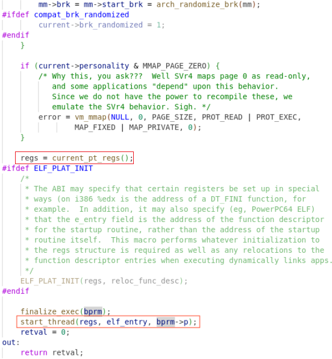

2023年8月8日星期二

# PID 1：第一个用户进程

在**`rest_init()`**中的一个重要工作就是创建第二个进程：1号进程。

`start_kernel()`一开始就会创建第一个进程：0号进程，并在完成初始化工作后，化身为idle进程。这是惟一一个没有通过`fork`或者`kernel_thread`产生的进程。

## kernel_init

`kernel_init()`函数返回后，返回到哪里了？（**ret_from_exception**）

1号进程创建时，将函数入口写入`thread`时，也将ra设置为**`ret_from_kernel_thread`**，因此执行kernel_thread创建1号进程后，且这个进程**被换入（执行switch_to）后**，将会return到这里。

然后在`ret_from_kernel_thread`中，会先执行**`schedule_tail`**完成正常进程切换中应该完成的剩余部分操作，再跳转到s0指向的入口地址，即`kernel_init`()。同时，也会将ra设置为**`ret_from_exception`**。因此，`kernel_init`函数执行完成后，将返回到`ret_from_exception`。

### copy_thread

除系统自举时的0号进程外，新创建的线程/进程，都会从ret_from_kernel_thread/ret_from_fork开始执行。

（进程/线程的开始执行，都是从`switch_to`()开始；switch后新的**ra寄存器**的值，使函数返回到新的线程。同时**tp**也更新为新的`task_struct`的地址）

### ret_from_kernel_thread

然后，根据`copy_thread`时设置的参数：

**s0=usp, s1=arg, sstatus=SPP|SPIE**

跳转`ret_from_kernel_thread`下一步，将跳转到usp所指向的地址，即**`kernel_init`的地址**。同时，在这里ra又被设置为了**`ret_from_exception`**，因此，`kernel_init`函数执行完后，函数return将会返回到`ret_from_exception`。同时，也设置了sstatus.spp|spie，即保持线程在S模式。

#### ret_from_exception

`kernel_init`函数执行完后，会再回到`ret_from_exception`。

线程内核栈是在`copy_thread`函数中的`task_pt_regs`即指向内核栈中”中断上下文”部分，它们首先被全部清0，然后给**gp=gp_in_global**和**status=PP|PIE**分别附了初值。`start_thread`中（1号线程中），又给**epc=elf_entry**和**sp**附了初值并更新了status寄存器。如果别的地方没有操作的话，ra应该是0。（也合理，sret到用户态后，不应该从这条路再回到内核态了，所以不需要ra的值了）

执行到sret后，会跳转到**epc所指向的地址**。同时特权级也会根据sstatus.spp发生切换。

#### schedule_tail

新创建的线程，被换入后应该调用的函数。

## run_init_process

从内核态到用户态的转换发生在执行完kernel_init函数，**return到`ret_from_exception`后**。`kernel_execve`执行`init`程序过程中，设置了**sstatus.spp=0和sepc=elf_entry**，所以在执行`ret_from_exception`到最后，**会执行sret**，然后跳转到init用户程序，并切换到U模式。

如果init程序崩溃，会引起系统不可用吗？根据网上查的信息，是的。它是所有进程的父进程。

### -> kernel_execve

暂时作为普通的elf文件来分析：

## load_elf_binary

获得elf文件解释器，用来处理动态库文件的链接。

### elf_interpreter

对于静态链接的elf文件，由于库文件在编译阶段就链接到elf文件中了，所以不再需要elf interpreter。同样，也不包括相应的INTERP段。

对于动态链接的elf文件，加载时需要interpreter来动态地将库文件链接进来。因此，就会包括额外的INTERP段。

### current_pt_regs()

获取当前进程的内核栈，然后为pt_regs分配空间，并返回基址。

### -> **`start_thread`**

在加载elf文件的最后，会调用`start_thread`来设置新线程的入口地址。同时，根据sstatus的设置，**在执行完kernel_init函数后会返回到ret_from_exception，然后sret后应该会切换到U模式并跳转到新的elf文件的入口地址**。（sstatus.spp没有置位）

## misc

### 初始sp

从传给`start_thread`的参数可知，sp源于`bprm->p`

向栈中传入参数时，先使能SUM，然后复制，最后禁止SUM

从栈中移除参数，并将占用的空间归还

### 访问用户空间

### `create_elf_tables`

...

## kernel_init_freeable

1号线程中，`kernel_init`函数最先执行此函数。它会等待`kthreadd_done`信号，即线程`kthreadd`（2号线程）创建完成后才会继续往前执行。

