# VFS

**VFS** forms unified interfaces for `syscall`s. Necessary `file_operations` will be implemented in device drivers

## ksys_write

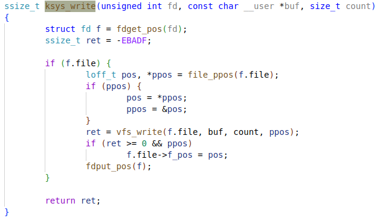

### vfs_write

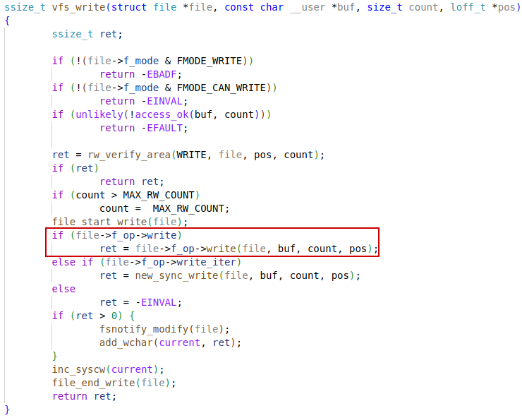

## ksys_read

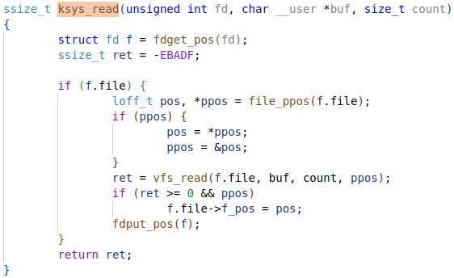

### vfs_read

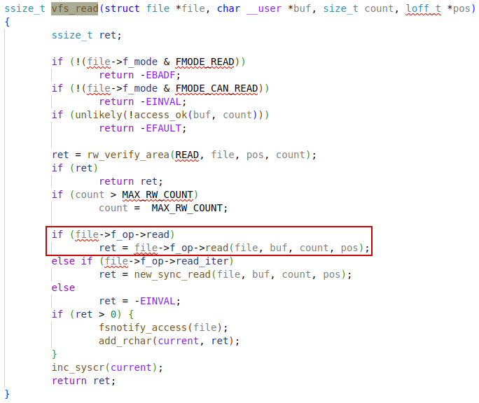

## fdget_pos

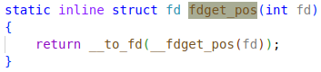


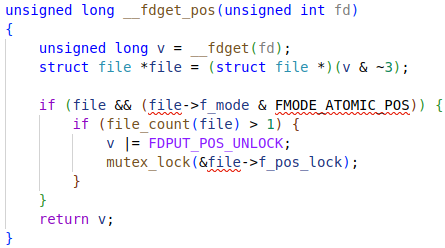

### __to_fd

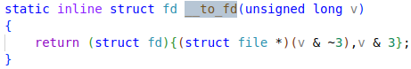

### __fdget

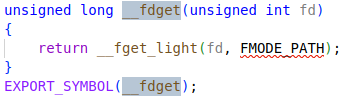

### __fget_light

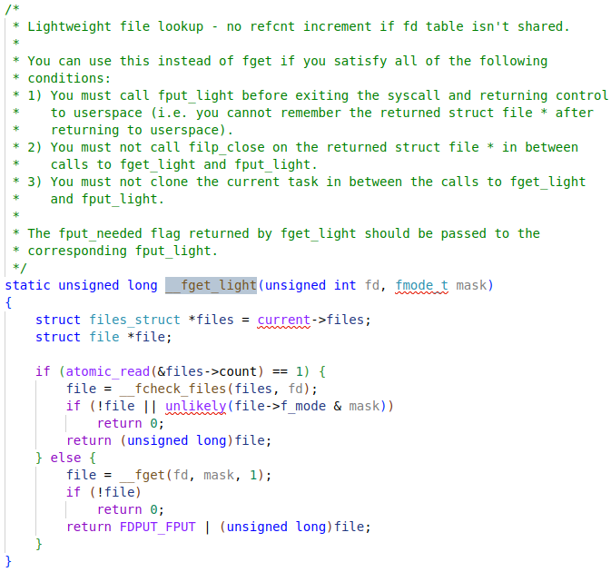


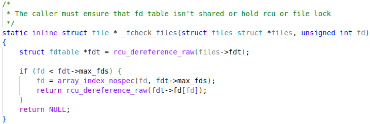


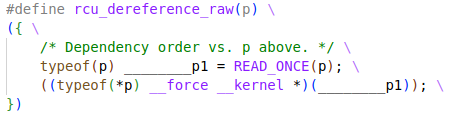

### READ_ONCE


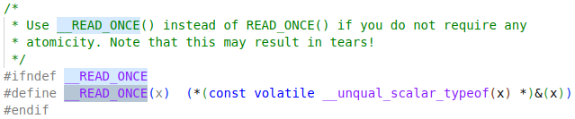

#### Generic

This seems just to improve compile-time performance by using `_Generic`

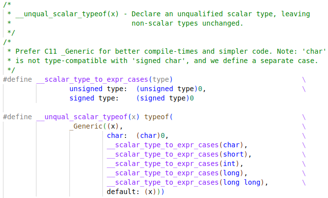

ref: https://en.cppreference.com/w/c/language/generic


### `struct` fd

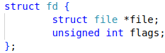

#### `struct` files_struct

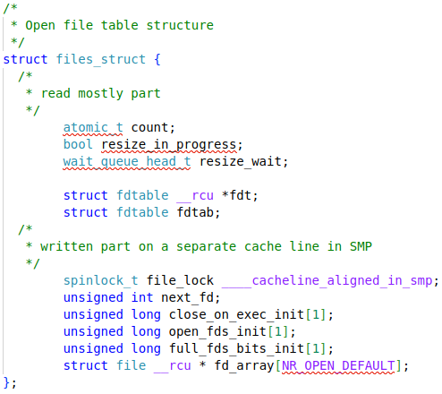

#### `struct` fdtable

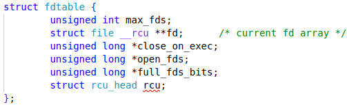

#### `struct` file

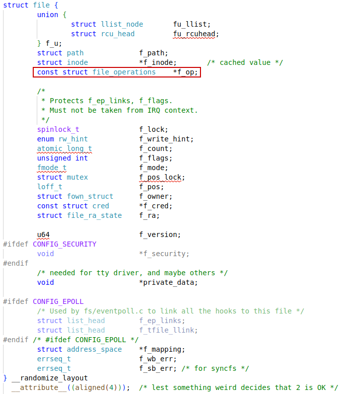

#### `struct` file_operations

```c
struct file_operations {
	struct module *owner;
	loff_t (*llseek) (struct file *, loff_t, int);
	ssize_t (*read) (struct file *, char __user *, size_t, loff_t *);
	ssize_t (*write) (struct file *, const char __user *, size_t, loff_t *);
	ssize_t (*read_iter) (struct kiocb *, struct iov_iter *);
	ssize_t (*write_iter) (struct kiocb *, struct iov_iter *);
	int (*iopoll)(struct kiocb *kiocb, bool spin);
	int (*iterate) (struct file *, struct dir_context *);
	int (*iterate_shared) (struct file *, struct dir_context *);
	__poll_t (*poll) (struct file *, struct poll_table_struct *);
	long (*unlocked_ioctl) (struct file *, unsigned int, unsigned long);
	long (*compat_ioctl) (struct file *, unsigned int, unsigned long);
	int (*mmap) (struct file *, struct vm_area_struct *);
	unsigned long mmap_supported_flags;
	int (*open) (struct inode *, struct file *);
	int (*flush) (struct file *, fl_owner_t id);
	int (*release) (struct inode *, struct file *);
	int (*fsync) (struct file *, loff_t, loff_t, int datasync);
	int (*fasync) (int, struct file *, int);
	int (*lock) (struct file *, int, struct file_lock *);
	ssize_t (*sendpage) (struct file *, struct page *, int, size_t, loff_t *, int);
	unsigned long (*get_unmapped_area)(struct file *, unsigned long, unsigned long, unsigned long, unsigned long);
	int (*check_flags)(int);
	int (*flock) (struct file *, int, struct file_lock *);
	ssize_t (*splice_write)(struct pipe_inode_info *, struct file *, loff_t *, size_t, unsigned int);
	ssize_t (*splice_read)(struct file *, loff_t *, struct pipe_inode_info *, size_t, unsigned int);
	int (*setlease)(struct file *, long, struct file_lock **, void **);
	long (*fallocate)(struct file *file, int mode, loff_t offset,
			  loff_t len);
	void (*show_fdinfo)(struct seq_file *m, struct file *f);
#ifndef CONFIG_MMU
	unsigned (*mmap_capabilities)(struct file *);
#endif
	ssize_t (*copy_file_range)(struct file *, loff_t, struct file *,
			loff_t, size_t, unsigned int);
	loff_t (*remap_file_range)(struct file *file_in, loff_t pos_in,
				   struct file *file_out, loff_t pos_out,
				   loff_t len, unsigned int remap_flags);
	int (*fadvise)(struct file *, loff_t, loff_t, int);
} __randomize_layout;
```


# sysfs

**sysfs** is a virtual filesystem in the Linux kernel that provides a standardized interface to expose kernel objects, their attributes, and relationships to user space. It is mounted at `/sys` and allows users and applications to query and **configure kernel subsystems, devices, and drivers** through virtual files.


/sys/devices/: Mirrors the internal kernel device tree, representing physical and logical devices.

/sys/class/: Groups devices by types (e.g., network interfaces, block devices).

/sys/bus/: Contains directories for each bus type (e.g., PCI, USB), with subdirectories for devices and drivers.

/sys/module/: Information about loaded kernel module

/sys/power/: Power management settings


## How sysfs Works

**sysfs** is tightly integrated with the `kobject` system in the kernel. Each registered `kobject` creates a corresponding directory in `sysfs`, reflecting its parent-child hierarchy.
