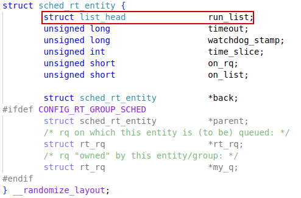
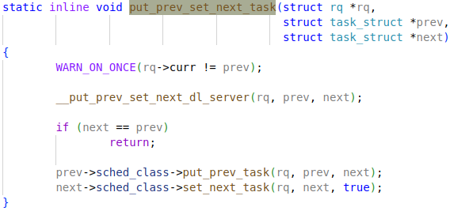
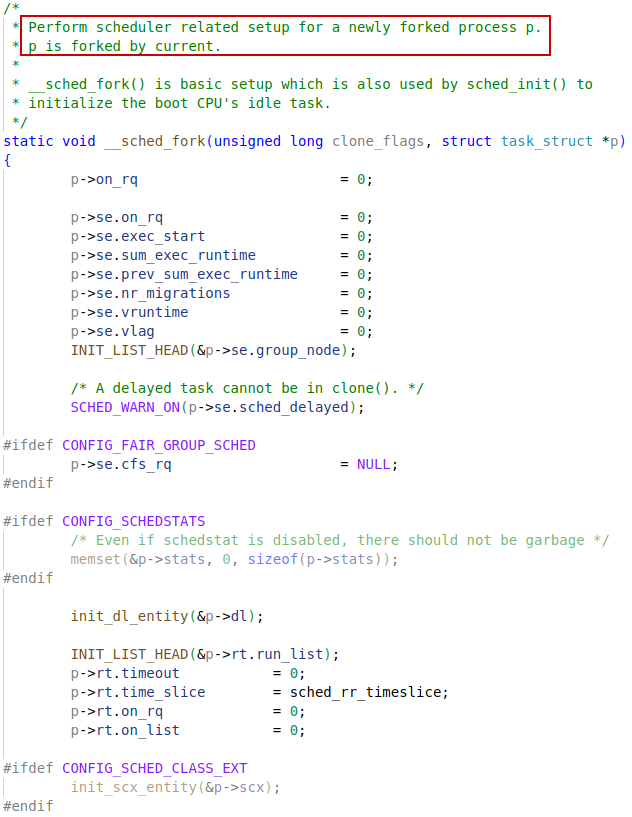
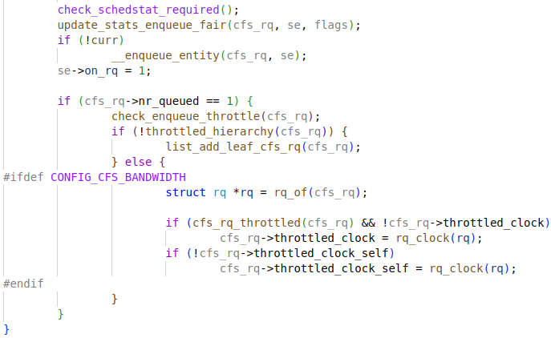
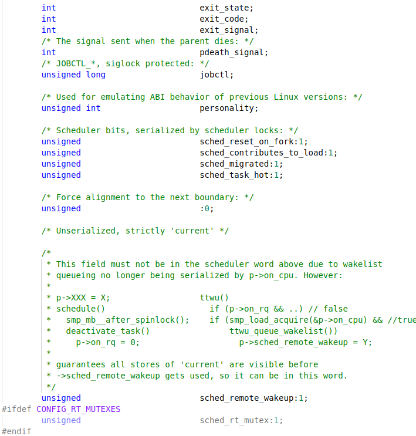
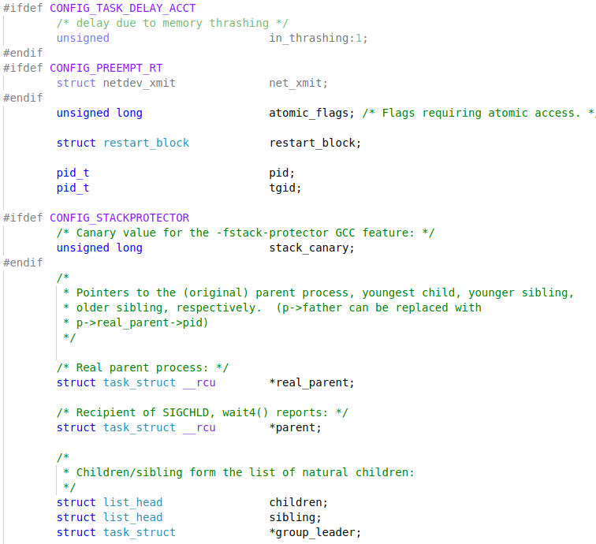
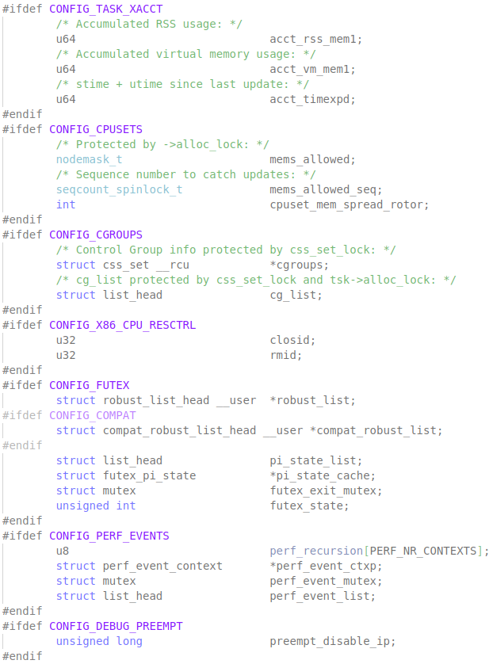
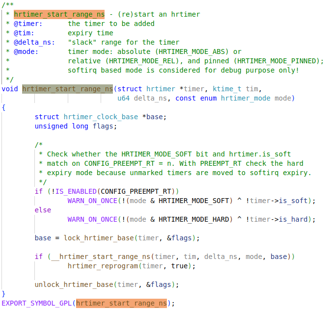

通用调度器目标：

- 交互任务响应快
- 批处理任务吞吐量大
- SMP高效多核，高cache和TLB命中率


# task scheduler

An example for Data structure used for **fair** scheduler: 


Different kinds of processes:

- **Real-time Process**: very high priority, response time smaller than Interactive Process (Real-time Processes nowadays are processes that actually have a Deadline for their completion time-windows, so they are in the **DL** schedule class)

- **Interactive Process**: high priority (Interactive Processes need a "real-time" response, so they are classified in **RT** schedule class at the very early stage of OS development)
- **Batch Process**: long time slice, low priority, falls into **fair** schedule class


## scheduler entity

Sched Objects: （调度实体）
```
- struct sched_entity se; # CFS
- struct sched_rt_entity rt; # RT
- struct sched_dl_entity dl; # DL (DeadLine)
```


### struct sched_dl_entity

`/* file: include/linux/sched.h */`


### struct sched_rt_entity




### struct sched_entity

`/* file: include/linux/sched.h */`


### struct sched_ext_entity

`/* include/linux/sched/ext.h */`


## sched_class

sched_class:（调度类）

- `stop_sched_class` # In SMP architecture, used to stop other task on a CPU, then **stop the CPU**
- `dl_sched_class` # Used for tasks needed to finish in a **time window**, highest priority for user tasks
- `rt_sched_class` # Real-time tasks, related to **user interaction**, priority lover than DL
- `fair_sched_class` # Used for most tasks, to fairly allocate CPU time to tasks, like **CFS**
- `idle_sched_class` # Similar to stop class, only for kernel threads, lowest priority, to lower power consumption when **CPU idle**


`/* file: include/asm-generic/vmlinux.lds.h */`


The implementation above is in v5.10 kernel code. The newest layout changes and the range names are changed to `highest` and `lowest` too, to make it clearer.


### struct sched_class


#### **DEFINE_SCHED_CLASS**

/* file: kernel/sched/sched.h */


### stop_sched_class

`/* file: kernel/sched/stop_task.c */`


### dl_sched_class

`/* file: kernel/sched/deadline.c */`


### rt_sched_class

`/* file: kernel/sched/rt.c */`


### fair_sched_class

`/* file: kernel/sched/fair.c */`


#### task_tick_fair


### idle_sched_class

`/* file: kernel/sched.idle.c */`


### ext_sched_class

`/* file: kernel/sched/ext.c */`


## pick_next_task

Implementation of scheduler, which will be called before swapping (/preempting), to choose the next task to switch to.

`/* file: kernel/sched/core.c */`


**for_each_class**


### pick_next_task_fair


#### pick_task_fair

`/* file: kernelj/sched/fair.c */`


##### pick_next_entity


##### pick_eevdf

How the heap and RB-tree are compatible, how is the relationship between `min_vruntime` and `virtual deadline`.


##### entity_eligible


#### put_prev_set_next_task




#### __put_prev_set_next_dl_server


#### put_prev_task_fair


The macro `for_each_sched_entity` is only effective with `CONFIG_FAIR_GROUP_SCHED`.


##### put_prev_entity


#### set_next_task_fair


##### set_next_entity


## struct rq

`rq`是系统可运行任务的容器，调度器的很多工作都是围绕着`rq`来进行的，调度类`struct sched_class`所申明的函数中，绝大多数都与`rq`相关。在系统中，每个CPU都有一个自己的`rq`，这样就可以避免多个CPU访问同一个`rq`产生的并发问题，提升调度器效率。

runqueue: 就续队列

The core of a runqueue, is presumably including:

```c
/* sub-rq for these schedule classes */
struct cfs_rq cfs;
struct rt_rq rt;
struct dl_rq dl;
struct scx_rq scx;

/* Only one task for stop schedule class and idle schedule class */
struct task_struct *idle;
struct task_struct *stop;
```


`/* file: kernel/sched/sched.h */`


### struct dl_rq


### struct rt_rq


#### rt_prio_array


### struct cfs_rq


#### rb_root_cached

带缓存的红黑树只是一个常规的`rb_root`，加上一个额外的指针来缓存最左边的节点。这使得rb_root_cached可以存在于rb_root存在的任何地方，并且只需增加几个接口来支持带缓存的树

`/* file: include/linux/rbtree_types.h */`


### struct scx_rq


## schedule policy


Sched Policy: （调度策略）

- `stop_sched_class`: only one task, no sched policy
- `dl_sched_class`: one policy, `SCHED_DEADLINE`
- `rt_sched_class`: 
  - `SCHED_FIFO`, 一直运行到主动放弃CPU
  - `SCHED_RR` 同优先级任务按照时间配额交替运行
- `fair_sched_class`: 
  - `SCHED_NORMAL`, 用于绝大多数用户进程
  - `SCHED_BATCH`, 用于没有交互行为的后台进程，在完成所有`SCHED_NORAML`的任务后，让该类任务不受打扰地跑上一段时间，以最大限度利用缓存
  - `SCHED_IDLE` 优先级最低任务，只有没有其它任何任务可运行时，调度器才运行该类任务
- `idle_sched_class`: same as `stop`, no sched policy

每个进程在创建时都会指定一个**调度策略**，从而自动归结到某个**调度类**下。


`/* file: include/uapi/linux/sched.h */`


### DL

Deadline 任务有三个重要的属性：runtime, period, deadline，调度器需要确保任务在每个period的时间窗口内得到runtime这么多的CPU时间，并且必须在deadline这个时间点之前得到。

EDF (Earliest Deadline First)，即在任意时刻，调度器都选择Deadline最近的任务执行。

```bash
chrt -d --sched-runtime 500000 --sched-deadline 1000000 \
	--sched-period 1666666 0 video_processing_tool
```


#### CBS

`scheduling_deadline`：子任务的deadline

`remaining_runtime`：在当前period，子任务还剩多少runtime可用


**CBS check**:

`scheduling_deadline < now` check deadline

`remaining_runtime / (scheduling_deadline - now) > runtime / period` check bandwidth


**postpone task** for one period and update states:

`scheduling_deadline = now + deadline`

`remaining_runtime = runtime`


**throttled**:

`remaining_runtime <= 0` will be throttled by scheduler

Then replenished at `scheduling_deadline`, i.e., next `period`. This time is then called `replenishment time`

`scheduling_deadline = scheduling_deadline + period`

`remaining_runtime = remaining_runtime + runtime`


### CFS

Completely Fair Scheduler

CFS吸取了RSDL中关于公平调度的思想，着力于改善调度器在**交互性**与**公平性**两方面的性能。调度器抛弃了基于时间片来划分调度周期的做法，引入了`vruntime`（虚拟时间）的概念来度量公平，并使用**红黒树**来管理任务。

- 现实中绝对公平几乎不可能实现，调度器维持公平性就是去除掉不公平性（维持所有任务的`vruntime`尽可能相等）。
- 公平(fair)调度器的目标是每个进程得到**同样多的CPU时间**，因此调度器每次调度时都选择runtime最小的进程。
- 优先级较高的进程应该得到更多的CPU时间，因此更高的**优先级**（低**nice**值）可以转化为更大的**CPU时间比例**（即时间权重）。
- 权重比例刻画公平性，对比实际使用时间片的比例比与权重是比例的差异来确定不公平性，来调度。
- 虚拟时间（vitrual runtime）是runtime除以**权重**是比例的**归一化数值**，即`vruntime`。
  - `vruntime = (wall_time / (weight / NICE_0_LOAD))`
  - `vruntime = (wall_time * (NICE_0_LOAD * 2^32) / weight)) >> 32 `
  - `vruntime = (wall_time * NICE_0_LOAD * inv_weight) >> 32`
  
- 归一化后，`cfs_rq`中使用`vruntime`作为key值的红黑树来保存所有的任务，最左侧节点的任务就是调度器应该选择的任务。


#### sched_latency

为了**调度延迟**，即一个任务在两次被调度到的时间间隔，CFS也需要引入**调度周期**（`sched_latency`）。

有了调度周期后（`__sched_period()`），还需要为任务计算其在一个调度周期内的时间配额（slice），`sched_slice()`。

Schedule latency is the duration in which all runable processes are expected to be scheduled at least once. It defines the "scheduling period" during which the CPU time is divided fairly among all runable tasks.

Schedule period: effective latency


What is lacking is a way to ensure that some processes can get accesss to a CPU quickly without necessarily giving those processes the ability to obtain more than their fair share of CPU time. (https://lwn.net/Articles/925371/)


##### time slice

time slice for CFS scheduler research

The schedule latency defines the time frame in which all tasks should be sheduled, and the timeslice per task is derived from dividing this latency by the number of tasks, respecting the **minimum granularity**.

This mechanism balances **fairness** (all tasks get CPU time within latency) and **efficiency** (avoid too frequent preemption)


##### minimum granularity

When the number of runnable tasks grows large, the scheduler period (effective latency) increases because each task must get at least the **mininum granularity**. The formula used is:

- If number of runable tasks <= `sched_latency_ns / sched_min_granularity_ns`, then scheduling period = `sched_latency_ns`
- Else, scheduling period = number of runnable tasks `x` `sched_min_granularity_ns`

This ensures that each task gets a fair minimum CPU slice, preventing too frequent context switches.


##### Handling New/Waking Tasks

This is **critial** as it's normal for tasks to go to sleep or wait for some resources and then they will wake up later. Newly created tasks usually expect to execute quickly to be responsive, but it shouldn't occupy CPU too long to starve other runnables.


#### EEVDF scheduler

Earliest Eligible **Virtual Deadline** First, A newer scheduler variant alongside CFS

The `commit` adding this implementation is `git show 147f3efaa241`


EEVDF picks task with `lag` greater or equal to zero and calculates a virtual deadline (**VD**) for each, selecting the task with the earliest VD to execute next.

It aims to improve fairness, **responsiveness**, and scalability while addressing **limitations** in CFS.

Tick driven preemption is driven by `request/slice` completion; 

while wakeup preemption is driven by the `deadline`.


**virtual `deadline`**

The other factor that comes into play is the "virtual deadline", which is the ~~earliest~~ time by which a process should have received its due CPU time. This deadline is calculated by adding a process's allocated time slice to its **eligible time**. A process with a 10ms time slice, and whose eligible time is 20ms in the future, will have a virtual deadline that is 30ms in the future.

A task is deemed "**eligible**" if its lag value is zero or greater; whenever the CPU scheduler must pick a task to run, it chooses from the set of eligible tasks. **eligible time** is the virtual **runtime of an eligible task**.

`deadline = vruntime + (slice / weight) * total_weight`  ?

Deadline is the time when a process should have received its due CPU timeslice, while all other processess get their partitions too. (This is why it multiplies the **total_weight** after being normalized)


**virtual `lag`**

Imagine a time period of one second; during that time, in our five-process scenario, each process should have gotten 200ms of CPU time. For a number of reasons, things never turn out exactly that way; some processes will have gotten too much time, while others will have been shortchanged. For each process, EEVDF calculates the difference between the time that process **should** have gotten and how much it **actually** got; that difference is called "lag". A process with a positive lag value has not received its fair share and should be scheduled sooner than one with a negative lag value.

The `lag` value is calculated over the normalized virtual runtime, since its easier to get the target virtual runtime (`rq.avg_vruntime`) for tasks in `runqueue`:

`se.vlag = rq.avg_vruntime - se.vruntime`


**Normalized** virtual runtime is the key dimension in CFS scheduler:

`se.vruntime = runtime / weight`

`se.vruntime += timeslice / weight`

`weight = load_weight.weight / NICE_0_LOAD`

`weight` is the **weight** of an entity. It is used to normalize the `runtime` from entities with different time weights. (`NICE_0_LOAD` is the weight of a default-priority task)


`runtime`s are supposed to be **evenly** separated to all entities in `runqueue`, so the `rq.avg_vruntime` means the **normalized** virtual runtime should be entitled to each task:

`rq.avg_vruntime = total_runtimes / total_weights`

`total_weights` is **sum of weights** of all runnable tasks in the runqueue.

`total_runtimes` is **sum of runtimes** the runqueue having gone through.


The sum of all the `lag` values in the system is always zero.

`lag = se.vlag * (weight)`

`weight` is the **weight** of an entity.

```
0 = sum of lags 
= sum of ((rq.avg_vruntime - se.vruntime) * weight)s
= sum of ((total_runtimes / total_weights - runtime / weight) * weight)s
= sum of ((total_runtimes * weight / total_weights - runtime)s
= sum of (total_runtimes * weight / total_weights)s - sum of runtimes
= total_runtimes * (sum of (weight / total_weights)s - 1)
= total_runtimes * (sum of (weight)s / total_weights - 1)

sum of (weight)s = sum of weights in runqueue = total_weights
```


```
0 = sum of vlags ?
= sum of (rq.avg_vruntime - se.vruntime)s
= sum of ((total_runtimes) / (total_weights) - runtime / weight)s
= n * (total_runtimes) / (total_weights) - sum of (runtime / weight)s
```


a scheduler includes: base scheduler, placement, preemption, picking


##### limitations in CFS

To figure out the reason why EEVDF was involved in CFS!

Corner cases: task groups starving under load

heterogeneous workloads: mixed CPU-bound/I/O-bounds tasks

low-latency scheduling for time-sensitive applications


##### sched_setattr

`/* file: kernel/sched/syscalls.c */`


##### __setparam_fair

`/* file: kernel/sched/fair.c */`


##### sysctl_sched_base_slice

`/* file: kernel/sched/fair.c */`


##### sched_init_debug

`/* file: kernel/sched/debug.c */`


##### base_slice_ns


#### struct load_weight


##### sched_prio_to_weight


##### sched_prio_to_wmult


#### update_curr

`/* file: kernel/sched/fair.c */`


##### update_curr_se


##### update_curr_task


##### update_deadline


###### calc_delta_fair


##### update_min_vruntime

`min_vruntime` is used to calculate increment of `avg_vruntime`, which is then used for `lag` caculation.


##### __update_min_vruntime


###### avg_vruntime_update


###### __pick_root_entity


#### sched_tick

调度节拍

`update_process_times() -> sched_tick() -> task_tick() -> entity_tick()`


##### entity_tick

`/* file: kernel/sched/fair.c */`


##### resched_curr_lazy

`/* file: kernel/sched/core.c */`


##### __resched_curr


# Add task


## sched_fork


### __sched_fork




## queue_task_fair

`/* file: kernel/sched/fair.c */`


### cfs_rq_min_slice


## enqueue_entity

`/* file: kernel/sched/fair.c */`





### place_entity


### __enqueue_entity

`/* file: kernel/sched/fair.c */`


# sched_init

`/* file: kernel/sched/core.c */`


# task_struct

`/* file: include/linux/sched.h */`


## new

Implementation in newer version code (v6.14-rc5):











## thread_info

/* file: arch/riscv/include/asm/thread_info.h */


## thread_struct

.thread在`task_struct`结构体的最后边。

线程上下文（vs pt_regs），线程换出时保存，换入时恢复。


## kernel stack

For **PID0** process, the kernel stack is on a thread block together with`task_struct` `init_task` . The total size of the thread block is 16K. But for other threads, their **kernel stack** and `task_struct` will allocated separately.

/* file: arch/riscv/include/asm/processor.h */


/* file: include/asm-generic/vmlinux.lds.h */


### THREAD_SIZE

The thread block size is 16K (4 page size) on 64-bit system, 8K on 32-bit system.

/* file: arch/riscv/include/asm/thread_info.h */


# sched_tick

调度节拍

`/* file: kernel/sched/core.c */`


## struct tick_sched


### struct hrtimer                                                                                                                                                                                                                                        


#### struct hrtimer_clock_base


## tick_nohz_activate


Nohz mode, also known as "tickless" mode, is a feature in the Linux kernel that aims to reduce or eliminate periodic timer interrupts (ticks) on CPUs under certain conditions. This feature is designed to improve energy efficiency and reduce system jitter, especially for systems with real-time or low-latency requirements.

## tick_init_highres

Only gets called in function `hrtimer_switch_to_hres`, which in turn only gets called by `hrtimer_run_queues`. Then finally will be called in `update_process_times`:


### tick_switch_to_oneshot

The handler `hrtimer_interrupt` will be added to the `clock_event_device` in `tick_cpu_device`.


### struct tick_device


#### struct clock_event_device


### clockevents_switch_state


## hrtimer

`/* file: include/linux/hrtimer_types.h */`


### hrtimer_init


### __hrtimer_init


#### timerqueue_init


### hrtimer_start


### hrtimer_set_expires


### hrtimer_start_expires


#### struct ktime_t


### hrtimer get expires


### hrtimer_start_range_ns



### __hrtimer_start_range_ns


#### switch_hrtimer_base


#### enqueue_hrtimer


#### timerqueue_add


### tick_setup_periodic


### tick_set_periodic_handler


### tick_handle_periodic


#### tick_periodic


### hrtimer_run_queues


### hrtimer_switch_to_hres


### tick_setup_sched_timer


### tick_sched_timer


### hrtimer_run_queues


### tick_check_oneshot_change


### tick_nohz_switch_to_nohz


### tick_nohz_handler


#### tick_sched_handle


### update_process_times


### run_local_timers


### hrtimer_run_queues


### hrtimer_switch_to_hres


### hrtimer_forward


### __hrtimer_peek_ahead_timers


### hrtimer_interrupt

event_handler


### __hrtimer_run_queues


### __run_hrtimer


## hrtimers_init

This function is called in `start_kernel` function.


### hrtimers_prepare_cpu


# timer initialization

All the timers will be declared by macro `TIMER_OF_DECLARE`, and then get initialized in `timer_probe` function.

## TIMER_OF_DECLARE


Finally, this macro expands to:

```c
#define TIMER_OF_DECLARE(name, compat, fn)				as
static const struct of_device_id __of_table_##name		\
		__used __section("__" "timer" "_of_table")		\
    	 = { .compatible = compat,						\
             .data = (fn == (fn_type)NULL) ? fn : fn }	
```

Then the `struct` is defined to link to `__timer_of_table` sections:

```c
typedef int (*of_init_fn_1_ret)(struct device_node *);
#define TIMER_OF_DECLARE(name, compat, fn)				as
static const struct of_device_id __of_table_##name		\
		__used __section("__timer_of_table")		\
    	 = { .compatible = compat,						\
             .data = (fn == (of_init_fn_1_ret)NULL) ? fn : fn }	
```

## time_init

This function is called in `start_kernel` function.


### timer_probe

The symbol `__timer_of_table` here, is set to pointing to the `__timer_of_table` section in linker script file.


#### for_each_matching_node_and_match


#### __of_match_node


#### __of_device_is_compatible


#### __timer_of_table


Here `TIMER_OF_TABALES()` expands to `_OF_TABLE_0(timer)`. 


Then:

```c
#define _OF_TABLE_0(timer)
		. = ALIGN(8);						\
        __timer_of_table = .;				\
        KEEP(*(__timer_of_table));			\
        KEEP(*(__timer_of_table_end))
```

## timer drivers

Corresponding drivers should be configured properly, and then the "compatible" strings in device tree can be used to drivers pointed in the `__timer_of_table` section.


### clint_timer_init_dt


The macro `TIMER_OF_DECLARE` will expand here: 

```c
typedef int (*of_init_fn_1_ret)(struct device_node *);
#define TIMER_OF_DECLARE(clint_timer, "riscv,clint0", fn)
// will expand as the struct below
static const struct of_device_id __of_table_clint_timer
		__used __section("__timer_of_table")
    	 = { .compatible = "riscv,clint0",
             .data = (fn == (of_init_fn_1_ret)NULL) ? fn : fn }	
// fn = clint_timer_init_dt;
```


### riscv_timer_init_dt


Here this macro expands as:

```c
typedef int (*of_init_fn_1_ret)(struct device_node *);
#define TIMER_OF_DECLARE(riscv_timer, "riscv", fn)
// will expand as the struct below
static const struct of_device_id __of_table_riscv_timer
		__used __section("__timer_of_table")
    	 = { .compatible = "riscv",
             .data = (fn == (of_init_fn_1_ret)NULL) ? fn : fn }	
// fn = riscv_timer_init_dt;
```

### cpuhp_setup_state


### __cpuhp_setup_state


### __cpuhp_setup_state_cpuslocked


#### cpuhp_store_callbacks

`cpuhp_step`


#### cpuhp_issue_call


#### cpuhp_invoke_ap_callback


#### cpuhp_invoke_callback


## clock_event_device


### clint_timer_starting_cpu


#### clint_clock_event


#### clint_clock_next_event


### riscv_timer_starting_cpu


#### riscv_clock_event


#### riscv_clock_next_event


### clockevents_config_and_register


### clockevents_register_device


#### __ clockevents_notify_released

This function is not relevant here, but doing similar stuff.


## tick_cpu_device

tick devices


### tick_device: tick_cpu_device


### tick_check_new_device

The `riscv_clock_event` will be added to `tick_cpu_device` here. The `tick_cpu_device` is the `tick_device` for every CPU.


#### __ tick_install_replacement


### tick_setup_device

With a new `clock_event_device` added to the `tick_device`, the`clock_event_device`.`event_handler`  will normally be executed in the timer interrupt handling routine in the driver. The function for **clint timer** is `clint_timer_interrupt`.


#### __ tick_resume_local


## clock_event_device


### clint_timer_interrupt

This one is currently used by setting "riscv,clint0" compatible in device tree.


#### clint_clock_event


### riscv_timer_interrupt


#### riscv_clock_event


# jiffies

**Is the number of system ticks**. The system tick frequency is set by `CONFIG_HZ`, while 100 means ticking 100 times in a second. The tick period is 10ms for `CONFIG_HZ=100`, as `tick = 1s / HZ`.

