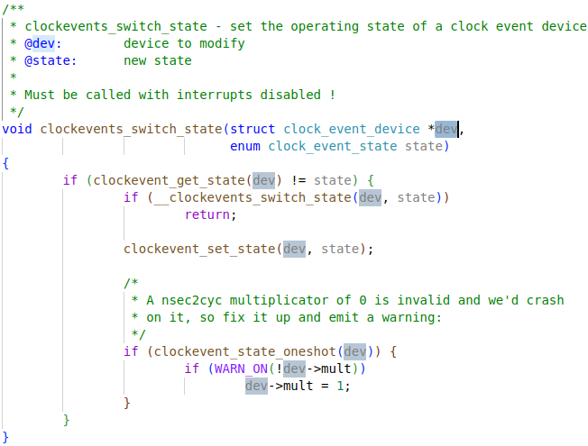
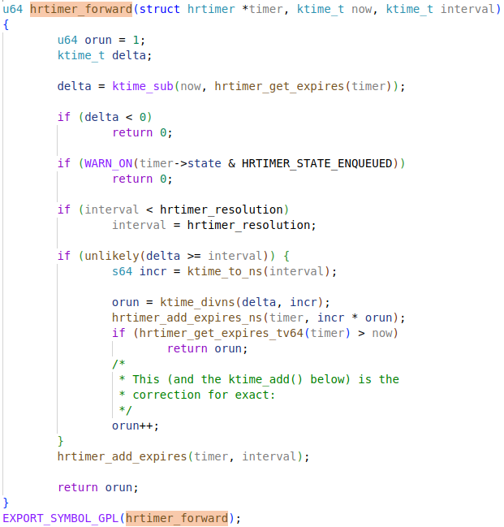
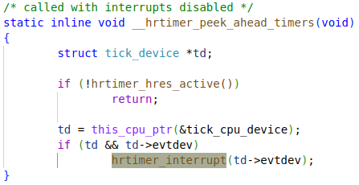
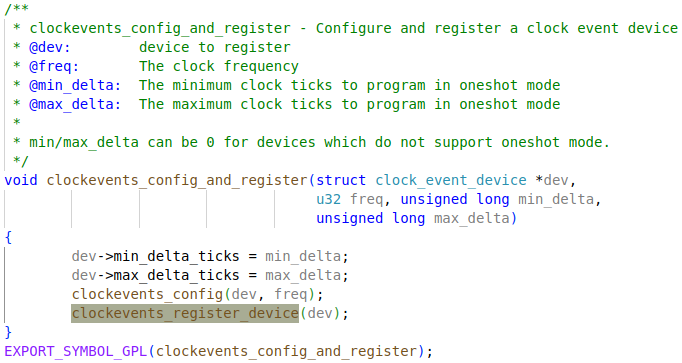
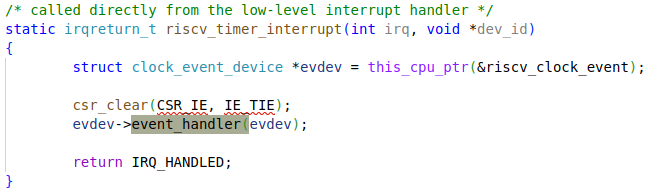

# wait

## DEFINE_WAIT_FUNC


### `struct` wait_queue_entry


## woken_wake_function


### default_wake_function


### try_to_wake_up

```c
/**
 * try_to_wake_up - wake up a thread
 * @p: the thread to be awakened
 * @state: the mask of task states that can be woken
 * @wake_flags: wake modifier flags (WF_*)
 *
 * Conceptually does:
 *
 *   If (@state & @p->state) @p->state = TASK_RUNNING.
 *
 * If the task was not queued/runnable, also place it back on a runqueue.
 *
 * This function is atomic against schedule() which would dequeue the task.
 *
 * It issues a full memory barrier before accessing @p->state, see the comment
 * with set_current_state().
 *
 * Uses p->pi_lock to serialize against concurrent wake-ups.
 *
 * Relies on p->pi_lock stabilizing:
 *  - p->sched_class
 *  - p->cpus_ptr
 *  - p->sched_task_group
 * in order to do migration, see its use of select_task_rq()/set_task_cpu().
 *
 * Tries really hard to only take one task_rq(p)->lock for performance.
 * Takes rq->lock in:
 *  - ttwu_runnable()    -- old rq, unavoidable, see comment there;
 *  - ttwu_queue()       -- new rq, for enqueue of the task;
 *  - psi_ttwu_dequeue() -- much sadness :-( accounting will kill us.
 *
 * As a consequence we race really badly with just about everything. See the
 * many memory barriers and their comments for details.
 *
 * Return: %true if @p->state changes (an actual wakeup was done),
 *	   %false otherwise.
 */
static int
try_to_wake_up(struct task_struct *p, unsigned int state, int wake_flags)
{
	unsigned long flags;
	int cpu, success = 0;

	preempt_disable();
	if (p == current) {
		/*
		 * We're waking current, this means 'p->on_rq' and 'task_cpu(p)
		 * == smp_processor_id()'. Together this means we can special
		 * case the whole 'p->on_rq && ttwu_runnable()' case below
		 * without taking any locks.
		 *
		 * In particular:
		 *  - we rely on Program-Order guarantees for all the ordering,
		 *  - we're serialized against set_special_state() by virtue of
		 *    it disabling IRQs (this allows not taking ->pi_lock).
		 */
		if (!(p->state & state))
			goto out;

		success = 1;
		trace_sched_waking(p);
		p->state = TASK_RUNNING;
		trace_sched_wakeup(p);
		goto out;
	}

	/*
	 * If we are going to wake up a thread waiting for CONDITION we
	 * need to ensure that CONDITION=1 done by the caller can not be
	 * reordered with p->state check below. This pairs with smp_store_mb()
	 * in set_current_state() that the waiting thread does.
	 */
	raw_spin_lock_irqsave(&p->pi_lock, flags);
	smp_mb__after_spinlock();
	if (!(p->state & state))
		goto unlock;

	trace_sched_waking(p);

	/* We're going to change ->state: */
	success = 1;

	/*
	 * Ensure we load p->on_rq _after_ p->state, otherwise it would
	 * be possible to, falsely, observe p->on_rq == 0 and get stuck
	 * in smp_cond_load_acquire() below.
	 *
	 * sched_ttwu_pending()			try_to_wake_up()
	 *   STORE p->on_rq = 1			  LOAD p->state
	 *   UNLOCK rq->lock
	 *
	 * __schedule() (switch to task 'p')
	 *   LOCK rq->lock			  smp_rmb();
	 *   smp_mb__after_spinlock();
	 *   UNLOCK rq->lock
	 *
	 * [task p]
	 *   STORE p->state = UNINTERRUPTIBLE	  LOAD p->on_rq
	 *
	 * Pairs with the LOCK+smp_mb__after_spinlock() on rq->lock in
	 * __schedule().  See the comment for smp_mb__after_spinlock().
	 *
	 * A similar smb_rmb() lives in try_invoke_on_locked_down_task().
	 */
	smp_rmb();
	if (READ_ONCE(p->on_rq) && ttwu_runnable(p, wake_flags))
		goto unlock;

#ifdef CONFIG_SMP
	/*
	 * Ensure we load p->on_cpu _after_ p->on_rq, otherwise it would be
	 * possible to, falsely, observe p->on_cpu == 0.
	 *
	 * One must be running (->on_cpu == 1) in order to remove oneself
	 * from the runqueue.
	 *
	 * __schedule() (switch to task 'p')	try_to_wake_up()
	 *   STORE p->on_cpu = 1		  LOAD p->on_rq
	 *   UNLOCK rq->lock
	 *
	 * __schedule() (put 'p' to sleep)
	 *   LOCK rq->lock			  smp_rmb();
	 *   smp_mb__after_spinlock();
	 *   STORE p->on_rq = 0			  LOAD p->on_cpu
	 *
	 * Pairs with the LOCK+smp_mb__after_spinlock() on rq->lock in
	 * __schedule().  See the comment for smp_mb__after_spinlock().
	 *
	 * Form a control-dep-acquire with p->on_rq == 0 above, to ensure
	 * schedule()'s deactivate_task() has 'happened' and p will no longer
	 * care about it's own p->state. See the comment in __schedule().
	 */
	smp_acquire__after_ctrl_dep();

	/*
	 * We're doing the wakeup (@success == 1), they did a dequeue (p->on_rq
	 * == 0), which means we need to do an enqueue, change p->state to
	 * TASK_WAKING such that we can unlock p->pi_lock before doing the
	 * enqueue, such as ttwu_queue_wakelist().
	 */
	p->state = TASK_WAKING;

	/*
	 * If the owning (remote) CPU is still in the middle of schedule() with
	 * this task as prev, considering queueing p on the remote CPUs wake_list
	 * which potentially sends an IPI instead of spinning on p->on_cpu to
	 * let the waker make forward progress. This is safe because IRQs are
	 * disabled and the IPI will deliver after on_cpu is cleared.
	 *
	 * Ensure we load task_cpu(p) after p->on_cpu:
	 *
	 * set_task_cpu(p, cpu);
	 *   STORE p->cpu = @cpu
	 * __schedule() (switch to task 'p')
	 *   LOCK rq->lock
	 *   smp_mb__after_spin_lock()		smp_cond_load_acquire(&p->on_cpu)
	 *   STORE p->on_cpu = 1		LOAD p->cpu
	 *
	 * to ensure we observe the correct CPU on which the task is currently
	 * scheduling.
	 */
	if (smp_load_acquire(&p->on_cpu) &&
	    ttwu_queue_wakelist(p, task_cpu(p), wake_flags | WF_ON_CPU))
		goto unlock;

	/*
	 * If the owning (remote) CPU is still in the middle of schedule() with
	 * this task as prev, wait until its done referencing the task.
	 *
	 * Pairs with the smp_store_release() in finish_task().
	 *
	 * This ensures that tasks getting woken will be fully ordered against
	 * their previous state and preserve Program Order.
	 */
	smp_cond_load_acquire(&p->on_cpu, !VAL);

	cpu = select_task_rq(p, p->wake_cpu, SD_BALANCE_WAKE, wake_flags);
	if (task_cpu(p) != cpu) {
		if (p->in_iowait) {
			delayacct_blkio_end(p);
			atomic_dec(&task_rq(p)->nr_iowait);
		}

		wake_flags |= WF_MIGRATED;
		psi_ttwu_dequeue(p);
		set_task_cpu(p, cpu);
	}
#else
	cpu = task_cpu(p);
#endif /* CONFIG_SMP */

	ttwu_queue(p, cpu, wake_flags);
unlock:
	raw_spin_unlock_irqrestore(&p->pi_lock, flags);
out:
	if (success)
		ttwu_stat(p, task_cpu(p), wake_flags);
	preempt_enable();

	return success;
}
```


## add_wait_queue


### struct wait_queue_head


### __add_wait_queue

```c
static inline void __add_wait_queue(struct wait_queue_head *wq_head, struct wait_queue_entry *wq_entry)
{
	list_add(&wq_entry->entry, &wq_head->head);
}
```


## wait_woken


`schedule_timeout` will sleep until timeout, or woken up by signals if `TASK_INTERRUPTIBLE` flag was set by `set_current_state()`.  See `preemption` doc for explanation about scheduling.


# wait queue


## waitqueue_active


## __wake_up


# sched_tick

## struct tick_sched


### struct hrtimer                                                                                                                                                                                                                                        


#### struct hrtimer_clock_base


## tick_nohz_activate


Nohz mode, also known as "tickless" mode, is a feature in the Linux kernel that aims to reduce or eliminate periodic timer interrupts (ticks) on CPUs under certain conditions. This feature is designed to improve energy efficiency and reduce system jitter, especially for systems with real-time or low-latency requirements.

## tick_init_highres

Only gets called in function `hrtimer_switch_to_hres`, which in turn only gets called by `hrtimer_run_queues`. Then finally will be called in `update_process_times`:


### tick_switch_to_oneshot

The handler `hrtimer_interrupt` will be added to the `clock_event_device` in `tick_cpu_device`.


### struct tick_device


#### struct clock_event_device


### clockevents_switch_state




## hrtimer


### hrtimer_init


### __hrtimer_init


#### timerqueue_init


### hrtimer_start


### hrtimer_set_expires


### hrtimer_start_expires


#### struct ktime_t


### hrtimer get expires


### hrtimer_start_range_ns


### __hrtimer_start_range_ns


#### switch_hrtimer_base


#### enqueue_hrtimer


#### timerqueue_add


### tick_setup_periodic


### tick_set_periodic_handler


### tick_handle_periodic


#### tick_periodic


### hrtimer_run_queues


### hrtimer_switch_to_hres


### tick_setup_sched_timer


### tick_sched_timer


### hrtimer_run_queues


### tick_check_oneshot_change


### tick_nohz_switch_to_nohz


### tick_nohz_handler


#### tick_sched_handle


### update_process_times


### run_local_timers


### hrtimer_run_queues


### hrtimer_switch_to_hres


### hrtimer_forward





### __hrtimer_peek_ahead_timers



### hrtimer_interrupt

event_handler


### __hrtimer_run_queues


### __run_hrtimer


## hrtimers_init

This function is called in `start_kernel` function.


### hrtimers_prepare_cpu


# timer initialization

All the timers will be declared by macro `TIMER_OF_DECLARE`, and then get initialized in `timer_probe` function.

## TIMER_OF_DECLARE


Finally, this macro expands to:

```c
#define TIMER_OF_DECLARE(name, compat, fn)				as
static const struct of_device_id __of_table_##name		\
		__used __section("__" "timer" "_of_table")		\
    	 = { .compatible = compat,						\
             .data = (fn == (fn_type)NULL) ? fn : fn }	
```

Then the `struct` is defined to link to `__timer_of_table` sections:

```c
typedef int (*of_init_fn_1_ret)(struct device_node *);
#define TIMER_OF_DECLARE(name, compat, fn)				as
static const struct of_device_id __of_table_##name		\
		__used __section("__timer_of_table")		\
    	 = { .compatible = compat,						\
             .data = (fn == (of_init_fn_1_ret)NULL) ? fn : fn }	
```

## time_init

This function is called in `start_kernel` function.


### timer_probe

The symbol `__timer_of_table` here, is set to pointing to the `__timer_of_table` section in linker script file.


#### for_each_matching_node_and_match


#### __of_match_node


#### __of_device_is_compatible


#### __timer_of_table


Here `TIMER_OF_TABALES()` expands to `_OF_TABLE_0(timer)`. 


Then:

```c
#define _OF_TABLE_0(timer)
		. = ALIGN(8);						\
        __timer_of_table = .;				\
        KEEP(*(__timer_of_table));			\
        KEEP(*(__timer_of_table_end))
```

## timer drivers

Corresponding drivers should be configured properly, and then the "compatible" strings in device tree can be used to drivers pointed in the `__timer_of_table` section.


### clint_timer_init_dt


The macro `TIMER_OF_DECLARE` will expand here: 

```c
typedef int (*of_init_fn_1_ret)(struct device_node *);
#define TIMER_OF_DECLARE(clint_timer, "riscv,clint0", fn)
// will expand as the struct below
static const struct of_device_id __of_table_clint_timer
		__used __section("__timer_of_table")
    	 = { .compatible = "riscv,clint0",
             .data = (fn == (of_init_fn_1_ret)NULL) ? fn : fn }	
// fn = clint_timer_init_dt;
```


### riscv_timer_init_dt


Here this macro expands as:

```c
typedef int (*of_init_fn_1_ret)(struct device_node *);
#define TIMER_OF_DECLARE(riscv_timer, "riscv", fn)
// will expand as the struct below
static const struct of_device_id __of_table_riscv_timer
		__used __section("__timer_of_table")
    	 = { .compatible = "riscv",
             .data = (fn == (of_init_fn_1_ret)NULL) ? fn : fn }	
// fn = riscv_timer_init_dt;
```

### cpuhp_setup_state


### __cpuhp_setup_state


### __cpuhp_setup_state_cpuslocked


#### cpuhp_store_callbacks

`cpuhp_step`


#### cpuhp_issue_call


#### cpuhp_invoke_ap_callback


#### cpuhp_invoke_callback


## clock_event_device


### clint_timer_starting_cpu


#### clint_clock_event


#### clint_clock_next_event


### riscv_timer_starting_cpu


#### riscv_clock_event


#### riscv_clock_next_event


### clockevents_config_and_register



### clockevents_register_device


#### __ clockevents_notify_released

This function is not relevant here, but doing similar stuff.


## tick_cpu_device

tick devices


### tick_device: tick_cpu_device


### tick_check_new_device

The `riscv_clock_event` will be added to `tick_cpu_device` here. The `tick_cpu_device` is the `tick_device` for every CPU.


#### __ tick_install_replacement


### tick_setup_device

With a new `clock_event_device` added to the `tick_device`, the`clock_event_device`.`event_handler`  will normally be executed in the timer interrupt handling routine in the driver. The function for **clint timer** is `clint_timer_interrupt`.


#### __ tick_resume_local


## clock_event_device


### clint_timer_interrupt

This one is currently used by setting "riscv,clint0" compatible in device tree.


#### clint_clock_event


### riscv_timer_interrupt



#### riscv_clock_event


# jiffies

Is the number of system ticks. The system tick frequency is set by `CONFIG_HZ`, while 100 means ticking 100 times in a second. The tick period is 10ms for `CONFIG_HZ=100`, as `tick = 1s / HZ`.


# time slice

