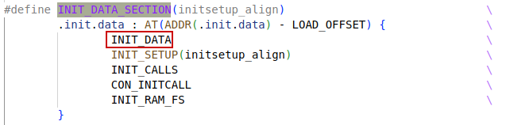

The linker scripts file is architecture specific. For RISC-V architecture, the source linker scripts file is in `arch/riscv/kernel/` directory. Its name should be `vmlinux.lds.S`.

## Minimal example

```c
/*
 * Helper macros to support writing architecture specific
 * linker scripts.
 *
 * A minimal linker scripts has following content:
 * [This is a sample, architectures may have special requiriements]
 *
 * OUTPUT_FORMAT(...)
 * OUTPUT_ARCH(...)
 * ENTRY(...)
 * SECTIONS
 * {
 *	. = START;
 *	__init_begin = .;
 *	HEAD_TEXT_SECTION
 *	INIT_TEXT_SECTION(PAGE_SIZE)
 *	INIT_DATA_SECTION(...)
 *	PERCPU_SECTION(CACHELINE_SIZE)
 *	__init_end = .;
 *
 *	_stext = .;
 *	TEXT_SECTION = 0
 *	_etext = .;
 *
 *      _sdata = .;
 *	RO_DATA(PAGE_SIZE)
 *	RW_DATA(...)
 *	_edata = .;
 *
 *	EXCEPTION_TABLE(...)
 *
 *	BSS_SECTION(0, 0, 0)
 *	_end = .;
 *
 *	STABS_DEBUG
 *	DWARF_DEBUG
 *	ELF_DETAILS
 *
 *	DISCARDS		// must be the last
 * }
 *
 * [__init_begin, __init_end] is the init section that may be freed after init
 * 	// __init_begin and __init_end should be page aligned, so that we can
 *	// free the whole .init memory
 * [_stext, _etext] is the text section
 * [_sdata, _edata] is the data section
 *
 * Some of the included output section have their own set of constants.
 * Examples are: [__initramfs_start, __initramfs_end] for initramfs and
 *               [__nosave_begin, __nosave_end] for the nosave data
 */
```


# RISC-V SECTIONS

In linker script file `arch/riscv/kernel/vmlinux.lds.S`, the `SECTIONS` is defined.


## INIT_DATA_SECTION



### INIT_DATA


# RISC-V vdso


# module SECTIONS

The module linker script file is in `scripts\module.lds.S` file.

