How kernel modules work?

# Usage

Linux kernel modules are pieces of code that can be loaded and unloaded into the kernel on demand, allowing for dynamic extension of the kernel's functionality without the need for recompilation. This flexibility is crucial for managing different hardware and software configurations in Linux systems.


## Build and Install modules

```bash
make ARCH=$ARCH CROSS_COMPILE=$CROSS_COMPILE -j$(nproc) vmlinux modules
make ARCH=$ARCH CROSS_COMPILE=$CROSS_COMPILE INSTALL_MOD_PATH=/path/to/install modules_install
```


## Load a module

`insmod` or `modprobe`


## Unload a module

`rmmod` or `modprobe -r`


## dmesg

Use `dmesg` to view log messages generated by the module, which can assist in debugging.


# Create a module


## Definition

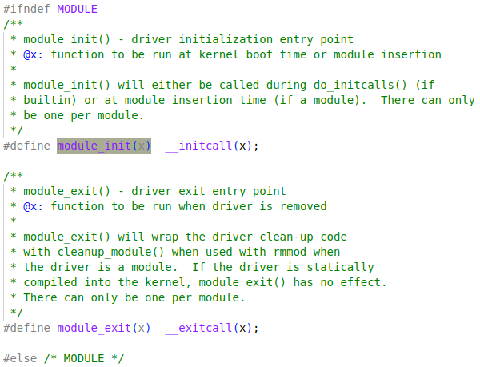

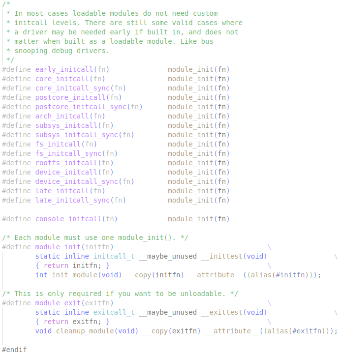

### initcall

For the case of compiling kernel, `MODULE` will not be defined, then `module_init` is actually `__initcall`

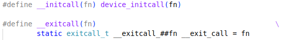

It's one of the various types of initcalls:

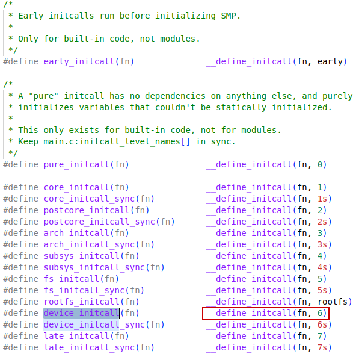

Then expands to initcall entries in `.init` section.

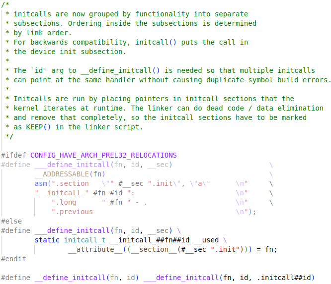

### module


## module_init()


## module_exit()


## Makefile

```makefile
obj-m += mymodule.o

all:
	make -C /lib/modules/$(uname -r)/build M=$(PWD) modules
	
clean:
	make -C /lib/modules/$(uname -r)/build M=$(PWD) clean
```


# Cross-Compile extra modules

1. Set Up environment variables

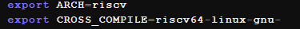

Should be using the same toolchain as kernel compilation.

2. Prepare Module source code

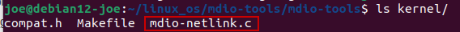

3. Create a Makefile

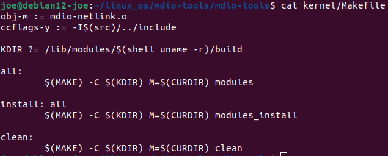

4. Build the module

`KDIR` is point to the kernel source code

`KDIR=/home/joe/linux_os/linux make O=/home/joe/linux_os/linux-build-rv64 all`

5. Install the module to rootfs

`KDIR=/home/joe/linux_os/linux make O=/home/joe/linux_os/linux-build-rv64 INSTALL_MOD_PATH=/home/joe/linux_os/initrd-rv64 install`

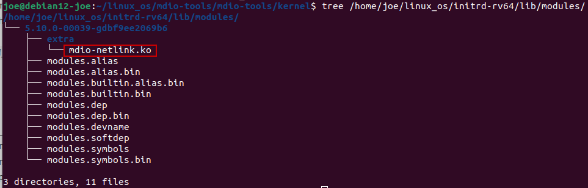


## depmod

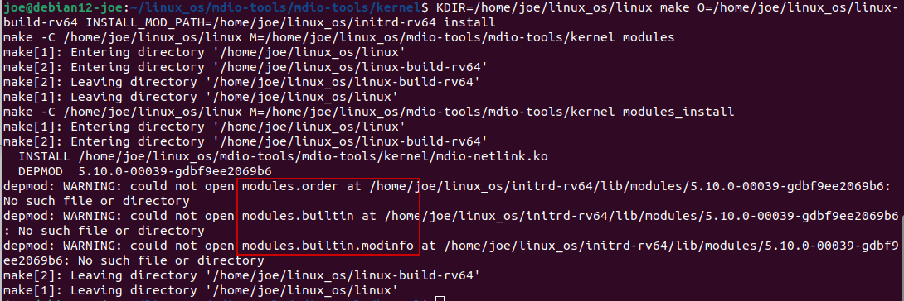

Lacking `modules.order`, `modules.builtin` may lead to the issue below

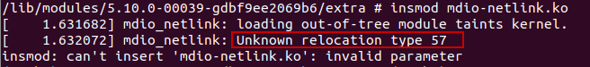

Adding these files by install in-tree kernel modules first

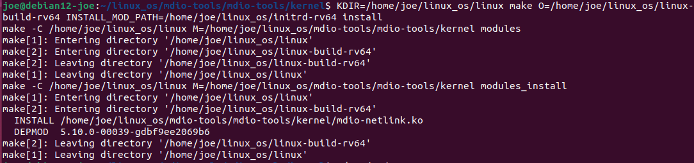


## relocation issue

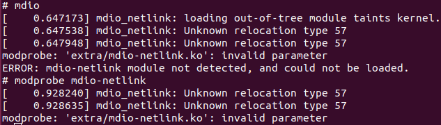

Need to read kernel source code to determine what this is about.

#### Add dump_stack()

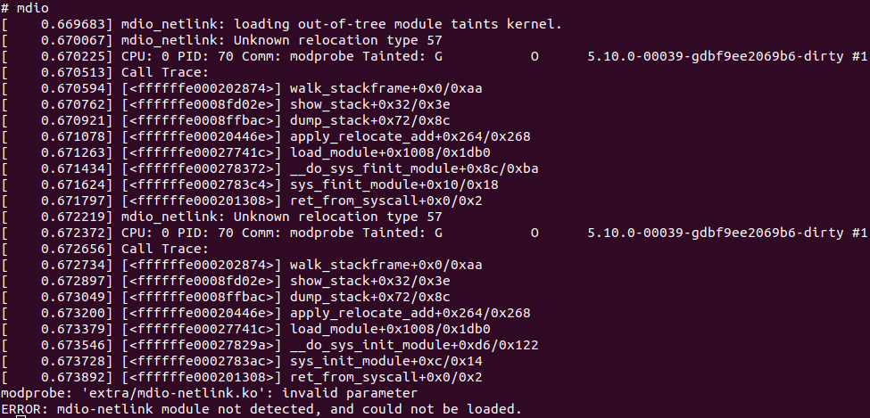


### finit_module

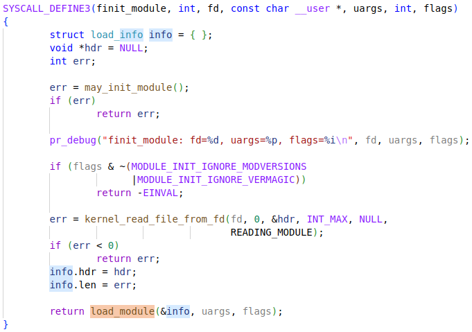

### init_module

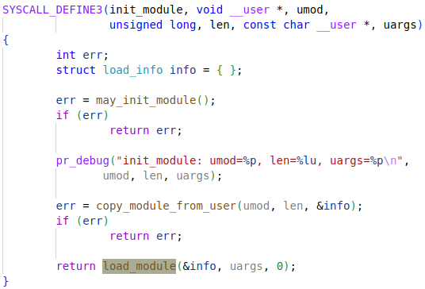


### apply_relocate_add

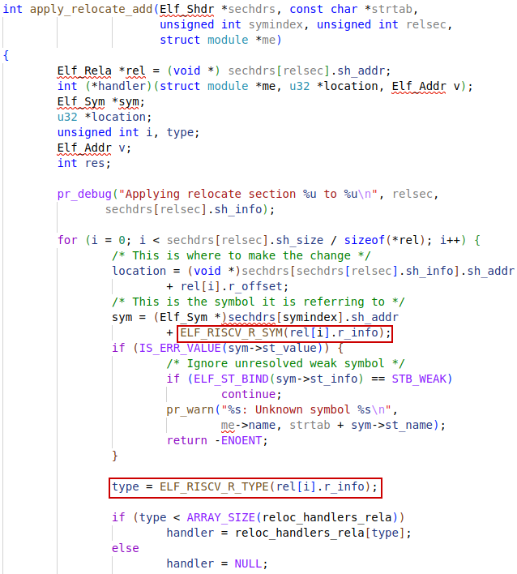

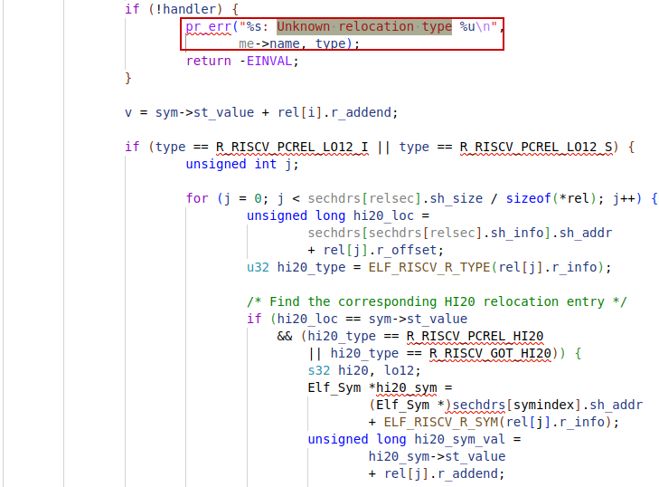

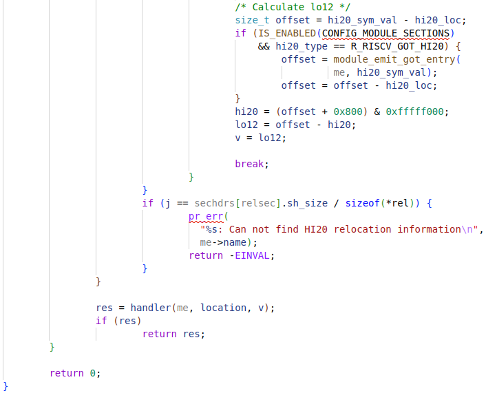

#### ELF_RISCV_R_TYPE

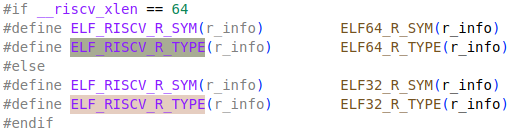


#### reloc_handlers_rela

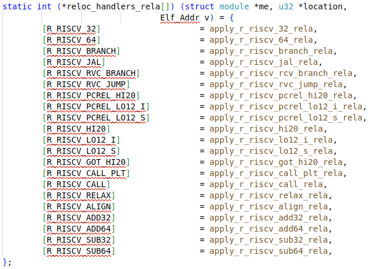

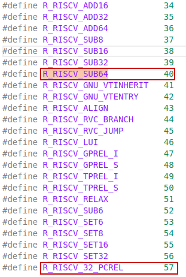

#### Elf_Shdr

Section header

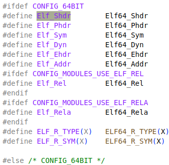

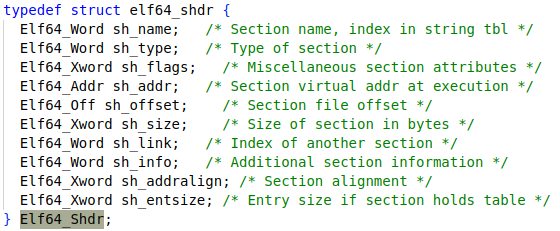

##### Elf64_Addr

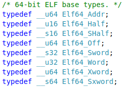

##### elf64_rela

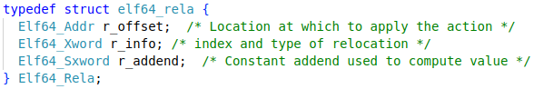

**r_offset**

This member gives the location at which to **apply the relocation action**. Different object files have slightly different interpretations for this member.

For a relocatable file, the value indicates a section offset. The relocation section describes how to modify **another section** in the file. **Relocation offsets designate a storage unit within the second section**.

For an executable or shared object, the value indicates the virtual address of the storage unit affected by the relocation. This information makes the **relocation entries** more useful for the runtime linker.

Although the interpretation of the member changes for different object files to allow efficient access by the relevant programs, the meanings of the relocation types stay the same.


**r_info**

This member gives both the **symbol table index**, with respect to which the relocation must be made, and the **type of relocation to apply**. For example, a call instruction's relocation entry holds the symbol table index of the function being called. If the index is `STN_UNDEF`, the undefined symbol index, the relocation uses zero as the symbol value.

**Relocation types are processor-specific**. A relocation entry's relocation type or symbol table index is the result of applying `ELF32_R_TYPE` or `ELF32_R_SYM`, respectively, to the entry's `r_info` member.


**r_addend**

This member specifies a constant addend used to compute the value to be stored into the relocatable field.


#### relocation sections

Relocation is the process of connecting **symbolic references** with **symbolic definitions**. For example, when a program calls a function, the associated call instruction must transfer control to the proper destination address at execution. Relocatable files must have information that describes how to modify their section contents. This information allows executable and shared object files to hold the right information for a process's program image. **Relocation entries** are these data.


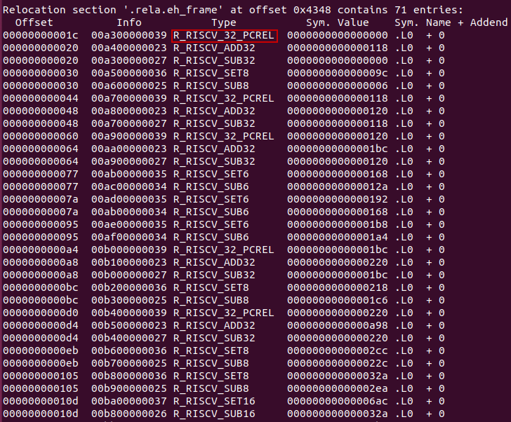

`.eh_frame`: Exception Handling and for debugger to be able to **unwinding  the stack frames**. `.rela.eh_frame` is the relocation section describing how to modify `.eh_frame` when relocating.

ref: https://maskray.me/blog/2020-11-08-stack-unwinding


`R_RISCV_32_PCREL`: 32-bit PC relative


##### Fix relocation issue

Those seem to be the reason for `unknown relocation type 57`. The gcc 10.4.0 will not generate `.eh_frame` and `.rela.eh_frame`, there are `R_RISCV_32_PCREL` relocation types in the latter section.


Adding some option to prevent those sections fixed the issue:

```diff
diff --git a/kernel/Makefile b/kernel/Makefile
index 27c0883..c1b6ff2 100644
--- a/kernel/Makefile
+++ b/kernel/Makefile
@@ -1,5 +1,5 @@
 obj-m := mdio-netlink.o
-ccflags-y := -I$(src)/../include
+ccflags-y := -I$(src)/../include -fomit-frame-pointer -fno-exceptions -fno-asynchronous-unwind-tables -fno-unwind-tables
 
 KDIR ?= /lib/modules/$(shell uname -r)/build

```

ref: https://mailing.freebsd.hackers.narkive.com/bVVwlta9/eh-frame-eh-frame-hdr-how-to-remove-that-trash


> [!NOTE]
>
> But there is still a question: what are the `R_RISCV_32_PCREL` and why it is not supported?


##### relocation process

The relocation process typically involves several steps:

1. **Assembly**: When a RISC-V program is compiled, the assembler generates an object file that contains both machine code and relocation entries. These entries specify how to adjust addresses once the final layout of the program is known.

2. **Linking**: The linker takes these object files and combines them into a single executable or shared library. During this process, it resolves symbols (like function names) and applies relocations based on the final memory layout.

3. **Relaxation**: Linker relaxation is a technique used to optimize code by simplifying instructions when possible. For example, if a function call can be made within a shorter range than initially specified, the linker can replace a pair of instructions (like `auipc` + `jalr`) with a single `jal` instruction, which is smaller and faster

   

# Kernel Headers

Kernel headers are **a set of C header files** that define the interfaces between user-space applications (including kernel modules) and the kernel. These headers contain definitions for **system calls**, **kernel functions**, **data structures**, and **constants** that the kernel module needs to interact with the kernel. 

They are essential for compiling any code that interfaces with the kernel, such as drivers, loadable kernel modules, and certain utilities.


Install Header files from Kernel source code:

`make headers_install INSTALL_HDR_PATH=/path/to/install/header/files`
