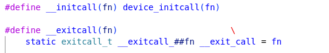
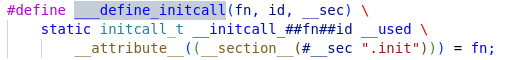

# initcalls and modules

## 1 How to define a module

从GPT上查到设置一个模块的方法如下：

## 2 The mechanism behind

### 2.1 Source code checking

->

->

->

->

如果没有定义MODULE，即，相应的驱动会被编译到内核中。那么，宏module_init(x)会使相应的模块初始化函数被映射到.init段。

如果要编译为module，而不是builtin到内核中，就需要定义MODULE（需要确认是不是这样）。
