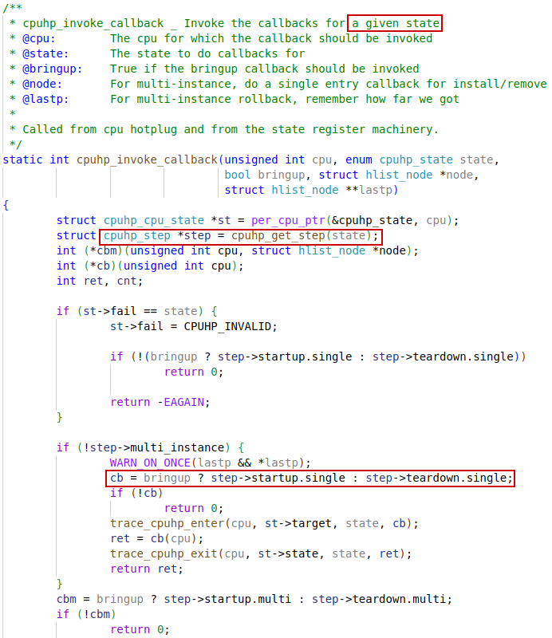
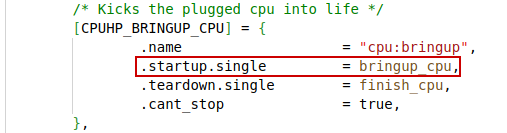
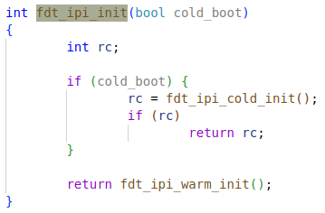

To tease out the bringup process of SMP

# smp_init


## bringup_nonboot_cpus


## cpu_up


## _cpu_up


Target state is minimized to `CPUHP_BRINGUP_CPU` here.

### cpuhp_set_state


### cpuhp_up_callbacks


#### cpuhp_invode_callback




# cpuhp


## cpuhp_step

**Hotplug state machine** boots processors from one state step to another, and will go through every step between the two states.


### cpuhp_get_step


`cpuhp_hp_states` declaration:


### cpuhp_hp_states


...



...


## cpuhp_cpu_state

Per-CPU hotplug state storage


### enum cpuhp_state


```c
enum cpuhp_state {
	CPUHP_INVALID = -1,
	CPUHP_OFFLINE = 0,
	CPUHP_CREATE_THREADS,
	CPUHP_PERF_PREPARE,
	CPUHP_PERF_X86_PREPARE,
	CPUHP_PERF_X86_AMD_UNCORE_PREP,
	CPUHP_PERF_POWER,
	CPUHP_PERF_SUPERH,
	CPUHP_X86_HPET_DEAD,
	CPUHP_X86_APB_DEAD,
	CPUHP_X86_MCE_DEAD,
	CPUHP_VIRT_NET_DEAD,
	CPUHP_SLUB_DEAD,
	CPUHP_DEBUG_OBJ_DEAD,
	CPUHP_MM_WRITEBACK_DEAD,
	CPUHP_MM_VMSTAT_DEAD,
	CPUHP_SOFTIRQ_DEAD,
	CPUHP_NET_MVNETA_DEAD,
	CPUHP_CPUIDLE_DEAD,
	CPUHP_ARM64_FPSIMD_DEAD,
	CPUHP_ARM_OMAP_WAKE_DEAD,
	CPUHP_IRQ_POLL_DEAD,
	CPUHP_BLOCK_SOFTIRQ_DEAD,
	CPUHP_ACPI_CPUDRV_DEAD,
	CPUHP_S390_PFAULT_DEAD,
	CPUHP_BLK_MQ_DEAD,
	CPUHP_FS_BUFF_DEAD,
	CPUHP_PRINTK_DEAD,
	CPUHP_MM_MEMCQ_DEAD,
	CPUHP_PERCPU_CNT_DEAD,
	CPUHP_RADIX_DEAD,
	CPUHP_PAGE_ALLOC_DEAD,
	CPUHP_NET_DEV_DEAD,
	CPUHP_PCI_XGENE_DEAD,
	CPUHP_IOMMU_INTEL_DEAD,
	CPUHP_LUSTRE_CFS_DEAD,
	CPUHP_AP_ARM_CACHE_B15_RAC_DEAD,
	CPUHP_PADATA_DEAD,
	CPUHP_WORKQUEUE_PREP,
	CPUHP_POWER_NUMA_PREPARE,
	CPUHP_HRTIMERS_PREPARE,
	CPUHP_PROFILE_PREPARE,
	CPUHP_X2APIC_PREPARE,
	CPUHP_SMPCFD_PREPARE,
	CPUHP_RELAY_PREPARE,
	CPUHP_SLAB_PREPARE,
	CPUHP_MD_RAID5_PREPARE,
	CPUHP_RCUTREE_PREP,
	CPUHP_CPUIDLE_COUPLED_PREPARE,
	CPUHP_POWERPC_PMAC_PREPARE,
	CPUHP_POWERPC_MMU_CTX_PREPARE,
	CPUHP_XEN_PREPARE,
	CPUHP_XEN_EVTCHN_PREPARE,
	CPUHP_ARM_SHMOBILE_SCU_PREPARE,
	CPUHP_SH_SH3X_PREPARE,
	CPUHP_NET_FLOW_PREPARE,
	CPUHP_TOPOLOGY_PREPARE,
	CPUHP_NET_IUCV_PREPARE,
	CPUHP_ARM_BL_PREPARE,
	CPUHP_TRACE_RB_PREPARE,
	CPUHP_MM_ZS_PREPARE,
	CPUHP_MM_ZSWP_MEM_PREPARE,
	CPUHP_MM_ZSWP_POOL_PREPARE,
	CPUHP_KVM_PPC_BOOK3S_PREPARE,
	CPUHP_ZCOMP_PREPARE,
	CPUHP_TIMERS_PREPARE,
	CPUHP_MIPS_SOC_PREPARE,
	CPUHP_BP_PREPARE_DYN,
	CPUHP_BP_PREPARE_DYN_END		= CPUHP_BP_PREPARE_DYN + 20,
	CPUHP_BRINGUP_CPU,
	CPUHP_AP_IDLE_DEAD,
	CPUHP_AP_OFFLINE,
	CPUHP_AP_SCHED_STARTING,
	CPUHP_AP_RCUTREE_DYING,
	CPUHP_AP_CPU_PM_STARTING,
	CPUHP_AP_IRQ_GIC_STARTING,
	CPUHP_AP_IRQ_HIP04_STARTING,
	CPUHP_AP_IRQ_ARMADA_XP_STARTING,
	CPUHP_AP_IRQ_BCM2836_STARTING,
	CPUHP_AP_IRQ_MIPS_GIC_STARTING,
	CPUHP_AP_IRQ_RISCV_STARTING,
	CPUHP_AP_IRQ_SIFIVE_PLIC_STARTING,
	CPUHP_AP_ARM_MVEBU_COHERENCY,
	CPUHP_AP_MICROCODE_LOADER,
	CPUHP_AP_PERF_X86_AMD_UNCORE_STARTING,
	CPUHP_AP_PERF_X86_STARTING,
	CPUHP_AP_PERF_X86_AMD_IBS_STARTING,
	CPUHP_AP_PERF_X86_CQM_STARTING,
	CPUHP_AP_PERF_X86_CSTATE_STARTING,
	CPUHP_AP_PERF_XTENSA_STARTING,
	CPUHP_AP_MIPS_OP_LOONGSON3_STARTING,
	CPUHP_AP_ARM_SDEI_STARTING,
	CPUHP_AP_ARM_VFP_STARTING,
	CPUHP_AP_ARM64_DEBUG_MONITORS_STARTING,
	CPUHP_AP_PERF_ARM_HW_BREAKPOINT_STARTING,
	CPUHP_AP_PERF_ARM_ACPI_STARTING,
	CPUHP_AP_PERF_ARM_STARTING,
	CPUHP_AP_ARM_L2X0_STARTING,
	CPUHP_AP_EXYNOS4_MCT_TIMER_STARTING,
	CPUHP_AP_ARM_ARCH_TIMER_STARTING,
	CPUHP_AP_ARM_GLOBAL_TIMER_STARTING,
	CPUHP_AP_JCORE_TIMER_STARTING,
	CPUHP_AP_ARM_TWD_STARTING,
	CPUHP_AP_QCOM_TIMER_STARTING,
	CPUHP_AP_TEGRA_TIMER_STARTING,
	CPUHP_AP_ARMADA_TIMER_STARTING,
	CPUHP_AP_MARCO_TIMER_STARTING,
	CPUHP_AP_MIPS_GIC_TIMER_STARTING,
	CPUHP_AP_ARC_TIMER_STARTING,
	CPUHP_AP_RISCV_TIMER_STARTING,
	CPUHP_AP_CLINT_TIMER_STARTING,
	CPUHP_AP_CSKY_TIMER_STARTING,
	CPUHP_AP_HYPERV_TIMER_STARTING,
	CPUHP_AP_KVM_STARTING,
	CPUHP_AP_KVM_ARM_VGIC_INIT_STARTING,
	CPUHP_AP_KVM_ARM_VGIC_STARTING,
	CPUHP_AP_KVM_ARM_TIMER_STARTING,
	/* Must be the last timer callback */
	CPUHP_AP_DUMMY_TIMER_STARTING,
	CPUHP_AP_ARM_XEN_STARTING,
	CPUHP_AP_ARM_CORESIGHT_STARTING,
	CPUHP_AP_ARM_CORESIGHT_CTI_STARTING,
	CPUHP_AP_ARM64_ISNDEP_STARTING,
	CPUHP_AP_SMPCFD_DYING,
	CPUHP_AP_X86_TBOOT_DYING,
	CPUHP_AP_ARM_CACHE_B15_RAC_DYING,
	CPUHP_AP_ONLINE,
	CPUHP_TEARDOWN_CPU,
	CPUHP_AP_ONLINE_IDLE,
	CPUHP_AP_SMPBOOT_THREADS,
	CPUHP_AP_X86_VDSO_VMA_ONLINE,
	CPUHP_AP_IRQ_AFFINITY_ONLINE,
	CPUHP_AP_BLK_MQ_ONLINE,
	CPUHP_AP_ARM_MVEBU_SYNC_CLOCKS,
	CPUHP_AP_X86_INTEL_EPB_ONLINE,
	CPUHP_AP_PERF_ONLINE,
	CPUHP_AP_PERF_X86_ONLINE,
	CPUHP_AP_PERF_X86_UNCORE_ONLINE,
	CPUHP_AP_PERF_X86_AMD_UNCORE_ONLINE,
	CPUHP_AP_PERF_X86_AMD_POWER_ONLINE,
	CPUHP_AP_PERF_X86_RAPL_ONLINE,
	CPUHP_AP_PERF_X86_CQM_ONLINE,
	CPUHP_AP_PERF_X86_CSTATE_ONLINE,
	CPUHP_AP_PERF_S390_CF_ONLINE,
	CPUHP_AP_PERF_S390_SF_ONLINE,
	CPUHP_AP_PERF_ARM_CCI_ONLINE,
	CPUHP_AP_PERF_ARM_CCN_ONLINE,
	CPUHP_AP_PERF_ARM_HISI_DDRC_ONLINE,
	CPUHP_AP_PERF_ARM_HISI_HHA_ONLINE,
	CPUHP_AP_PERF_ARM_HISI_L3_ONLINE,
	CPUHP_AP_PERF_ARM_L2X0_ONLINE,
	CPUHP_AP_PERF_ARM_QCOM_L2_ONLINE,
	CPUHP_AP_PERF_ARM_QCOM_L3_ONLINE,
	CPUHP_AP_PERF_ARM_APM_XGENE_ONLINE,
	CPUHP_AP_PERF_ARM_CAVIUM_TX2_UNCORE_ONLINE,
	CPUHP_AP_PERF_POWERPC_NEST_IMC_ONLINE,
	CPUHP_AP_PERF_POWERPC_CORE_IMC_ONLINE,
	CPUHP_AP_PERF_POWERPC_THREAD_IMC_ONLINE,
	CPUHP_AP_PERF_POWERPC_TRACE_IMC_ONLINE,
	CPUHP_AP_PERF_POWERPC_HV_24x7_ONLINE,
	CPUHP_AP_PERF_POWERPC_HV_GPCI_ONLINE,
	CPUHP_AP_WATCHDOG_ONLINE,
	CPUHP_AP_WORKQUEUE_ONLINE,
	CPUHP_AP_RCUTREE_ONLINE,
	CPUHP_AP_BASE_CACHEINFO_ONLINE,
	CPUHP_AP_ONLINE_DYN,
	CPUHP_AP_ONLINE_DYN_END		= CPUHP_AP_ONLINE_DYN + 30,
	CPUHP_AP_X86_HPET_ONLINE,
	CPUHP_AP_X86_KVM_CLK_ONLINE,
	CPUHP_AP_ACTIVE,
	CPUHP_ONLINE,
};
```


# bringup_cpu

This is the startup method of the `CPUHP_BRINGUP_CPU` state step.


# __cpu_up


## start_secondary_cpu


## cpu_ops_sbi

In `arch/riscv/kernel`:


### sbi_cpu_start


### sbit_hsm_hart_start


## SBI lib

ecall_hsm


### sbi_ecall_hsm_handler


### sbi_hsm_hart_start


### sbi_ipi_raw_send


## ipi_dev


### sbi_ipi_set_device


### CONFIG_FDT_IPI

If not configured, `fdt_ipi_init` will be empty, instead of calling `fdt_ipi_cold_init` to set the **ipi device**


### fdt_ipi_init



### fdt_ipi_cold_init


### .match_table


In device tree, the compatible property should match the `clint` node.


### CONFIG_FDT_IPI_MSWI

The C array `fdt_ipi_drivers` will be added with `struct fdt_ipi_mswi`, with `CONFIG_FDT_IPI_MSWI` configuration.


### ipi_mswi_cold_init


#### fdt_parse_alint_node


### aclint_mswi_cold_init


### sbi_ipi_device


## sbi_ipi_init

In `init_coldboot`:


### sbi_platform_ipi_init


`ipi_init` is pointing to `fdt_ipi_init`.


### sbi_ipi_event_create


### SBI_EINVAL


