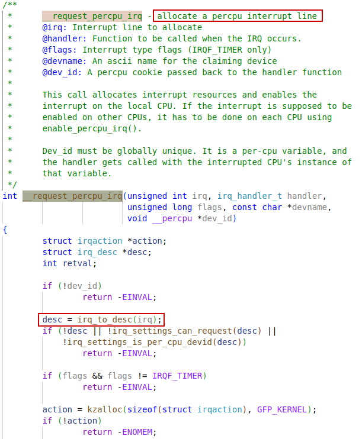
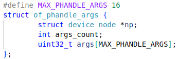
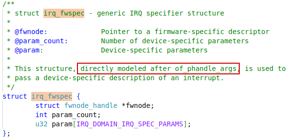
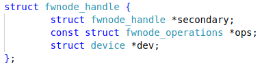
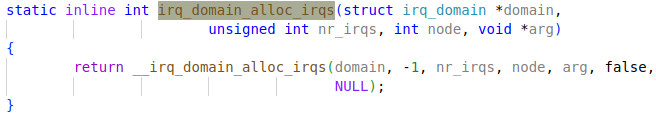
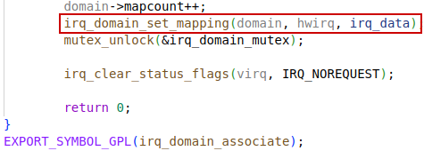
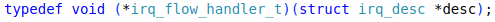

1. How are all the interrupt handlers working in Linux kernel?


# request_per_irq


## __request_percpu_irq




## __setup_irq


## irq_request_resources


# request_irq


## request_threaded_irq


# of irq


## of_irq_parse_one


new style


### of_irq_parse_raw


## irq_of_parse_and_map


### irq_create_of_mapping


#### of_phandle_args_to_fwspec


### irq_create_fwspec_mapping


#### irq_find_matching_fwspec


#### irq_domain_translate


## struct


### of_phandle_args




#### irq_fwspec




#### device_node


#### fwnode_handle



##### fwnode_operations


### irq_desc


#### irq_data


##### irq_chip


##### irq_domain

The `irq_domain` is responsible for reverse mapping of the `hwirq` into the Linux IRQ number space.


##### irq_domain_ops


#### irqaction


# irq domain

A mechanism to separate controller-local interrupt numbers, called hardware irq's, from Linux IRQ numbers. The `irq_domain` object is responsible for `hwirq` to `irq` translation.


## irq_domian Hierarchy

Hierarchy IRQ domain:

On some architectures, there may be multiple interrupt controllers involved in delivering an interrupt from the device to the target CPU. Here is a typical interrupt delivering path on RISC-V platforms:

​	UART device --> PLIC -> riscv-intc -> hart

There are two interrupt controllers involved: 

1. PLIC (Platform level interrupt controller)
2. riscv-intc (hart interrupt controller)

To support such a hardware topology and make software architecture match hardware architecture, an `irq_domain` data structure is built for each interrupt controller and those `irq_domain`s are organized into hierarchy. When building `irq_domain` hierarchy, the `irq_domain` near to the device is child and the `irq_domain` near to CPU is parent. So a hierarchy structure as below will be built for the example above:

```
	CPU Vector `irq_domain` (root `irq_domain` to manage CPU vectors)
			^
			|
	PLIC `irq_domain` (manage external interrupts)
```


There are four major interfaces to use hierarchy irq_domain:

1) `irq_domain_alloc_irqs()`: allocate IRQ **descriptors** and interrupt
   controller related resources to deliver these interrupts.
2) `irq_domain_free_irqs()`: free IRQ descriptors and interrupt controller
   related resources associated with these interrupts.
3) `irq_domain_activate_irq()`: activate interrupt controller hardware to
   deliver the interrupt.
4) `irq_domain_deactivate_irq()`: deactivate interrupt controller hardware
   to stop delivering the interrupt.

With support of hierarchy `irq_domian` and hierarchy `irq_data` ready, **an `irq_domain` structure is built for each interrupt controller**, and an `irq_data` structure is allocated for each `irq_domain` associate with an IRQ. Now we could go one step further to support stacked(hierarchy) `irq_chip`. That is, an `irq_chip` is associated with each `irq_data` along the hierarchy. A child `irq_chip` may implement a required action by itself or by cooperating with its parent `irq_chip`.

With stacked `irq_chip`, interrupt controller driver only needs to deal with the hardware managed by itself and may ask for services from its parent `irq_chip` when needed. So we could achieve a much cleaner software architecture.


### irq_domain_alloc_irqs



### __irq_domain_alloc_irqs


#### irq_domain_alloc_descs


#### __irq_alloc_descs


##### alloc_descs


##### alloc_desc


##### irq_insert_desc

In this way, IRQ numbers are connected to its corresponding `irq_desc`.


#### irq_domain_alloc_irq_data


#### irq_domain_alloc_irqs_hierarchy


#### irq_domain_trim_hierarchy


#### irq_domain_insert_irq


##### irq_domain_set_mapping


## irq_domain_add/create_*


### irq_domain_add_linear


## __irq_domain_add


### irq_create_mapping

In most cases, the `irq_domain` will begin with empty without any mappings between hwirq and IRQ numbers. Mappings are added to the `irq_domain` by calling `irq_create_mapping()`.


#### irq_create_mapping_affinity


#### irq_domain_associate





## irq_desc_tree


# struct irq_desc

interrupt descriptor


## irq_desc_get_chip


## struct irq_data


### irq_chip


# riscv_intc


## riscv_intc_init


### irq_domain_add_linear

Allocate and register a linear revmap `irq_domain`.

See `irq_domain_add/create_*` section for more details.

#### riscv_intc_domain_ops


### set_handle_irq


## riscv_intc_irq

The `cause` is holding the `hwirq` value here.


## handle_domain_irq


## __handle_domain_irq


### set_irq_regs


### irq_find_mapping

When an interrupt is received, `irq_find_mapping()` function should be used to find the Linux IRQ number from the hwirq number.


# PLIC


## plic_init


### irq_set_chained_handler


### __irq_set_handler


### __irq_do_set_handler


## plic_handle_irq


# generic_handle_irq

This function applies to all levels of irq chip.


## irq_to_desc

irq-desc pairs are stored in a **radix tree** structure.


## generic_handle_irq_desc


.handle_irq


