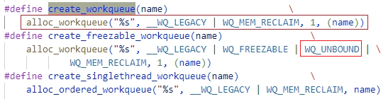
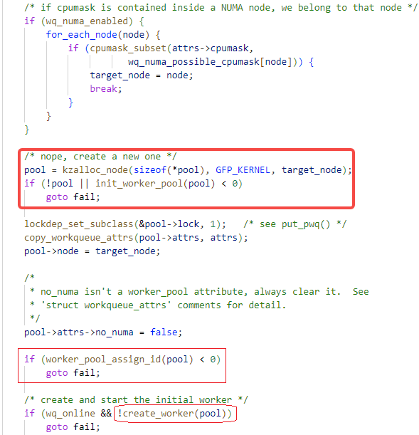
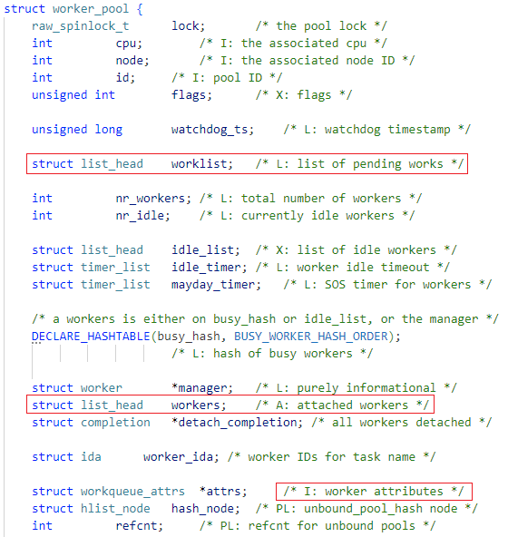
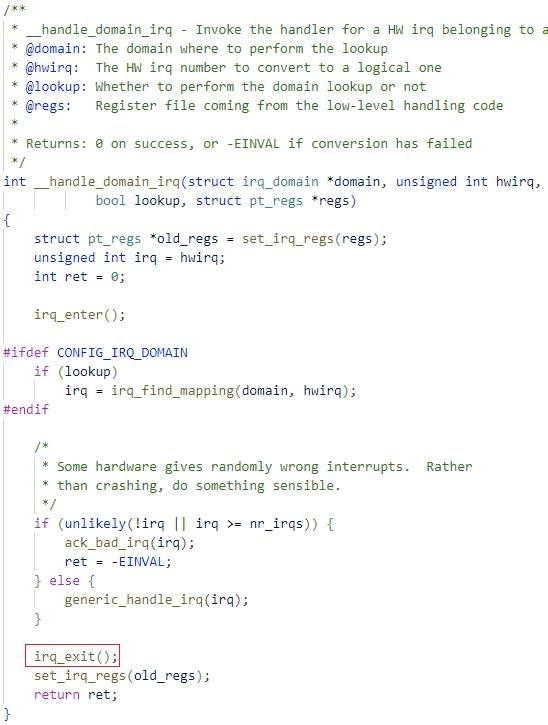
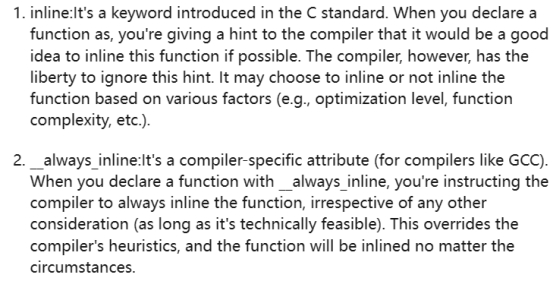
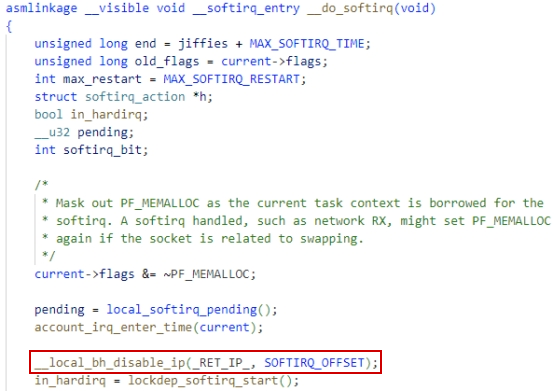
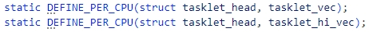

2024年2月18日

> [!NOTE]
>
> How workqueue works with UART console interaction?


# IRQ bottom half:

当中断产生时，Interrupt Handler需要快速地完成响应。如果需要在Interrupt Handler里完成较多较复杂的任务，就需要把它们分成两半，即Top Half和Bottom Half。

Linux中主要有4中BH 机制：

`softirqs`, `tasklets`, `threaded IRQs`, `workqueue`

它们的使用优先原则是：

尽量不要有`softirqs`，使用`tasklets`  ->  `tasklets` deprecated，使用`threaded IRQ`


## workqueue: kernel process context

workqueue是在内核的2.6版加入的。

被定义的work需要加入到workqueue里，才能被worker thread执行。在worker_pool里有许多worker线程，它们共同承担完成worklist中的work任务。

- global workqueue：系统默认的工作队列，入队的方法有static method和dynamic method，分别对应将deferral function初始化到work的方式是静态的，还是动态的。

- own workqueue：自定义的工作队列


workqueue subsystem的实体是**worker_pool**。（相应地，threaded IRQ的实体则是一个个IRQ thread）。worker线程隶属于worker_pool，另外`worker_pool.worklist`指分配给线程池的work，当worklist空了，则代表工作处理完了。`workqueue`是设备驱动使用workqueue子系统的接口，通过`pool_workqueue`将**worker_pool**分配给`workqueue`。然后，在`queue_work`时，实际上就把work加到了**worker_pool**的worklist中了。如果worker_pool中的worker线程不够用了，就会自动创建新的worker。

![任务工厂 - Linux 中的 workqueue 机制 [一]](./.17_interrupt_handler_BH/v2-78a30d3d370024f4fbd4cb5342515e3a_1440w.png)


在Top Half中，调用`schedule_work`函数，然后返回IRQ_HANLDED。从而将任务defer到**worker线程**中。这里的'workqueue'其实是之前创建的work的结构体。


### schedule_work

调度work到**global workqueue**（工作队列）。


#### queue_work_on

将**work**加入到**workqueue**中。处于**pending**状态的work不会重复挂入workqueue。


#### __queue_work


#### insert_work

work实际上是被直接插入到了pwq，接在**worklist**链表的末端。


其它schedule_work相关的函数：

- schedule_delayed_work
- schedule_work_on
- schedule_delayed_work_on

及删除work相关的函数：

- flush_work
- cancel_work_sync
- cancel_delayed_work_sync

及检查work状态相关的函数：

- work_pending
- delayed_work_pending


### queue_work

调度work到**own workqueue**


#### create_workqueue

创建一个**workqueue**，同时也会创建相应的**pool_workqueue**以及相应的**worker_pool**。

函数返回的wq只是个接口，通过pwq将work发布给适合worker_pool。然后由其中的workers去执行相应的工作。**singlethread workqueue**就对应于非per-cpu worker_pool。**freezable**跟电源管理相关的flag，当系统suspend的时候，有一个阶段会将所有的用户空间的进程冻结，缺省情况下，所有的内核线程都是nofreezable的。freezable workqueue也是singlethread的，只是singlethread workqueue是**non-freezable**的。




#### alloc_workqueue


##### alloc_and_link_pwqs

不管是系统创建的global wq，还是用户自己创建的own wq，只要没有指定`WQ_UNBOUND`，默认都是和normal worker_pool**（per-cpu）绑定的**。wq和pwq是**一对多**的关系，每个CPU上有一个worker_pool与wq相对应，因此需要一组pwqs与wq相对应。pwq和worker_pool是一对一的关系。


###### apply_workqueue_attrs

只有**unbound** workqueue才有workqueue_attrs，才能有效的执行后续的一系列操作。


###### apply_workqueue_attrs_locked


###### apply_wqattrs_prepare


##### alloc_unbound_pwq


###### get_unbound_pool





##### init_pwq


##### link_pwq


### workqueues


### 问题

> [!IMPORTANT]
>
> worker线程在哪里？它是如何工作的？
>
> 答：在wq子系统初始化时，由`workqueue_init`函数会为worker_pool创建相应的worker线程，在线程函数`worker_thread`中，会无限循环。在循环中，会检查worker_pool->worklist中是否有要完成的work。如果所有的work都完成了，就会进入sleep状态，让出CPU。`worker_pool`会自动增加其中的worker，以提高并发concurrency。
>
> schedule_work和queue_work分别将work添加到内核默认wq和自定义wq，**那么workqueue是如何被worker线程执行的**？
>
> 答：`worker_pool`里有一个worklist，指向了work链表。enque work时，其实是将work加到了worker_pool的worklist。然后，由worker_pool里的worker线程去完成这些work。
>
> 所有的workers都隶属于`worker_pool`，要么是**per-cpu** worker_pool（**normal wq**），要么是**dynamic** worker_pool。per-cpu worker_pool应该是每个CPU对应一个，那dynamic是怎么工作呢？它们和pwq的有关系？
>
> 答：unbound pool就是dynamic worker_pool，它不与CPU进行绑定。它通过一个pwq分配给带有`WQ_UNBOUND`标志的workqueue。如果workqueue不带`WQ_UNBOUND`标志，则会创建pwqs，以将bound到CPUs的worker_pools分配给它。在`workqueue_init_early`函数中，会为global workqueue创建的per-cpu/bound worker_pool。workqueue的**unbound标志是对于CPU而言**的，这代表着相应的工作可以由不同的CPU执行，也即worker_pool中的worker线程可以运行在不同的CPU上。
>
> 如果是per-CPU `worker_pool`，对应于一个**workqueue**每个CPU都一个bound到自己的`worker_pool`，及相应的pwq。在queue work时，就会加入到hard irq执行时所在的CPU的worker_pool的worklist中。
>
> 为了充分利用**locality**，通常选择将处理hardirq的CPU作为该workqueue下半部的执行CPU，因此每个CPU都要有对应的worker_pool来提供worker去执行从上半部defer过来的work，这就是per-cpu worker_pool。对于负载波动性比较大的应用，这种设计会产生较多的idle worker线程，每一个空闲的线程都会占用一定的系统资源。因此就有了unbound worker_pool的设计，其中的worker线程可以工作在任何一个CPU上，这样就减少了worker线程的生成与销毁，也减少了idle worker的数量。
>
> 每一个`worker_pool`又有自己的wq，即`pool_workqueue`。那么enque work时的，wq跟pwq的关系是什么呢？需要弄清楚workqueue的真正作用，它对应什么实体。
>
> 答：**`pool_workqueue`结构体中包含了`worker_pool`和`workqueue`**。一个工作队列主要包括了线程池和工作链表。`workqueue`是子系统中，workqueue实体给设备驱动或者其它子系统的接口。

### 结构体

#### worker


worker线程主要有三种状态：idle, running, pending


#### work_struct


#### worker_pool

所有的workers都隶属于`worker_pool`，要么是**per-cpu** worker_pool（normal, bound），要么是**dynamic** worker_pool（unbound）。

**worker_pool的调度思想**是：如果有work需要处理，保持一个running状态的worker处理，不多也不少。如果有work是CPU密集型的，它虽没进入suspend状态，但会长期占用CPU，上后续的work阻塞太长时间。这时wq可以声明自己是`CPU_INTENSIVE`，让当前worker脱离动态调度，像是进入了suspend状态，以便其它worker进入running状态去执行其它work。





##### cpu_worker_pools


`static struct worker_pool[NR_STD_WORKER_POOLS];`


`static struct worker_pool[2];`

静态地为每个CPU创建2个per-cpu worker_pool，调度优先级一个是普通的，另一个是高的。


##### unbound worker_pools

unbound worker_pool分成两类，一类是**unbound_std_wq**，每个node（NUMA的node）对应一个worker_pool，多个node就对应多个worker_pool。另一类是**ordered_wq**，所有的node对应一个default worker_pool。


#### pool_workqueue

每一个pwq有自己的workqueue，即`pool_workqueue->wq`。**pwq和worker_pool是一对一的关系**。pwq是一个中介角色，联系起wq和worker_pool。

在alloc_workqueue时，bound pwqs由`alloc_percpu`函数动态分配；unbound pwq由`alloc_unbound_pwq`函数分配，并同时分配worker_pool。


#### workqueue_struct

如果wq是`WQ_UNBOUND`，则使用`unbound_attrs`和`dfl_pwq`；如果不是，则使用`__percpu cpu_pwqs`。


##### workqueue_attrs


#### locking annotation


### workqueue subsystem init

#### workqueue_init_early

创建global **workqueue**s，在**start_kernel**中被调用。也创建了per-cpu **worker_pool**。


##### init_worker_pool

初始化**worker_pool**


##### worker_pool_assign_id

将**worker_pool**加入到`worker_pool_idr`中。


通过ID radix tree将所有的worker_pool组织到一起。


#### workqueue_init

为worker_pool创建inital workers，在**kernel_init_freeable**中被调用。


##### unbound_pool_hash


#### create_worker

分配一个worker到worker_pool，并为worker创建一个线程。


##### kthread_create_on_node

创建一个内核线程，即kthread。


### worker_thread

worker的线程函数，每次唤醒后就去执行workqueue中的work，然后通过调用**schedule**让出cpu。

这些workers会去处理所有的**work**，而不会限定只执行特定的wq。唯一的例外是，rescuer的wq只被`rescuer_thread`执行。


#### process_one_work

函数作用：处理一个工作

`__releases()`和`__acquires()`是内核中的特殊注解标记，用于指示锁的释放和获取。


#### keep_working


#### may_start_working


#### manage_workers


##### maybe_create_worker

`workqueue_init`中为`worker_pool`创建一个worker线程之后，线程池中的worker线程是根据需要增加的。


## Threaded IRQ: process context

no need to schedule the bottom half, kernel will do it.

会为每一个interrupt line创建一个IRQ thread。而workqueue中的work会共享worker pool中的worker线程。

workqueue需要依赖于相应的子系统，而threaded IRQ只需要在分配interrupt line时，创建相应的irq_thread就可以了。但每一个interrupt line都会在需要一个内核线程。

IRQ thread中完成的**一定是中断的BH**（下半部分），而workqueue中的work却可以有其它来源。

### request_threaded_irq


#### __setup_irq


### setup_irq_thread

创建irq thread


### irq_thread

这个是Threaded IRQ线程的主函数，即线程起来后，从这里开始执行。在请求中断后，开启这个线程，然后在top half完成后执行一次BH，最后在不需要的时候结束线程。


#### irq_thread_fn


#### irq_forced_thread_fn

被强制defer到threaded IRQ中的中断处理程序，需要在屏蔽中断的环境下执行。


#### irq_wait_for_interrupt

这是一个无限循环函数，只有在函数返回时，才终止循环。在查询到RUNTHREAD标志时，函数返回0；在线程需要退出时，函数返回-1，这时会触发上层函数结束while循环，进而结束IRQ线程；其它情况下，调用schedule让出CPU，然后在线程重新获得CPU资源时继续循环。


## software interrupt context

特点：硬件中断处于使能状态，~~但又不在（没有返回到）进程环境中~~。软中断处于disable的状态，这会阻止进程的调度。
softirqs只能在raise它的CPU上执行，它的pending位是per-CPU的。
由于处于interrupt context而不是process context，**softriqs/tasklets不能sleep**。

### softirqs: 响应过程

are statistically allocated at the compile time, so we cannot dynamically create or kill the softirqs. Softirqs are represented using the `struct softirq_action` which is defined in <linux/interrupt.h>

called by `__do_softirq()`

ref: [Concurrency Managed Workqueue之（一）：workqueue的基本概念 (wowotech.net)](http://www.wowotech.net/irq_subsystem/workqueue.html)

有三种情况下，softirq handler会被执行。

1. 在执行完hardware interrupt后；（也可能在`local_bh_enable`中）
2. 在ksoftirqd内核进程中；
3. 代码中显式地执行pending的softirqs，例如networking subsystem。

这里，主要分析**第一种情况**，从中断响应过程分析。

#### 1. __handle_domain_irq



#### irq_enter


#### __irq_enter

```preempt_count_add(HARDIRQ_OFFSET);/* 将hardware interrupt的count值加1 */```


##### preempt_count_add


#### irq_exit


#### __irq_exit_rcu

```preempt_count_sub(HARDIRQ_OFFSET); /* 将hardware interrupt的count值减1。*/```
如果没有硬件中断嵌套，也不在软中断中，那么此时`in_interrupt()`应该返回0。此时，如果有softirqs pending_bit，则执行`invoke_softirq`()。


这里就是softirq在执行hardware interrupt完后，被执行的入口。

##### preempt_count_sub


**-（减号）即是单目运算符**，又是双目运算符。


**inline vs __always_inline**




##### in_interrupt

获得hardware interrupt，software interrupt和NMI（i386才有？）的中断计数。即判断有没有在硬中断/软中断/NMI中。


`in_softirq`定义了更大的一个区域，不仅仅包括了`in_serving_softirq`上下文，还包括了diable bottom half的场景：


#### invoke_softirq


#### __do_softirq

通过执行softirqs中注册的action，相应的bottom half被完成。



scan all the softirqs with softirq_bit set


##### __local_bh_disable_ip

With `SOFTIRQ_OFFSET`, this function instructs entering of softirq processing.


##### __local_bh_enable

With `SOFTIRQ_OFFSET`, this function instructs leaving of softirq processing.


##### pending


声名`irq_stat`


定义`irq_stat`


= 在per-CPU section里定义`irq_cpustat_t irq_stat;`
因此，每一个CPU都有自己的**softirqs pending bit**。


**raw_cpu_read_4**


```*raw_cpu_ptr(&(local_softirq_pending_ref));```

**raw_cpu_write_4**


```*raw_cpu_ptr(&(local_softirq_pending_ref)) = (x);```

**raw_cpu_or_4**


```*raw_cpu_ptr(&(local_softirq_pending_ref)) |= (x);```


##### per-CPU variable


**__PCPU_ATTRS(sec):**


`PER_CPU_BASE_SECTION`


`PER_CPU_ALIGNED_SECTION`


对于单核处理器，没有`CONFIG_SMP`
```__attribute__(section(“.data” “..shared_aligned”))```
C编译器对字符串的处理方式是：引号引起来的字符串，中间以空格分开，编译器（**预处理器**）会自动将它们连成一个。
```__attribute__(section(“.data..shared_aligned”))```
因此，per-CPU variables会被链接到`.data..shared_aligned section`。

对于多核处理器，会有`CONFIG_SMP`

```__attribute__(section(“.data..percpu” “..shared_aligned”)```

=``` __attribute__(section(“.data..percpu..shared_aligned”)```

真正的per-CPU variables 会被链接到`.data..percpu..shared_aligned section`。

但是，这里的变量是如何做到per-CPU的呢？
按照解释，内核初始化过程中，会先确认有多少个CPU，然后创建合适数据量的per-CPU sections。


链接的时候，分配一个per-CPU section。


start_kernel()中：


##### setup_per_cpu_areas


**per_cpu_areas这一部分比较复杂，需要专门花时间来分析**。

##### ffs


### softirqs: 注册过程

在start_kernel函数中，系统初始化的过程时初始化了**softirqs**


#### softirq_init

默认开启**tasklets**所对应的softirqs。


tasklets和softirqs的区别是什么？
tasklets基于softirqs实现，在TASKLET_SOFTIRQ中，会执行tasklet队列。

**在softirq_init时，tasklet相对应的softirq被注册了tasklet_action和tasklet_hi_action。**
**然后，在schedule tasklet的时候，raise相关的softirqs（TASKLET_SOFTIRQ/HI_SOFTIRQ）。**
**最后，在响应相关的softirqs的时候，执行了相应的tasklet_action/tasklet_hi_action。**
**在tasklet_action/tasklet_hi_action函数中，又会扫描tasklet_vec/tasklet_hi_vec指向的队列，完成tasklets任务。**

#### open_softirq

将相应的**softirqs**的执行函数注册到`softirq_vec`


#### softirq_vec


不要增加新的softirqs，尽量用**tasklets**。


因此，**softirq_vec就是一个函数指针数组**。在`__do_softirq`中会根据相应的**pending状态位**执行数组中的函数。

#### raise_softirq_irqoff


### 2. ksoftirqd

当负荷比较重的时候（中断产生的比较多），系统在一段时间内都在处理interrupt handler以及相关的softirq，从而导致无法调度到进程执行，这时候，linux kernel采用了将softirq推迟到**softirqd**这个内核线程中执行

#### spawn_ksoftirqd


##### smpboot_register_percpu_thread


##### __smpboot_create_thread


##### kthread_create_on_cpu


#### smpboot_thread_fn


##### kthread_should_stop


##### kthread_should_park


##### kthread_park


##### kthread_parkme


#### softirq_threads


线程task_struct：


线程函数：


### 3. do_softirq


#### do_softirq_own_stack


**网络子系统**中，会显式执行softirqs的handler。


### tasklets: 基本原理

“small” thread, has neither stack nor context of its own.
executed by the principle of non-preemptive scheduling （不可抢占）

tasklets被schedule后，才会被执行。被调度后，tasklet就会在相应的（**tasklet_vec/tasklet_hi_vec**）队列中。

tasklets基于softirqs实现，具体来说就是根据高低优先级使用**HI_SOFTIRQ**和**TASKLET_SOFTIRQ**两个softirq中断号来处理相应的tasklets队列。

#### tasklet_schedule

只有**不在SCHED状态**的tasklet才能被`__tasllet_schedule()`，即同一个tasklet不能同时schedule两次。而且在**schedule** tasklet之前会set **SCHED**状态。


tasklet只会在调度它的CPU上被执行（继承自softirqs的属性：**per-CPU pending_bit**），tasklet_vec也是一个per-CPU的，因此每个CPU都有相应的**tasklet_vec**。


```
/* head->tail里存的是指向tasklet_struct.next的指针，即指向tasklet_struct *next的指针， */
/* 是一个最终指向tasklet_struct的二级指针 */
*head->tail = t; /* *head->tail先dereference到*next指针 */
/* 然后将指针tasklet_struct *t给它，即将t加入以head为头的tasklet单链表 */
head->tail = &(t->next); /* 然后将head->tail指向新的tasklet的next指针 */
/* ->（箭头操作符）通过指针获得结构体成员 */
/* &（取地址）获得了指向被取地址对象的指针，因此tail指向了指针t->next */

raise_softirq_irqoff(softirq_nr);
/* 加入队列后，设置tasklets在softirqs里相应的pending_bit，以激活softirqs去执行tasklets队列。*/
```

##### tasklet_head


##### tasklet_struct

**tasklet_struct**中有一个指向下一个tasklet_struct的指针，这样就构成了一个链表，最后挂在**tasklet_head**上。每个CPU有**tasklet_vec/tasklet_hi_vec**两个链表分别用于一般tasklets和高优先级tasklets。


tasklet state:


#### tasklet_action


扫描整个tasklet_vec队列。最开始，将tasklet_head.head地址放入tasklet_head.tail中。然后每扫过一个tasklet，如果没有成功执行，都将它的地址放到tasklet_head.tail所指向的地址中，然后将tasklet_head.tail指向队列的下一个tasklet的地址。这样扫描完成后，tasklet_head.head就指向了一个新的，由未执行的tasklets组成的队列。并且，每一个tasklet都会在未守成的时去设置softirq中对应的pending，以在下一个合适的时候唤醒softirq，进而再执行tasklet_action。执行task之前会clear **SCHED**状态。


#### tasklet_vec



tasklet相关的队列也是**per-CPU**的，被scheduled tasklets只能在schedule它们的CPU上被执行。
