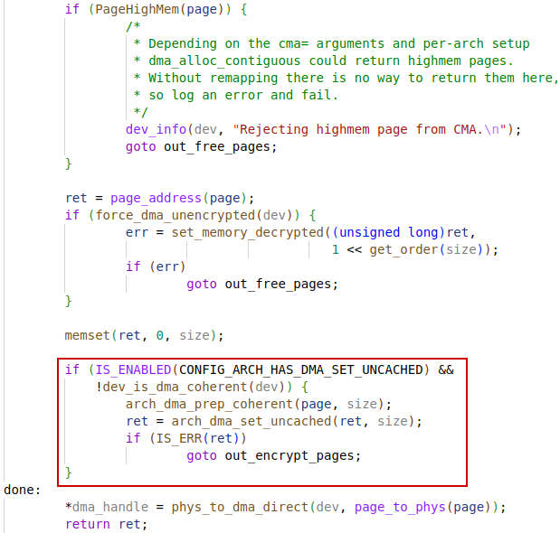
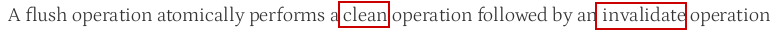
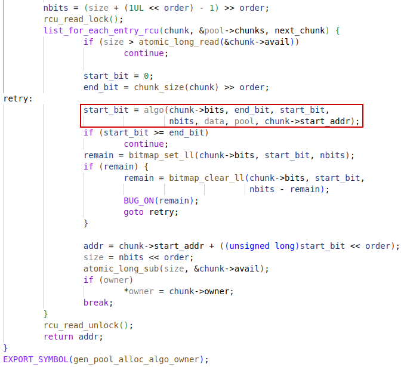
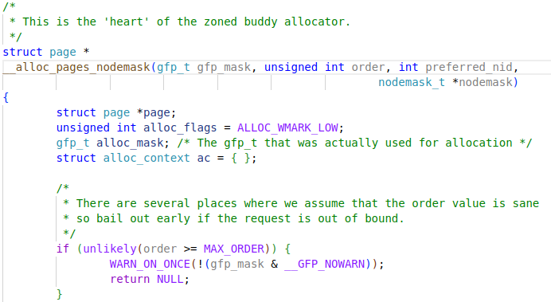
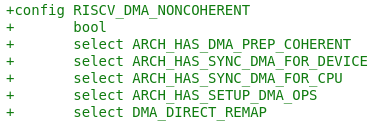
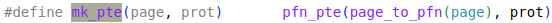
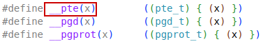
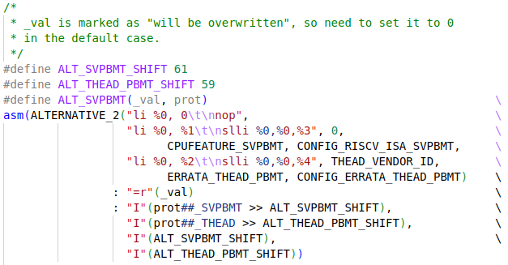
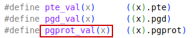

DMA related kernel code

# dma_alloc_coherent

gfp=`GFP_KERNEL`, which means `attrs` is 0

## dma_alloc_attrs

### get_dma_ops

Need to set `CONFIG_DMA_OPS` in configuration (Not configured in C920 patch)

### device.coherent_dma_mask

In `of_platform_device_create_pdata`, the `device.coherent_dma_mask` was set when registering a device.

## dma_alloc_from_dev_coherent

### dev_get_coherent_memory

If `dev->dma_mem` is not set, this way of DMA allocation will not be applied.

### __dma_alloc_from_coherent

## dma_alloc_direct

### dma_go_direct

## dma_direct_alloc

Several types of method of DMA allocation will be tried based on configuration and settings.

### dev_is_dma_coherent

`CONFIG_ARCH_HAS_SYNC_DMA_FOR_DEVICE` and `CONFIG_ARCH_HAS_SYNC_DMA_FOR_CPU` should be configured for DMA writing to device and writing to CPU separately. Naturally, if these configurations are set, the device is not DMA coherent, i.e., `dev->dma_coherent` is left false in default.

#### arch_sync_dma_for_device

Add `CONFIG_ARCH_HAS_SYNC_DMA_FOR_DEVICE` and C920 patch

#### arch_sync_dma_for_cpu

Add `CONFIG_ARCH_HAS_SYNC_DMA_FOR_CPU` and C920 patch

### 1. arch_dma_alloc

Depends on architecture, maybe even no implementation on some platforms.

### 2. dma_direct_alloc_from_pool

#### dma_direct_optimal_gfp_mask

#### dma_alloc_from_pool

Will try the pools in precedence of:

1. `atomic_pool_dma32`
2. `atomic_pool_dma`
3. `NULL`

##### dma_guess_pool

#### __dma_alloc_from_pool

##### gen_pool_alloc

###### gen_pool_alloc_algo_owner

##### dma_coherent_ok

`dma_coherent_ok` is what `phys_addr_ok` point to.

###### phys_to_dma_direct

If everything is cool, `phys_to_dma_direct` may directly return the `phys` back.

###### phys_to_dma

##### gen_pool_avail

To make sure the available free space in pool is not below `atomic_pool_size`.

### 3. __dma_direct_alloc_pages

#### dma_alloc_contiguous

#### alloc_pages_node

#### __aloc_pages_node

#### __alloc_pages

#### __alloc_pages_nodemask

#### get_page_from_freelist

### arch_dma_prep_coherent

If `CONFIG_ARCH_HAS_DMA_PREP_COHERENT` is configured, a **flush** operation will be done before setting a memory space from cached to un-cached.

The `DCACHE.CIPA` instruction will **w**rite **b**ack the pointed cache block and then **inv**alidate the cache entry. (The meaningful part of this instruction is actually the write-back operation, which is also called **flush**)

#### DCACHE.CIPA

Consider switch to standard CMO extensions in future (Zicbom extension)

#### CBO.FLUSH

The standard operation for this purpose should be a **flush operation**, instead of an invalidate operation. Actually, `CBO.FLUSH` instruction in `Zicbom` extension is doing the same thing as `DCACHE.CIPA`  in Thead cache sub-instruction set.

In mainline linux kernel code, we can see that the `arch_dma_prep_coherent` is using the `CBO.FLUSH` instruction.

The commit to add `zicbom` extension support:

### arch_dma_set_uncached

The calling of this function is only in a block that will not be compiled in if `CONFIG_ARCH_HAS_DMA_SET_UNCACHED` is not set, so the inline placeholder function is not needed.

# dma_map_single

The streaming DMA mapping routines can be called from interrupt context.

## dma_map_single_attrs

## dma_map_page_attrs

### dma_map_direct

Normally, `get_dma_ops` will return `NULL` if not configuring `CONFIG_DMA_OPS`

## dma_direct_map_page

## arch_sync_dma_for_device

This is apparently architecture specific and if `CONFIG_ARCH_HAS_SYNC_DMA_FOR_DEVICE` is not set, it will be an empty function.

# pool

## atomic_pool_work

## __dma_atomic_pool_init

### gen_pool_create

### gen_pool_set_algo

### atomic_pool_expand

#### cma_in_zone

Without `CONFIG_DMA_CMA` configured, which depends on `CONFIG_HAVE_DMA_CONTIGUOUS` and ` CONFIG_CMA`, `cma_in_zone` will return `false` directly.

#### alloc_pages

#### __alloc_pages

#### arch_dma_prep_coherent

C920 specified DMA coherence functions:

`dma_wbinv_range` just clean and invalidate the cache lines.

#### dma_common_contiguous_remap

#### pgprot_dmacoherent

### gen_pool_first_fit_order_align

#### bitmap_find_next_zero_area_off

## atomic_pool_work_fn

# vmalloc

## vmap

### map_kernel_range

### map_kernel_range_noflush

### vmap_p4d_range

### vmap_pud_range

### vmap_pmd_range

### vmap_pte_range

### set_pte_at

#### pte_t

#### __pte

#### set_pte

Seems here should be the point where PBMT setting change page to uncached to achieve coherence with DMA.

## setup_vmalloc

# Contiguous Memory Allocator

ref: https://www.marcusfolkesson.se/blog/contiguous-memory-allocator/

## Reserve CMA area

By device tree:

By kernel parameter:

By kernel configuration:

# GFP

Get Free Pages

Userful GFP flag combinations:

Plain integer GFP bitmasks:

## keyword __force

In the context of C and C++ programming, particularly in kernel development, the `__force` keyword is often used as a type cast to indicate that a specific conversion should be enforced by the compiler. This is typically seen in the Linux kernel codebase, where it is used to cast types explicitly, ensuring that the compiler treats the value as a specific type **without any warnings or errors related to type safety**.

# pgprot

The portion below in patch for kernel v5.10 is not compatible with C920R2S0. Check mainline kernel v6.6 (or v5.19) for corresponding C920 support.

## pgprot_noncached

This is non-standard PBMT

This is what the mainline kernel release v5.19:

In arch/riscv/asm/errata_list.h (The errata_list means actual implementation not compatible with standard Svpbmt)

### pgprot_val

### pgprot_t

## pgprot_dmacoherent

## dma_pgprot

## PBMT

