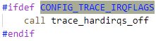

2023年8月28日星期一


# Trace function in Linux kernel


## ftrace

ftrace framework:internal tracers for kernel tracing

tracepoints: predefined trace locations

event hooks: custom trace events at specific places in the code

tracers: modules within the ftrace framework that collect and process data


BPF(Berkeley Packet Filter): bpftrace: trace user-space programs


使用方法：

### 内核配置剪裁

```
make ARCH=riscv menuconfig egret_defconfig
```

使能 ->Kernel hacking ->Tracers ->Interrupts-off Latency Tracer


### 安装tracefs

/etc/fstab:

```
tracefs /sys/kernel/tracing tracefs defaults 0 0
```


or mount at run time:

```
mount -t tracefs nodev /sys/kernel/tracing
```


legacy in debugfs

当安装debugfs文件系统后，`/sys/kernel/debug/tracing`中的内容和`tracefs`中的内容一样。


### 设置tracer


`current_tracer`:

可以用来显示或者配置当前配置的tracer。


`available_tracers`:

编译进内核的可以用的，可以写进`current_tracer`的tracer。


将`irqsoff`写入`current_tracer`:


### 开启和关闭tracing

开启：`echo 1 > tracing_on`

关闭：`echo 0 > tracing_on`


### trace | trace_pipe

`trace`: 非消耗性（not a consumer）输出


`trace_pipe`: live tracing，读消耗性（a consumer），会等待新数据


### events


使能相应的事件：irq


### 停止tracing

```
echo 0 > tracing_on
echo nop > current_tracer
umount /sys/kernel/tracing
```


## Trace irqflags

### `irqs_disabled()`


### `CONFIG_TRACE_IRQFLAGS`

在中断例程中，有以下跟irqflags相关的trace操作：

1. ​	进中断时，保存寄存器现场后，记录中断关闭



1. ​	在处理异常的情况下，会再记录中断开启的操作（异常响应时中断是根据SPIE再打开的，而中断响应时全局中断被硬件关闭后未再由软件打开，但SPIE应该是1才能使中断返回时硬件开启全局中断）


1. ​	异常处理结束后，会再关闭中断（因为sret时，硬件会恢复中断现场，其中也包括全局中断位），并记录操作


1. ​	中断响应结束前会恢复寄存器现场，在这之前会根据`SPIE`的值，测定sret是会关闭中断，还是开启中断，并提前记录相应的操作


### trace_hardirqs_on/off


内核配置irqflags后，就会具备相应的trace功能。

trace操作只有在第一次开启中断的时候才会记录（由tracing_irq_cpu来记录是否是，关闭后第一次打开）


trace操作只有在第一次关闭中断的时候才记录（由tracing_irq_cpu来跟踪是否是，打开后第一次关闭）。


每次执行`trace_hardirqs_on`时都会把置1的`tracing_irq_cpu`清零；每次执行`trace_hardirqs_off`时都会把清零的`tracing_irq_cpu`置1。这样就可以记录下中断持续处于关闭状态的时间。


关闭中断时，开始计时（会受到irq trace和preempt trace配置的影响）


打开中断时，结束计时，这样就得出全局中断关闭的时间。


只有相应的tracer开启了，且全局中断处于关闭状态才启动和停止精确计时。


如果preempt tracer也配置了，且开启了，则会根据preemption来决定要不要启动或者停止计时。只有在preemption使能的时候才启动或者停止计时。


如果没有配置`CONFIG_TRACE_IRQFLAGS`，则相应的trace操作的宏相当于空


### lockdep

用来检测潜在的deadlock或者其它的同步问题。


