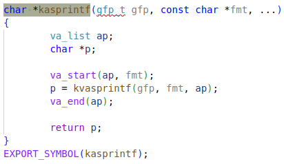
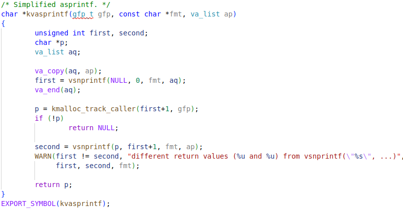
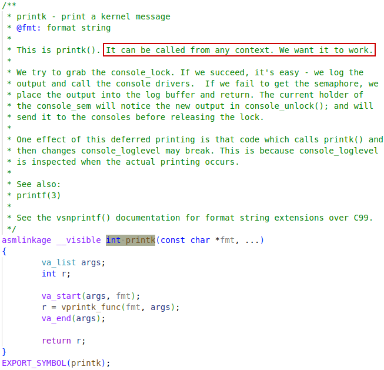

# kasprintf

## kvasprintf

# printk

https://lwn.net/Articles/909980/ about `printk`

console lock for all consoles is the existing **global lock** for all consoles

**per-console lock** that would be added, would also get a state structure so that their status can be tracked.

It is important to note that while there is only a  single CPU actually physically printing to the console at any given time, other CPUs can still use `printk()`; the data goes to the **ring buffer** and will eventually get out to the console—at least that is the hope.

`write_thread`, is called from a thread context, thus it can sleep.

`write_atomic`, is called from atomic mode so it cannot block.

https://lwn.net/Articles/938236/ about realtime patches

