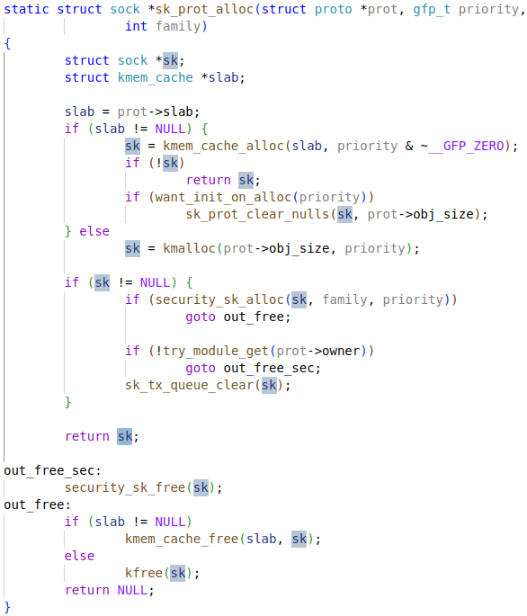
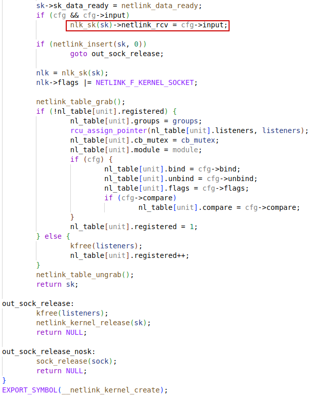
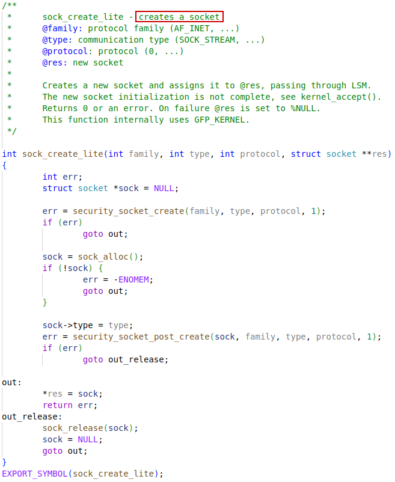
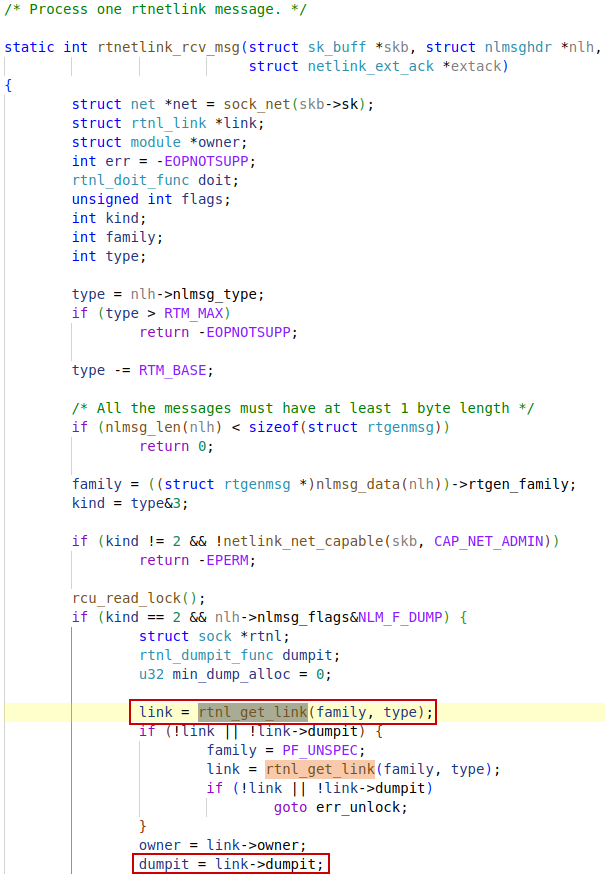
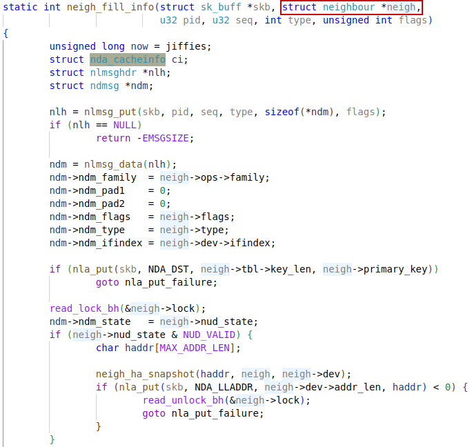
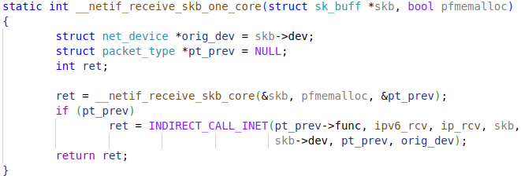
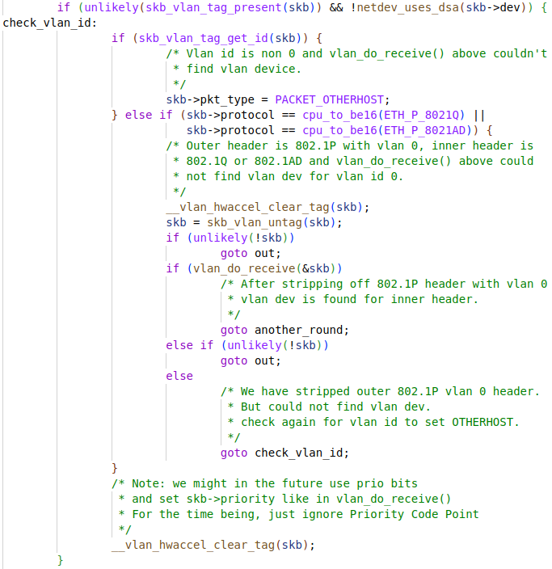
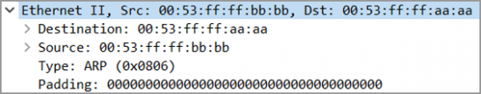

# struck sk_buff

```c
struck sk_buff
/**
 *	struct sk_buff - socket buffer
 *	@next: Next buffer in list
 *	@prev: Previous buffer in list
 *	@tstamp: Time we arrived/left
 *	@skb_mstamp_ns: (aka @tstamp) earliest departure time; start point
 *		for retransmit timer
 *	@rbnode: RB tree node, alternative to next/prev for netem/tcp
 *	@list: queue head
 *	@sk: Socket we are owned by
 *	@ip_defrag_offset: (aka @sk) alternate use of @sk, used in
 *		fragmentation management
 *	@dev: Device we arrived on/are leaving by
 *	@dev_scratch: (aka @dev) alternate use of @dev when @dev would be %NULL
 *	@cb: Control buffer. Free for use by every layer. Put private vars here
 *	@_skb_refdst: destination entry (with norefcount bit)
 *	@sp: the security path, used for xfrm
 *	@len: Length of actual data
 *	@data_len: Data length
 *	@mac_len: Length of link layer header
 *	@hdr_len: writable header length of cloned skb
 *	@csum: Checksum (must include start/offset pair)
 *	@csum_start: Offset from skb->head where checksumming should start
 *	@csum_offset: Offset from csum_start where checksum should be stored
 *	@priority: Packet queueing priority
 *	@ignore_df: allow local fragmentation
 *	@cloned: Head may be cloned (check refcnt to be sure)
 *	@ip_summed: Driver fed us an IP checksum
 *	@nohdr: Payload reference only, must not modify header
 *	@pkt_type: Packet class
 *	@fclone: skbuff clone status
 *	@ipvs_property: skbuff is owned by ipvs
 *	@inner_protocol_type: whether the inner protocol is
 *		ENCAP_TYPE_ETHER or ENCAP_TYPE_IPPROTO
 *	@remcsum_offload: remote checksum offload is enabled
 *	@offload_fwd_mark: Packet was L2-forwarded in hardware
 *	@offload_l3_fwd_mark: Packet was L3-forwarded in hardware
 *	@tc_skip_classify: do not classify packet. set by IFB device
 *	@tc_at_ingress: used within tc_classify to distinguish in/egress
 *	@redirected: packet was redirected by packet classifier
 *	@from_ingress: packet was redirected from the ingress path
 *	@peeked: this packet has been seen already, so stats have been
 *		done for it, don't do them again
 *	@nf_trace: netfilter packet trace flag
 *	@protocol: Packet protocol from driver
 *	@destructor: Destruct function
 *	@tcp_tsorted_anchor: list structure for TCP (tp->tsorted_sent_queue)
 *	@_nfct: Associated connection, if any (with nfctinfo bits)
 *	@nf_bridge: Saved data about a bridged frame - see br_netfilter.c
 *	@skb_iif: ifindex of device we arrived on
 *	@tc_index: Traffic control index
 *	@hash: the packet hash
 *	@queue_mapping: Queue mapping for multiqueue devices
 *	@head_frag: skb was allocated from page fragments,
 *		not allocated by kmalloc() or vmalloc().
 *	@pfmemalloc: skbuff was allocated from PFMEMALLOC reserves
 *	@active_extensions: active extensions (skb_ext_id types)
 *	@ndisc_nodetype: router type (from link layer)
 *	@ooo_okay: allow the mapping of a socket to a queue to be changed
 *	@l4_hash: indicate hash is a canonical 4-tuple hash over transport
 *		ports.
 *	@sw_hash: indicates hash was computed in software stack
 *	@wifi_acked_valid: wifi_acked was set
 *	@wifi_acked: whether frame was acked on wifi or not
 *	@no_fcs:  Request NIC to treat last 4 bytes as Ethernet FCS
 *	@encapsulation: indicates the inner headers in the skbuff are valid
 *	@encap_hdr_csum: software checksum is needed
 *	@csum_valid: checksum is already valid
 *	@csum_not_inet: use CRC32c to resolve CHECKSUM_PARTIAL
 *	@csum_complete_sw: checksum was completed by software
 *	@csum_level: indicates the number of consecutive checksums found in
 *		the packet minus one that have been verified as
 *		CHECKSUM_UNNECESSARY (max 3)
 *	@dst_pending_confirm: need to confirm neighbour
 *	@decrypted: Decrypted SKB
 *	@napi_id: id of the NAPI struct this skb came from
 *	@sender_cpu: (aka @napi_id) source CPU in XPS
 *	@secmark: security marking
 *	@mark: Generic packet mark
 *	@reserved_tailroom: (aka @mark) number of bytes of free space available
 *		at the tail of an sk_buff
 *	@vlan_present: VLAN tag is present
 *	@vlan_proto: vlan encapsulation protocol
 *	@vlan_tci: vlan tag control information
 *	@inner_protocol: Protocol (encapsulation)
 *	@inner_ipproto: (aka @inner_protocol) stores ipproto when
 *		skb->inner_protocol_type == ENCAP_TYPE_IPPROTO;
 *	@inner_transport_header: Inner transport layer header (encapsulation)
 *	@inner_network_header: Network layer header (encapsulation)
 *	@inner_mac_header: Link layer header (encapsulation)
 *	@transport_header: Transport layer header
 *	@network_header: Network layer header
 *	@mac_header: Link layer header
 *	@tail: Tail pointer
 *	@end: End pointer
 *	@head: Head of buffer
 *	@data: Data head pointer
 *	@truesize: Buffer size
 *	@users: User count - see {datagram,tcp}.c
 *	@extensions: allocated extensions, valid if active_extensions is nonzero
 */
struct sk_buff {
	union {
		struct {
			/* These two members must be first. */
			struct sk_buff		*next;
			struct sk_buff		*prev;

			union {
				struct net_device	*dev;
				/* Some protocols might use this space to store information,
				 * while device pointer would be NULL.
				 * UDP receive path is one user.
				 */
				unsigned long		dev_scratch;
			};
		};
		struct rb_node		rbnode; /* used in netem, ip4 defrag, and tcp stack */
		struct list_head	list;
	};

	union {
		struct sock		*sk;
		int			ip_defrag_offset;
	};

	union {
		ktime_t		tstamp;
		u64		skb_mstamp_ns; /* earliest departure time */
	};
	/*
	 * This is the control buffer. It is free to use for every
	 * layer. Please put your private variables there. If you
	 * want to keep them across layers you have to do a skb_clone()
	 * first. This is owned by whoever has the skb queued ATM.
	 */
	char			cb[48] __aligned(8);

	union {
		struct {
			unsigned long	_skb_refdst;
			void		(*destructor)(struct sk_buff *skb);
		};
		struct list_head	tcp_tsorted_anchor;
	};

#if defined(CONFIG_NF_CONNTRACK) || defined(CONFIG_NF_CONNTRACK_MODULE)
	unsigned long		 _nfct;
#endif
	unsigned int		len,
				data_len;
	__u16			mac_len,
				hdr_len;

	/* Following fields are _not_ copied in __copy_skb_header()
	 * Note that queue_mapping is here mostly to fill a hole.
	 */
	__u16			queue_mapping;

/* if you move cloned around you also must adapt those constants */
#ifdef __BIG_ENDIAN_BITFIELD
#define CLONED_MASK	(1 << 7)
#else
#define CLONED_MASK	1
#endif
#define CLONED_OFFSET()		offsetof(struct sk_buff, __cloned_offset)

	/* private: */
	__u8			__cloned_offset[0];
	/* public: */
	__u8			cloned:1,
				nohdr:1,
				fclone:2,
				peeked:1,
				head_frag:1,
				pfmemalloc:1;
#ifdef CONFIG_SKB_EXTENSIONS
	__u8			active_extensions;
#endif
	/* fields enclosed in headers_start/headers_end are copied
	 * using a single memcpy() in __copy_skb_header()
	 */
	/* private: */
	__u32			headers_start[0];
	/* public: */

/* if you move pkt_type around you also must adapt those constants */
#ifdef __BIG_ENDIAN_BITFIELD
#define PKT_TYPE_MAX	(7 << 5)
#else
#define PKT_TYPE_MAX	7
#endif
#define PKT_TYPE_OFFSET()	offsetof(struct sk_buff, __pkt_type_offset)

	/* private: */
	__u8			__pkt_type_offset[0];
	/* public: */
	__u8			pkt_type:3;
	__u8			ignore_df:1;
	__u8			nf_trace:1;
	__u8			ip_summed:2;
	__u8			ooo_okay:1;

	__u8			l4_hash:1;
	__u8			sw_hash:1;
	__u8			wifi_acked_valid:1;
	__u8			wifi_acked:1;
	__u8			no_fcs:1;
	/* Indicates the inner headers are valid in the skbuff. */
	__u8			encapsulation:1;
	__u8			encap_hdr_csum:1;
	__u8			csum_valid:1;

#ifdef __BIG_ENDIAN_BITFIELD
#define PKT_VLAN_PRESENT_BIT	7
#else
#define PKT_VLAN_PRESENT_BIT	0
#endif
#define PKT_VLAN_PRESENT_OFFSET()	offsetof(struct sk_buff, __pkt_vlan_present_offset)
	/* private: */
	__u8			__pkt_vlan_present_offset[0];
	/* public: */
	__u8			vlan_present:1;
	__u8			csum_complete_sw:1;
	__u8			csum_level:2;
	__u8			csum_not_inet:1;
	__u8			dst_pending_confirm:1;
#ifdef CONFIG_IPV6_NDISC_NODETYPE
	__u8			ndisc_nodetype:2;
#endif

	__u8			ipvs_property:1;
	__u8			inner_protocol_type:1;
	__u8			remcsum_offload:1;
#ifdef CONFIG_NET_SWITCHDEV
	__u8			offload_fwd_mark:1;
	__u8			offload_l3_fwd_mark:1;
#endif
#ifdef CONFIG_NET_CLS_ACT
	__u8			tc_skip_classify:1;
	__u8			tc_at_ingress:1;
#endif
#ifdef CONFIG_NET_REDIRECT
	__u8			redirected:1;
	__u8			from_ingress:1;
#endif
#ifdef CONFIG_TLS_DEVICE
	__u8			decrypted:1;
#endif

#ifdef CONFIG_NET_SCHED
	__u16			tc_index;	/* traffic control index */
#endif

	union {
		__wsum		csum;
		struct {
			__u16	csum_start;
			__u16	csum_offset;
		};
	};
	__u32			priority;
	int			skb_iif;
	__u32			hash;
	__be16			vlan_proto;
	__u16			vlan_tci;
#if defined(CONFIG_NET_RX_BUSY_POLL) || defined(CONFIG_XPS)
	union {
		unsigned int	napi_id;
		unsigned int	sender_cpu;
	};
#endif
#ifdef CONFIG_NETWORK_SECMARK
	__u32		secmark;
#endif

	union {
		__u32		mark;
		__u32		reserved_tailroom;
	};

	union {
		__be16		inner_protocol;
		__u8		inner_ipproto;
	};

	__u16			inner_transport_header;
	__u16			inner_network_header;
	__u16			inner_mac_header;

	__be16			protocol;
	__u16			transport_header;
	__u16			network_header;
	__u16			mac_header;

	/* private: */
	__u32			headers_end[0];
	/* public: */

	/* These elements must be at the end, see alloc_skb() for details.  */
	sk_buff_data_t		tail;
	sk_buff_data_t		end;
	unsigned char		*head,
				*data;
	unsigned int		truesize;
	refcount_t		users;

#ifdef CONFIG_SKB_EXTENSIONS
	/* only useable after checking ->active_extensions != 0 */
	struct skb_ext		*extensions;
#endif
};
```

# struct socket


## struct sock

```c
/**
  *	struct sock - network layer representation of sockets
  *	@__sk_common: shared layout with inet_timewait_sock
  *	@sk_shutdown: mask of %SEND_SHUTDOWN and/or %RCV_SHUTDOWN
  *	@sk_userlocks: %SO_SNDBUF and %SO_RCVBUF settings
  *	@sk_lock:	synchronizer
  *	@sk_kern_sock: True if sock is using kernel lock classes
  *	@sk_rcvbuf: size of receive buffer in bytes
  *	@sk_wq: sock wait queue and async head
  *	@sk_rx_dst: receive input route used by early demux
  *	@sk_dst_cache: destination cache
  *	@sk_dst_pending_confirm: need to confirm neighbour
  *	@sk_policy: flow policy
  *	@sk_rx_skb_cache: cache copy of recently accessed RX skb
  *	@sk_receive_queue: incoming packets
  *	@sk_wmem_alloc: transmit queue bytes committed
  *	@sk_tsq_flags: TCP Small Queues flags
  *	@sk_write_queue: Packet sending queue
  *	@sk_omem_alloc: "o" is "option" or "other"
  *	@sk_wmem_queued: persistent queue size
  *	@sk_forward_alloc: space allocated forward
  *	@sk_napi_id: id of the last napi context to receive data for sk
  *	@sk_ll_usec: usecs to busypoll when there is no data
  *	@sk_allocation: allocation mode
  *	@sk_pacing_rate: Pacing rate (if supported by transport/packet scheduler)
  *	@sk_pacing_status: Pacing status (requested, handled by sch_fq)
  *	@sk_max_pacing_rate: Maximum pacing rate (%SO_MAX_PACING_RATE)
  *	@sk_sndbuf: size of send buffer in bytes
  *	@__sk_flags_offset: empty field used to determine location of bitfield
  *	@sk_padding: unused element for alignment
  *	@sk_no_check_tx: %SO_NO_CHECK setting, set checksum in TX packets
  *	@sk_no_check_rx: allow zero checksum in RX packets
  *	@sk_route_caps: route capabilities (e.g. %NETIF_F_TSO)
  *	@sk_route_nocaps: forbidden route capabilities (e.g NETIF_F_GSO_MASK)
  *	@sk_route_forced_caps: static, forced route capabilities
  *		(set in tcp_init_sock())
  *	@sk_gso_type: GSO type (e.g. %SKB_GSO_TCPV4)
  *	@sk_gso_max_size: Maximum GSO segment size to build
  *	@sk_gso_max_segs: Maximum number of GSO segments
  *	@sk_pacing_shift: scaling factor for TCP Small Queues
  *	@sk_lingertime: %SO_LINGER l_linger setting
  *	@sk_backlog: always used with the per-socket spinlock held
  *	@sk_callback_lock: used with the callbacks in the end of this struct
  *	@sk_error_queue: rarely used
  *	@sk_prot_creator: sk_prot of original sock creator (see ipv6_setsockopt,
  *			  IPV6_ADDRFORM for instance)
  *	@sk_err: last error
  *	@sk_err_soft: errors that don't cause failure but are the cause of a
  *		      persistent failure not just 'timed out'
  *	@sk_drops: raw/udp drops counter
  *	@sk_ack_backlog: current listen backlog
  *	@sk_max_ack_backlog: listen backlog set in listen()
  *	@sk_uid: user id of owner
  *	@sk_priority: %SO_PRIORITY setting
  *	@sk_type: socket type (%SOCK_STREAM, etc)
  *	@sk_protocol: which protocol this socket belongs in this network family
  *	@sk_peer_pid: &struct pid for this socket's peer
  *	@sk_peer_cred: %SO_PEERCRED setting
  *	@sk_rcvlowat: %SO_RCVLOWAT setting
  *	@sk_rcvtimeo: %SO_RCVTIMEO setting
  *	@sk_sndtimeo: %SO_SNDTIMEO setting
  *	@sk_txhash: computed flow hash for use on transmit
  *	@sk_filter: socket filtering instructions
  *	@sk_timer: sock cleanup timer
  *	@sk_stamp: time stamp of last packet received
  *	@sk_stamp_seq: lock for accessing sk_stamp on 32 bit architectures only
  *	@sk_tsflags: SO_TIMESTAMPING socket options
  *	@sk_tskey: counter to disambiguate concurrent tstamp requests
  *	@sk_zckey: counter to order MSG_ZEROCOPY notifications
  *	@sk_socket: Identd and reporting IO signals
  *	@sk_user_data: RPC layer private data
  *	@sk_frag: cached page frag
  *	@sk_peek_off: current peek_offset value
  *	@sk_send_head: front of stuff to transmit
  *	@tcp_rtx_queue: TCP re-transmit queue [union with @sk_send_head]
  *	@sk_tx_skb_cache: cache copy of recently accessed TX skb
  *	@sk_security: used by security modules
  *	@sk_mark: generic packet mark
  *	@sk_cgrp_data: cgroup data for this cgroup
  *	@sk_memcg: this socket's memory cgroup association
  *	@sk_write_pending: a write to stream socket waits to start
  *	@sk_state_change: callback to indicate change in the state of the sock
  *	@sk_data_ready: callback to indicate there is data to be processed
  *	@sk_write_space: callback to indicate there is bf sending space available
  *	@sk_error_report: callback to indicate errors (e.g. %MSG_ERRQUEUE)
  *	@sk_backlog_rcv: callback to process the backlog
  *	@sk_validate_xmit_skb: ptr to an optional validate function
  *	@sk_destruct: called at sock freeing time, i.e. when all refcnt == 0
  *	@sk_reuseport_cb: reuseport group container
  *	@sk_bpf_storage: ptr to cache and control for bpf_sk_storage
  *	@sk_rcu: used during RCU grace period
  *	@sk_clockid: clockid used by time-based scheduling (SO_TXTIME)
  *	@sk_txtime_deadline_mode: set deadline mode for SO_TXTIME
  *	@sk_txtime_report_errors: set report errors mode for SO_TXTIME
  *	@sk_txtime_unused: unused txtime flags
  */
struct sock {
	/*
	 * Now struct inet_timewait_sock also uses sock_common, so please just
	 * don't add nothing before this first member (__sk_common) --acme
	 */
	struct sock_common	__sk_common;
#define sk_node			__sk_common.skc_node
#define sk_nulls_node		__sk_common.skc_nulls_node
#define sk_refcnt		__sk_common.skc_refcnt
#define sk_tx_queue_mapping	__sk_common.skc_tx_queue_mapping
#ifdef CONFIG_XPS
#define sk_rx_queue_mapping	__sk_common.skc_rx_queue_mapping
#endif

#define sk_dontcopy_begin	__sk_common.skc_dontcopy_begin
#define sk_dontcopy_end		__sk_common.skc_dontcopy_end
#define sk_hash			__sk_common.skc_hash
#define sk_portpair		__sk_common.skc_portpair
#define sk_num			__sk_common.skc_num
#define sk_dport		__sk_common.skc_dport
#define sk_addrpair		__sk_common.skc_addrpair
#define sk_daddr		__sk_common.skc_daddr
#define sk_rcv_saddr		__sk_common.skc_rcv_saddr
#define sk_family		__sk_common.skc_family
#define sk_state		__sk_common.skc_state
#define sk_reuse		__sk_common.skc_reuse
#define sk_reuseport		__sk_common.skc_reuseport
#define sk_ipv6only		__sk_common.skc_ipv6only
#define sk_net_refcnt		__sk_common.skc_net_refcnt
#define sk_bound_dev_if		__sk_common.skc_bound_dev_if
#define sk_bind_node		__sk_common.skc_bind_node
#define sk_prot			__sk_common.skc_prot
#define sk_net			__sk_common.skc_net
#define sk_v6_daddr		__sk_common.skc_v6_daddr
#define sk_v6_rcv_saddr	__sk_common.skc_v6_rcv_saddr
#define sk_cookie		__sk_common.skc_cookie
#define sk_incoming_cpu		__sk_common.skc_incoming_cpu
#define sk_flags		__sk_common.skc_flags
#define sk_rxhash		__sk_common.skc_rxhash

	socket_lock_t		sk_lock;
	atomic_t		sk_drops;
	int			sk_rcvlowat;
	struct sk_buff_head	sk_error_queue;
	struct sk_buff		*sk_rx_skb_cache;
	struct sk_buff_head	sk_receive_queue;
	/*
	 * The backlog queue is special, it is always used with
	 * the per-socket spinlock held and requires low latency
	 * access. Therefore we special case it's implementation.
	 * Note : rmem_alloc is in this structure to fill a hole
	 * on 64bit arches, not because its logically part of
	 * backlog.
	 */
	struct {
		atomic_t	rmem_alloc;
		int		len;
		struct sk_buff	*head;
		struct sk_buff	*tail;
	} sk_backlog;
#define sk_rmem_alloc sk_backlog.rmem_alloc

	int			sk_forward_alloc;
#ifdef CONFIG_NET_RX_BUSY_POLL
	unsigned int		sk_ll_usec;
	/* ===== mostly read cache line ===== */
	unsigned int		sk_napi_id;
#endif
	int			sk_rcvbuf;

	struct sk_filter __rcu	*sk_filter;
	union {
		struct socket_wq __rcu	*sk_wq;
		/* private: */
		struct socket_wq	*sk_wq_raw;
		/* public: */
	};
#ifdef CONFIG_XFRM
	struct xfrm_policy __rcu *sk_policy[2];
#endif
	struct dst_entry	*sk_rx_dst;
	struct dst_entry __rcu	*sk_dst_cache;
	atomic_t		sk_omem_alloc;
	int			sk_sndbuf;

	/* ===== cache line for TX ===== */
	int			sk_wmem_queued;
	refcount_t		sk_wmem_alloc;
	unsigned long		sk_tsq_flags;
	union {
		struct sk_buff	*sk_send_head;
		struct rb_root	tcp_rtx_queue;
	};
	struct sk_buff		*sk_tx_skb_cache;
	struct sk_buff_head	sk_write_queue;
	__s32			sk_peek_off;
	int			sk_write_pending;
	__u32			sk_dst_pending_confirm;
	u32			sk_pacing_status; /* see enum sk_pacing */
	long			sk_sndtimeo;
	struct timer_list	sk_timer;
	__u32			sk_priority;
	__u32			sk_mark;
	unsigned long		sk_pacing_rate; /* bytes per second */
	unsigned long		sk_max_pacing_rate;
	struct page_frag	sk_frag;
	netdev_features_t	sk_route_caps;
	netdev_features_t	sk_route_nocaps;
	netdev_features_t	sk_route_forced_caps;
	int			sk_gso_type;
	unsigned int		sk_gso_max_size;
	gfp_t			sk_allocation;
	__u32			sk_txhash;

	/*
	 * Because of non atomicity rules, all
	 * changes are protected by socket lock.
	 */
	u8			sk_padding : 1,
				sk_kern_sock : 1,
				sk_no_check_tx : 1,
				sk_no_check_rx : 1,
				sk_userlocks : 4;
	u8			sk_pacing_shift;
	u16			sk_type;
	u16			sk_protocol;
	u16			sk_gso_max_segs;
	unsigned long	        sk_lingertime;
	struct proto		*sk_prot_creator;
	rwlock_t		sk_callback_lock;
	int			sk_err,
				sk_err_soft;
	u32			sk_ack_backlog;
	u32			sk_max_ack_backlog;
	kuid_t			sk_uid;
	struct pid		*sk_peer_pid;
	const struct cred	*sk_peer_cred;
	long			sk_rcvtimeo;
	ktime_t			sk_stamp;
#if BITS_PER_LONG==32
	seqlock_t		sk_stamp_seq;
#endif
	u16			sk_tsflags;
	u8			sk_shutdown;
	u32			sk_tskey;
	atomic_t		sk_zckey;

	u8			sk_clockid;
	u8			sk_txtime_deadline_mode : 1,
				sk_txtime_report_errors : 1,
				sk_txtime_unused : 6;

	struct socket		*sk_socket;
	void			*sk_user_data;
#ifdef CONFIG_SECURITY
	void			*sk_security;
#endif
	struct sock_cgroup_data	sk_cgrp_data;
	struct mem_cgroup	*sk_memcg;
	void			(*sk_state_change)(struct sock *sk);
	void			(*sk_data_ready)(struct sock *sk);
	void			(*sk_write_space)(struct sock *sk);
	void			(*sk_error_report)(struct sock *sk);
	int			(*sk_backlog_rcv)(struct sock *sk,
						  struct sk_buff *skb);
#ifdef CONFIG_SOCK_VALIDATE_XMIT
	struct sk_buff*		(*sk_validate_xmit_skb)(struct sock *sk,
							struct net_device *dev,
							struct sk_buff *skb);
#endif
	void                    (*sk_destruct)(struct sock *sk);
	struct sock_reuseport __rcu	*sk_reuseport_cb;
#ifdef CONFIG_BPF_SYSCALL
	struct bpf_local_storage __rcu	*sk_bpf_storage;
#endif
	struct rcu_head		sk_rcu;
};
```

## sk_alloc


### sk_prot_alloc




# struct netlink_sock


## nlk_sk

This function will get the `struct netlink_sock` containing the `struct sock` passed in.


# struct net_device

```c

/**
 *	struct net_device - The DEVICE structure.
 *
 *	Actually, this whole structure is a big mistake.  It mixes I/O
 *	data with strictly "high-level" data, and it has to know about
 *	almost every data structure used in the INET module.
 *
 *	@name:	This is the first field of the "visible" part of this structure
 *		(i.e. as seen by users in the "Space.c" file).  It is the name
 *		of the interface.
 *
 *	@name_node:	Name hashlist node
 *	@ifalias:	SNMP alias
 *	@mem_end:	Shared memory end
 *	@mem_start:	Shared memory start
 *	@base_addr:	Device I/O address
 *	@irq:		Device IRQ number
 *
 *	@state:		Generic network queuing layer state, see netdev_state_t
 *	@dev_list:	The global list of network devices
 *	@napi_list:	List entry used for polling NAPI devices
 *	@unreg_list:	List entry  when we are unregistering the
 *			device; see the function unregister_netdev
 *	@close_list:	List entry used when we are closing the device
 *	@ptype_all:     Device-specific packet handlers for all protocols
 *	@ptype_specific: Device-specific, protocol-specific packet handlers
 *
 *	@adj_list:	Directly linked devices, like slaves for bonding
 *	@features:	Currently active device features
 *	@hw_features:	User-changeable features
 *
 *	@wanted_features:	User-requested features
 *	@vlan_features:		Mask of features inheritable by VLAN devices
 *
 *	@hw_enc_features:	Mask of features inherited by encapsulating devices
 *				This field indicates what encapsulation
 *				offloads the hardware is capable of doing,
 *				and drivers will need to set them appropriately.
 *
 *	@mpls_features:	Mask of features inheritable by MPLS
 *	@gso_partial_features: value(s) from NETIF_F_GSO\*
 *
 *	@ifindex:	interface index
 *	@group:		The group the device belongs to
 *
 *	@stats:		Statistics struct, which was left as a legacy, use
 *			rtnl_link_stats64 instead
 *
 *	@rx_dropped:	Dropped packets by core network,
 *			do not use this in drivers
 *	@tx_dropped:	Dropped packets by core network,
 *			do not use this in drivers
 *	@rx_nohandler:	nohandler dropped packets by core network on
 *			inactive devices, do not use this in drivers
 *	@carrier_up_count:	Number of times the carrier has been up
 *	@carrier_down_count:	Number of times the carrier has been down
 *
 *	@wireless_handlers:	List of functions to handle Wireless Extensions,
 *				instead of ioctl,
 *				see <net/iw_handler.h> for details.
 *	@wireless_data:	Instance data managed by the core of wireless extensions
 *
 *	@netdev_ops:	Includes several pointers to callbacks,
 *			if one wants to override the ndo_*() functions
 *	@ethtool_ops:	Management operations
 *	@l3mdev_ops:	Layer 3 master device operations
 *	@ndisc_ops:	Includes callbacks for different IPv6 neighbour
 *			discovery handling. Necessary for e.g. 6LoWPAN.
 *	@xfrmdev_ops:	Transformation offload operations
 *	@tlsdev_ops:	Transport Layer Security offload operations
 *	@header_ops:	Includes callbacks for creating,parsing,caching,etc
 *			of Layer 2 headers.
 *
 *	@flags:		Interface flags (a la BSD)
 *	@priv_flags:	Like 'flags' but invisible to userspace,
 *			see if.h for the definitions
 *	@gflags:	Global flags ( kept as legacy )
 *	@padded:	How much padding added by alloc_netdev()
 *	@operstate:	RFC2863 operstate
 *	@link_mode:	Mapping policy to operstate
 *	@if_port:	Selectable AUI, TP, ...
 *	@dma:		DMA channel
 *	@mtu:		Interface MTU value
 *	@min_mtu:	Interface Minimum MTU value
 *	@max_mtu:	Interface Maximum MTU value
 *	@type:		Interface hardware type
 *	@hard_header_len: Maximum hardware header length.
 *	@min_header_len:  Minimum hardware header length
 *
 *	@needed_headroom: Extra headroom the hardware may need, but not in all
 *			  cases can this be guaranteed
 *	@needed_tailroom: Extra tailroom the hardware may need, but not in all
 *			  cases can this be guaranteed. Some cases also use
 *			  LL_MAX_HEADER instead to allocate the skb
 *
 *	interface address info:
 *
 * 	@perm_addr:		Permanent hw address
 * 	@addr_assign_type:	Hw address assignment type
 * 	@addr_len:		Hardware address length
 *	@upper_level:		Maximum depth level of upper devices.
 *	@lower_level:		Maximum depth level of lower devices.
 *	@neigh_priv_len:	Used in neigh_alloc()
 * 	@dev_id:		Used to differentiate devices that share
 * 				the same link layer address
 * 	@dev_port:		Used to differentiate devices that share
 * 				the same function
 *	@addr_list_lock:	XXX: need comments on this one
 *	@name_assign_type:	network interface name assignment type
 *	@uc_promisc:		Counter that indicates promiscuous mode
 *				has been enabled due to the need to listen to
 *				additional unicast addresses in a device that
 *				does not implement ndo_set_rx_mode()
 *	@uc:			unicast mac addresses
 *	@mc:			multicast mac addresses
 *	@dev_addrs:		list of device hw addresses
 *	@queues_kset:		Group of all Kobjects in the Tx and RX queues
 *	@promiscuity:		Number of times the NIC is told to work in
 *				promiscuous mode; if it becomes 0 the NIC will
 *				exit promiscuous mode
 *	@allmulti:		Counter, enables or disables allmulticast mode
 *
 *	@vlan_info:	VLAN info
 *	@dsa_ptr:	dsa specific data
 *	@tipc_ptr:	TIPC specific data
 *	@atalk_ptr:	AppleTalk link
 *	@ip_ptr:	IPv4 specific data
 *	@dn_ptr:	DECnet specific data
 *	@ip6_ptr:	IPv6 specific data
 *	@ax25_ptr:	AX.25 specific data
 *	@ieee80211_ptr:	IEEE 802.11 specific data, assign before registering
 *	@ieee802154_ptr: IEEE 802.15.4 low-rate Wireless Personal Area Network
 *			 device struct
 *	@mpls_ptr:	mpls_dev struct pointer
 *
 *	@dev_addr:	Hw address (before bcast,
 *			because most packets are unicast)
 *
 *	@_rx:			Array of RX queues
 *	@num_rx_queues:		Number of RX queues
 *				allocated at register_netdev() time
 *	@real_num_rx_queues: 	Number of RX queues currently active in device
 *	@xdp_prog:		XDP sockets filter program pointer
 *	@gro_flush_timeout:	timeout for GRO layer in NAPI
 *	@napi_defer_hard_irqs:	If not zero, provides a counter that would
 *				allow to avoid NIC hard IRQ, on busy queues.
 *
 *	@rx_handler:		handler for received packets
 *	@rx_handler_data: 	XXX: need comments on this one
 *	@miniq_ingress:		ingress/clsact qdisc specific data for
 *				ingress processing
 *	@ingress_queue:		XXX: need comments on this one
 *	@nf_hooks_ingress:	netfilter hooks executed for ingress packets
 *	@broadcast:		hw bcast address
 *
 *	@rx_cpu_rmap:	CPU reverse-mapping for RX completion interrupts,
 *			indexed by RX queue number. Assigned by driver.
 *			This must only be set if the ndo_rx_flow_steer
 *			operation is defined
 *	@index_hlist:		Device index hash chain
 *
 *	@_tx:			Array of TX queues
 *	@num_tx_queues:		Number of TX queues allocated at alloc_netdev_mq() time
 *	@real_num_tx_queues: 	Number of TX queues currently active in device
 *	@qdisc:			Root qdisc from userspace point of view
 *	@tx_queue_len:		Max frames per queue allowed
 *	@tx_global_lock: 	XXX: need comments on this one
 *	@xdp_bulkq:		XDP device bulk queue
 *	@xps_cpus_map:		all CPUs map for XPS device
 *	@xps_rxqs_map:		all RXQs map for XPS device
 *
 *	@xps_maps:	XXX: need comments on this one
 *	@miniq_egress:		clsact qdisc specific data for
 *				egress processing
 *	@qdisc_hash:		qdisc hash table
 *	@watchdog_timeo:	Represents the timeout that is used by
 *				the watchdog (see dev_watchdog())
 *	@watchdog_timer:	List of timers
 *
 *	@proto_down_reason:	reason a netdev interface is held down
 *	@pcpu_refcnt:		Number of references to this device
 *	@todo_list:		Delayed register/unregister
 *	@link_watch_list:	XXX: need comments on this one
 *
 *	@reg_state:		Register/unregister state machine
 *	@dismantle:		Device is going to be freed
 *	@rtnl_link_state:	This enum represents the phases of creating
 *				a new link
 *
 *	@needs_free_netdev:	Should unregister perform free_netdev?
 *	@priv_destructor:	Called from unregister
 *	@npinfo:		XXX: need comments on this one
 * 	@nd_net:		Network namespace this network device is inside
 *
 * 	@ml_priv:	Mid-layer private
 * 	@lstats:	Loopback statistics
 * 	@tstats:	Tunnel statistics
 * 	@dstats:	Dummy statistics
 * 	@vstats:	Virtual ethernet statistics
 *
 *	@garp_port:	GARP
 *	@mrp_port:	MRP
 *
 *	@dev:		Class/net/name entry
 *	@sysfs_groups:	Space for optional device, statistics and wireless
 *			sysfs groups
 *
 *	@sysfs_rx_queue_group:	Space for optional per-rx queue attributes
 *	@rtnl_link_ops:	Rtnl_link_ops
 *
 *	@gso_max_size:	Maximum size of generic segmentation offload
 *	@gso_max_segs:	Maximum number of segments that can be passed to the
 *			NIC for GSO
 *
 *	@dcbnl_ops:	Data Center Bridging netlink ops
 *	@num_tc:	Number of traffic classes in the net device
 *	@tc_to_txq:	XXX: need comments on this one
 *	@prio_tc_map:	XXX: need comments on this one
 *
 *	@fcoe_ddp_xid:	Max exchange id for FCoE LRO by ddp
 *
 *	@priomap:	XXX: need comments on this one
 *	@phydev:	Physical device may attach itself
 *			for hardware timestamping
 *	@sfp_bus:	attached &struct sfp_bus structure.
 *
 *	@qdisc_tx_busylock: lockdep class annotating Qdisc->busylock spinlock
 *	@qdisc_running_key: lockdep class annotating Qdisc->running seqcount
 *
 *	@proto_down:	protocol port state information can be sent to the
 *			switch driver and used to set the phys state of the
 *			switch port.
 *
 *	@wol_enabled:	Wake-on-LAN is enabled
 *
 *	@net_notifier_list:	List of per-net netdev notifier block
 *				that follow this device when it is moved
 *				to another network namespace.
 *
 *	@macsec_ops:    MACsec offloading ops
 *
 *	@udp_tunnel_nic_info:	static structure describing the UDP tunnel
 *				offload capabilities of the device
 *	@udp_tunnel_nic:	UDP tunnel offload state
 *	@xdp_state:		stores info on attached XDP BPF programs
 *
 *	@nested_level:	Used as as a parameter of spin_lock_nested() of
 *			dev->addr_list_lock.
 *	@unlink_list:	As netif_addr_lock() can be called recursively,
 *			keep a list of interfaces to be deleted.
 *
 *	FIXME: cleanup struct net_device such that network protocol info
 *	moves out.
 */

struct net_device {
	char			name[IFNAMSIZ];
	struct netdev_name_node	*name_node;
	struct dev_ifalias	__rcu *ifalias;
	/*
	 *	I/O specific fields
	 *	FIXME: Merge these and struct ifmap into one
	 */
	unsigned long		mem_end;
	unsigned long		mem_start;
	unsigned long		base_addr;
	int			irq;

	/*
	 *	Some hardware also needs these fields (state,dev_list,
	 *	napi_list,unreg_list,close_list) but they are not
	 *	part of the usual set specified in Space.c.
	 */

	unsigned long		state;

	struct list_head	dev_list;
	struct list_head	napi_list;
	struct list_head	unreg_list;
	struct list_head	close_list;
	struct list_head	ptype_all;
	struct list_head	ptype_specific;

	struct {
		struct list_head upper;
		struct list_head lower;
	} adj_list;

	netdev_features_t	features;
	netdev_features_t	hw_features;
	netdev_features_t	wanted_features;
	netdev_features_t	vlan_features;
	netdev_features_t	hw_enc_features;
	netdev_features_t	mpls_features;
	netdev_features_t	gso_partial_features;

	int			ifindex;
	int			group;

	struct net_device_stats	stats;

	atomic_long_t		rx_dropped;
	atomic_long_t		tx_dropped;
	atomic_long_t		rx_nohandler;

	/* Stats to monitor link on/off, flapping */
	atomic_t		carrier_up_count;
	atomic_t		carrier_down_count;

#ifdef CONFIG_WIRELESS_EXT
	const struct iw_handler_def *wireless_handlers;
	struct iw_public_data	*wireless_data;
#endif
	const struct net_device_ops *netdev_ops;
	const struct ethtool_ops *ethtool_ops;
#ifdef CONFIG_NET_L3_MASTER_DEV
	const struct l3mdev_ops	*l3mdev_ops;
#endif
#if IS_ENABLED(CONFIG_IPV6)
	const struct ndisc_ops *ndisc_ops;
#endif

#ifdef CONFIG_XFRM_OFFLOAD
	const struct xfrmdev_ops *xfrmdev_ops;
#endif

#if IS_ENABLED(CONFIG_TLS_DEVICE)
	const struct tlsdev_ops *tlsdev_ops;
#endif

	const struct header_ops *header_ops;

	unsigned int		flags;
	unsigned int		priv_flags;

	unsigned short		gflags;
	unsigned short		padded;

	unsigned char		operstate;
	unsigned char		link_mode;

	unsigned char		if_port;
	unsigned char		dma;

	/* Note : dev->mtu is often read without holding a lock.
	 * Writers usually hold RTNL.
	 * It is recommended to use READ_ONCE() to annotate the reads,
	 * and to use WRITE_ONCE() to annotate the writes.
	 */
	unsigned int		mtu;
	unsigned int		min_mtu;
	unsigned int		max_mtu;
	unsigned short		type;
	unsigned short		hard_header_len;
	unsigned char		min_header_len;
	unsigned char		name_assign_type;

	unsigned short		needed_headroom;
	unsigned short		needed_tailroom;

	/* Interface address info. */
	unsigned char		perm_addr[MAX_ADDR_LEN];
	unsigned char		addr_assign_type;
	unsigned char		addr_len;
	unsigned char		upper_level;
	unsigned char		lower_level;

	unsigned short		neigh_priv_len;
	unsigned short          dev_id;
	unsigned short          dev_port;
	spinlock_t		addr_list_lock;

	struct netdev_hw_addr_list	uc;
	struct netdev_hw_addr_list	mc;
	struct netdev_hw_addr_list	dev_addrs;

#ifdef CONFIG_SYSFS
	struct kset		*queues_kset;
#endif
#ifdef CONFIG_LOCKDEP
	struct list_head	unlink_list;
#endif
	unsigned int		promiscuity;
	unsigned int		allmulti;
	bool			uc_promisc;
#ifdef CONFIG_LOCKDEP
	unsigned char		nested_level;
#endif


	/* Protocol-specific pointers */

#if IS_ENABLED(CONFIG_VLAN_8021Q)
	struct vlan_info __rcu	*vlan_info;
#endif
#if IS_ENABLED(CONFIG_NET_DSA)
	struct dsa_port		*dsa_ptr;
#endif
#if IS_ENABLED(CONFIG_TIPC)
	struct tipc_bearer __rcu *tipc_ptr;
#endif
#if IS_ENABLED(CONFIG_IRDA) || IS_ENABLED(CONFIG_ATALK)
	void 			*atalk_ptr;
#endif
	struct in_device __rcu	*ip_ptr;
#if IS_ENABLED(CONFIG_DECNET)
	struct dn_dev __rcu     *dn_ptr;
#endif
	struct inet6_dev __rcu	*ip6_ptr;
#if IS_ENABLED(CONFIG_AX25)
	void			*ax25_ptr;
#endif
	struct wireless_dev	*ieee80211_ptr;
	struct wpan_dev		*ieee802154_ptr;
#if IS_ENABLED(CONFIG_MPLS_ROUTING)
	struct mpls_dev __rcu	*mpls_ptr;
#endif

/*
 * Cache lines mostly used on receive path (including eth_type_trans())
 */
	/* Interface address info used in eth_type_trans() */
	unsigned char		*dev_addr;

	struct netdev_rx_queue	*_rx;
	unsigned int		num_rx_queues;
	unsigned int		real_num_rx_queues;

	struct bpf_prog __rcu	*xdp_prog;
	unsigned long		gro_flush_timeout;
	int			napi_defer_hard_irqs;
	rx_handler_func_t __rcu	*rx_handler;
	void __rcu		*rx_handler_data;

#ifdef CONFIG_NET_CLS_ACT
	struct mini_Qdisc __rcu	*miniq_ingress;
#endif
	struct netdev_queue __rcu *ingress_queue;
#ifdef CONFIG_NETFILTER_INGRESS
	struct nf_hook_entries __rcu *nf_hooks_ingress;
#endif

	unsigned char		broadcast[MAX_ADDR_LEN];
#ifdef CONFIG_RFS_ACCEL
	struct cpu_rmap		*rx_cpu_rmap;
#endif
	struct hlist_node	index_hlist;

/*
 * Cache lines mostly used on transmit path
 */
	struct netdev_queue	*_tx ____cacheline_aligned_in_smp;
	unsigned int		num_tx_queues;
	unsigned int		real_num_tx_queues;
	struct Qdisc		*qdisc;
	unsigned int		tx_queue_len;
	spinlock_t		tx_global_lock;

	struct xdp_dev_bulk_queue __percpu *xdp_bulkq;

#ifdef CONFIG_XPS
	struct xps_dev_maps __rcu *xps_cpus_map;
	struct xps_dev_maps __rcu *xps_rxqs_map;
#endif
#ifdef CONFIG_NET_CLS_ACT
	struct mini_Qdisc __rcu	*miniq_egress;
#endif

#ifdef CONFIG_NET_SCHED
	DECLARE_HASHTABLE	(qdisc_hash, 4);
#endif
	/* These may be needed for future network-power-down code. */
	struct timer_list	watchdog_timer;
	int			watchdog_timeo;

	u32                     proto_down_reason;

	struct list_head	todo_list;
	int __percpu		*pcpu_refcnt;

	struct list_head	link_watch_list;

	enum { NETREG_UNINITIALIZED=0,
	       NETREG_REGISTERED,	/* completed register_netdevice */
	       NETREG_UNREGISTERING,	/* called unregister_netdevice */
	       NETREG_UNREGISTERED,	/* completed unregister todo */
	       NETREG_RELEASED,		/* called free_netdev */
	       NETREG_DUMMY,		/* dummy device for NAPI poll */
	} reg_state:8;

	bool dismantle;

	enum {
		RTNL_LINK_INITIALIZED,
		RTNL_LINK_INITIALIZING,
	} rtnl_link_state:16;

	bool needs_free_netdev;
	void (*priv_destructor)(struct net_device *dev);

#ifdef CONFIG_NETPOLL
	struct netpoll_info __rcu	*npinfo;
#endif

	possible_net_t			nd_net;

	/* mid-layer private */
	union {
		void					*ml_priv;
		struct pcpu_lstats __percpu		*lstats;
		struct pcpu_sw_netstats __percpu	*tstats;
		struct pcpu_dstats __percpu		*dstats;
	};

#if IS_ENABLED(CONFIG_GARP)
	struct garp_port __rcu	*garp_port;
#endif
#if IS_ENABLED(CONFIG_MRP)
	struct mrp_port __rcu	*mrp_port;
#endif

	struct device		dev;
	const struct attribute_group *sysfs_groups[4];
	const struct attribute_group *sysfs_rx_queue_group;

	const struct rtnl_link_ops *rtnl_link_ops;

	/* for setting kernel sock attribute on TCP connection setup */
#define GSO_MAX_SIZE		65536
	unsigned int		gso_max_size;
#define GSO_MAX_SEGS		65535
	u16			gso_max_segs;

#ifdef CONFIG_DCB
	const struct dcbnl_rtnl_ops *dcbnl_ops;
#endif
	s16			num_tc;
	struct netdev_tc_txq	tc_to_txq[TC_MAX_QUEUE];
	u8			prio_tc_map[TC_BITMASK + 1];

#if IS_ENABLED(CONFIG_FCOE)
	unsigned int		fcoe_ddp_xid;
#endif
#if IS_ENABLED(CONFIG_CGROUP_NET_PRIO)
	struct netprio_map __rcu *priomap;
#endif
	struct phy_device	*phydev;
	struct sfp_bus		*sfp_bus;
	struct lock_class_key	*qdisc_tx_busylock;
	struct lock_class_key	*qdisc_running_key;
	bool			proto_down;
	unsigned		wol_enabled:1;

	struct list_head	net_notifier_list;

#if IS_ENABLED(CONFIG_MACSEC)
	/* MACsec management functions */
	const struct macsec_ops *macsec_ops;
#endif
	const struct udp_tunnel_nic_info	*udp_tunnel_nic_info;
	struct udp_tunnel_nic	*udp_tunnel_nic;

	/* protected by rtnl_lock */
	struct bpf_xdp_entity	xdp_state[__MAX_XDP_MODE];
};
#define to_net_dev(d) container_of(d, struct net_device, dev)

```


# struct softnet_data

Every CPU has its `softnet_data` instance.


## queuing discipline

Used to schedule outbound streaming (队列规则)

funcs: enqueue/dequeue/requeue


# net


## Protocol Stack

In Network Protocol,

- frame: Link Layer
- packet: Internet Layer
- segment: Transportation Layer
- message: Application Layer


Protocol Families, same as Address Families:


## rtnetlink_net_init


### netlink_kernel_create


### __netlink_kernel_create





#### sock_create_lite




#### __netlink_create


#### sock_init_data


#### sk_init_common


#### sk_set_socket


## rtnl_register


### rtnl_register_internel


#### rtm_msgindex


## rtnl_link


### rtnetlink_rcv

This function will  be registered to a `netlink_sock` struct in `rtnetlink_net_init` function.


#### netlink_rcv_skb


### rtnetlink_rcv_msg




#### rtnl_get_link


### netlink_dump_start


### __netlink_dump_start


#### netlink_loopup


#### __netlink_loopup


#### netlink_dump


## neighboring infrastructure


### Concepts

**NUD** (Network Un-reachability Detection)

**ND** (Neighbor Discovery), developed for IPv6

ARP is vastly used for IPv4


#### Proxy

A service could be provided by either a transparent proxy or a nontransparent proxy.


#### Transmitting solicitation requests


#### NUD

an important part of managing neighbors is to know whether they are **reachable**.

The target of the reachability is in **Layer 3**, i.e., a IP address of a neighbor.


#### struct neighbour


#### VFT (virtual function table)


##### queue_xmit


### Loopback eth0-eth1


Occasion to create ARP cache entries:

- Transmission of request will create a neighbor entry, but with FAILED state in this case as no response from recipient (**need to figure out why**). The `NUD_FAILED` state mean a neighbor is unreachable.


- Reception of a ARP request will also create a neighbor entry, even no response was issued. Due to no complete reachability confirmation process, the NUD state is `NUD_STALE`


- For special cases, `ip neigh add` ( also `arp -s` command ) can be used to add an ARP cache entry to ARP cache.


#### Set ARP cache entry

The possible reason that ARP request is not replied: the TIP(Target IP) is actually a loopback address, as it's on the same host.

A proof of the ARP request is sent out is that we can see a ARP cache entry of host device is created on the target interface when it pings, which means a *solicitation request* is received on the other side.


So set ARP mapping manually to bypass this issue.

On net device `eth0`, a cache entry was created by `arp -s`, for host `192.168.0.3`, which is actually on the same host of `eth0`.


#### ping with the cache entry

ping `192.168.0.3` from net interface `eth0` still fails with the PERMANENT ARP cache entry


Even though the ICMP packet is seen on RGMII line, there are no reply from its correspondent interface. Need to analyze the ICMP protocol for the reason.


#### check ICMP protocol

The Ingress packet may not even be processed before the possibility of `icmp_reply`.


ICMP echo reply needs to do a route lookup at the end:


Linux has a rather unusual design: it considers an IP address as belonging to a host rather than an interface, even though administrators always assign IP addresses to particular interfaces.

IP address belongs to hosts, not device interface. So sending out packets from a device interface, instead of `lo` device may be rejected. Even though the ICMP packets were forced out through particular interface, instead of routing table, by `ping -I` to specify the interface, the reply will go through the routing lookup process. In routing lookup, the destination IP will be seen as local address.

#### routing lookup


##### Ingress lookup

check if the ingress ICMP packets is dropped.


Ingress routing:


##### Egress lookup

In Chapter 33: Using scope involving ARP

`RTO_ONLINK`, `RTO_ONHOST?`

`RT_SCOPE_LINK`


### neigh_init


### neigh_dump_info


### neigh_fill_info




## dev_queue_xmit

L2 transmit function


## netif_receive_skb

Frame entrance processing, before L3 protocol




### __netif_receive_skb_core





# TCP/IP protocol


## loopback interface

A `loopback interface` is a virtual interface in our network device that is always up and active after it has been configured. 

he loopback interface can be considered stable because once you enable it, it will remain up until you issue the shutdown command under its interface configuration mode. It’s very useful when you want a single IP address as a reference that is independent of the status of any physical interfaces in the networking device.

**NOTE**
Loopback addresses are not limited to the 127.0.0.0/8 block.


## scope

Both **routes** and **IP addresses** are assigned scopes, which tell the kernel the contexts in which they are meaningful and usable.

IP addresses:

- Host

  An address has host scope when it is used only to communicate within the host itself. An example is the **loopback address**, 127.0.0.1.

- Link

  An address has link scope when it is meaningful and can be used only within a LAN. An example is a subnet’s broadcast address. Packets sent to the **subnet broadcast address** are sent by a host on that subnet to the other hosts on the same subnet.

- Universe

  An address has universe scope when it can be used anywhere. This is the **default scope for most addresses**.

routes:

- Host

  A route has host scope when it **leads to a destination address on the local host**.

- Link

  A route has link scope when it leads to a destination address on the local **network**.

- Universe

  A route has universe scope when it leads to addresses **more than one hop away**.


## routing table

Linux uses a separate hash-based routing table where is stores only local addresses. To be more exact, it stores all of those addresses that it listens to, which includes both the **locally configured addresses** and the subnet broadcasts.

Linux uses two routing tables: 

(When there is no support for **Policy Routing**, which is determined in compile time)
• A table for **local addresses**. A successful lookup in this table means that the packet is to be delivered on the host itself. We will see in Chapter 32 how the kernel populates this table.
• A table for **all other routes**, manually configured by the user or dynamically inserted by routing protocols.

### lookups


The routing table is used to route both packets that are transmitted and those that are received, because either type may be delivered locally or forwarded.


### policy routing

Any routing based on more than just the destination address is **policy routing**.

Linux uses multiple tables for policy routing. Because so many criteria could potentially be involved in every  route lookup, it's faster and easier for a host to maintain independent routing tables and choose the right one from particular criteria.

When policy routing is in use, a **lookup for a destination** consists of two steps:

1. Identify the **routing table to use**, based on the **policies configured**. This extra
   task inevitably increases routing lookup times.
2. Do a lookup on the selected routing table.

Parameters based on to select the routing table:

- Source and/or destination IP address
- Ingress device
- TOS (Type of Service)
- Fwmark (firewall)


## RPDB-Routing Policy

The basic routing policy in the TCP/IP suite within the Linux kernel is fundamentally structured around the Routing Policy Database (**RPDB**), which allows for sophisticated routing decisions based on various criteria. This system enables Linux to manage multiple routing tables and **apply policies that dictate how packets are forwarded through the network**.

The RPDB  is a core component of Linux's routing mechanism, introduced in kernel versions 2.1 and higher. It supports **255 routing tables** and allows for **2^32 rules**, which means each IPv4 address can have a unique rule associated with it. The RPDB operates by evaluating a linear list of rules based on their priority, whitch determines how packets are routed based on attributes such as:

- **Source address**
- **Destination address**
- **Type of Service (TOS)**
- **Incoming interface**
- **Firewall marks (fwmark)**

Each rule consists of a selector that matches these attributes and an action predicate that defines what to do when a match occurs.


**Default Routing Behavior**

At system startup, the Linux kernel initializes a default RPDB with three fundamental rules. These rules guide the kernel in selecting routes based on the longest match algorithm, which a common method for determining the best route to a destination. If no specific rules match, packets are typically sent to a default gateway.

**Policy Routing**

Linux's policy routing extends beyond traditional destination-based routing by allowing administrators to define complex routing behaviors. This includes specifying different routes based on various packet attributes, enabling features like:

- **Network Address Translation (NAT)**
- **Traffic shaping**
- **Load balancing**


### Configuring Routing in Linux

For a Linux system to function as a router, IP forwarding must enabled. This can be done by modifying kernel parameters:

- For IPv4: Set `net.ipv4.ip_forward` to `1`
- For IPv6: Set `net.ipv6.conf.all.forwading` to `1`

This Setting allows the system to forward packets between different network interfaces.


### Managing Routing Tables

Routing tables can be viewed and modified using command like `route` or `ip route`. These commands allows administrators to add static routes or configure dynamic routing protocols like RIP or OSPF if needed.

Example Configuration

A simple example of configuring a static route might look like this in `/etc/sysconfig/network-scripts/route-eth0`:

```
GATEWAY=192.168.0.1
```

This entry sets the default gateway for the `eth0` interface, guiding outgoing traffic appropriately.


### OSPF

Open Shortest Path First (OSPF) is an IP [routing](https://www.techtarget.com/searchnetworking/definition/router) [protocol](https://www.techtarget.com/searchnetworking/definition/protocol) that uses a mathematical algorithm to calculate the most efficient path to direct traffic on IP networks. OSPF is an open standard and designated by the Internet Engineering Task Force ([IETF](https://www.techtarget.com/whatis/definition/IETF-Internet-Engineering-Task-Force)) as one of several Interior Gateway Protocols (IGPs) within the family of [TCP/IP](https://www.techtarget.com/searchnetworking/definition/TCP-IP) protocols.


## ARP

The Address Resolution Protocol is a critical networking protocol used to **map** Internet Protocol (IP) address to Media Access Control (MAC) addresses within a local area network (LAN). This mapping is essential for devices to communicate effectively over a network, particularly in Ethernet environments.

ARP operates at the boundary **between** the data link layer (Layer 2) and the network layer (Layer 3) of the OSI model. It facilitates the translation of 32-bit IPv4 addresses into 48-bit MAC addresses, enabling devices to locate each other on a LAN. The protocol was first defined in 1982 in RFC 826 and has since been foundational for IP networking.


ARP process involves several key steps:

- **ARP Request**: When a device wants to communicate with another device but does not know its MAC address, it sends an ARP Request. (The request contains the target device IP address)
- **Broadcasting**: The ARP request is sent to the **broadcast** address (FF:FF:FF:FF:FF:FF), ensuring all devices on the LAN receive it.
- **ARP reply**: The device that recognizes its IP address as the one specified in the ARP request responds with an ARP reply. (The reply includes its MAC address and is sent directly back to the Request device)
- **Updating ARP cache**: Upon receiving the ARP reply, the requesting device updates its ARP cache with the new IP-to-MAC address mapping, allowing for direct communication without needing further ARP requests for subsequent packets.
- **Communication**: With the MAC address now known, the device can send data packets directly to its target device.


**Timeout case**:

Another case for a **ARP Request** is that there is **No Response** to the **Broadcasting**. The reason could be that the target device is either powered off, disconnected, or simply not part of the network. After sending request and receiving no reply, the device will eventually time out waiting for a response. This **timeout period** can very based on system configurations but **typically lasts a few seconds**. The No Response then led to communication failure between the device and its target device.

**Error Handling**: Depending on the application or protocol in use, Host A may handle this failure in various ways:

- It might **retry** sending the ARP request after some time.
- It could log an **error** or alert the user that the target device is **unreachable**. 
- In some cases, it may attempt to contact **alternative devices or routes** if configured to do so.


Operating systems maintain an ARP cache -- a table that stores recently resolved IP-to-MAC address mappings. Before sending an ARP request, a device checks this cache to see if already has the necessary MAC address, which helps reduce network traffic and latency.

**Variants of ARP**:

- **Inverse ARP**: Used primarily in Frame Relay networks, where a device starts with a MAC address and requests the corresponding IP address.
- **Proxy ARP**: Allows a router to respond to ARP requests **on behalf of** devices that are not on the same local network, facilitating communication across subnets.


### Traditional ARP

ref: https://www.practicalnetworking.net/series/arp/traditional-arp/

As we’ve learned before, the Address Resolution Protocol (ARP) is the process by which a [known L3 address is mapped to an unknown L2 address](https://www.practicalnetworking.net/series/packet-traveling/key-players/#arp). The purpose for creating such a mapping is so a packet’s L2 header can be properly populated to [deliver a packet to the next NIC in the path between two end points](https://www.practicalnetworking.net/series/packet-traveling/osi-model/#osi-layer-23).

The “next NIC” in the path will become the [target of the ARP request](https://www.practicalnetworking.net/series/packet-traveling/key-players/#arp-target).

If a host is speaking to another host on the *same* IP network, the target for the ARP request is the [other host’s IP address](https://www.practicalnetworking.net/series/packet-traveling/host-to-host/#arp_request). If a host is speaking to another host on a *different* IP network, the target for the ARP request will be the [Default Gateway’s IP address](https://www.practicalnetworking.net/series/packet-traveling/host-to-host-through-a-router/#host_to_router).

In the same way, if a [Router is delivering a packet to the destination host](https://www.practicalnetworking.net/series/packet-traveling/host-to-host-through-a-router/#router_to_host), the Router’s ARP target will be the Host’s IP address. If a [Router is delivering a packet to the next Router in the path to the host](https://www.practicalnetworking.net/series/packet-traveling/host-to-host-through-a-router/#router_to_router), the ARP target will be the other Router’s Interface IP address – as indicated by the relative entry in the **Routing table**.

The Address Resolution itself is a two step process – a request and a response:


The **ARP Request** is an ARP payload carried within the appropriate L2 frame for the medium in use. The majority of the time this will be [Ethernet](https://www.practicalnetworking.net/stand-alone/ethernet-wiring/), which will also be the L2 medium we will be looking at in our examples.


The Ethernet header will include three fields: a Destination MAC address, a Source MAC address, and an EtherType. Notice the Layer 2 **Destination** is `ffff.ffff.ffff`, this is the special reserved MAC address indicating a [broadcast frame](https://www.practicalnetworking.net/series/packet-traveling/host-to-host-through-a-switch/#broadcasts). *This* is what makes an ARP Request a broadcast. Had Host A chosen to send this frame using a specific host’s MAC address in the destination, then the ARP request would have been unicast.

The **EtherType** contains the hex value `0x0806`, which is the [reserved EtherType](https://tools.ietf.org/html/rfc7042#appendix-B.1) for Address Resolution packets.

This particular Ethernet header also includes some **padding**. The size of the Destination/Source/Type fields is 14 bytes, the size of the ensuing ARP Payload (pictured below) is 28 bytes, and the size of the trailing [FCS](https://en.wikipedia.org/wiki/Frame_check_sequence) (not pictured) is 4 bytes. Which means an additional 18 bytes of padding had to be added to ensure this frame reaches the minimum acceptable length of 64 bytes.


The ARP payload itself has a few fields which are worth discussing.


The **Hardware Type** and **Protocol Type** fields indicate what type of addresses are being mapped to each other. In this case, we are mapping an Ethernet address (MAC address) to an IPv4 address.

The **Hardware Size** and **Protocol Size** refer to the amount of bytes in each of the aforementioned types of addresses: a MAC address is 6 bytes (or 48 bits), and an IPv4 address is 4 bytes (or 32 bits).

The **Opcode** indicates what type of ARP packet this is. There are really only two values you will see. A value of **`1`** indicates this ARP packet is a *Request*, or a value of `2` would indicates this ARP packet is a *Response*

Finally there are two sets of MAC addresses and IP addresses, which make up the crux of the ARP payload.

The **Sender MAC address** and **Sender IP address** are, unsurprisingly, the MAC and IP address of the initiator of the ARP request. In this case, these are the addresses for Host A. Since the Request included the MAC address of Host A, the Response can be sent directly back to Host A, without necessitating a broadcast.

The **Target MAC address** and **Target IP address** refer to intended target of the ARP Request – in this case, Host B. Notice the Target IP address is filled in (`10.0.0.22`), but the Target MAC address is all zeros. Since Host A does not know Host B’s MAC address, Host A can only populate the Target *IP address* field and leave the Target *MAC address*, essentially, **blank**.

The **ARP Response** has a very similar packet structure. We will again look at the Ethernet header first, then the ARP payload.



The Ethernet header has the same three parts: a Destination MAC address, a Source MAC address, and an EtherType.

The ARP Response payload contains the same fields as the request above.


The major difference between the Request and the Response is in the **Opcode** field. In an ARP Response, this field contains a value of **`2`**.

The **Sender MAC** and **Sender IP** Address include the addresses for Host B, which is expected given Host B sent the ARP Response.

The **Target MAC** and **Target IP** Address include the addresses for Host A, as this is the target of the ARP Response.


### Duplicate Address Detection

**ARP Probe** Request and **ARP Announcement** are used in a process known as Duplicate Address Detection. The process is pretty straight forward, send a few **ARP Probes** (typically 3), and if **no one responds**, officially claim the IP address with an **ARP Announcement**.

- The ARP Probe serves the purpose of polling the network to validate that an **IP** address is **not already in use**.
- If the ARP Probe does not generate a response from whomever might already be using the IP address, the initiating host will consider this IP address unique and will send an **ARP Announcement** to officially “**claim**” the **IP** address on the network.

**ARP Probe Packet Structure**

The ARP Probe serves the purpose of polling the network to validate that an IP address is not already in use.


Notice **there is no complete mapping provided in the packet**. The Sender IP is set to all zeros, which means it cannot map to the Sender MAC address. The Target MAC address is all zeros, which means it cannot map to the Target IP address.

**ARP Announcement Packet Structure**

If the ARP Probe does not generate a response from whomever might already be using the IP address, the initiating host will consider this IP address unique and will send an ARP Announcement to officially “claim” the IP address on the network.


### Gratuitous ARP

ref: https://www.practicalnetworking.net/series/arp/gratuitous-arp/

A Gratuitous ARP is an **ARP Response** that was not prompted by an ARP Request. The Gratuitous ARP is sent as a broadcast, as a way for a node to announce or update its IP to MAC mapping to the entire network. Think of it as a reply to which no request has been made.

The main item to point out in the Ethernet header is the **Destination MAC**. Notice this frame is addressed to **`ffff.ffff.ffff`**, making it a [Broadcast frame](https://www.practicalnetworking.net/series/packet-traveling/host-to-host-through-a-switch/#broadcasts).


The **Opcode** is set to **`2`**, indicating a response. Despite the fact that this packet did not actually follow a request.


There are three primary cases we will illustrate for Gratuitous ARP: **updating ARP mappings**, **announcing a node’s existence**, and **redundancy**.


**Updating ARP Mapping**

The first use case is pretty straight forward, a node can use a Gratuitous ARP to update the ARP mapping of the *other* hosts on the network should the node’s IP to MAC mapping change.

This might happen if a user manually modifies their MAC address – they retain the same IP address, but now have a new MAC address. Therefore, the ARP mapping for all the nodes which are communicating with this user must be updated.

That being said, manually changing the MAC address is pretty rare. However, you do sometimes see this in redundant Cloud or Virtual environments, where a particular Virtual Machine (VM) ‘jumps’ to a new physical box – the same VM’s IP address is now being served by a different physical machine.

**Announcing a Node’s Existence**

The second use case for Gratuitous ARP is when a host newly joins a network — it can use Gratuitous ARP to announce it’s existence to the network.

The intent motivating this action is useful — it is an attempt to preemptively populate ARP caches of neighboring hosts without requiring them to initiate the [Traditional ARP](https://www.practicalnetworking.net/series/arp/traditional-arp/) process.

However, there is no mandate for hosts to cache ARP mappings in every Gratuitous ARP they receive. As a result, this use case provides little benefit. It causes no significant harm though, so this behavior is not discouraged.

This use case is often confused with an attempt to detect possible duplicate IP addresses, but a Gratuitous ARP is not used for this process. To detect an IP address conflict, hosts will use [ARP Probes and Announcements](https://www.practicalnetworking.net/series/arp/arp-probe-arp-announcement/), which is the topic for the next article in the [Address Resolution Protocol Series](https://www.practicalnetworking.net/series/arp/address-resolution-protocol/).

**Redundancy**

Much more substantial is Gratuitous ARP’s use case in situations where redundancy or failover between two devices are used.

With redundancy, you typically have two scenarios: **two devices sharing** an IP address, but each having their own MAC address (GARP update gateway mapping). Or, two devices sharing both an IP address *and* a MAC address (GARP update switch's MAC address table).

In both of these cases, Gratuitous ARP is critically important to ensure the continued ability to communicate with the IP address as it shifts between the two redundant devices. 


### multicast


The MAC address **33:33:00:00:00:16** is a multicast MAC address used in IPv6 networking.

**Structure of Multicast MAC Addresses**

The structure of an IPv6 multicast MAC address is as follows:

- The first two octets are always **33:33**.
- The last four octets correspond to the last 32 bits of the IPv6 multicast address.


## ICMP

Internet Control Message Protocol is known as ICMP. The protocol is at the network layer.

ref: https://www.geeksforgeeks.org/internet-control-message-protocol-icmp/


The initial 8-bit of the packet is for message type, it provides a brief description of the message so that receiving network would know what kind of message it is  receiving and how to respond to it.


### ping

**Check Routing Table**: When there are multiple network interfaces on a device, the `ping` command typically uses the interface selected by the device's **routing table**. The routing table contains rules that help determine the best path for network packets to reach their destination based on **factors like IP addresses and network prefixes**.

**Default Gateway and Subnet Matching**: If the target IP is in the same subnet as one of the interfaces, `ping` will likely used that specific interface. If the target IP is outside the local subnet, the routing table uses the default gateway route (often via one of the interfaces connected to the Internet) to determine the path.

**Interface binding (if specified)**: In many operating systems, you can specify which interface `ping` should use with an option or flag.

`ping -I eth0 google.com`

**Static Routes**: In some setups, administrators configure specific static routes in the routing table to direct traffic for **certain IP addresses through specific interfaces**.


### filter


## How LAN Switches Work


# RTSP protocol

Real-Time Streaming Protocol is a network control protocol primarily used for streaming multimedia content over IP networks.


## FFplay

FFplay is a simple and portable **media player** that is part of the **FFmpeg project**, primarily used for playing multimedia files and streams. It utilizes the **FFmpeg libraries** along with the **SDL (Simple DirectMedia Layer) library** to provide a basic interface for video playback.


How to capture H264 stream from network camera?


# EOF
