2023年12月20日星期三

# network subsystem analysis

Linux内核可以大概分成5部分，分别是：

- 进程管理与调度；

- 内存管理；

- 设备驱动；

- 虚拟文件系统；

- 网络子系统。

嵌入式Linux操作系统的应用大多跟网络相关。网络子系统作为系统内核的主要组成部分，值得去分析明白。

网络子系统包括：

网络协议栈 stack

网络设备及驱动

设备抽象为net_device

BSD socket API

网络协议 protocols

路由转发表 routing/forwading

firewall/netfilter

BPF (Berkely Packet Filter)

Network namespace (for container or virtual machine)

QoS(Quality of Service), Traffic control (polarize traffic)

DHCP

Wireless networking

## socket

Linux使用socket API来向用户提供网络进程间通信接口。

### 创建一个socket:

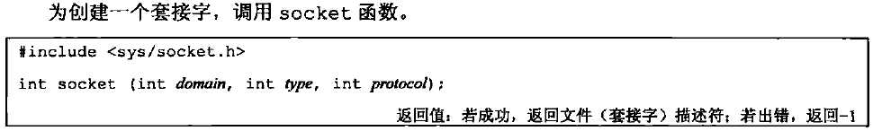{width="5.759722222222222in"
height="0.8666666666666667in"}

domain:

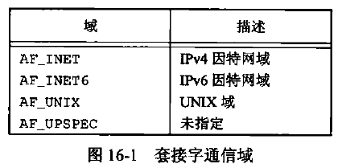{width="4.479166666666667in"
height="2.1770833333333335in"}

type:

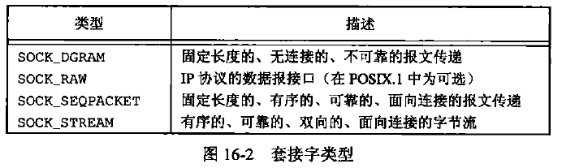{width="5.766666666666667in" height="1.725in"}

protocol:

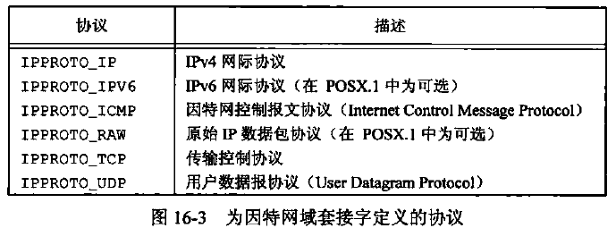{width="5.763194444444444in"
height="2.1326388888888888in"}

protocol
通信为0，表示为给定的域和socket类型提供默认的协议。数据报（SOCK_DGRAM）对应默认的协议为UDP；字节流（SOCK_STREAM）对应默认的协议为TCP。

调用socket与调用open类似，两种情况均可获得用于I/O的文件描述符。当不再需要该文件描述符时，就可以调用close来关闭对文件或套接字的访问，并释放该描述符以便重新使用。

### 套接字与地址的bind

一个地址标识一个套接字端点。

套接字通用地址结构：

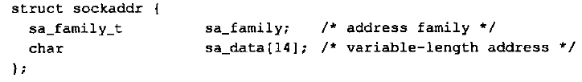{width="5.761805555555555in"
height="0.8118055555555556in"}

Linux中套接字地址结构：

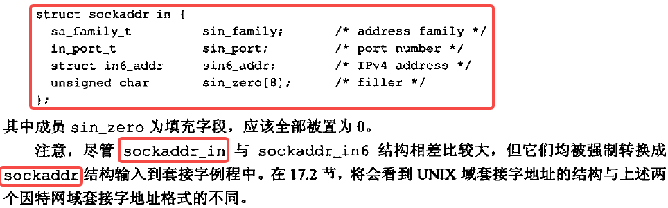{width="5.763888888888889in" height="1.8in"}

这里的地址包括[IP地址和port号]{.mark}。

IANA分配的service-names与port-numbers的关联记录在[/etc/services]{.mark}中。

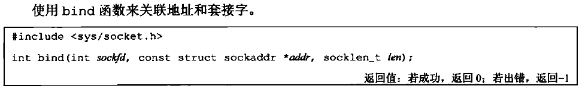{width="5.761111111111111in"
height="0.8888888888888888in"}

### 建立连接connect

客户端发起connect：

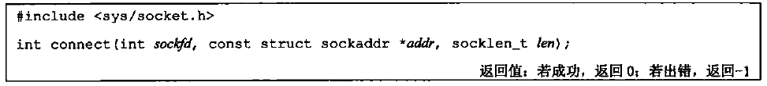{width="5.767361111111111in"
height="0.6520833333333333in"}

（connect函数也可以用于无连接的网络服务，SOCK_DGRAM。这时传送报文的目标地址，会设置成connect调用中所指定的地址。这样传送报文时就不需要再提供地址，另外也仅能接收来自指定地址的报文）

服务器端调用listen来开启连接请求队列。

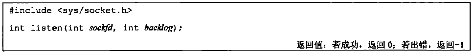{width="5.763194444444444in"
height="0.6486111111111111in"}

之后，所用的套接字就能接收连接请求了。服务器端，使用accept来获得连接请求并建立连接。accept函数返回一个新的建立了与调用connect的客户端连接的套接字描述符。之前的套接字描述符没有关联到这个连接，它继续保持可用状态并接收其它连接请求。

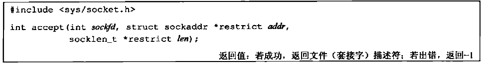{width="5.763194444444444in"
height="0.7729166666666667in"}

### 数据传输send/recv

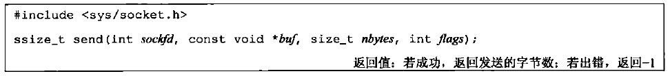{width="5.761111111111111in"
height="0.6576388888888889in"}

sendto不需要连接也可以发送报文

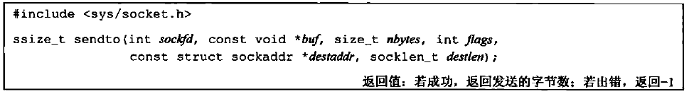{width="5.763194444444444in"
height="0.7909722222222222in"}

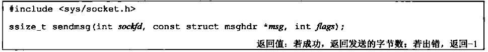{width="5.763194444444444in"
height="0.6243055555555556in"}

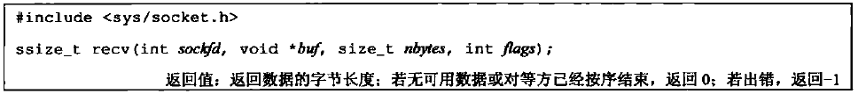{width="5.767361111111111in" height="0.6375in"}

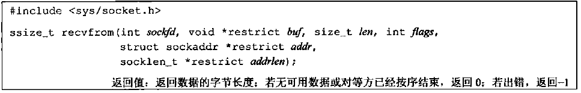{width="5.761805555555555in"
height="0.9291666666666667in"}

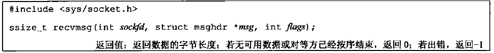{width="5.759722222222222in"
height="0.6236111111111111in"}

### 套接字选项set/get

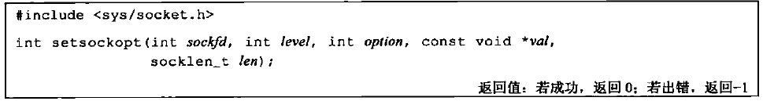{width="5.763194444444444in"
height="0.7673611111111112in"}

参数level标识了选项应用的协议（通用: SOL_SOCK，TCP: IPPROTO_TCP，IP:
IPPROTO_IP）

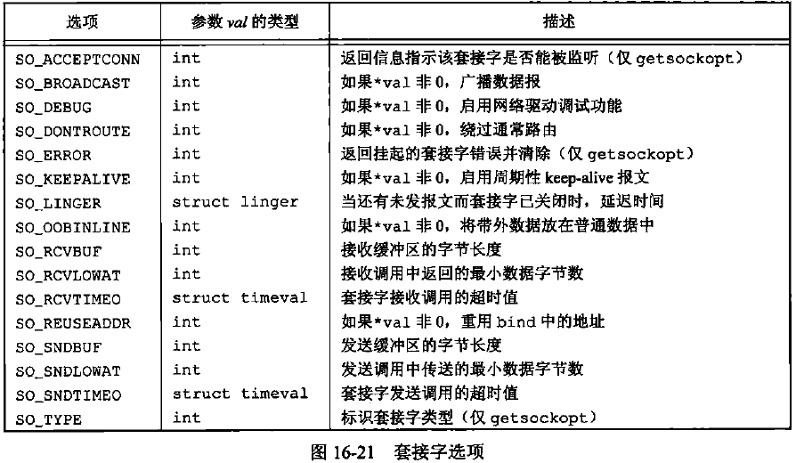{width="5.764583333333333in"
height="3.352777777777778in"}

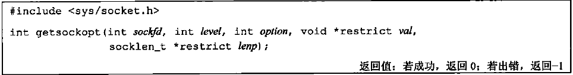{width="5.763888888888889in"
height="0.7590277777777777in"}

### 带外数据OOB

out-of-band data

TCP将带外数据称为紧急数据（urgent
data），仅支持一个字节的紧急数据。为了产生紧急数据，可以在3个send函数中任何一个指定MSG_OOB标志。

### 非阻塞/异步IO

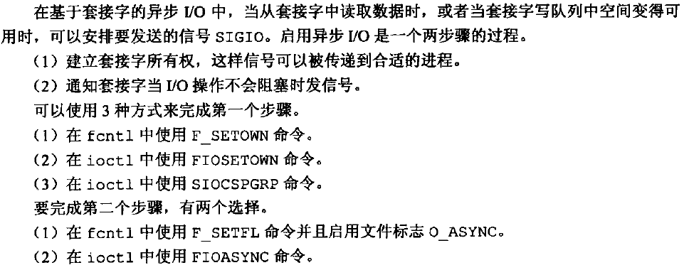{width="5.767361111111111in"
height="2.263888888888889in"}

## ioctl

先从系统调用入手，ioctl()应该是busybox中使用的~~跟network子系统相关的~~一个系统调用。

control stream device

ref: <https://man7.org/linux/man-pages/man2/ioctl.2.html>

ref:
https://pubs.opengroup.org/onlinepubs/009604599/functions/ioctl.html

ioctl()是一个用于在Unix-like系统上执行各种设备或文件描述符的输入输出控制操作的[系统调用]{.mark}。它通常用于在用户空间程序和设备驱动之间进行通信和控制。(The
Swiss army-knife of UNIX)

在C语言中，ioctl的声明通常如下：

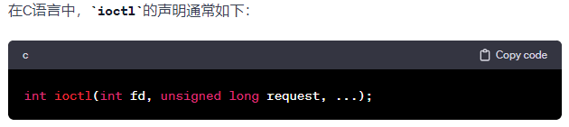{width="5.761805555555555in"
height="0.9361111111111111in"}

应用场景：

- 设备控制： 控制设备的各种属性，例如串口设置、磁带机操作等。

- 套接字控制：
  在套接字上执行一些特殊的操作，例如配置套接字选项、[获取/修改套接字状态]{.mark}等。

- 终端控制： 控制终端设备的属性，例如设置终端大小、获取终端状态等。

- 文件系统控制：
  用于执行与文件系统相关的操作，例如获取文件的访问权限、修改文件的时间戳等。

  SIO\*开头的request宏定义，就是跟socket I/O相关的控制操作。

  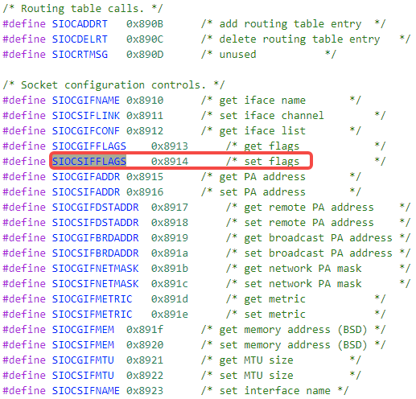{width="5.385416666666667in"
  height="5.166666666666667in"}

### 修改socket状态

基于修改socket状态的过程，分析ioctl系统调用到内核中的具体实现过程。

### ip link set eth0 up

执行busybox中的ip命令，经历ip -\> link -\> set -\>
up的过程。最终在do_chflags()中进行了系统调用。

#### ip_main

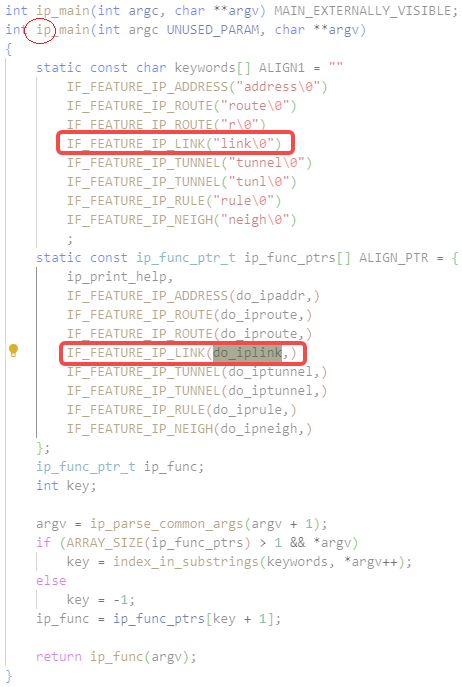{width="4.8125in" height="7.15625in"}

#### do_iplink

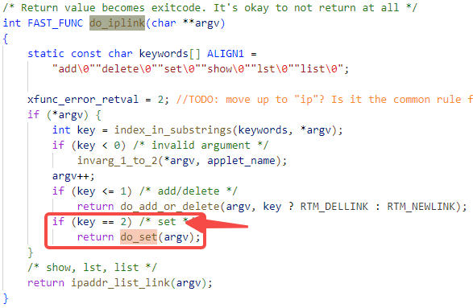{width="5.7659722222222225in" height="3.7625in"}

#### do_set

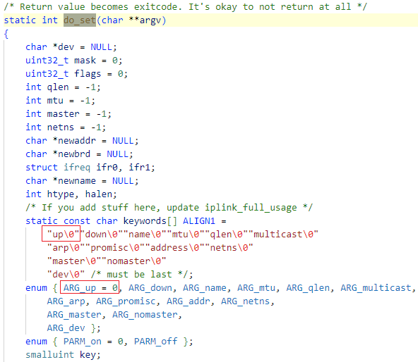{width="5.7659722222222225in"
height="5.00625in"}

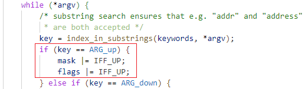{width="5.4375in" height="1.5833333333333333in"}

\...

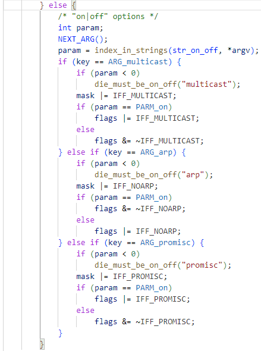{width="4.572916666666667in"
height="6.145833333333333in"}

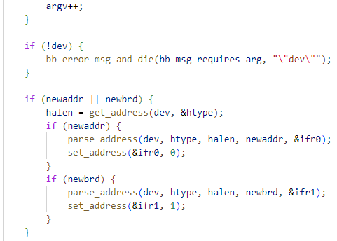{width="5.010416666666667in"
height="3.5833333333333335in"}

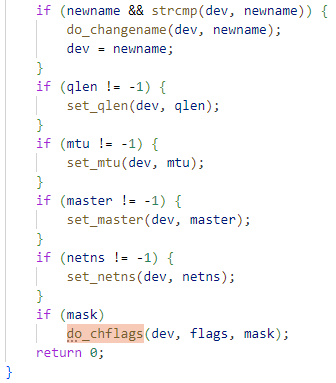{width="3.5in" height="3.9895833333333335in"}

#### do_chflags

设置套接字flag（SIOCSIFFLAGS: set flags）

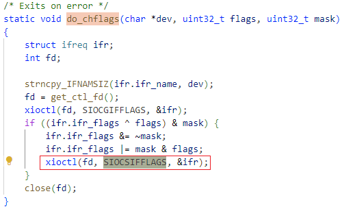{width="5.208333333333333in"
height="3.1770833333333335in"}

#### ioctl()

{width="5.763888888888889in"
height="0.20555555555555555in"}

#和宏一起配合，把相应的宏名转换为相应的字符串。即，在这里预处理后，#request="SIOCSIFFLAGS"。所以[ioctl_name为"SIOCSIFFLAGS"]{.mark}

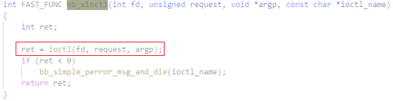{width="5.7652777777777775in"
height="1.4881944444444444in"}

ioctl作为[C库函数(libc)中的系统调用]{.mark}，会陷入到内核模式。如果返回值小于，即有错误，就会打印出来。

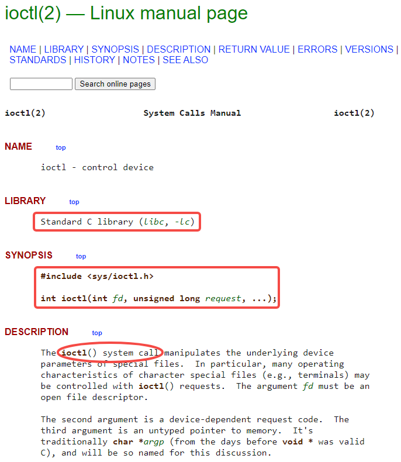{width="5.766666666666667in"
height="6.6409722222222225in"}

ref: https://man7.org/linux/man-pages/man2/ioctl.2.html

### kernel mode entry

然后内核态系统调用的响应过程，即从ioctl()
到net_device_ops-\>ndo_open的调用过程分析：

陷入到内核后，首先会执行中断例程，保存中断上下文。然后根据SCAUSE中的值确定这是一个系统使用（u-ecall），再跳转到handle_syscall根据syscall号跳转到[sys_call_table]{.mark}中相应的系统调用入口。

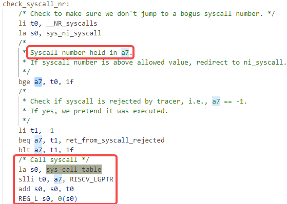{width="5.764583333333333in"
height="4.104166666666667in"}

{width="1.7604166666666667in"
height="0.40625in"}

#### sys_ioctl

这里的入口就是定义在[void
\*sys_call_table]{.mark}指针数组中的函数入口，即sys_ioctl()。真正的sys_ioctl其实是封装好的一个接口，真正的系统调用的实现在以下函数中。

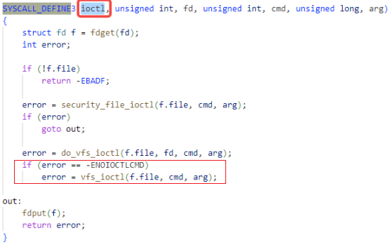{width="5.7652777777777775in"
height="3.6631944444444446in"}

##### fdget

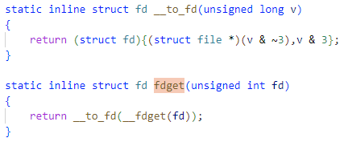{width="4.447916666666667in" height="1.84375in"}

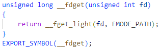{width="3.2708333333333335in"
height="1.03125in"}

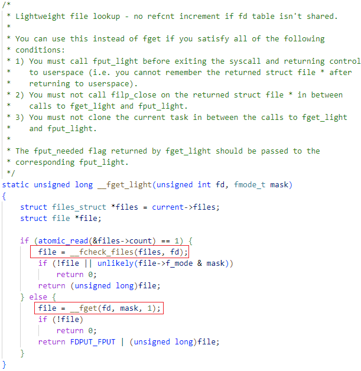{width="5.7659722222222225in"
height="5.927083333333333in"}

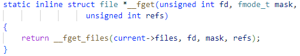{width="5.229166666666667in"
height="0.9895833333333334in"}

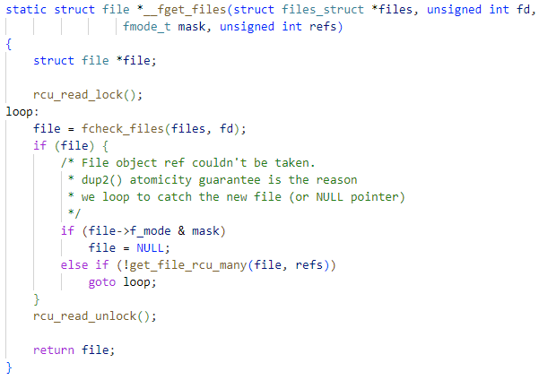{width="5.7659722222222225in"
height="4.0680555555555555in"}

##### fcheck_files

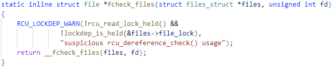{width="5.761111111111111in"
height="1.1819444444444445in"}

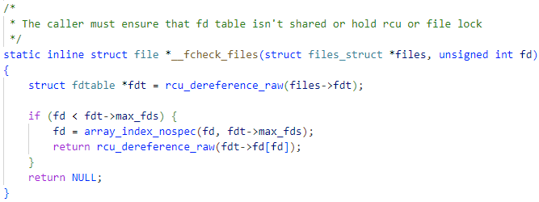{width="5.766666666666667in"
height="2.1618055555555555in"}

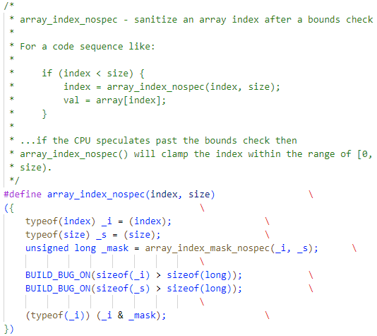{width="5.5625in" height="4.947916666666667in"}\
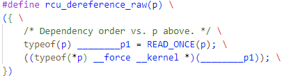{width="4.21875in"
height="1.1979166666666667in"}

#### security_file_ioctl

{width="2.2916666666666665in"
height="0.22916666666666666in"}未配置时直接返回0

\...

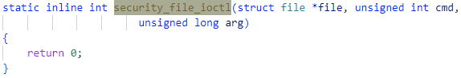{width="5.763888888888889in"
height="0.9840277777777777in"}

#### do_vfs_ioctl

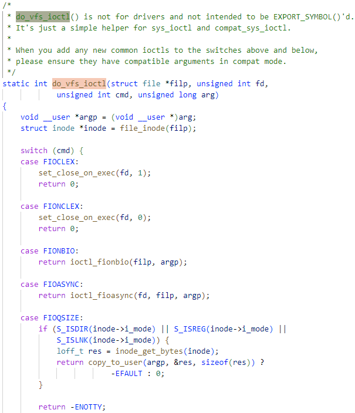{width="5.766666666666667in"
height="6.709722222222222in"}

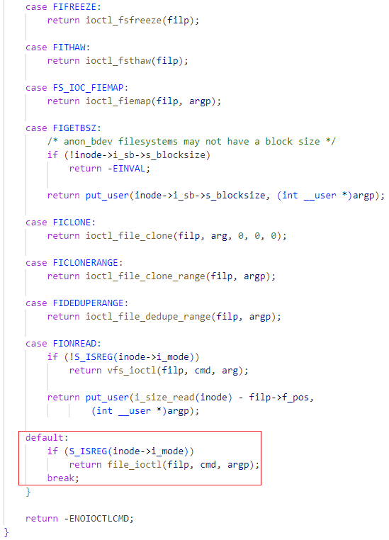{width="5.71875in" height="7.9375in"}

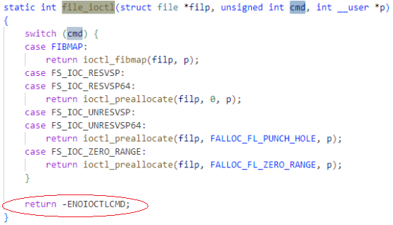{width="5.7652777777777775in"
height="3.298611111111111in"}

#### vfs_ioctl

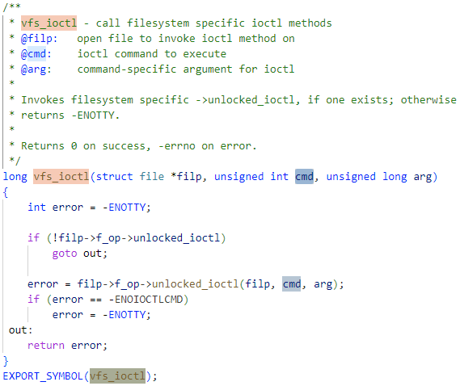{width="5.767361111111111in"
height="4.844444444444444in"}

filp: file pointer源于fd.file（ file
descriptor），进一步源于busybox代码中进行系统调用时传入的参数fget(fd)。

#### f_op-\>unlocked_ioctl

[猜测]{.mark}会是socket中的这个结构体：

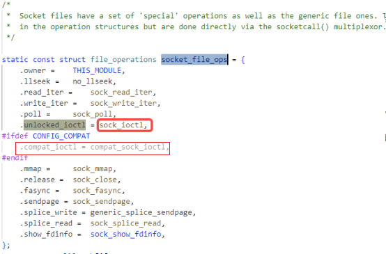{width="5.717361111111111in"
height="3.7756944444444445in"}

##### get_ctl_fd

busybox代码中调用ioctl()时，传入的fd参数，由以下方法获得。其中，socket也是个系统调用。

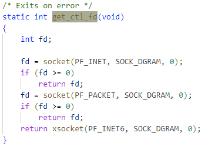{width="3.6354166666666665in"
height="2.5833333333333335in"}

##### socket()

[系统调用]{.mark}：调用过程详见相应章节分析。

{width="5.764583333333333in"
height="4.415277777777778in"}

ref: https://man7.org/linux/man-pages/man2/socket.2.html

#### sock_ioctl

{width="5.7659722222222225in"
height="4.919444444444444in"}

{width="4.104166666666667in" height="1.5625in"}

\...

{width="4.479166666666667in" height="3.0in"}

#### sock_do_ioctl

{width="5.552083333333333in"
height="7.135416666666667in"}

#### compat_sock_ioctl

{width="5.354166666666667in" height="4.5625in"}

#### compat_sock_ioctl_trans

{width="5.768055555555556in"
height="2.678472222222222in"}

\...

{width="2.0729166666666665in"
height="1.2083333333333333in"}

\...

{width="4.552083333333333in"
height="0.4270833333333333in"}

{width="4.125in" height="2.2291666666666665in"}

#### ops_init

{width="5.7652777777777775in"
height="4.9847222222222225in"}

#### \_\_register_pernet_operations

{width="5.291666666666667in"
height="5.979166666666667in"}

##### for_each_net

{width="4.489583333333333in"
height="0.5833333333333334in"}

{width="5.302083333333333in"
height="1.9791666666666667in"}

##### net_namespace_list

所有的net namespace都在这个list中。

#### register_pernet_operations

{width="5.458333333333333in" height="4.40625in"}

#### register_pernet_subsys

{width="5.7652777777777775in"
height="5.5465277777777775in"}

#### rtnetlink_init

{width="5.763194444444444in"
height="2.329861111111111in"}

{width="5.7652777777777775in"
height="5.8277777777777775in"}

##### rtnl_register

{width="5.763194444444444in"
height="5.116666666666666in"}

##### rtnl_register_internal

{width="5.46875in" height="6.729166666666667in"}

{width="5.041666666666667in"
height="4.166666666666667in"}

##### rtnl_get_link

{width="5.322916666666667in"
height="2.5729166666666665in"}

##### rtnetlink_rcv_msg

{width="5.71875in" height="5.947916666666667in"}

{width="4.885416666666667in"
height="8.114583333333334in"}

{width="4.104166666666667in"
height="6.739583333333333in"}

{width="1.96875in"
height="1.6041666666666667in"}

##### rtnetlink_rcv

{width="3.8333333333333335in"
height="0.8229166666666666in"}

##### rtnetlink_net_init

{width="4.8125in" height="3.3645833333333335in"}

###### netlink_kernel_create

{width="5.763194444444444in"
height="0.8902777777777777in"}

{width="5.7652777777777775in"
height="5.597916666666666in"}

{width="5.7652777777777775in"
height="7.429861111111111in"}

###### nlk_sk

nlk_sk(sk) == [sock]{.mark}

{width="4.822916666666667in"
height="0.8229166666666666in"}

所以，[sock-\>netlink_rcv]{.mark} = cfg.input = [rtnetlink_rcv]{.mark}

###### sock_create_lite

{width="5.7652777777777775in"
height="7.784027777777778in"}

###### \_\_netlink_create

{width="5.53125in" height="6.135416666666667in"}

###### sk_alloc

{width="5.375in" height="8.333333333333334in"}

{width="4.177083333333333in"
height="0.9895833333333334in"}

{width="5.53125in"
height="1.2083333333333333in"}

###### sock_init_data

{width="4.895833333333333in"
height="4.770833333333333in"}

##### rtnetlink_net_ops

{width="4.375in" height="0.8020833333333334in"}

#### rtnl_newlink

{width="5.763888888888889in"
height="2.7729166666666667in"}

#### \_\_rtnl_newlink

{width="5.5625in" height="3.7708333333333335in"}

\...

{width="5.75in" height="3.5729166666666665in"}

#### -\>rtnl_configure_link

{width="5.764583333333333in"
height="4.084722222222222in"}

#### -\>dev_change_flags

{width="5.763888888888889in"
height="4.585416666666666in"}

#### \_\_dev_change_flags

{width="5.6875in" height="5.166666666666667in"}

{width="5.5625in" height="6.916666666666667in"}

{width="1.2604166666666667in"
height="0.4583333333333333in"}

#### \_\_dev_open

{width="5.763194444444444in"
height="8.07013888888889in"}

{width="1.4166666666666667in"
height="0.4270833333333333in"}

#### ndev-\>netdev_ops

{width="5.0in" height="4.416666666666667in"}

{width="4.96875in"
height="2.6145833333333335in"}

{width="5.354166666666667in"
height="1.5833333333333333in"}

#### axienet_netdev_ops.ndo_open

{width="4.729166666666667in"
height="2.6354166666666665in"}

#### axienet_open

{width="5.7652777777777775in"
height="7.377777777777778in"}

{width="5.53125in" height="7.1875in"}

## socket

系统调用socket的定义：

{width="5.145833333333333in"
height="0.8333333333333334in"}

### \_\_sys_socket

{width="5.1875in" height="5.197916666666667in"}

### sock_create

{width="5.7625in" height="2.720138888888889in"}

#### \_\_sock_create

{width="5.677083333333333in"
height="7.958333333333333in"}

{width="5.7659722222222225in"
height="6.336111111111111in"}

{width="5.763194444444444in"
height="6.136805555555555in"}

{width="2.4270833333333335in"
height="2.78125in"}

# socket.c文件分析：

### sock_register

{width="5.5in" height="6.34375in"}

实际操作就是，把ops附给[net_families]{.mark}\[ops-\>family\]

### sock_init

{width="4.729166666666667in"
height="5.739583333333333in"}

{width="5.7625in"
height="3.9159722222222224in"}

这个函数会在initcall中被调用。

## syscall-\>SYSCALL_DEFINEx

分析在内核中系统调用是如何定义的。

=\> \_\_do_sys_ioctl(unsigned int fd, usigned int cmd, unsigned long,
arg)

然后[sys_ioctl()]{.mark}中调用这个函数。而sys_ioctl()的函数指针又被加到指针数组\*[sys_call_table\[\]]{.mark}中。

{width="5.7659722222222225in"
height="3.6590277777777778in"}

syscall vs compat_syscall

### SYSCALL_DEFINE

{width="5.7625in" height="3.786111111111111in"}

{width="5.764583333333333in"
height="4.884027777777778in"}

\_\_se_sys_ioctl与sys_ioctl之间的联系是什么？

A: aliased by \_\_attribute((alias(stringfy(\_\_se_sys##name))))

用来定义类型的宏：

{width="2.3125in"
height="0.22916666666666666in"}

{width="5.761805555555555in"
height="0.17708333333333334in"}

{width="5.768055555555556in" height="1.4in"}

{width="4.385416666666667in"
height="0.21875in"}

#### sys_ioctl

{width="4.104166666666667in" height="0.625in"}

根据宏\_\_SYSCALL_COMPAT是否定义，\_\_SC_COMP被定义为不同的调用实现。

{width="5.625in" height="1.4479166666666667in"}

#### \_\_MAP

{width="5.270833333333333in"
height="3.3958333333333335in"}

### sys_call_table

最终sys_ioctl会被加到数组\*[sys_call_table]{.mark}中，位置为\_\_NR_ioctl，即29。

in syscall_table.c

{width="3.8958333333333335in"
height="1.3958333333333333in"}

{width="5.625in" height="1.4479166666666667in"}

这时相当于：#define \_\_SC_COMP(\_nr, \_sys, \_comp) [\[\_nr\] =
(\_sys)]{.mark}

include 头文件：

{width="5.763888888888889in"
height="2.86875in"}

include 头文件：

{width="5.768055555555556in"
height="0.39791666666666664in"}

\...

{width="2.7604166666666665in"
height="0.3229166666666667in"}

{width="5.7652777777777775in"
height="3.261111111111111in"}

include 头文件：

{width="5.625in" height="3.1145833333333335in"}

\...

{width="4.104166666666667in" height="0.625in"}

=\> [\[\_\_NR_ioctl\] = (sys_ioctl)]{.mark}

\...

因此，[sys_ioctl]{.mark}作为函数指针，被加入到了[sys_call_table\[29\]]{.mark}这个位置。

如果[\_\_SYSCALL_COMPAT]{.mark}被定义了，则将[compat_sys_ioctl]{.mark}加入到sys_call_table\[29\]。

### COMPAT_SYSCALL_DEFINE

compatible syscall

{width="4.53125in" height="3.78125in"}

{width="5.7625in" height="4.467361111111111in"}

\_\_se_compat_sys_ioctl与compat_sys_ioctl之间的联系是什么？

A: aliased by \_\_attribute((alias(stringfy(\_\_se_compat_sys##name))))

COMPAT_SYSCALL_DEFINEx定义出来的函数名为compat_sys_name，即[compat_sys_ioctl]{.mark}。

#### CONFIG_COMPAT

compatible指的是[兼容]{.mark}32位userspace
program。或者叫兼容用户态32位进程，内核态还处于64bit地址空间。

根据以下代码分析可知，COMPAT系统调用会把参数arg从32位（[compat_ulong_t =
u32]{.mark}）转换成内核系统实际的位宽（[unsigned
long]{.mark}，取决于[-mabi]{.mark}的选项配置，例如[lp64]{.mark}指long和pointer都是64位的，而[ilp32]{.mark}指int,
long和pointer都是32位的）。

反过来，返回结果到用户程序时，也会转换为兼容32位的类型。

{width="5.6875in" height="7.135416666666667in"}

{width="5.40625in"
height="4.541666666666667in"}

在COMPAT系统调用中，对参数arg进行了处理。这里的[(unsigned
long)]{.mark}类型转换，可以将32位的长整型转换为内核系统实际的长整型。

{width="4.645833333333333in"
height="2.3541666666666665in"}

[compat_ulong_t]{.mark}被定义为32位的宽度，以兼容32位用户程序。

{width="4.135416666666667in"
height="3.8020833333333335in"}

Kconfig的解释：[32bit U-mode 运行在64bit
S-mode上]{.mark}，内核会为32bit用户程序处理好system calls, vdso等组件。

{width="5.760416666666667in"
height="1.3763888888888889in"}
