Memory management

# kcalloc

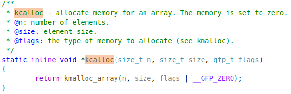

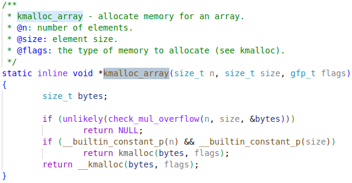

## __kmalloc

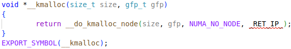

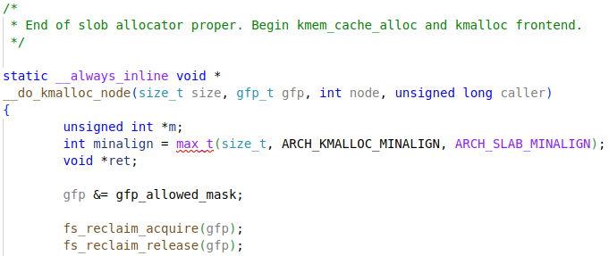

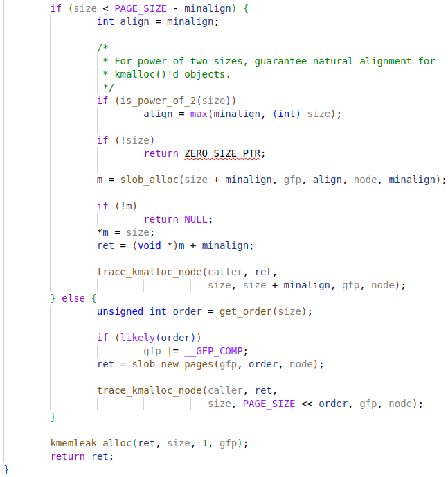

# kmalloc

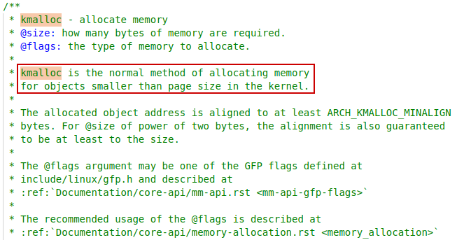

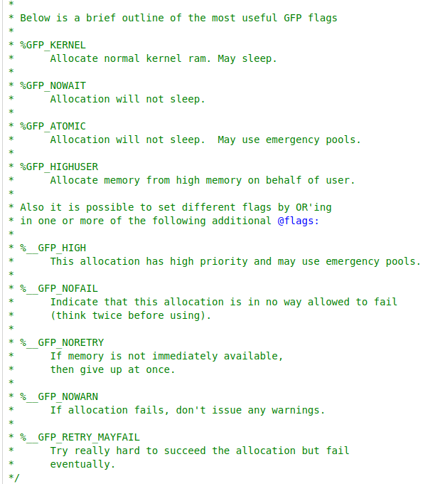

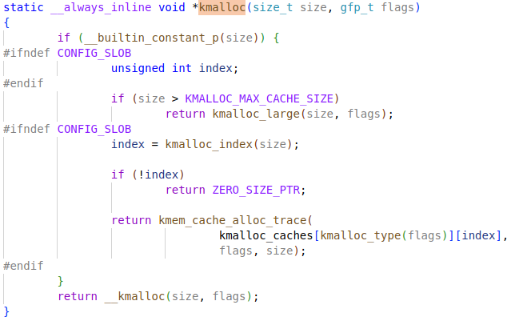

## __kmalloc

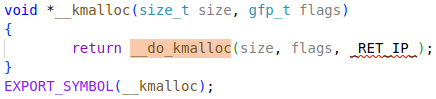

## __do_kmalloc

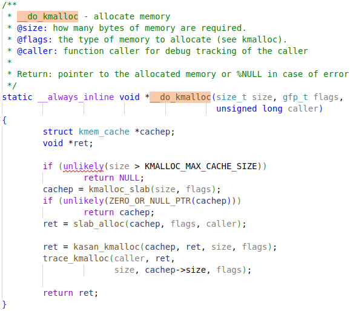

### kmalloc_slab

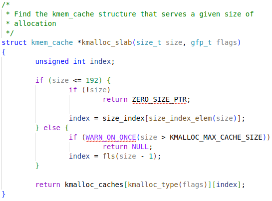

### slab_alloc

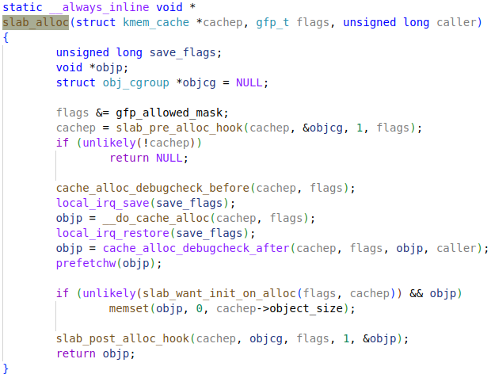

### kasan_kmalloc

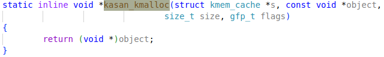

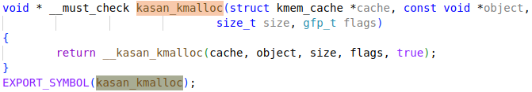

# vmalloc

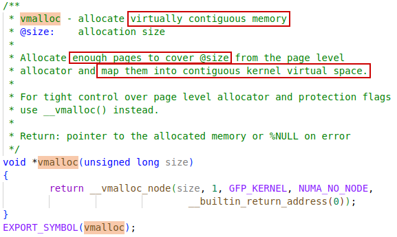

## __vmalloc_node

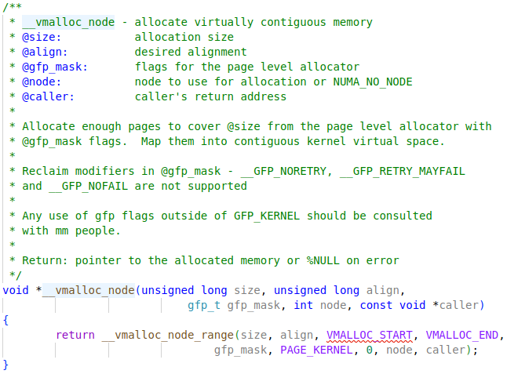

# __vmalloc

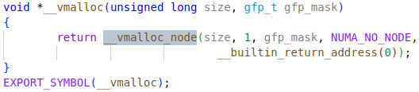

