Memory management


# VMA management

Every process or thread has its virtual memory address space, the `mm_struct` under struct `task_struct` are the meta data used to store these information.

## mm_struct


（由于内核页表被映射到了所有的虚拟地址空间，在使用lazy context时，只有在切换到不同的用户进程的时候，才switch_mm。当内核线程被调度时，用active_mm来记录现在借用的是哪个用户进程的空间；当不被调度时，active_mm为NULL。内核线程没有自己单独的虚拟地址空间，mm永远为NULL。）

struct `mm_struct`是每个task的虚拟内存空间的描述符，例如用户态进（线程）程栈区间，堆区间的地址和大小等；每个进程只有一个mm，即使是多个线程的进程，所有的线程都共享同一个mm，mm_struct数据结构中几个关键字段的含义如下：


在一个mm中，所有的vma通过两种结构管理起来，一个是**双向链表**，一个是**红黑树**。当遍历这个虚拟地址空间时，通过双向链表是常用的方法；当在虚拟地址空间查找vma时，通过红黑树是更便捷的方法。通常两种方法结合起来使用，例如通过红黑树查找到某个vma，后要找到该vma的前置，则直接通过vma->vm_prev就可以直接获取。


```c
struct mm_struct {
	struct {
		struct vm_area_struct *mmap;		/* list of VMAs */
		struct rb_root mm_rb;
		u64 vmacache_seqnum;                   /* per-thread vmacache */
#ifdef CONFIG_MMU
		unsigned long (*get_unmapped_area) (struct file *filp,
				unsigned long addr, unsigned long len,
				unsigned long pgoff, unsigned long flags);
#endif
		unsigned long mmap_base;	/* base of mmap area */
		unsigned long mmap_legacy_base;	/* base of mmap area in bottom-up allocations */
#ifdef CONFIG_HAVE_ARCH_COMPAT_MMAP_BASES
		/* Base adresses for compatible mmap() */
		unsigned long mmap_compat_base;
		unsigned long mmap_compat_legacy_base;
#endif
		unsigned long task_size;	/* size of task vm space */
		unsigned long highest_vm_end;	/* highest vma end address */
		pgd_t * pgd;

#ifdef CONFIG_MEMBARRIER
		/**
		 * @membarrier_state: Flags controlling membarrier behavior.
		 *
		 * This field is close to @pgd to hopefully fit in the same
		 * cache-line, which needs to be touched by switch_mm().
		 */
		atomic_t membarrier_state;
#endif

		/**
		 * @mm_users: The number of users including userspace.
		 *
		 * Use mmget()/mmget_not_zero()/mmput() to modify. When this
		 * drops to 0 (i.e. when the task exits and there are no other
		 * temporary reference holders), we also release a reference on
		 * @mm_count (which may then free the &struct mm_struct if
		 * @mm_count also drops to 0).
		 */
		atomic_t mm_users;

		/**
		 * @mm_count: The number of references to &struct mm_struct
		 * (@mm_users count as 1).
		 *
		 * Use mmgrab()/mmdrop() to modify. When this drops to 0, the
		 * &struct mm_struct is freed.
		 */
		atomic_t mm_count;

		/**
		 * @has_pinned: Whether this mm has pinned any pages.  This can
		 * be either replaced in the future by @pinned_vm when it
		 * becomes stable, or grow into a counter on its own. We're
		 * aggresive on this bit now - even if the pinned pages were
		 * unpinned later on, we'll still keep this bit set for the
		 * lifecycle of this mm just for simplicity.
		 */
		atomic_t has_pinned;

#ifdef CONFIG_MMU
		atomic_long_t pgtables_bytes;	/* PTE page table pages */
#endif
		int map_count;			/* number of VMAs */

		spinlock_t page_table_lock; /* Protects page tables and some
					     * counters
					     */
		struct rw_semaphore mmap_lock;

		struct list_head mmlist; /* List of maybe swapped mm's.	These
					  * are globally strung together off
					  * init_mm.mmlist, and are protected
					  * by mmlist_lock
					  */


		unsigned long hiwater_rss; /* High-watermark of RSS usage */
		unsigned long hiwater_vm;  /* High-water virtual memory usage */

		unsigned long total_vm;	   /* Total pages mapped */
		unsigned long locked_vm;   /* Pages that have PG_mlocked set */
		atomic64_t    pinned_vm;   /* Refcount permanently increased */
		unsigned long data_vm;	   /* VM_WRITE & ~VM_SHARED & ~VM_STACK */
		unsigned long exec_vm;	   /* VM_EXEC & ~VM_WRITE & ~VM_STACK */
		unsigned long stack_vm;	   /* VM_STACK */
		unsigned long def_flags;

		spinlock_t arg_lock; /* protect the below fields */
		unsigned long start_code, end_code, start_data, end_data;
		unsigned long start_brk, brk, start_stack;
		unsigned long arg_start, arg_end, env_start, env_end;

		unsigned long saved_auxv[AT_VECTOR_SIZE]; /* for /proc/PID/auxv */

		/*
		 * Special counters, in some configurations protected by the
		 * page_table_lock, in other configurations by being atomic.
		 */
		struct mm_rss_stat rss_stat;

		struct linux_binfmt *binfmt;

		/* Architecture-specific MM context */
		mm_context_t context;

		unsigned long flags; /* Must use atomic bitops to access */

		struct core_state *core_state; /* coredumping support */

#ifdef CONFIG_AIO
		spinlock_t			ioctx_lock;
		struct kioctx_table __rcu	*ioctx_table;
#endif
#ifdef CONFIG_MEMCG
		/*
		 * "owner" points to a task that is regarded as the canonical
		 * user/owner of this mm. All of the following must be true in
		 * order for it to be changed:
		 *
		 * current == mm->owner
		 * current->mm != mm
		 * new_owner->mm == mm
		 * new_owner->alloc_lock is held
		 */
		struct task_struct __rcu *owner;
#endif
		struct user_namespace *user_ns;

		/* store ref to file /proc/<pid>/exe symlink points to */
		struct file __rcu *exe_file;
#ifdef CONFIG_MMU_NOTIFIER
		struct mmu_notifier_subscriptions *notifier_subscriptions;
#endif
#if defined(CONFIG_TRANSPARENT_HUGEPAGE) && !USE_SPLIT_PMD_PTLOCKS
		pgtable_t pmd_huge_pte; /* protected by page_table_lock */
#endif
#ifdef CONFIG_NUMA_BALANCING
		/*
		 * numa_next_scan is the next time that the PTEs will be marked
		 * pte_numa. NUMA hinting faults will gather statistics and
		 * migrate pages to new nodes if necessary.
		 */
		unsigned long numa_next_scan;

		/* Restart point for scanning and setting pte_numa */
		unsigned long numa_scan_offset;

		/* numa_scan_seq prevents two threads setting pte_numa */
		int numa_scan_seq;
#endif
		/*
		 * An operation with batched TLB flushing is going on. Anything
		 * that can move process memory needs to flush the TLB when
		 * moving a PROT_NONE or PROT_NUMA mapped page.
		 */
		atomic_t tlb_flush_pending;
#ifdef CONFIG_ARCH_WANT_BATCHED_UNMAP_TLB_FLUSH
		/* See flush_tlb_batched_pending() */
		bool tlb_flush_batched;
#endif
		struct uprobes_state uprobes_state;
#ifdef CONFIG_HUGETLB_PAGE
		atomic_long_t hugetlb_usage;
#endif
		struct work_struct async_put_work;

#ifdef CONFIG_IOMMU_SUPPORT
		u32 pasid;
#endif
	} __randomize_layout;

	/*
	 * The mm_cpumask needs to be at the end of mm_struct, because it
	 * is dynamically sized based on nr_cpu_ids.
	 */
	unsigned long cpu_bitmap[];
};
```


### vm_area_struct

```c
/*
 * This struct describes a virtual memory area. There is one of these
 * per VM-area/task. A VM area is any part of the process virtual memory
 * space that has a special rule for the page-fault handlers (ie a shared
 * library, the executable area etc).
 */
struct vm_area_struct {
	/* The first cache line has the info for VMA tree walking. */

	unsigned long vm_start;		/* Our start address within vm_mm. */
	unsigned long vm_end;		/* The first byte after our end address
					   within vm_mm. */

	/* linked list of VM areas per task, sorted by address */
	struct vm_area_struct *vm_next, *vm_prev;

	struct rb_node vm_rb;

	/*
	 * Largest free memory gap in bytes to the left of this VMA.
	 * Either between this VMA and vma->vm_prev, or between one of the
	 * VMAs below us in the VMA rbtree and its ->vm_prev. This helps
	 * get_unmapped_area find a free area of the right size.
	 */
	unsigned long rb_subtree_gap;

	/* Second cache line starts here. */

	struct mm_struct *vm_mm;	/* The address space we belong to. */

	/*
	 * Access permissions of this VMA.
	 * See vmf_insert_mixed_prot() for discussion.
	 */
	pgprot_t vm_page_prot;
	unsigned long vm_flags;		/* Flags, see mm.h. */

	/*
	 * For areas with an address space and backing store,
	 * linkage into the address_space->i_mmap interval tree.
	 */
	struct {
		struct rb_node rb;
		unsigned long rb_subtree_last;
	} shared;

	/*
	 * A file's MAP_PRIVATE vma can be in both i_mmap tree and anon_vma
	 * list, after a COW of one of the file pages.	A MAP_SHARED vma
	 * can only be in the i_mmap tree.  An anonymous MAP_PRIVATE, stack
	 * or brk vma (with NULL file) can only be in an anon_vma list.
	 */
	struct list_head anon_vma_chain; /* Serialized by mmap_lock &
					  * page_table_lock */
	struct anon_vma *anon_vma;	/* Serialized by page_table_lock */

	/* Function pointers to deal with this struct. */
	const struct vm_operations_struct *vm_ops;

	/* Information about our backing store: */
	unsigned long vm_pgoff;		/* Offset (within vm_file) in PAGE_SIZE
					   units */
	struct file * vm_file;		/* File we map to (can be NULL). */
	void * vm_private_data;		/* was vm_pte (shared mem) */

#ifdef CONFIG_SWAP
	atomic_long_t swap_readahead_info;
#endif
#ifndef CONFIG_MMU
	struct vm_region *vm_region;	/* NOMMU mapping region */
#endif
#ifdef CONFIG_NUMA
	struct mempolicy *vm_policy;	/* NUMA policy for the VMA */
#endif
	struct vm_userfaultfd_ctx vm_userfaultfd_ctx;
} __randomize_layout;
```


### 红黑树：自平衡二叉搜索树

平衡性保证，在最坏的情况下，基本的动态操作（插入，删除和查找）都有较低的时间复杂度。

 

红黑树性质：

1. 每个节点要么是黑色要么是红色
2. 根节点为黑色
3. leaf **空**节点为黑色
4. 红色节点不能相连（红色节点的子节点都得为黑色）
5. 从任意节点到leaf节点的黑色高度（简单路径包括黑色节点的数目）相同

 

这些性质保证了，在插入或删除节点后，树的结构仍然相对平衡。

在实际操作中，红黑树的操作复杂度保持在O(log n)级别，n是树中元素的个数。

 

O表示法：表示渐进复杂度的上界，用于描述最坏情况下的运行的时间或空间复杂度。

log n：以2为底的对数，红黑树的高为h = log2n。

 

红黑树通过平衡操作，使二叉树的高度最小，操作复杂度即O(h)最小。

ref: [红黑树的原理 (插入+ 删除) 案例分析 - 知乎 (zhihu.com)](https://zhuanlan.zhihu.com/p/166319823)


红色节点通常表示该节点是一个**临时节点**，用于维护红黑树的**平衡性**。增加了一个不平衡高度

黑色节点则表示该节点是一个稳定节点，用于存储红黑树数据。它们代表了平衡高度（呼应红黑树性质5）黑色可以理解为红黑树的底色，leaf空节点为黑色。

新加入节点就增加了不平衡性，它所在的分支就变长一个节点。因此，将其**着红色**以标记节点所在的分支**不平衡**。每个红色节点代表**不平衡的值**增加1。那么修复平衡时，就可以参考节点的红黑色来分情况操作了。连续两个红色节点，代表**父节点所在的分支**比另一个分支长两个节点，即**不平衡的值达到2**（如果叔父节点也是红色，则抵消一个）。

加入一个节点为红色，减少一个节点为**反红色**，即这个节点需要变成红色，然后再被删除掉。


**不平衡上/下移**：

- 状态1：两个子节点都为红色，父节点为黑色。
- 状态2：两个子节点都为黑色，父节点为红色。
- 上移：从状态1变为状态2
- 下移：从状态2 变为状态1


不平衡**上移延迟**：

当新插入节点的兄弟节点为红色节点，就可以进行不平衡上移。为了减少不必要的操作以提高效率，这个操作并未作为红黑树的性质作要求。而是延迟不平衡上移的操作到再有新子节点加入，导致连续两个红色节点出现。在这之前，如果要删除其中一个红色节点，就可以直接删除，而不需要修复平衡的操作。

 

***\*不平衡上借\****：

不平衡下移时，如果父节点原本就是黑色，就需要向上借红，因此叫不平衡**上借**。一直递归到父节点或者兄弟节点为红色（这时会通过**左右旋借**来修复平衡）。如果递归到根节点，则将根节点变红，然后不平衡下移。

 

***\*不平衡下借\****：

左/右旋时，如果右/左子节点为黑色，且其子节点为红色节点，就可以向**下借**，因此叫不平衡下借。实际上是强迫右/左子节点的子节点**不平衡上移**。以右/左子节点为当前节点，如果一个子节点为leaf空节点（黑色），将leaf空节点变红，然后不平衡上移。

 

本质上，根节点即是红色也是黑色，或者可以叫**红黑节点**。leaf空节点也为红黑节点。（**黑中带红**）


递归：

插入节点从leaf空节点插入，删除节点也是将要删除的节点**替换**到leaf节点再删除。因此，红黑树的平衡是从最末节点开始，向上到根节点，一层一层地进行维护/修复的。依据红黑树的五个性质每次维护一个节点的两子树分支平衡，然后将同样的操作**递归**到上一层节点。递归的条件是性质4，即祖父节点与祖祖节点都为红色。如果不满足，则修复结束。

 

红黑树平衡操作：

- 着色： 每个节点被赋于红色或黑色
- 左旋/右旋： 将（右/左）子节点**提升**为父节点，左旋和右旋操作互逆
- **插入**修复： 通过旋转或着色保证树的平衡性
- **删除**修复： 通过旋转或着色保证树的平衡性

**左旋左旋的意义**：

二叉树中，每个分叉的左中右三个节点都是从小到大排列的（二叉树的有序性）。当一个**左节点右旋**：使其**代替父节点的位置**，并将**父节点变为其右子节点**，**右子节点成为父节点的左子节点**；反之亦然。旋转后依然符合二叉树中，节点从左到右值增大的顺序。左右旋都使当前节点代替了其父节点的位置，旋转后子节点之前的分支长度减1而另一边的分支加1，因此修复了平衡。


由于**右旋**转过程中，需要将**右子节点的位置**划给父节点，然后将**右子节点**作为父节点的左子节点，如果此**新插入节点位置在右子节点**，那么就会过平衡。即，右旋的同时，把红色右子节点也移到了右边分支。因此，对于两个连续红色节点中，父节点为左节点，子节点为右节点的，需要先通过左旋，将父子节点转到左侧。之后，再进行右旋来修复平衡。
左旋右旋着色：
旋转使一个**节点子树**从父节点的一侧移到了另一侧，左旋往左移，右旋往右移。**子节点红色**也左/右移。从孙节点位置**升上来的子节点树**或者从子节点位置**降下来的孙节点树**，保持其原来颜色（节点及其位置颜色一起上升/下降）。
红黑树中，颜色是跟着位置走的，即节点变换位置后，继承原位置的颜色。旋转调整了分支不平衡性，因此才变换了红色的位置，旋转带动分支上移时，也带动了红色的上移。
左右旋时，**父节点位置的节点**保持其原本颜色。

 -> 

删除节点时会有**特有情况**如下：

- 如果被删除leaf子节点为黑色，**兄弟节点为黑色**且有子节点（一定是红色），则适用于旋转方法来修复平衡。旋转的目地是将要删除的节点转换为红色，实现预平衡。
- 这时，兄弟节点一定没有黑色子节点（基于红黑树性质5）。这样就分成两个红色子节点和红色子节点+leaf空节点两种情况。前一种可以直接做**不平衡上移**，后一种先从**leaf空节点借红**，再做不平衡上移。然后就可以通过左/右旋来把红色转移到被删除节点这一侧。
- 旋转后，要删除的节点变成了旋转支点的**孙节点**，而它的父节点位置获得了旋转转移过来的红色。此时，可以做不平衡下移，将**被删除节点**和它的兄弟节点-leaf空节点**变红**。leaf空节点变红后，自动变黑。


二叉搜索树：

- 有序性：对于树中的每个节点，**左子树节点的值都小于自己，而右子树节点都大于自己**
- 每一个节点的内侧子节点的值都比父节点的值离自己更近，这是左旋右旋的理论基础
- 惟一性：不存在两个节点有相同的值

如果二叉树平衡，树的高度就最小，即最坏情况下的操作复杂度保持在O(log n)级别。


红黑树插入：

- 按二叉搜索树插入，**新节点着红色**

  - 类似于搜索操作，找到适合的leaf空节点位置，然后插入
  - 从根节逐层递归，直到树末端的leaf空节点

- 修复平衡性

  - 父节点为黑色，满足性质4。

  - 父节点为红色，不满足性质4，需要再平衡。

  - 父叔节点都为红色，可以通过不平衡上移来在父节点满足性质4。

    需要将父叔节点变黑（平衡了），把祖父节点变红（不平衡上移，然后在祖父节点递归维护平衡性）

  - 父节点为红色，叔节点为黑色（空leaf节点），则**父节点这一级不平衡**

    由于二叉树中，每个分叉的左中右三个节点都是从小到大排列的，左旋和右旋分别代表了将支点左侧和右侧分支缩短一节，同是另外一侧会变长。因此，父节点为红色（叔节点为null）代表当前分支过长，需要平衡（通过左旋右旋）


红黑树删除：

- 按二叉搜索树的方式目标节点，然后由**前驱或后继**leaf节点**替换**，然后删除leaf节点位置。

  ​	前驱leaf节点为左子树最大值，后继leaf节点为右子树最小值。

  ​	将要删除的末端节点**转换为红色，再删除，树还是平衡的**。

  ​	因此，删除操作中平衡性的修复其实是**预平衡**操作。

- 修复平衡性

  - 删除**红色leaf节点**不破坏平衡性
  - 删除**黑色leaf节点**，需要修复。（基本逻辑是**将要删除的leaf节点先转换红色**）
    - 要么兄弟节点为黑色，无子节点（逻辑简单，不平衡上借）
    - 要么兄弟节点为黑色，只有红色子节点（左/右旋，将红色借过来）
    - 要么兄弟节点为红色，两个黑色子节点（左/右旋，将红色借过来）


性质4，为什么不能有两个连续的红色节点？
红色节点源于新插入节点，一条分支上有两个连续红色节点，说明这个分支变得比其它分支长了，而且长出了两个节点，需要平衡一下了。（分配到两个分支上，各分一个，这两个分支就回到了之前的平衡状态）

插入时修复平衡操作背后的意义：
每次插入都是从最末端下的leaf 空节点，插入时着红色代表增加了不平衡。当父节点也为红色，代表这次插入使**父级节点以下分支的不平衡性**从1增加到2。这时，就可以修复平衡了。
这也是性质4，红色节点不能相连的原因。

性质5，黑色高度是如何保证的？

- 新插入节点着红色

- 将红色节点变黑时，只影响其**上层节点的黑色高度**，必然要将它所在分支上的上层一个节点变红，以维持黑色高度并将不平衡标记上移。

  - 插入节点时，触发修复平衡操作时，如果两个子节点都为红色，则**不平衡上移**以维持上层节点的黑色高度的同时满足性质4。

  - 删除节点时，触发修复平衡操作时，如果两个子节点都为黑色，则**不平衡上借**以维持上层节点的黑色高度的同时将被删除节点变红。

- 删除黑色节点，要为它借一个红色来维持平衡。（预平衡：**上借，左右旋借**）

- 根节点如果**被变红**，由于其没有上层节点，可以自动变黑，这样所有分支的黑色高度加1

- 根节点如果**被借红**，由于其没有上层节点，可以自动变红，这样所有分支的黑色高度减1

- leaf空节点如果**被变红**，由于其中没有数据，可以直接删除，这样就又变成了黑色。

- leaf空节点如果**被借红**，可以假设先插入无效数据变红，之后再删除，这样就又变成了黑色。


## vmap space

Todo: add description about vmap space here


### vmalloc area

`/* file: arch/riscv/include/asm/pgtable.h */`


`/* file: arch/riscv/include/asm/page.h */`


`KERN_VIRT_SIZE` is the **size** of kernel virtual space.


`/* file: arch/riscv/Kconfig */`


`/* file: arch/riscv/kernel/vmlinux.lds.S */`


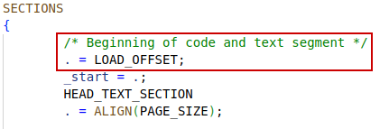


#### kernel vm layout

The layout below is specified for riscv32. It will be different in case of Arm32, Arm64, or x86.

`/* file: arch/riscv/mm/init.c */`


`/* file: arch/riscv/mm/ptdump.c */`


### struct vmap_area

`/* file: include/linux/vmalloc.h */`


#### struct vm_struct


### Global vmap_area varables

`/* file: mm/vmalloc.c */`

For kva allocator


#### RB_ROOT

`/* file: include/linux/rbtree.h */`


# PMA management


## memory models

**Physical memory models** are ways to organize physical Page Frames:

​	Flat memory model, Dis-contiguous memory model, Sparse memory model

```
include/asm-generic/memory_model.h

# Conversion between struct page and PFN
page_to_pfn
pfn_to_page
```


Every (physical) **Page Frame** will be abstracted to a struct `page`. In difference models, the way to organize page frames, i.e. struct `page`s are different, so implementation of `page_to_pfn` and `pfn_to_page` is different.

In Dis-contiguous model, physical memory address space is split into a a couple segments of flat memory by holes. There is one **struct `page` array** in one segment, or node(it's concept overlaps the NUMA node).

In Sparse model, the conception of **memory section** was involved. The whole physical memory address space is divided into sections, may be 1G for one section. 

A statically allocated **struct `mem_section*` array** is used manage all the address space. One struct `mem_section` is used manage a section of contiguous Page Frames, by a struct `page` array, the same to flat memory model.

There is something similar to multi-level page table, could be applied to struct `mem_section` pointer array: do not allocate struct `mem_section` if the corresponding section of memory does not exist.


In NUMA architecture, there will be **nodes** to manage affinity between memory and processors.


### mem_map

It's the paging for all physical memory. The core part is always the **struct `page` objects**, no matter which memory model is chosen.

`mem_map` for FLAT, `node_mem_map` for DISCONTIG, `section_mem_map` for SPARSE


#### struct page


#### FLATMEM / DISCONTIGMEM

`node_mem_map` in `pg_data_t` is a struct `page` array that maps physical pages belonging to that node.


Every `node_mem_map` behaves exactly as FLATMEM's `mem_map` - every physical page frame in a node has a `struct page` entry in the `node_mem_map` array. 

When DISCONTIGMEM is enabled, a portion of the `flags` field of the `struct page` encodes the node number of the node hosting that page.


Check the `paging_init` routine for details about how the struct `page` space is allocated.


#### SPARSEMEM


##### struct mem_section


## memblock

ref: https://tinylab.org/riscv-memblock/

**memblock 内存页帧分配器**是 Linux 启动早期内存管理器(boot memory allocator)，在伙伴系统（Buddy System）接管内存管理之前为系统提供内存分配、预留等功能。

memblock 将系统启动时获取的可用内存范围（如从设备树中获取的内存范围）纳入管理，为内核启动阶段内存分配需求提供服务，直到 memblock  分配器将内存管理权移交给伙伴系统。同时 memblock 分配器也维护预留内存（reserved  memory），使其不会被分配器直接用于分配，保证其不被非预留者使用。

### struct memblock

内核中定义了一个 `memblock` 实体，作为 memblock 分配器管理载体，其类型为 `struct memblock` 。

memblock 分配器管理结构共有三层，从顶向下分别为 `struct memblock` , `struct memblock_type` , `struct memblock_region` ，三层结构关系如下图所示，可结合代码理解。下面将详细分析。


### memblock func

- `memblock_add` 将内存区块添加到可用内存集合。通过此函数可展示 memblock 添加区块的思路。
- `memblock_reserve` 将内存区块添加到预留内存集合，预留的内存将不会被memblock分配出去。
- `for_each_reserved_mem_range` 遍历预留内存区块。通过此函数可展示 memblock 遍历区块的逻辑和思路。
- `memblock_phys_alloc` 用于申请 memblock 中的物理内存。
- `memblock_alloc` 用于申请 memblock 的内存并返回虚拟地址。可供内核申请内存是 memblock 价值实现的关键。
- `memblock_free` 用于释放**预留**的memblock的内存。


#### memblock_add

`/* file: mm/memblock.c */`


#### memblock_reserve

`/* file: mm/memblock.c */`


#### memblock_alloc

`/* file: include/linux/memblock.h */`


##### memblock_alloc_try_nid


#### memblock_alloc_exact_nid_raw


#### memblock_alloc_internal


##### memblock_alloc_range_nid

Allocated regions will be added to `memblock.reserved` to prevent from being allocated again.


##### memblock_find_in_range_node


##### __memblock_find_range_bottom_up


###### for_each_free_mem_range


##### __memblock_find_range_top_down


##### kmemleak_alloc_phys


##### kmemleak_alloc


#### memblock_alloc_node


#### memblock_free_early

`/* file: include/linux/memblock.h */`


#### memblock_free

It frees memory block from **reserved memory block type**, thus makes this region available if reserved previously.


##### memblock_remove_range

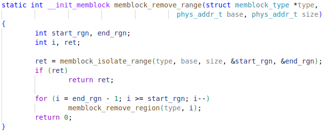


###### memblock_isolate_range


###### memblock_remove_region


#### memblock_remove


#### memblock_free_late


##### __memblock_free_late


## Page Frame Buddy System

ref: https://s3.shizhz.me/linux-mm/3.2-wu-li-nei-cun/3.2.4-buddy-system-huo-ban-xi-tong


Buddy System从 `zone` 中分配内存，zone 中使用一个数组来管理不同大小的Buddy，该字段定义如下：

```
/* file: include/linux/mmzone.h */

struct zone {
    /* free areas of different sizes */
    struct free_area free_area[MAX_ORDER];
}
```

`MAX_ORDER` 的值是 **11**，也就是说，Buddy System 一次能够分配的最大连续页面是 2^10=1024 个，即4M的连续内存。数组 `free_area` 每个索引 i 存放的就是大小为 2i 页面数量的分组，这样可以提升Buddy System分配内存时查找分组的效率。


数据结构 `free_area` 的定义如下：

```
/* file: include/linux/mmzone.h */

struct free_area {
    struct list_head free_list[MIGRATE_TYPES];
    unsigned long nr_free;
};
```

`free_area` 中的空闲分组按照 `MIGRATE_TYPES` 进行了分组，每种类型都保存在一个双向链表中，这里我们将关注点放在Buddy System算法的实现上，不展开讨论 `MIGRATE_TYPES`.


### struct pglist_data

On NUMA machines, each NUMA node would have a `struct pglist_data` to describe its memory layout (It falls back to only one `struct pglist_data node_data` for UMA machines).

```typedef struct pglist_data pg_data_t```


#### struct zone


##### struct per_cpu_pageset

`/* file: include/linux/mmzone.h */`


###### struct per_cpu_pages


##### struct free_area


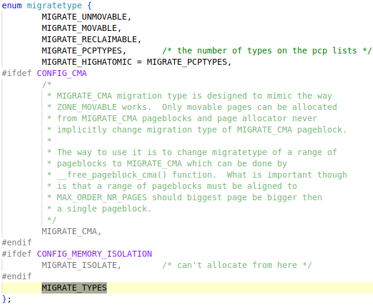


#### struct zonelist


##### struct zoneref


#### enum

Tricks to "macro" definition

##### MAX_NR_ZONES

`/* file: kernel/bounds.c */`


##### MAX_ZONELISTS


### free_reserved_area

Free the reserved areas to **buddy system**, after `memblock_free_all`.


`/* file: mm/page_alloc.c */`


#### free_reserved_page

`/* file: include/linux/mm.h */`


#### __free_page

`/* include/linux/gfp.h */`


## SLAB/SLUB/SLOB

ref: https://s3.shizhz.me/linux-mm/3.2-wu-li-nei-cun/3.2.5-slab-slub-slob


Buddy System进行连续内存页面的分配，但对于使用内存的程序而言，Buddy System 还存在如下问题：

- 粒度太大：Buddy System一次最少也要分配一页内存，通常情况下是4KB, 这对于程序而言还是太大了，我们需要一种更加细致的方式来对内存进行分配与释放。
- 缺乏语义：程序在使用内存时考虑的通常也不会是“物理内存页”这种底层概念，而是程序中定义的各种具备业务意义的数据结构与对象；不仅如此，对象的初始化与释放的逻辑有时比内存分配更加耗时。
- 效率偏低：Buddy System在分配与释放内存时会对Buddy进行拆分与合并，在频繁的内存申请与释放的场景下这将非常影响性能。

为了解决这些问题，内核基于Buddy System构建了一个“对象分配系统”，该系统叫着SLAB Allocator, SLAB以对象为基本单位进行分配与释放，并且为对象提供了缓存机制，从而一举解决了上述的各种问题。


**slab allocators**:

- SLAB (Slab Allocator)
- SLUB (**Unqueued** Slab Allocator)
- SLOB (Simple List of Blocks): as compact as possible


### struct kmem_cache

One `kmem_cache` for a type of slabs. 2 dimension array of `kmem_caches` for all slabs.


#### struct kmem_cache_cpu


#### struct kmem_cache_order_objects


##### oo_objects


#### struct kmem_cache_node


When the `page.flags` is set to slab, page.freelist is point to the **first free object** in a slab.

ref: https://s3.shizhz.me/linux-mm/3.2-wu-li-nei-cun/3.2.5-slab-slub-slob#org9a182bb

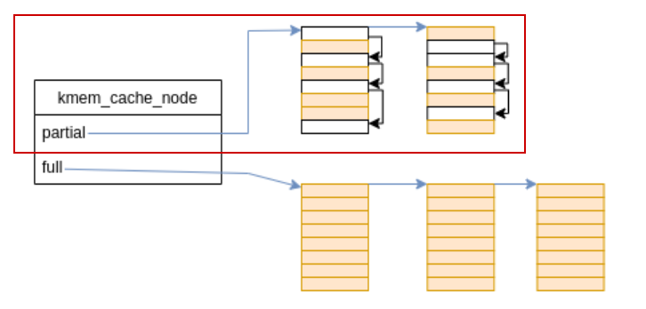


##### remove_partial

`/* file: mm/slub.c */`


##### add_partial


##### discard/free_slab


##### __free_slab


### slab_sysfs_init

This adds objects which display in VFS. Its path is `/sys/kernel/slab`. The VFS will be add in `initcall` stage.


`/* file: mm/slub.c */`


### slab_caches

`/* file: mm/slab_common.c */`


### kmem_cache_create

`/* file: mm/slab_common.c */`


`/* file: Documentation/core-api/memory-allocation.rst */`

This documentation explains the usage of **allocation functions** and setting **GFP flags**.


### kmem_cache_create_usercopy

`/* file: mm/slab_common.c */`


#### create_cache


### __kmem_cache_create

`/* file: mm/slub.c */`


#### kmem_cache_open

`/* file: mm/slub.c */`


##### init_kmem_cache_nodes

`/* file: mm/slub.c */`


###### early_kmem_cache_node_alloc

Before setting `slab_state` to PARTIAL, use the function to allocate the first slab.


###### init_kmem_cache_node


##### calculate_sizes

`/* file: mm/slub.c */`


##### calculate_order

`/* file: mm/slub.c */`


### kmem_cache_destory

`/* file: mm/slab_common.c */`


#### shutdown_cache


#### __kmem_cache_shutdown

`/* file: mm/slub.c */`


### kmem_cache_shrink

`/* file: mm/slab_common.c */`


### kmalloc_slab

`/* file: mm/slab_common.c */`


#### size_index table

`/* file: mm/slab_common.c */`


find last bit set

`/* file: include/asm-generic/bitops/builtin-fls.h */`


#### kmalloc_caches


`/* file: include/linux/slab.h */`


### kmalloc_index

There will be 14 slab sizes for 4K page system.

```c
#define PAGE_SHIFT 12
#define KMALLOC_SHIFT_HIGH (PAGE_SHIFT + 1) // 13
//[KMALLOC_SHIFT_HIGH + 1]					// 14
```


`/* file: include/linux/slab.h */`


`/* file: include/linux/slab.h */`


### kmalloc_type

`/* file: include/linux/slab.h */`


### kmem_cache_zalloc


### kmem_cache_alloc

Different slab allocators have different implementation. SLUB allocator is mostly used.

`/* file: slub.c */`


`/* file: mm/slab.c */`


`/* file: mm/slob.c */`


### kmem_cache_free

slub

`/* file: mm/slub.c */`


#### cache_from_obj

Check if the memory matches the kmem_cache.

`/* file: mm/slab.h */`

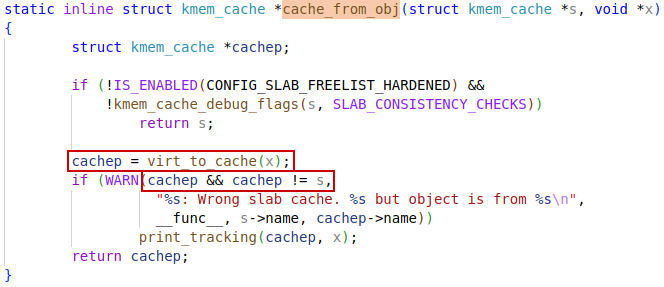


slab

`/* file: mm/slab.c */`


slob

`/* file: mm/slob.c */`


# slab_alloc

slab allocator implemenation

## slab

Implementation of slab allocator


### __do_cache_alloc


#### ____cache_alloc


#### cache_alloc_refill


#### alloc_block


#### slab_get_obj


### kasan_kmalloc


### __kasan_kmalloc


## slub

Implementation of slub allocator


### slab_alloc_node


### __slab_alloc


### ___slab_alloc


#### get_freelist


> [!WARNING]
>
> Why set `page->inuse` to `page->objects`? This means all objects are allocated out!
>
> A: When used by `kmem_cache_cpu`, the `page->freelist` will be set to `NULL`, while `c->freelist` is pointing to the **free slab list**. So, the `page->inuse` is reasonable to set to full.
>
> Also, `page->frozen` means this page is frozen by a CPU, then only that CPU can allocate slab objects from this slab.


`/* file: mm/slub.c */`


`page->objects` is the number of slabs in this "slab", `page->inuse` is the number of slabs allocated out by slab allocator. (A SLAB could be a page frame or a slab cache as a whole.)


##### __cmpxchg_double_slab


##### get_freepointer


##### set_freepointer


###### freelist_ptr


#### kmem_cache_debug

`/* file: mm/slub.c */`


`/* file: mm/slub.h */`


#### pfmemalloc_match

`/* file: mm/slub.c */`


#### deactivate_slab

Put the slab back to `kmem_cache_node` partial list.

`/* file: mm/slub.c */`


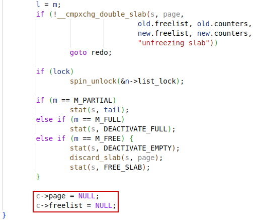


##### freelist_corrupted

`/* file: mm/slub.c */`


### new_slab_objects


#### get_partial

`/* file: mm/slub.c */`


##### get_partial_node


`/* file: include/linux/list.h */`


##### acquire_slab

`/* file: mm/slub.c */`


#### new_slab


#### allocate_slab


We are allocating slab for `kmem_cache_cpu`, so set `page->inuse` to full and set `page->fronzen` to 1 here.


##### **slab freelist**

ref: https://s3.shizhz.me/linux-mm/3.2-wu-li-nei-cun/3.2.5-slab-slub-slob#org9a182bb

`kmem_cache.offset` is the position in a free slab object, where the pointer to the next object is stored.


##### __SetPageSlab

Set page flags for `PG_slab`.

`/* file: include/linux/page-flags.h */`


`__PAGEFLAG(Slab, slab, PF_NO_TAIL)`


`void __SetPageSlab(struct page *page)`

`{ __set_bit(PG_slab, &PF_NO_TAIL(page, 1)->flags); }`


##### alloc_slab_page


###### alloc_pages

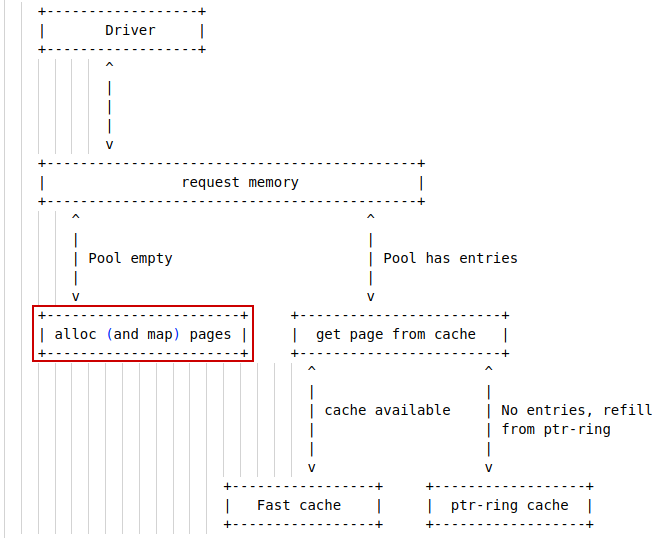


##### page_address

`/* file: include/linux/mm.h */`


###### virt pfn page

`/* file: arch/riscv/include/asm/page.h */`


`/* file: include/asm-generic/page.h */`

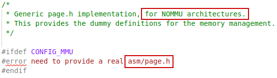

The definition below is for **NOMMU** arch:


##### setup_object


##### fixup_red_left


#### flush_slab


## slob

Actually the slab allocator for SLOB


### slob_new_pages

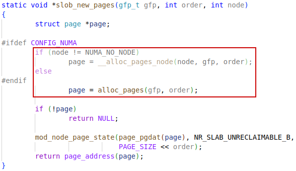


# slab_free

`/* file: mm/slub.c */`


## do_slab_free

`/* file: mm/slub.c */`


## __slab_free

Free to the per-cpu or per-node **partial list**, or free the slab if empty.

`/* file: mm/slub.c */`


# setup_arch

`/* file: arch/riscv/kernel/setup.c */`


## setup_bootmem

Add **kernel** and **device tree** to reserved region. The `memblock` is the **boot memory allocator**.

`/* file: arch/riscv/mm/init.c */`


# paging_init


## sparse_init

Only avail in SPARSEMEM model


### sparse_init_nid


#### *sparse_buffer_init

Allocate boot memory for struct `page`s for in **`mem_section`s**


#### __populate_section_memmap


##### sparse_buffer_alloc


###### sparse_buffer_free


#### sparse_init_one_section


## zone_sizes_init


### free_area_init


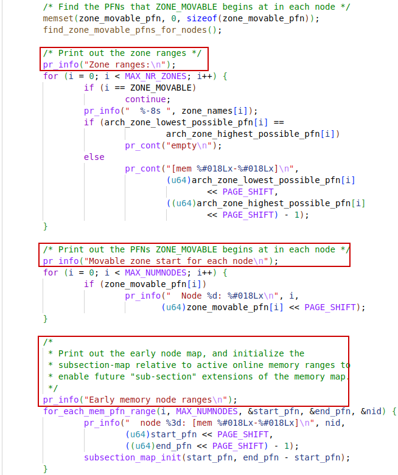


### free_area_init_node


#### *alloc_node_mem_map

`memblock_alloc_node` is to allocate space for **mem_map**


### free_area_init_core


#### zone_init_internals


#### zone_pcp_init

The per-cpu pageset will be filled only when **freeing order-0 pages** back to buddy system.

`/* file: mm/page_alloc.c */`


## resource_init


# mm_init


## mem_init


### memblock_free_all


#### reset_all_zones_managed_pages


##### reset_node_managed_pages


#### free_low_memory_core_early


##### reserve_bootmem_region

`/* file: mm/page_alloc.c */`


#### __free_memory_core


#### __free_pages_memory


##### memblock_free_pages


##### __free_pages_core


## kmem_cache_init

`/* file: mm/slub.c */`


### bootstrap

自举

Substitute a new one allocated from slab, i.e. from heap region, for the static `kmem_cache`.

`/* file: mm/slub.c */`


### create_kmalloc_caches

`/* file: mm/slab_common.c */`


#### new_kmalloc_cache

`/* file: mm/slab_common.c */`


#### kmalloc_info[]

`/* file: mm/slab_common.c */`


### create_kmalloc_cache

`/* file: mm/slab_common.c */`


#### create_boot_cache


### setup_kmalloc_cache_index_table

`/* file: mm/slab_common.c */`


## vmaloc_init

`/* file: mm/vmalloc.c */`


### vmap_init_free_space


#### insert_vmap_area_augment


#### augment_tree_propagate_from


### vm_area_register_early

`/* file: mm/vmalloc.c */`


#### vm_area_add_early


# setup_per_cpu_pageset

Called in `start_kernel()`, used to set up per-cpu pagesets in each buddy system **zone**.


## setup_zone_pageset

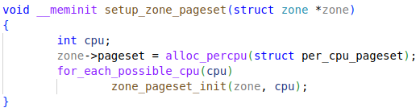


### zone_pageset_init


#### pageset_init


#### pageset_set_high_and_batch


# kmalloc

ref: https://s3.shizhz.me/linux-mm/3.2-wu-li-nei-cun/3.2.5-slab-slub-slob


`/* file: include/linux/slab.h */`


## kmalloc_large

`/* file: include/linux/slab.h */`


### KMALLOC_MAX_CACHE_SIZE

`(PAGE_SIZE*2)` is the biggest slab size.


### kmalloc_order

`/* file: mm/slab_common.c */`


## kmem_cache_alloc_trace

`/* file: include/linux/slab.h */`


# __kmalloc

Slab allocators have different implemenation.

## slab

Implementation of slab allocator

`/* file: mm/slab.c */`


### __do_kmalloc

`/* file: mm/slab.c */`


## slub

`/* file: mm/slub.c */`


### kmalloc_slab

Find the `kmem_cache` structure


## slob

Implementation of slob allocator

`/* file: mm/slob.c */`


### __do_kmalloc_node


# NUMA

## kmalloc_node

`/* file: include/linux/slab.h */`


## kmalloc_array_node

`/* file: include/linux/slab.h */`


### slab

Implementation in slab allocator


### __kmalloc_node


### __kmalloc_node_track_caller


### __do_kmalloc_node


### slub

`/* file: mm/slub.c */`

### __kmalloc_node


### __kmalloc_node_track_caller


# kzalloc

set memory to zero


# kcalloc


## kmalloc_array


# vmalloc


## __vmalloc_node

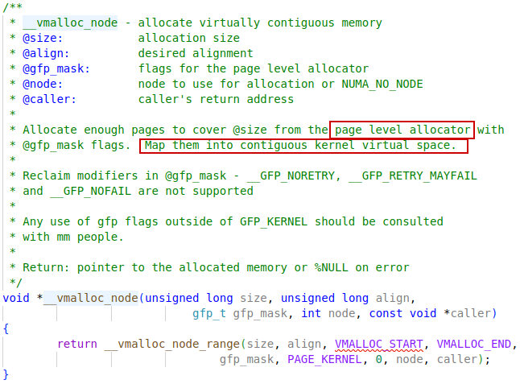


## __vmalloc_node_range


### __get_vm_area_node


#### alloc_vmap_area

`/* file: mm/vmalloc.c */`


#### __alloc_vmap_area

`/* file: mm/vmalloc.c */`


##### find_vmap_lowest_match


###### insert_vmap_area


##### adjust_va_to_fit_type

Adjust the free vmap area, as some space allocated.


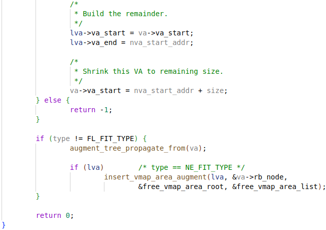


#### setup_vmalloc_vm

`/* file: mm/vmalloc.c */`


Get the `vmap_area_lock`.


### __vmalloc_area_node

Allocate physical pages for the vmap area allocated.

`/* file: mm/vmalloc.c */`


`/* file: include/linux/gfp.h */`


#### map_kernel_range

`/* file: mm/vmalloc.c */`


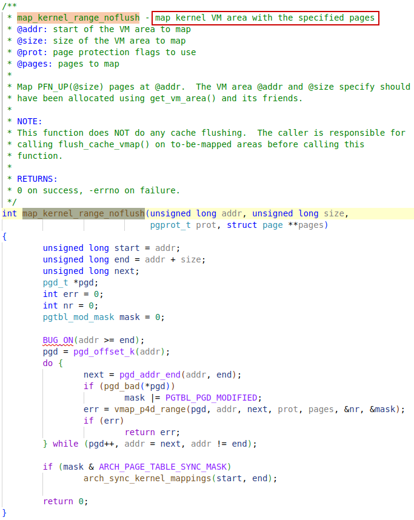


## vzalloc


## __vmalloc


# kvfree

Free the memory allocated with `kmalloc`, `vmalloc` and `kvmalloc`.

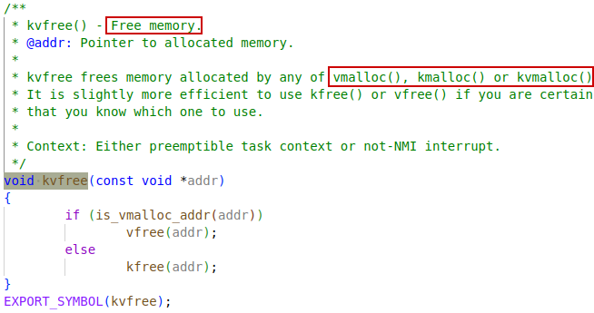


## kfree

### slab

`/* file: mm/slab.c */`


### slub

`/* file: mm/slub.c */`


### slob

`/* file: mm/slob.c */`


## vfree

`/* file: mm/vmalloc.c */`


##  __vfree


### __vfree_deferred


### __vunmap


#### free_vmap_area

`/* file: mm/vmalloc.c */`


# alloc_pages


## alloc_pages_node


## __alloc_pages_node


## __alloc_pages


#### struct alloc_context


## __alloc_pages_nodemask


### prepare_alloc_pages

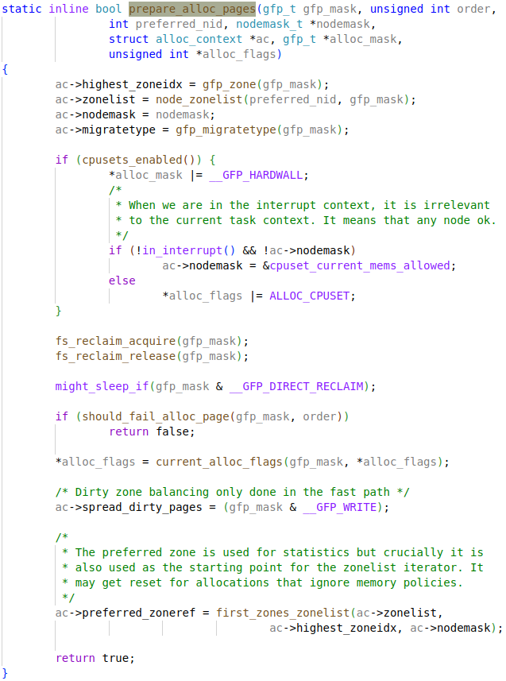


#### node_zonelist

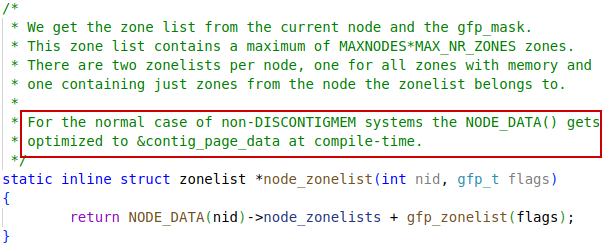


From v6.14 rc5

`/* file: mm/numa.c */` 


`/* file: include/linux/numa.h */`


### get_page_from_freelist


#### rmqueue


##### rmqueue_pcplist

For order-0 page only

`/* file: mm/page_alloc.c */`


##### __rmqueue_pcplist


#### __rmqueue

`/* file: mm/page_alloc.c */`


#### __rmqueue_smallest


##### get_page_from_free_area

`/* file: include/linux/mmzone.h */`


`/* file: include/linux/list.h */`


#### prep_new_page


### __alloc_pages_slowpath

`/* file: mm/page_alloc.c */`


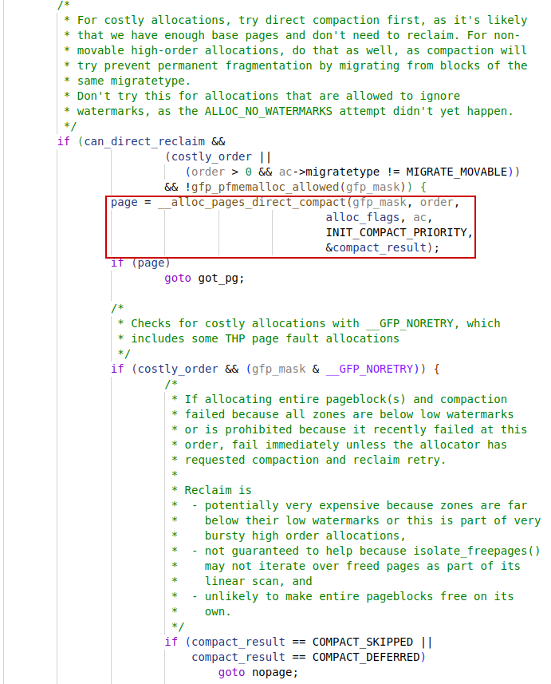


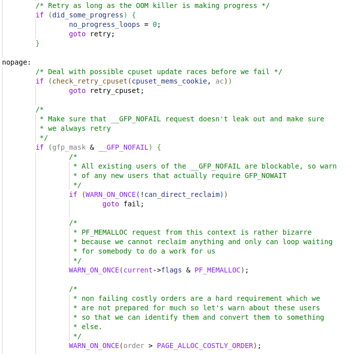


#### __alloc_pages_direct_reclaim


##### __perform_reclaim


##### try_to_free_pages

`/* file: mm/vmscan.c */`


##### do_try_to_free_pages


#### __alloc_pages_direct_compact


##### try_to_compact_pages


##### compact_zone_order

`/* file: mm/compaction.c */`


##### compact_zone


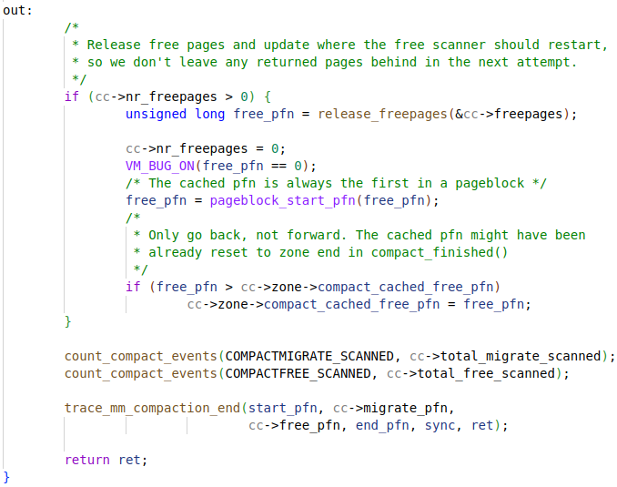


# free_pages

`/* file: mm/page_alloc.c /*`


## __free_pages

`/* file: mm/page_alloc.c /*`


### free_the_page

The order-0 page will be unrefereed to per-cpu pageset.

`/* file: mm/page_alloc.c /*`


#### free_unref_page

`/* file: mm/page_alloc.c /*`

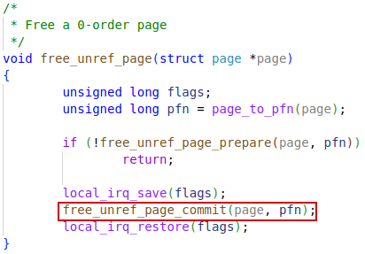


##### free_unref_page_commit


#### __free_pages_ok


##### free_one_page


##### __free_one_page


