---

---

2024年2月29日

# 设备总线驱动模型

ref: https://mp.weixin.qq.com/s?chksm=ce7a054cf90d8c5a91e2188d507dfb9bf4fa9405c7ce2aa1d027d42459d951b47dc7e7894e02&exptype=timeline_unsubscribed_oftenread_card&mid=2247498756&sn=c6483d3057d33e7f489086cb0e5d93b6&idx=1&__biz=Mzg2MzQzMjc0Mw%3D%3D&scene=169&subscene=90&sessionid=0&flutter_pos=3&clicktime=1728977800&enterid=1728977800&finder_biz_enter_id=5&ranksessionid=1728969653&ascene=56&fasttmpl_type=0&fasttmpl_fullversion=7429186-zh_CN-zip&fasttmpl_flag=0&realreporttime=1729143770399&devicetype=android-31&version=28003533&nettype=3gnet&abtest_cookie=AAACAA%3D%3D&lang=zh_CN&countrycode=CN&exportkey=n_ChQIAhIQnjFlQcu8dPujWJlge6E76xLiAQIE97dBBAEAAAAAAN2bIYUcUD4AAAAOpnltbLcz9gKNyK89dVj0YV3wY6N2vQiqRhl%2FksVXWGLnmN03UnZ3cuBVH1UXjUEhX0tkPFBbY8S56KQclVTEnSbcy0yibrzYFy%2BVgVRWhWQjY5wJemiU6Go3LrBgwSU9n%2BbNT4%2B5S3aAiCyNsTeCI3ffCk9KwtilDwp9fPuzbtd7cEezHVFdTYOvfLs94GQqH%2B9aftsEfAUA8Vgmrricy0CPOt%2BR9laXCyJ04lWK6P4suNczk6khPedIFPBDfmRnsfpoO69BVMZstT8%3D&pass_ticket=N6BhHeXA1w7jkT420JtuY0B1IvHCYDXzk5qH1%2F%2BKDp9UJ16j%2BPfL3v9%2Fx7i4lMlP&wx_header=3

简单来说，bus负责维护注册进来的device与driver，每注册进来一个device或者driver都会调用bus->match函数将device与driver进行配对，并将它们加入链表。如果配对成功，调用bus->probe或者driver->probe函数，调用kobject_uevent函数设置环境变量（通知用户空间），mdev进行创建设备节点等操作。

## 总线

总线(bus)是linux发展过程中抽象出来的一种设备模型，为了统一管理所有的设备，内核中每个设备都会被挂载在总线上，这个bus可以是对应硬件的bus(i2c bus、spi bus)、可以是虚拟bus(platform bus)。

bus将所有挂在上面的具体设备抽象成两部分，device_driver和device。

### buses_init

Get called in `driver_init()`


Register `bus` at root directory of `sysfs`:


Register `system` in `/sys/devices`: (`kset` means a directory in `sysfs`)


## driver与device

driver实现了同类型设备的驱动程序实现，而device则向系统注册具体的设备需要的资源，每当添加一个新的driver(device)到bus中时，都将调用bus的match函数，试图寻找匹配的device(driver)。

如果匹配成功，就调用probe函数，在probe函数中实现设备的初始化、各种配置以及生成用户空间的文件接口。

probe函数是总线在匹配成功时调用的函数，bus->probe和drv->probe中只会有一个起效，同时存在时使用bus->probe。

###  devices_init

Get called in `driver_init()`


Register `dev` at root directory and add `block` and `char` to it:


# platform mechanism的三个步骤

## 1.总线注册（platform_bus）

​	在内核初始过程中，会有一个驱动初始化的步骤（`driver_init`）。在这个步骤里会初始化platform_bus，先注册**总线设备**，再注册**总线类**。这个**总线设备**是挂载到`platform_bus`总线上的所有设备的**根设备**。

### do_basic_setup


### driver_init

This is to initialize **driver model**


### of_core_init

If `CONFIG_OF`, will add `devicetree` API in `/sys/firmware` in `sysfs`.


### platform_bus_init

Initialize **platform bus**


#### platform_bus

是`platform_bus`总线上的设备的**根设备**，`platform_bus`是虚拟总线。由于linux设备和驱动通常都需要挂接到一种总线上，比较常见的总线有USB，PCIe总线等。而SoC系统中集成的MMIO外设却不依附与此类总线，因此在v2.6内核加入的platform虚拟总线。

platform机制将设备本身的资源注册进内核，由内核统一管理，在驱动程序使用这些资源时使用统一的接口，这样提高了程序的可移植性。


#### platform_bus_type

`platform_bus`总线本身，**总线类**


#### bus_type

`/* file: include/linux/device */`


### bus_register


Register for a bus, i.e., platform bus:


Buses are used to attach device and driver to each other.


#### klist_init


#### klist_devices_get/put


### device_register

Seems this way of register devices is used by bus device registeration more.


## 2.添加设备（platform_device）

​	platform_bus总线是一个虚拟总线，它跟**device tree**相呼应的。device tree最早应用于**OpenFirmware**项目中，因此在内核代码中设备树相关的函数都是以**of_***开头的。

### init_call: 

See the `initcalls` section for more details about how it works.

### of_platform_default_populate_init


#### for_each_matching_node


##### of_find_matching_node


##### __of_match_node


##### reserved_mem_matches

Match table for nodes in `/reserved-memory` node


#### of_platform_default_populate


of_default_bus_match_table:


根据**device tree**中*soc节点*的compatible属性**"simple-bus"**，*soc节点*及其子节点设备将会被添加到系统中。


#### of_platform_populate

**populate函数**与`of_platform_bus_probe`函数功能相似，新设备推荐使用populate函数。


##### for_each_child_of_node

遍历parent节点的所有child节点，并每一次返回child节点


#### of_platform_bus_create


根据`of_match_node`函数，当匹配到soc这一级时，它将会返回匹配到的"simple_bus"指针，即非0值。而一般情况下of_platform_device_create_pdata也将会返回dev指针。因此，此时将进行后边的迭代。

假设当前设备是一个**总线设备**，遍历它的子节点，然后迭代当前函数的操作直到`child`为`NULL`。


##### struct platform_object


##### struct platform_device


##### struct resource


##### struct device


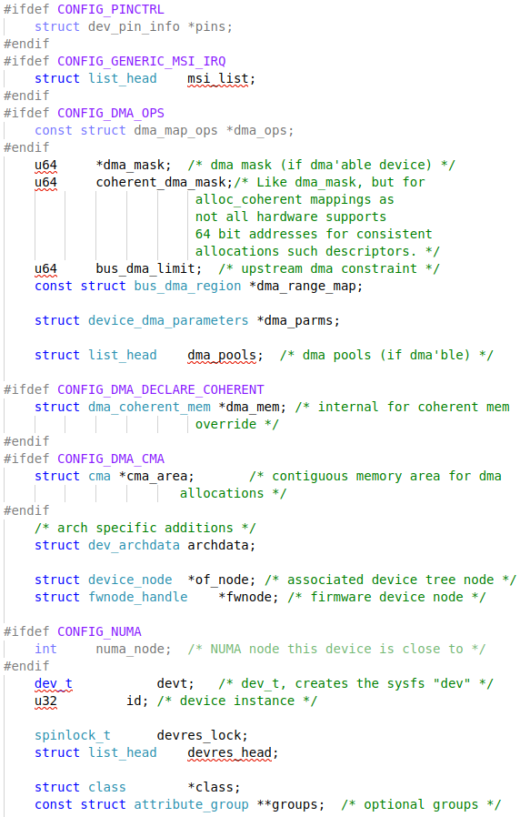


##### of_match_node


#### of_platform_device_create


#### of_platform_device_create_pdata

为设备树节点分配`platform_device`结构体，并从相应节点中读取信息填写到结构体中。


##### of_device_alloc

分配`platform_device`对象时，为配置好从fdt获得的**resource和其它信息**。


###### platform_device_alloc

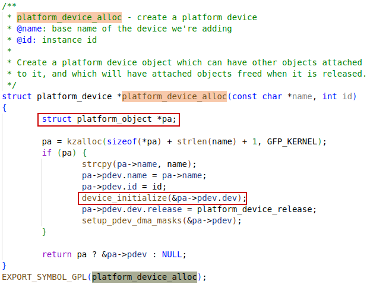


###### of_address_to_resource

Translate device tree address and return as `resource`, will **return 0** in a success translation.

See more details in `51_device_tree.md`


###### of_irq_to_resource_table

Fill in resource table with node's IRQ info, will return **number of IRQs** in the table.

See more details in `51_device_tree.md`


##### of_msi_configure


###### of_msi_get_domain


##### of_device_add


###### of_node_to_nid


### device_add


#### device_private_init


#### bus_add_device

最后设备被添加到了`platform_bus`总线上


##### sysfs_create_link

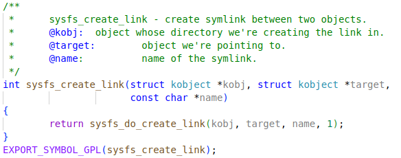


##### klist_add_tail

将node添加到klist末尾，然后在**注册驱动**阶段，进行probe时从`bus_for_each_dev`中会被取出来


#### bus_probe_device


##### device_initial_probe


##### __device_attach


##### bus_for_each_drv


##### __device_attach_driver


##### driver_probe_device

`driver_probe_device` is also called during driver registration.


### module_init(deviceX_init)


用于**非fdt设置**的设备，处理fdt中配置的设备都会以**of_*开头**的函数。这种传统的非fdt的方式下，设备的注册与设备驱动的注册一般放在一个module中完成。新的设备驱动不推荐再使用这种方法，应该通过设备树来描述设备信息的方式添加设备。**通过设备信息和驱动的分离，设备驱动就可以对应于操作逻辑相同的外设，即使外设挂到了不同的主机上。**进一步地，**操作逻辑相似的设备都可以抽象成同一个驱动**，然后不同的部分通过设备树描述，然后在驱动probe设备时采取不同的操作。

#### platform_add_devices

使用此函数时，设备的驱动程序直接在`platform_device`结构体中添加**设备描述信息**。相对应地，**OF函数**从设备树中获得这些设备描述信息。


#### platform_device_register


#### platform_device_add


## 3.驱动注册（platform_driver）

注册驱动过程中，会将driver添加到相匹配的bus上。在添加driver到bus上的过程中，会根据bus的autoprobe的配置，尝试与**注册到bus上的设备**进行匹配，并在probe成功后**将device和driver绑定到一起**。

### initcall: 

See the `initcalls` section for more details about how it works.

### module_platform_driver()


**驱动注册**步骤，在此之前还有**总线注册**，**添加设备**等步骤。


可变参数列表： `...` 与 `__VA_ARGS__` 相对应，在`...`为空时 `##` 会删除之前的逗号。

因此，以上宏会展开为：

```c
axienet_driver_init(void)
{
	return platform_driver_register( &(axienet_driver));
}
module_init(axienet_driver_init);
```


```__initcall(axienet_driver_init);```


**initcall**在`rest_init` -> `kernel_init` -> `kernel_init_freeable` -> `do_basic_setup`中被调用。因此，initcall是在线程1中完成的，它可能会fork新的线程。

#### platform_driver_register


#### driver_register


#### bus_add_driver


#### driver_attach


##### __driver_attach


##### bus_for_each_dev

**添加设备**阶段，最终通过`bus_add_device`，把相应的`struct device *dev`注册到`klist_iter`中。然后，在**驱动注册**阶段，调用到以下函数时，就从链表中找到与驱动匹配的设备，然后进行绑定。


##### next_device


#### device_driver_attach


#### driver_probe_device


##### really_probe


`really_probe`中，调用了`device_driver.probe`方法，进而调用`platform_driver.probe`方法。

#### platform_drv_probe

在`platform_driver_register`函数中，将`platform_drv_probe`注册给了`device_driver.probe`，因此`really_probe`函数中`drv->proble`就指向了这个函数。

在这里，将`device`和`driver`转换为它们的container，即`platform_driver`和`platform_device`，然后进行**platform_driver.probe**


最终调用了`platform_driver.probe`函数。对于每一个**platform device驱动**（**soc设备**使用paltform虚拟总线），都会有一个`platform_driver`的结构体，一般这个结构体都会有一个**probe**成员。因此在驱动注册过程中，最终会调用到这个**proble**函数。

### struct platform_driver

This is actually platform device driver


#### device_driver

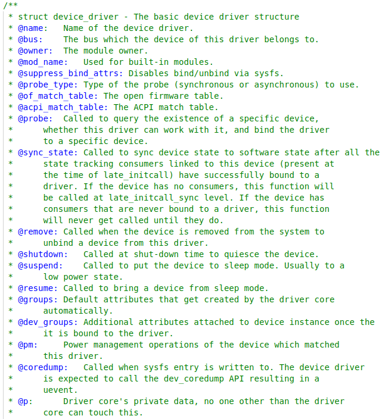


#### driver_model


# initcalls

initcall在`rest_init` -> `kernel_init` -> `kernel_init_freeable` -> `do_basic_setup`中被调用。因此，initcall是在线程PID1中完成的，它可能会fork新的线程，也可能会被调度。

## do_basic_setup


## initcall


## initcall: serial8250_init

This doesn't really follow the `platform_driver` registration course.

This `initcall` is special. It is for non-fdt serial devices. What are its other purposes? 


This `serial8250_init` is always done, as it's in the serial core file `8250_core.c`.


### serial8250_isa_init_ports


#### serial8250_init_port

All the `uart_8250_port.uart_port.ops` will be set to `serial8250_pops`.


#### serial8250_set_defaults


##### set_io_from_upio

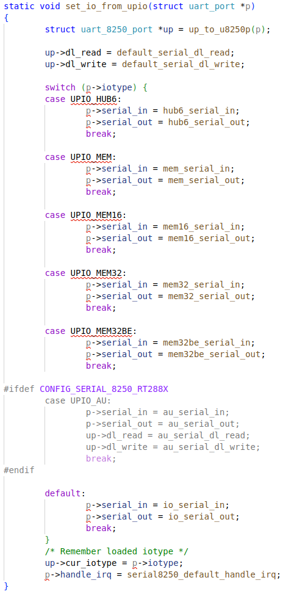

#### uart_ops: serial8250_pops


##### .release_port


#### serial8250_isa_config

`serial8250_isa_config` is empty.


### serial8250_reg


### serial8250_register_ports


### serial8250_isa_driver


#### .probe


##### `struct` plat_serial8250_port


# device resource management


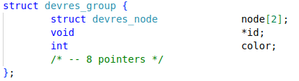

## GPIO


### devm_gpiod_get_array_optional


### devm_gpiod_get_array

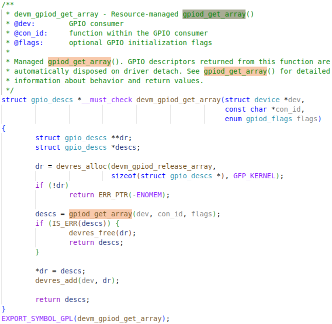


## devres_find


### find_dr


## devres_alloc


### devres_alloc_node


#### alloc_dr


## devres_add


### add_dr


## devm_kzalloc


## devm_kcalloc


### devm_kmalloc_array


### devm_kmalloc


#### alloc_dr


#### kmalloc_node_track_caller


#### __kmalloc_track_caller


#### __do_kmalloc


# Device links


## initcall:

## devlink_class_init


## device_links_supplier_sync_state_pause


## fw_devlink_pause


## fw_devlink_resume


****

# UART drivers

## dw8250


### dw8250_platform_driver

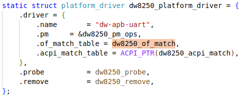


### dw8250_probe


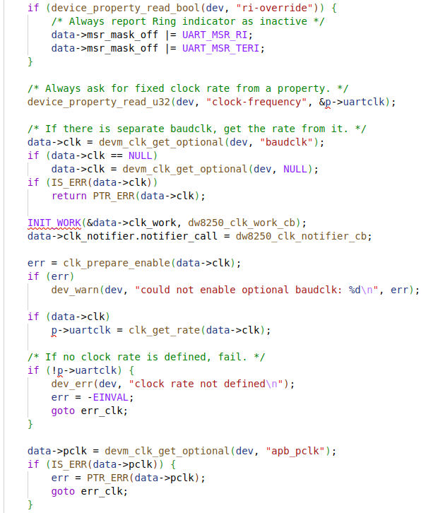


#### dw8250_quirks

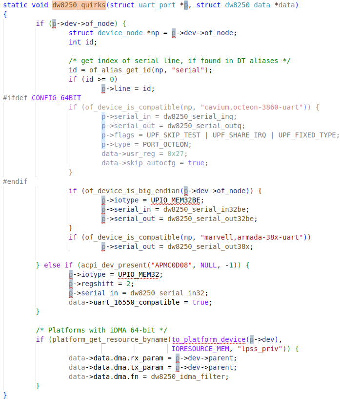

#### dw8250_setup_port


#### serial8250_register_8250_port

This is a main function for registering a serial port. See 8250 port section for more details.

## 8250

Here is how the driver will probe devices matched.

### of_platform_serial_driver


In the process of registering drivers, the `probe` function will be called to attach the driver to a device.

### of_platform_serial_probe


#### serial8250_register_8250_port

This function is used to register a serial port line for probed device, while allocating a `uart_8250_port` to it from the port line in `serial8250_ports[]` array. See 8250 port section for more detials.

### of_platform_serial_setup

```c
/*
 * Fill a struct uart_port for a given device node
 */
static int of_platform_serial_setup(struct platform_device *ofdev,
			int type, struct uart_8250_port *up,
			struct of_serial_info *info)
{
	struct resource resource;
	struct device_node *np = ofdev->dev.of_node;
	struct uart_port *port = &up->port;
	u32 clk, spd, prop;
	int ret, irq;

	memset(port, 0, sizeof *port);

	pm_runtime_enable(&ofdev->dev);
	pm_runtime_get_sync(&ofdev->dev);

	if (of_property_read_u32(np, "clock-frequency", &clk)) {

		/* Get clk rate through clk driver if present */
		info->clk = devm_clk_get(&ofdev->dev, NULL);
		if (IS_ERR(info->clk)) {
			ret = PTR_ERR(info->clk);
			if (ret != -EPROBE_DEFER)
				dev_warn(&ofdev->dev,
					 "failed to get clock: %d\n", ret);
			goto err_pmruntime;
		}

		ret = clk_prepare_enable(info->clk);
		if (ret < 0)
			goto err_pmruntime;

		clk = clk_get_rate(info->clk);
	}
	/* If current-speed was set, then try not to change it. */
	if (of_property_read_u32(np, "current-speed", &spd) == 0)
		port->custom_divisor = clk / (16 * spd);

	ret = of_address_to_resource(np, 0, &resource);
	if (ret) {
		dev_warn(&ofdev->dev, "invalid address\n");
		goto err_unprepare;
	}

	port->flags = UPF_SHARE_IRQ | UPF_BOOT_AUTOCONF | UPF_FIXED_PORT |
				  UPF_FIXED_TYPE;
	spin_lock_init(&port->lock);

	if (resource_type(&resource) == IORESOURCE_IO) {
		port->iotype = UPIO_PORT;
		port->iobase = resource.start;
	} else {
		port->mapbase = resource.start;
		port->mapsize = resource_size(&resource);

		/* Check for shifted address mapping */
		if (of_property_read_u32(np, "reg-offset", &prop) == 0)
			port->mapbase += prop;

		port->iotype = UPIO_MEM;
		if (of_property_read_u32(np, "reg-io-width", &prop) == 0) {
			switch (prop) {
			case 1:
				port->iotype = UPIO_MEM;
				break;
			case 2:
				port->iotype = UPIO_MEM16;
				break;
			case 4:
				port->iotype = of_device_is_big_endian(np) ?
					       UPIO_MEM32BE : UPIO_MEM32;
				break;
			default:
				dev_warn(&ofdev->dev, "unsupported reg-io-width (%d)\n",
					 prop);
				ret = -EINVAL;
				goto err_unprepare;
			}
		}
		port->flags |= UPF_IOREMAP;
	}

	/* Compatibility with the deprecated pxa driver and 8250_pxa drivers. */
	if (of_device_is_compatible(np, "mrvl,mmp-uart"))
		port->regshift = 2;

	/* Check for registers offset within the devices address range */
	if (of_property_read_u32(np, "reg-shift", &prop) == 0)
		port->regshift = prop;

	/* Check for fifo size */
	if (of_property_read_u32(np, "fifo-size", &prop) == 0)
		port->fifosize = prop;

	/* Check for a fixed line number */
	ret = of_alias_get_id(np, "serial");
	if (ret >= 0)
		port->line = ret;

	irq = of_irq_get(np, 0);
	if (irq < 0) {
		if (irq == -EPROBE_DEFER) {
			ret = -EPROBE_DEFER;
			goto err_unprepare;
		}
		/* IRQ support not mandatory */
		irq = 0;
	}

	port->irq = irq;

	info->rst = devm_reset_control_get_optional_shared(&ofdev->dev, NULL);
	if (IS_ERR(info->rst)) {
		ret = PTR_ERR(info->rst);
		goto err_unprepare;
	}

	ret = reset_control_deassert(info->rst);
	if (ret)
		goto err_unprepare;

	port->type = type;
	port->uartclk = clk;

	if (of_property_read_bool(np, "no-loopback-test"))
		port->flags |= UPF_SKIP_TEST;

	port->dev = &ofdev->dev;
	port->rs485_config = serial8250_em485_config;
	up->rs485_start_tx = serial8250_em485_start_tx;
	up->rs485_stop_tx = serial8250_em485_stop_tx;

	switch (type) {
	case PORT_RT2880:
		port->iotype = UPIO_AU;
		break;
	}

	if (IS_ENABLED(CONFIG_SERIAL_8250_FSL) &&
	    (of_device_is_compatible(np, "fsl,ns16550") ||
	     of_device_is_compatible(np, "fsl,16550-FIFO64"))) {
		port->handle_irq = fsl8250_handle_irq;
		port->has_sysrq = IS_ENABLED(CONFIG_SERIAL_8250_CONSOLE);
	}

	return 0;
err_unprepare:
	clk_disable_unprepare(info->clk);
err_pmruntime:
	pm_runtime_put_sync(&ofdev->dev);
	pm_runtime_disable(&ofdev->dev);
	return ret;
}
```


### platform_set_drvdata


# 8250 port


The `UART_NR` should be able to cover total number of serial lines in the system, if they occupy one `serial8250_port` each.

### `struct` uart_8250_port


### `struct` uart_port


## serial8250_register_8250_port


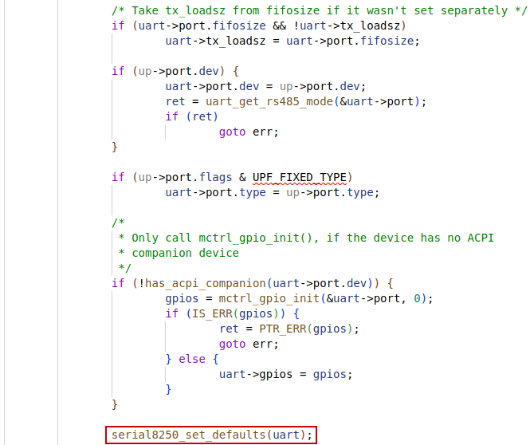


### serial8250_find_match_or_unused


#### serial8250_ports[]


The `serial8250_ports[]` array is holding port line resources for each port entry. It is initailzed by `serial8250_isa_init_ports` in `initcall` `serial8250_init`. See `initcalls` section for more details.

#### uart_match_port


### uart_remove_one_port

This is roughly the reverse of `uart_add_one_port`.


### serial8250_set_defaults


#### set_io_from_upio


### serial8250_isa_config

`serial8250_isa_config` is empty.


### uart_add_one_port

This is roughly the reverse of `uart_remove_one_port`.


#### uart_configure_port

`port->type` is not right, in this case. (When making dw8250 extension on spike)

Here is requring the `UPF_FIXED_TYPE` flag. If not, the `port->type` will be set to `PORT_UNKNOWN`, which prevents registering a console over dw8250.


##### serial8250_config_port


###### uart_report_port


#### register_console


#### unregister_console


#### serial8250_reg

This `uart_driver` will be attached to the `uart_port` of a `uart_8250_port` : `uart->port`.


# 如何写一个platform驱动？

ref: https://blog.51cto.com/u_8475449/5769668

