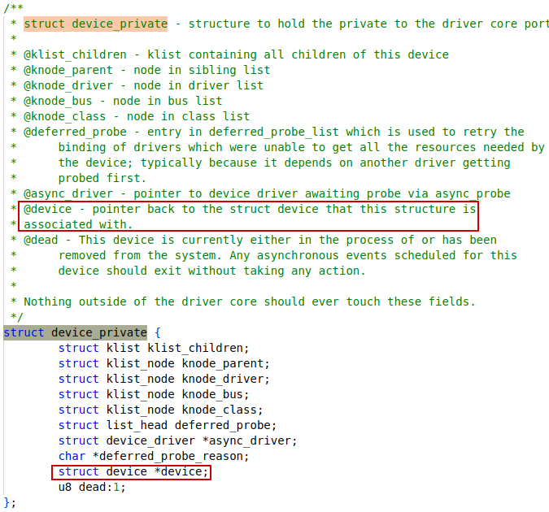
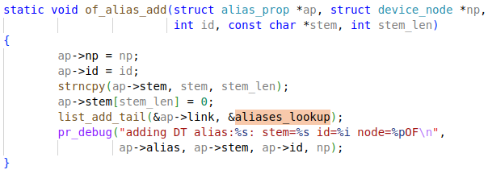
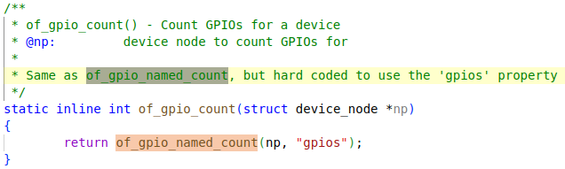
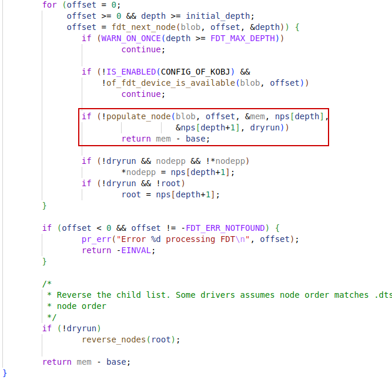
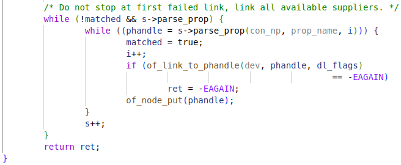

# struct device

## device_private

## platform_device

### resource

# struct device_node

The `.of_node` member in `struct device`

## of_node_get

## of_find_node_by_path

### of_find_node_opts_by_path

### of_root

### __of_find_node_by_full_path

### __of_find_node_by_path

## of_get_next_available_child

## of_address_to_resource

### of_get_address

### __of_address_to_resource

## of_irq_to_resource_tables

### of_irq_to_resource

### of_irq_get

## of_property_read_bool

# of_find_node_by_phandle

## of_phandle_cache_hash

# of_alias_scan

In device tree `aliases` node, the alias names are comprised of stem name and id.

## of_alias_add

# of_property_read_u32

## of_property_read_u32_array

## of_property_read_variable_u32_array

If there are errors in `of_find_property_value_of_size`, the `out_values` will be left untouched, which is presumablly having a default value of zero.

## of_find_property_value_of_size

### -EINVAL

If the pointer is NULL, `ERR_PTR(-22)` will be returned

### ERR_PTR

# of_get_property

# of_find_property

## __of_find_property

## of_prop_cmp

# of_parse_phandle*

## of_parse_phandle

## of_parse_phandle_with_args

## of_parse_phandle_with_args_map

`stem_name` = "gpio" makes `cells_name` = "#gpio-cells", which is set to `2` in device tree.

## of_parse_phandle_with_fixed_args

### __of_parse_phandle_with_args

### of_for_each_phandle

#### of_phandle_iterator_init

#### of_phandle_iterator_next

### of_phandle_iterator_args

## struct of_phandle_iterator

### phandle

It's actually a pointer to nodes.

# gpiod_get_array

# of_gpio_count

## of_gpio_named_count

## of_count_phandle_with_args

****

# of_core_init

## unflatten_device_tree

## __unflatten_device_tree

### unflatten_dt_nodes

### populate_node

#### unflatten_dt_alloc

#### of_node_init

#### populate_properties

# struct fwnode_handle

The `.fwnode` member in `struct device`

## fwnode_operations

# of_fwnode_ops

## .get_next_child_node

## .get_named_child_node

## .get_reference_args

### fwnode_property_get_reference_args

### fwnode_find_reference

### fwnode_devcon_match

### fwnode_connection_find_match

### device_connection_find_match

## .device_get_match_data

### of_device_get_match_data

## .add_links

### of_fwnode_add_links

### of_link_to_suppliers

### of_link_property

expand to:

parse_gpio()

parse_gpios()

### parse_suffix_prop_cells

#### of_parse_phandle_with_args

See more details in `of_parse_phandle*` section.

