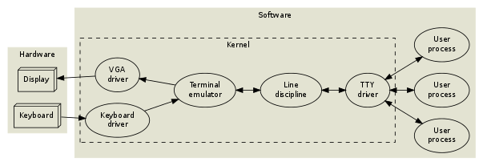
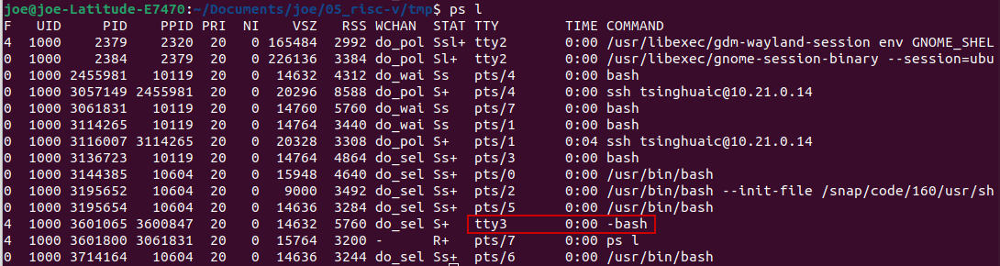
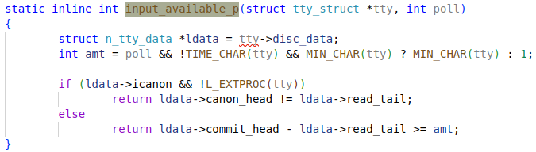
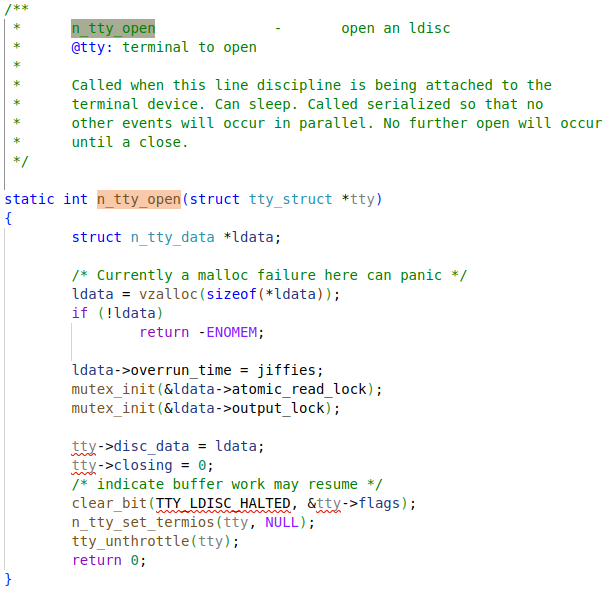
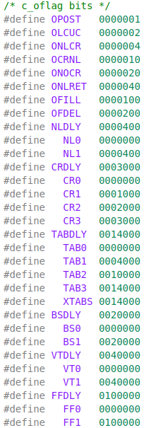
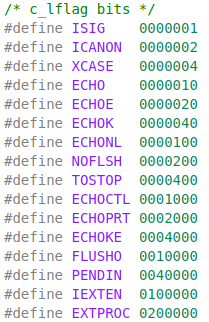

Apr9 2024

# Terminals

A computer terminal is an electronic or electromechanical hardware device that can be used for entering data into, and transcribing data from, a computer or computer system.

Terminals are successor of *punched cards* or *paper tape* in computer system.

A text terminal, or often just terminal (sometimes *text console*) is a serial computer interface for text entry and display. It was widely used with time sharing computers before the advent of PC era. 

Modern computers have a built-in keyboard and display for the console. Some Unix-like operating systems such as Linux and FreeBSD have **virtual consoles** to provide several text **terminals** on a single computer.(emulated video terminals)

ref: [The TTY demystified](http://www.linusakesson.net/programming/tty/)

## terminal history

The name was historically from **teletypewriter** used as early user terminal connecting to computers. The name **tele**typewriter was then originated from **tele**graphy, which had the same way of using paper tape reader and punch for input/output interface. 

### teletypewriter

*Teletype Model 33*


*IBM 2741 printing terminal*


### VDU terminals

character-mode terminals of VDUs(Video Display Units) replacing teletype machines by teletype emulation

*IBM 2260*


The next generation of VDUs went beyond teletype emulation with an addressable cursor that gave them the ability to paint two-dimensional displays on the screen. The classic era of the VDU began in the early 1970s and was closely intertwined with the rise of time sharing computers. These devices used no complicated CPU, instead relying on individual logic gates, LSI chips, or microprocessors such as the intel 8080. This made them inexpensive and they quickly became extremely popular input/output devices on many types of computer system, often replacing earlier and more expensive printing terminals.

The experimental era of serial VDUs culminated with the VT100 in 1978. By the early 1980s, there were dozens of manufactures of terminals, including Lear-Siegler, ADDS, Data General, DEC, Hzeltine Corporation, Heath/Zenith, Hewlett-Packard, IBM, TeleVideo, Volker-Craig, and Wyse, many of which had incompatible **command sequences** (although many used the early ADM-3 as a starting point).

The great variations in the control codes between makers gave rise to software that identified and grouped terminal types so the system software would correctly display input forms using the appropriate control codes; In Unix-like systems the **termcap** or **terminfo** files, the **stty utility**, and the **TERM** environment variable would be used.

### *VT100*


## virtual console vs console

A virtual console is a software implementation that simulates a **physical console or terminal** device.

A traditional console typically refers to a physical terminal device with a keyboard and monitor for input/output. A virtual console, on the other hand, is a software emulation of such a device.

**Historical Context**: Virtual consoles evolved from a time when Unix systems were large computers connected to multiple **physical** "dumb" **terminals**. The virtual console concept allowed a single computer to simulate multiple terminals.

So, physical terminal is a ancient piece of hardware, while modern computers using terminal emulators to fulfill that role.

- punched card or paper tape: physical terminal
- teletype writer: physical terminal
- VDU terminal / virtual terminal: physical terminal
- virtual console: simulated terminal on a computer, still has the name of `ttyN`
- When moving the terminal emulation into userland, it is called pseudo terminal

# TTY device

**TTY device** will be initialized as <u>char device</u> and then accessed through corresponding <u>file operations</u>.

A particular triplet of UART driver, line discipline instance and TTY driver may be referred as a `TTY device`, or sometimes just TTY.

## `fs_initcall`: `chr_dev_init`


### tty_init

Initialize TTY devices with `file_operations`.


#### tty_cdev


#### MKDEV


### cdev_init


### cdev_add


## tty_fops / console_fops

`file_operations` will be called from **VFS** layer.


### tty_read

```c
/**
 *	tty_read	-	read method for tty device files
 *	@file: pointer to tty file
 *	@buf: user buffer
 *	@count: size of user buffer
 *	@ppos: unused
 *
 *	Perform the read system call function on this terminal device. Checks
 *	for hung up devices before calling the line discipline method.
 *
 *	Locking:
 *		Locks the line discipline internally while needed. Multiple
 *	read calls may be outstanding in parallel.
 */

static ssize_t tty_read(struct file *file, char __user *buf, size_t count,
			loff_t *ppos)
{
	int i;
	struct inode *inode = file_inode(file);
	struct tty_struct *tty = file_tty(file);
	struct tty_ldisc *ld;

	if (tty_paranoia_check(tty, inode, "tty_read"))
		return -EIO;
	if (!tty || tty_io_error(tty))
		return -EIO;

	/* We want to wait for the line discipline to sort out in this
	   situation */
	ld = tty_ldisc_ref_wait(tty);
	if (!ld)
		return hung_up_tty_read(file, buf, count, ppos);
	if (ld->ops->read)
		i = ld->ops->read(tty, file, buf, count);
	else
		i = -EIO;
	tty_ldisc_deref(ld);

	if (i > 0)
		tty_update_time(&inode->i_atime);

	return i;
}
```


### tty_write

```c
/**
 *	tty_write		-	write method for tty device file
 *	@file: tty file pointer
 *	@buf: user data to write
 *	@count: bytes to write
 *	@ppos: unused
 *
 *	Write data to a tty device via the line discipline.
 *
 *	Locking:
 *		Locks the line discipline as required
 *		Writes to the tty driver are serialized by the atomic_write_lock
 *	and are then processed in chunks to the device. The line discipline
 *	write method will not be invoked in parallel for each device.
 */

static ssize_t tty_write(struct file *file, const char __user *buf,
						size_t count, loff_t *ppos)
{
	struct tty_struct *tty = file_tty(file);
 	struct tty_ldisc *ld;
	ssize_t ret;

	if (tty_paranoia_check(tty, file_inode(file), "tty_write"))
		return -EIO;
	if (!tty || !tty->ops->write ||	tty_io_error(tty))
			return -EIO;
	/* Short term debug to catch buggy drivers */
	if (tty->ops->write_room == NULL)
		tty_err(tty, "missing write_room method\n");
	ld = tty_ldisc_ref_wait(tty);
	if (!ld)
		return hung_up_tty_write(file, buf, count, ppos);
	if (!ld->ops->write)
		ret = -EIO;
	else
		ret = do_tty_write(ld->ops->write, tty, file, buf, count);
	tty_ldisc_deref(ld);
	return ret;
}
```


#### do_tty_write

```c
/*
 * Split writes up in sane blocksizes to avoid
 * denial-of-service type attacks
 */
static inline ssize_t do_tty_write(
	ssize_t (*write)(struct tty_struct *, struct file *, const unsigned char *, size_t),
	struct tty_struct *tty,
	struct file *file,
	const char __user *buf,
	size_t count)
{
	ssize_t ret, written = 0;
	unsigned int chunk;

	ret = tty_write_lock(tty, file->f_flags & O_NDELAY);
	if (ret < 0)
		return ret;

	/*
	 * We chunk up writes into a temporary buffer. This
	 * simplifies low-level drivers immensely, since they
	 * don't have locking issues and user mode accesses.
	 *
	 * But if TTY_NO_WRITE_SPLIT is set, we should use a
	 * big chunk-size..
	 *
	 * The default chunk-size is 2kB, because the NTTY
	 * layer has problems with bigger chunks. It will
	 * claim to be able to handle more characters than
	 * it actually does.
	 *
	 * FIXME: This can probably go away now except that 64K chunks
	 * are too likely to fail unless switched to vmalloc...
	 */
	chunk = 2048;
	if (test_bit(TTY_NO_WRITE_SPLIT, &tty->flags))
		chunk = 65536;
	if (count < chunk)
		chunk = count;

	/* write_buf/write_cnt is protected by the atomic_write_lock mutex */
	if (tty->write_cnt < chunk) {
		unsigned char *buf_chunk;

		if (chunk < 1024)
			chunk = 1024;

		buf_chunk = kmalloc(chunk, GFP_KERNEL);
		if (!buf_chunk) {
			ret = -ENOMEM;
			goto out;
		}
		kfree(tty->write_buf);
		tty->write_cnt = chunk;
		tty->write_buf = buf_chunk;
	}

	/* Do the write .. */
	for (;;) {
		size_t size = count;
		if (size > chunk)
			size = chunk;
		ret = -EFAULT;
		if (copy_from_user(tty->write_buf, buf, size))
			break;
		ret = write(tty, file, tty->write_buf, size);
		if (ret <= 0)
			break;
		written += ret;
		buf += ret;
		count -= ret;
		if (!count)
			break;
		ret = -ERESTARTSYS;
		if (signal_pending(current))
			break;
		cond_resched();
	}
	if (written) {
		tty_update_time(&file_inode(file)->i_mtime);
		ret = written;
	}
out:
	tty_write_unlock(tty);
	return ret;
}
```

### tty_open

```c
/**
 *	tty_open		-	open a tty device
 *	@inode: inode of device file
 *	@filp: file pointer to tty
 *
 *	tty_open and tty_release keep up the tty count that contains the
 *	number of opens done on a tty. We cannot use the inode-count, as
 *	different inodes might point to the same tty.
 *
 *	Open-counting is needed for pty masters, as well as for keeping
 *	track of serial lines: DTR is dropped when the last close happens.
 *	(This is not done solely through tty->count, now.  - Ted 1/27/92)
 *
 *	The termios state of a pty is reset on first open so that
 *	settings don't persist across reuse.
 *
 *	Locking: tty_mutex protects tty, tty_lookup_driver and tty_init_dev.
 *		 tty->count should protect the rest.
 *		 ->siglock protects ->signal/->sighand
 *
 *	Note: the tty_unlock/lock cases without a ref are only safe due to
 *	tty_mutex
 */

static int tty_open(struct inode *inode, struct file *filp)
{
	struct tty_struct *tty;
	int noctty, retval;
	dev_t device = inode->i_rdev;
	unsigned saved_flags = filp->f_flags;

	nonseekable_open(inode, filp);

retry_open:
	retval = tty_alloc_file(filp);
	if (retval)
		return -ENOMEM;

	tty = tty_open_current_tty(device, filp);
	if (!tty)
		tty = tty_open_by_driver(device, filp);

	if (IS_ERR(tty)) {
		tty_free_file(filp);
		retval = PTR_ERR(tty);
		if (retval != -EAGAIN || signal_pending(current))
			return retval;
		schedule();
		goto retry_open;
	}

	tty_add_file(tty, filp);

	check_tty_count(tty, __func__);
	tty_debug_hangup(tty, "opening (count=%d)\n", tty->count);

	if (tty->ops->open)
		retval = tty->ops->open(tty, filp);
	else
		retval = -ENODEV;
	filp->f_flags = saved_flags;

	if (retval) {
		tty_debug_hangup(tty, "open error %d, releasing\n", retval);

		tty_unlock(tty); /* need to call tty_release without BTM */
		tty_release(inode, filp);
		if (retval != -ERESTARTSYS)
			return retval;

		if (signal_pending(current))
			return retval;

		schedule();
		/*
		 * Need to reset f_op in case a hangup happened.
		 */
		if (tty_hung_up_p(filp))
			filp->f_op = &tty_fops;
		goto retry_open;
	}
	clear_bit(TTY_HUPPED, &tty->flags);

	noctty = (filp->f_flags & O_NOCTTY) ||
		 (IS_ENABLED(CONFIG_VT) && device == MKDEV(TTY_MAJOR, 0)) ||
		 device == MKDEV(TTYAUX_MAJOR, 1) ||
		 (tty->driver->type == TTY_DRIVER_TYPE_PTY &&
		  tty->driver->subtype == PTY_TYPE_MASTER);
	if (!noctty)
		tty_open_proc_set_tty(filp, tty);
	tty_unlock(tty);
	return 0;
}
```

## file_tty


### tty_ldisc_ref_wait

```c
/**
 *	tty_ldisc_ref_wait	-	wait for the tty ldisc
 *	@tty: tty device
 *
 *	Dereference the line discipline for the terminal and take a
 *	reference to it. If the line discipline is in flux then
 *	wait patiently until it changes.
 *
 *	Returns: NULL if the tty has been hungup and not re-opened with
 *		 a new file descriptor, otherwise valid ldisc reference
 *
 *	Note: Must not be called from an IRQ/timer context. The caller
 *	must also be careful not to hold other locks that will deadlock
 *	against a discipline change, such as an existing ldisc reference
 *	(which we check for)
 *
 *	Note: a file_operations routine (read/poll/write) should use this
 *	function to wait for any ldisc lifetime events to finish.
 */

struct tty_ldisc *tty_ldisc_ref_wait(struct tty_struct *tty)
{
	struct tty_ldisc *ld;

	ldsem_down_read(&tty->ldisc_sem, MAX_SCHEDULE_TIMEOUT);
	ld = tty->ldisc;
	if (!ld)
		ldsem_up_read(&tty->ldisc_sem);
	return ld;
}
EXPORT_SYMBOL_GPL(tty_ldisc_ref_wait);
```

### ldsem_down_read

```c
/*
 * lock for reading -- returns 1 if successful, 0 if timed out
 */
int __sched ldsem_down_read(struct ld_semaphore *sem, long timeout)
{
	might_sleep();
	return __ldsem_down_read_nested(sem, 0, timeout);
}

static int __ldsem_down_read_nested(struct ld_semaphore *sem,
					   int subclass, long timeout)
{
	long count;

	rwsem_acquire_read(&sem->dep_map, subclass, 0, _RET_IP_);

	count = atomic_long_add_return(LDSEM_READ_BIAS, &sem->count);
	if (count <= 0) {
		lock_contended(&sem->dep_map, _RET_IP_);
		if (!down_read_failed(sem, count, timeout)) {
			rwsem_release(&sem->dep_map, _RET_IP_);
			return 0;
		}
	}
	lock_acquired(&sem->dep_map, _RET_IP_);
	return 1;
}
```

### ldsem_up_read

```c
/*
 * release a read lock
 */
void ldsem_up_read(struct ld_semaphore *sem)
{
	long count;

	rwsem_release(&sem->dep_map, _RET_IP_);

	count = atomic_long_add_return(-LDSEM_READ_BIAS, &sem->count);
	if (count < 0 && (count & LDSEM_ACTIVE_MASK) == 0)
		ldsem_wake(sem);
}
```


# TTY layer

In Linux, the TTY layer (**Teletypewriter**) is a fundamental component of the kernel responsible for managing communication between user processes and peripheral devices like **terminals, serial ports, and pseudo-terminals**. The TTY layer abstracts the complexities of interacting with these devices, providing a **uniform interface** for user-space programs to read from and write to them.

So TTY layer is mainly abstraction of those TTY devices?

**TTY**: **t**ele**ty**pe

In the UNIX world, the approach was to let the operating system kernel handle all the **low-level details**, such as `word length, baud rate, flow control, parity, control codes` for rudimentary line editing and so on. 


Teletypes were evolved in `stock ticker` , as a typewriter to transfer commercial telegrams. While the computers transition from the `old batch processing` model to the `command line`, teletypes were used as `input` and `output` devices, as they were readily available on the market.

## virtual console

In a typical desktop system, there is no UART or physical terminal involved anymore. Instead, a video terminal (a complex state machine including a *frame buffer* of characters and graphical character attributes) is emulated in software, and rendered to a VGA display.



### xterm

The console subsystem is somewhat rigid. Things get more flexible (and abstract) if we move the terminal emulation into userland. This is how `xterm(1)` and its clones work:


To facilitate moving the terminal emulation into userland, while still keeping the TTY subsystem (session management and line discipline) intact, the *pseudo terminal* or *pty* was invented.

In Ubuntu system, when starting a session in terminal emulator inside the GUI system, `pty` will be used. But there are still tty consoles available, for example pressing `ctrl + alt + f3`, triggers starting a real tty session.



References about the TTY layer: 

[The TTY demystified](http://www.linusakesson.net/programming/tty/)

[A Q&A about the realtime patches](https://lwn.net/Articles/938236/)

## line discipline

Ldisc对象是用来处理终端设备或串口与系统之间的输入输出数据流的。**TTY子系统**把终端传入的数据传递给ldisc，它的input处理函数会被调用。**ldisc与用户空间**的交互是通过**termios 接口**来实现的，用户应用程序可以通过termios的attributes来配置ldisc怎么处理输入和怎么格式化输出。当需要输出时，TTY子系统会把应用程序的数据传递给**ldisc的输出**处理函数，由ldisc来执行**格式化，流控制**等任务。TTY子系统还提供了一个**TTY layer**供ldisc通过**标准接口**来调用底层驱动，与终端设备之间的IO也由TTY layer来管理。

总的来说，**termios接口**使`用户空间`能够通过配置来实现输入输出的控制，TTY子系统通过调用ldisc函数来将具体的控制实现抽象出来，其中**TTY layer**屏蔽了底层驱动的实现细节，实现了ldisc与底层驱动的解耦。

`line descipline` is for line editing in the default `canonical` mode. Most interactive applications(editors, mail user agents, all programs relying on `curses` or `readline`) run in `raw` mode, and handle all the line editing command themselves.

This console in `console_init` is not the early console, which is referred in **boot arguments** as "earlycon". The earlycon registration is processed fairly early in `start_kernel->setup_arch->parse_early_param->parse_early_options->do_early_param`. Here the console is the real console, so `line discipline` is needed. Also, the console is configured in **boot arguments**.

### console_init


### tty_register_ldisc

Line disciplines are registered with `tty_register_ldisc()` passing the discipline number and the `ldisc` structure. At the point of registration the discipline must be ready to use and it is possible it will get used before the call returns success. If the call returns an error then it won't get called.


### default `tty_ldisc_ops`


#### n_tty_read

```c
/**
 *	n_tty_read		-	read function for tty
 *	@tty: tty device
 *	@file: file object
 *	@buf: userspace buffer pointer
 *	@nr: size of I/O
 *
 *	Perform reads for the line discipline. We are guaranteed that the
 *	line discipline will not be closed under us but we may get multiple
 *	parallel readers and must handle this ourselves. We may also get
 *	a hangup. Always called in user context, may sleep.
 *
 *	This code must be sure never to sleep through a hangup.
 *
 *	n_tty_read()/consumer path:
 *		claims non-exclusive termios_rwsem
 *		publishes read_tail
 */

static ssize_t n_tty_read(struct tty_struct *tty, struct file *file,
			 unsigned char __user *buf, size_t nr)
{
	struct n_tty_data *ldata = tty->disc_data;
	unsigned char __user *b = buf;
	DEFINE_WAIT_FUNC(wait, woken_wake_function);
	int c;
	int minimum, time;
	ssize_t retval = 0;
	long timeout;
	int packet;
	size_t tail;

	c = job_control(tty, file);
	if (c < 0)
		return c;

	/*
	 *	Internal serialization of reads.
	 */
	if (file->f_flags & O_NONBLOCK) {
		if (!mutex_trylock(&ldata->atomic_read_lock))
			return -EAGAIN;
	} else {
		if (mutex_lock_interruptible(&ldata->atomic_read_lock))
			return -ERESTARTSYS;
	}

	down_read(&tty->termios_rwsem);

	minimum = time = 0;
	timeout = MAX_SCHEDULE_TIMEOUT;
	if (!ldata->icanon) {
		minimum = MIN_CHAR(tty);
		if (minimum) {
			time = (HZ / 10) * TIME_CHAR(tty);
		} else {
			timeout = (HZ / 10) * TIME_CHAR(tty);
			minimum = 1;
		}
	}

	packet = tty->packet;
	tail = ldata->read_tail;

	add_wait_queue(&tty->read_wait, &wait);
	while (nr) {
		/* First test for status change. */
		if (packet && tty->link->ctrl_status) {
			unsigned char cs;
			if (b != buf)
				break;
			spin_lock_irq(&tty->link->ctrl_lock);
			cs = tty->link->ctrl_status;
			tty->link->ctrl_status = 0;
			spin_unlock_irq(&tty->link->ctrl_lock);
			if (put_user(cs, b)) {
				retval = -EFAULT;
				break;
			}
			b++;
			nr--;
			break;
		}

		if (!input_available_p(tty, 0)) {
			up_read(&tty->termios_rwsem);
			tty_buffer_flush_work(tty->port);
			down_read(&tty->termios_rwsem);
			if (!input_available_p(tty, 0)) {
				if (test_bit(TTY_OTHER_CLOSED, &tty->flags)) {
					retval = -EIO;
					break;
				}
				if (tty_hung_up_p(file))
					break;
				/*
				 * Abort readers for ttys which never actually
				 * get hung up.  See __tty_hangup().
				 */
				if (test_bit(TTY_HUPPING, &tty->flags))
					break;
				if (!timeout)
					break;
				if (tty_io_nonblock(tty, file)) {
					retval = -EAGAIN;
					break;
				}
				if (signal_pending(current)) {
					retval = -ERESTARTSYS;
					break;
				}
				up_read(&tty->termios_rwsem);

				timeout = wait_woken(&wait, TASK_INTERRUPTIBLE,
						timeout);

				down_read(&tty->termios_rwsem);
				continue;
			}
		}

		if (ldata->icanon && !L_EXTPROC(tty)) {
			retval = canon_copy_from_read_buf(tty, &b, &nr);
			if (retval)
				break;
		} else {
			int uncopied;

			/* Deal with packet mode. */
			if (packet && b == buf) {
				if (put_user(TIOCPKT_DATA, b)) {
					retval = -EFAULT;
					break;
				}
				b++;
				nr--;
			}

			uncopied = copy_from_read_buf(tty, &b, &nr);
			uncopied += copy_from_read_buf(tty, &b, &nr);
			if (uncopied) {
				retval = -EFAULT;
				break;
			}
		}

		n_tty_check_unthrottle(tty);

		if (b - buf >= minimum)
			break;
		if (time)
			timeout = time;
	}
	if (tail != ldata->read_tail)
		n_tty_kick_worker(tty);
	up_read(&tty->termios_rwsem);

	remove_wait_queue(&tty->read_wait, &wait);
	mutex_unlock(&ldata->atomic_read_lock);

	if (b - buf)
		retval = b - buf;

	return retval;
}
```

##### job_control


##### __tty_check_change


##### input_available_p

This function is used to check whether there are data received. If true, will copy them to user buffer.



##### copy_from_read_buf


##### canon_copy_from_read_buf


#### n_tty_write

```c
/**
 *	n_tty_write		-	write function for tty
 *	@tty: tty device
 *	@file: file object
 *	@buf: userspace buffer pointer
 *	@nr: size of I/O
 *
 *	Write function of the terminal device.  This is serialized with
 *	respect to other write callers but not to termios changes, reads
 *	and other such events.  Since the receive code will echo characters,
 *	thus calling driver write methods, the output_lock is used in
 *	the output processing functions called here as well as in the
 *	echo processing function to protect the column state and space
 *	left in the buffer.
 *
 *	This code must be sure never to sleep through a hangup.
 *
 *	Locking: output_lock to protect column state and space left
 *		 (note that the process_output*() functions take this
 *		  lock themselves)
 */

static ssize_t n_tty_write(struct tty_struct *tty, struct file *file,
			   const unsigned char *buf, size_t nr)
{
	const unsigned char *b = buf;
	DEFINE_WAIT_FUNC(wait, woken_wake_function);
	int c;
	ssize_t retval = 0;

	/* Job control check -- must be done at start (POSIX.1 7.1.1.4). */
	if (L_TOSTOP(tty) && file->f_op->write != redirected_tty_write) {
		retval = tty_check_change(tty);
		if (retval)
			return retval;
	}

	down_read(&tty->termios_rwsem);

	/* Write out any echoed characters that are still pending */
	process_echoes(tty);

	add_wait_queue(&tty->write_wait, &wait);
	while (1) {
		if (signal_pending(current)) {
			retval = -ERESTARTSYS;
			break;
		}
		if (tty_hung_up_p(file) || (tty->link && !tty->link->count)) {
			retval = -EIO;
			break;
		}
		if (O_OPOST(tty)) {
			while (nr > 0) {
				ssize_t num = process_output_block(tty, b, nr);
				if (num < 0) {
					if (num == -EAGAIN)
						break;
					retval = num;
					goto break_out;
				}
				b += num;
				nr -= num;
				if (nr == 0)
					break;
				c = *b;
				if (process_output(c, tty) < 0)
					break;
				b++; nr--;
			}
			if (tty->ops->flush_chars)
				tty->ops->flush_chars(tty);
		} else {
			struct n_tty_data *ldata = tty->disc_data;

			while (nr > 0) {
				mutex_lock(&ldata->output_lock);
				c = tty->ops->write(tty, b, nr);
				mutex_unlock(&ldata->output_lock);
				if (c < 0) {
					retval = c;
					goto break_out;
				}
				if (!c)
					break;
				b += c;
				nr -= c;
			}
		}
		if (!nr)
			break;
		if (tty_io_nonblock(tty, file)) {
			retval = -EAGAIN;
			break;
		}
		up_read(&tty->termios_rwsem);

		wait_woken(&wait, TASK_INTERRUPTIBLE, MAX_SCHEDULE_TIMEOUT);

		down_read(&tty->termios_rwsem);
	}
break_out:
	remove_wait_queue(&tty->write_wait, &wait);
	if (nr && tty->fasync)
		set_bit(TTY_DO_WRITE_WAKEUP, &tty->flags);
	up_read(&tty->termios_rwsem);
	return (b - buf) ? b - buf : retval;
}
```

##### process_output


##### process_output_block


##### do_output_char


##### tty_put_char

This finally calls the `ops`, which is implemented in device drivers, e.g. serial drivers. See *TTY driver* section for more details about how these ops are registered. 


#### n_tty_open



#### n_tty_set_termios

```c
/**
 *	n_tty_set_termios	-	termios data changed
 *	@tty: terminal
 *	@old: previous data
 *
 *	Called by the tty layer when the user changes termios flags so
 *	that the line discipline can plan ahead. This function cannot sleep
 *	and is protected from re-entry by the tty layer. The user is
 *	guaranteed that this function will not be re-entered or in progress
 *	when the ldisc is closed.
 *
 *	Locking: Caller holds tty->termios_rwsem
 */

static void n_tty_set_termios(struct tty_struct *tty, struct ktermios *old)
{
	struct n_tty_data *ldata = tty->disc_data;

	if (!old || (old->c_lflag ^ tty->termios.c_lflag) & (ICANON | EXTPROC)) {
		bitmap_zero(ldata->read_flags, N_TTY_BUF_SIZE);
		ldata->line_start = ldata->read_tail;
		if (!L_ICANON(tty) || !read_cnt(ldata)) {
			ldata->canon_head = ldata->read_tail;
			ldata->push = 0;
		} else {
			set_bit((ldata->read_head - 1) & (N_TTY_BUF_SIZE - 1),
				ldata->read_flags);
			ldata->canon_head = ldata->read_head;
			ldata->push = 1;
		}
		ldata->commit_head = ldata->read_head;
		ldata->erasing = 0;
		ldata->lnext = 0;
	}

	ldata->icanon = (L_ICANON(tty) != 0);

	if (I_ISTRIP(tty) || I_IUCLC(tty) || I_IGNCR(tty) ||
	    I_ICRNL(tty) || I_INLCR(tty) || L_ICANON(tty) ||
	    I_IXON(tty) || L_ISIG(tty) || L_ECHO(tty) ||
	    I_PARMRK(tty)) {
		bitmap_zero(ldata->char_map, 256);

		if (I_IGNCR(tty) || I_ICRNL(tty))
			set_bit('\r', ldata->char_map);
		if (I_INLCR(tty))
			set_bit('\n', ldata->char_map);

		if (L_ICANON(tty)) {
			set_bit(ERASE_CHAR(tty), ldata->char_map);
			set_bit(KILL_CHAR(tty), ldata->char_map);
			set_bit(EOF_CHAR(tty), ldata->char_map);
			set_bit('\n', ldata->char_map);
			set_bit(EOL_CHAR(tty), ldata->char_map);
			if (L_IEXTEN(tty)) {
				set_bit(WERASE_CHAR(tty), ldata->char_map);
				set_bit(LNEXT_CHAR(tty), ldata->char_map);
				set_bit(EOL2_CHAR(tty), ldata->char_map);
				if (L_ECHO(tty))
					set_bit(REPRINT_CHAR(tty),
						ldata->char_map);
			}
		}
		if (I_IXON(tty)) {
			set_bit(START_CHAR(tty), ldata->char_map);
			set_bit(STOP_CHAR(tty), ldata->char_map);
		}
		if (L_ISIG(tty)) {
			set_bit(INTR_CHAR(tty), ldata->char_map);
			set_bit(QUIT_CHAR(tty), ldata->char_map);
			set_bit(SUSP_CHAR(tty), ldata->char_map);
		}
		clear_bit(__DISABLED_CHAR, ldata->char_map);
		ldata->raw = 0;
		ldata->real_raw = 0;
	} else {
		ldata->raw = 1;
		if ((I_IGNBRK(tty) || (!I_BRKINT(tty) && !I_PARMRK(tty))) &&
		    (I_IGNPAR(tty) || !I_INPCK(tty)) &&
		    (tty->driver->flags & TTY_DRIVER_REAL_RAW))
			ldata->real_raw = 1;
		else
			ldata->real_raw = 0;
	}
	/*
	 * Fix tty hang when I_IXON(tty) is cleared, but the tty
	 * been stopped by STOP_CHAR(tty) before it.
	 */
	if (!I_IXON(tty) && old && (old->c_iflag & IXON) && !tty->flow_stopped) {
		start_tty(tty);
		process_echoes(tty);
	}

	/* The termios change make the tty ready for I/O */
	wake_up_interruptible(&tty->write_wait);
	wake_up_interruptible(&tty->read_wait);
}
```


### ldisc number


## `struct` tty_struct

TTY data structure for each of the open TTY **device**s.

```c
struct tty_struct {
	int	magic;
	struct kref kref;
	struct device *dev;
	struct tty_driver *driver;
	const struct tty_operations *ops;
	int index;

	/* Protects ldisc changes: Lock tty not pty */
	struct ld_semaphore ldisc_sem;
	struct tty_ldisc *ldisc;

	struct mutex atomic_write_lock;
	struct mutex legacy_mutex;
	struct mutex throttle_mutex;
	struct rw_semaphore termios_rwsem;
	struct mutex winsize_mutex;
	spinlock_t ctrl_lock;
	spinlock_t flow_lock;
	/* Termios values are protected by the termios rwsem */
	struct ktermios termios, termios_locked;
	struct termiox *termiox;	/* May be NULL for unsupported */
	char name[64];
	struct pid *pgrp;		/* Protected by ctrl lock */
	/*
	 * Writes protected by both ctrl lock and legacy mutex, readers must use
	 * at least one of them.
	 */
	struct pid *session;
	unsigned long flags;
	int count;
	struct winsize winsize;		/* winsize_mutex */
	unsigned long stopped:1,	/* flow_lock */
		      flow_stopped:1,
		      unused:BITS_PER_LONG - 2;
	int hw_stopped;
	unsigned long ctrl_status:8,	/* ctrl_lock */
		      packet:1,
		      unused_ctrl:BITS_PER_LONG - 9;
	unsigned int receive_room;	/* Bytes free for queue */
	int flow_change;

	struct tty_struct *link;
	struct fasync_struct *fasync;
	wait_queue_head_t write_wait;
	wait_queue_head_t read_wait;
	struct work_struct hangup_work;
	void *disc_data;
	void *driver_data;
	spinlock_t files_lock;		/* protects tty_files list */
	struct list_head tty_files;

#define N_TTY_BUF_SIZE 4096

	int closing;
	unsigned char *write_buf;
	int write_cnt;
	/* If the tty has a pending do_SAK, queue it here - akpm */
	struct work_struct SAK_work;
	struct tty_port *port;
} __randomize_layout;
```

### tty_ldisc

```c
struct tty_ldisc {
	struct tty_ldisc_ops *ops;
	struct tty_struct *tty;
};
```

#### tty_ldisc_ops

```c
struct tty_ldisc_ops {
	int	magic;
	char	*name;
	int	num;
	int	flags;

	/*
	 * The following routines are called from above.
	 */
	int	(*open)(struct tty_struct *);
	void	(*close)(struct tty_struct *);
	void	(*flush_buffer)(struct tty_struct *tty);
	ssize_t	(*read)(struct tty_struct *tty, struct file *file,
			unsigned char __user *buf, size_t nr);
	ssize_t	(*write)(struct tty_struct *tty, struct file *file,
			 const unsigned char *buf, size_t nr);
	int	(*ioctl)(struct tty_struct *tty, struct file *file,
			 unsigned int cmd, unsigned long arg);
	int	(*compat_ioctl)(struct tty_struct *tty, struct file *file,
				unsigned int cmd, unsigned long arg);
	void	(*set_termios)(struct tty_struct *tty, struct ktermios *old);
	__poll_t (*poll)(struct tty_struct *, struct file *,
			     struct poll_table_struct *);
	int	(*hangup)(struct tty_struct *tty);

	/*
	 * The following routines are called from below.
	 */
	void	(*receive_buf)(struct tty_struct *, const unsigned char *cp,
			       char *fp, int count);
	void	(*write_wakeup)(struct tty_struct *);
	void	(*dcd_change)(struct tty_struct *, unsigned int);
	int	(*receive_buf2)(struct tty_struct *, const unsigned char *cp,
				char *fp, int count);

	struct  module *owner;

	int refcount;
};
```

### tty_port


#### tty_bufhead


#### tty_port_operations


### tty_operations


## `struct` tty_driver


### tty_operations

exists in `struct` tty_struct too.


## ReadLine lib

`man readline`

`readline` - get a line from a user with editing

`readline`  offers  editing capabilities while the user is entering the line.  By default, the line editing commands are similar to those of `emacs`.  A vi-style line editing interface is also available.


*Will all the keyboard inputs be echoed to ~~userspace readline buffer~~?* No

Firstly, input data will be received in relative interrupt handlers. For UART TTY, the Line Status Register will indicate there are data waiting to receive in FIFO or buffer.

Then, these data are fetched one by one until the buffer is empty. The received char is pushed to uart layer in return. And added to tty buffer in the `uart_port`.`state`->`tty_port`.

So, it depends on whether `tty ldisc` will echo them or not.

Then, is there a daemon handling this echo stuff?

Yes, this is done by `workqueue`. In the interrupt handler, `tty_flip_buffer_push` func will be called after reception of input data. Then a `work` in the `tty_port.buf` will be queued by `tty_schedule_flip` func. The `work` scheduled was initialized to `flush_to_ldisc` in `tty_buffer_init` func.

The routine executed in `workqueue` thread will finally processing the input data, after they are moved to the TTY buffer. While processing the input data, `flush_echoes` func will be called to echo them to output. But this is uart output to a serial assistant program on the other PC.

The userspace readline buffer should get the input data from `tty_port` buffer, through `syscalls`. The readline lib will also keep the terminal display line the same with what is stored in its buffer.

~~The terminal assistant should not echo input chars as the line discipline will echo~~. (When system gets stuck, the terminal will not respond to key strikes. This means the display of input content is done by the system, **vise versa**)

Tests proved that, the terminal assistant will echo input, while the line discipline doing that same thing after having pressed `enter`.(These tests were done with GDB debugging)


If not use GDB debugging, there will be no echoes for the input string.


So, is TTY layer echoing input chars to terminal, or the terminal assistant echoes them directly?

**Intuitively**, TTY layer will be in charge of all the display work. This should include the echoing of the input characters. But this needs to be checked in the code.

###  Shell vs TTY

TTY layer mainly abstracts the manipulation of different kinds of TTY devices, like serial ports, i.e. UART ports, pseudo terminals over a video display. 

The *line discipline* provides an editing buffer and some rudimentary editing commands (**backspace, erase word, clear line, reprint**), which are enabled by default.

The `readline` lib invoked by shells is used to handle line editing commands, while make the `line discipline` run in `raw` mode.

# TTY buffer


## flush_to_ldisc

This function is called normally in a `workqueue` thread. The `work` is triggered at the end of `serial8250_rx_chars`, while the Rx routine is processing reception interrupt.


## receive_buf


The `client_ops` was initialized to point to `tty_port_default_client_ops` in `tty_port_init`.


### tty_port_default_receive_buf


### tty_ldisc_receive_buf


According to default `tty_ldisc`.`ops`, the `receive_buf2` will point to `n_tty_receive_buf2`

#### n_tty_receivef_buf2


#### n_tty_receive_buf_common

This function seems designed to process input of a TTY.

```c
/**
 *	n_tty_receive_buf_common	-	process input
 *	@tty: device to receive input
 *	@cp: input chars
 *	@fp: flags for each char (if NULL, all chars are TTY_NORMAL)
 *	@count: number of input chars in @cp
 *
 *	Called by the terminal driver when a block of characters has
 *	been received. This function must be called from soft contexts
 *	not from interrupt context. The driver is responsible for making
 *	calls one at a time and in order (or using flush_to_ldisc)
 *
 *	Returns the # of input chars from @cp which were processed.
 *
 *	In canonical mode, the maximum line length is 4096 chars (including
 *	the line termination char); lines longer than 4096 chars are
 *	truncated. After 4095 chars, input data is still processed but
 *	not stored. Overflow processing ensures the tty can always
 *	receive more input until at least one line can be read.
 *
 *	In non-canonical mode, the read buffer will only accept 4095 chars;
 *	this provides the necessary space for a newline char if the input
 *	mode is switched to canonical.
 *
 *	Note it is possible for the read buffer to _contain_ 4096 chars
 *	in non-canonical mode: the read buffer could already contain the
 *	maximum canon line of 4096 chars when the mode is switched to
 *	non-canonical.
 *
 *	n_tty_receive_buf()/producer path:
 *		claims non-exclusive termios_rwsem
 *		publishes commit_head or canon_head
 */
static int
n_tty_receive_buf_common(struct tty_struct *tty, const unsigned char *cp,
			 char *fp, int count, int flow)
{
	struct n_tty_data *ldata = tty->disc_data;
	int room, n, rcvd = 0, overflow;

	down_read(&tty->termios_rwsem);

	do {
		/*
		 * When PARMRK is set, each input char may take up to 3 chars
		 * in the read buf; reduce the buffer space avail by 3x
		 *
		 * If we are doing input canonicalization, and there are no
		 * pending newlines, let characters through without limit, so
		 * that erase characters will be handled.  Other excess
		 * characters will be beeped.
		 *
		 * paired with store in *_copy_from_read_buf() -- guarantees
		 * the consumer has loaded the data in read_buf up to the new
		 * read_tail (so this producer will not overwrite unread data)
		 */
		size_t tail = smp_load_acquire(&ldata->read_tail);

		room = N_TTY_BUF_SIZE - (ldata->read_head - tail);
		if (I_PARMRK(tty))
			room = (room + 2) / 3;
		room--;
		if (room <= 0) {
			overflow = ldata->icanon && ldata->canon_head == tail;
			if (overflow && room < 0)
				ldata->read_head--;
			room = overflow;
			ldata->no_room = flow && !room;
		} else
			overflow = 0;

		n = min(count, room);
		if (!n)
			break;

		/* ignore parity errors if handling overflow */
		if (!overflow || !fp || *fp != TTY_PARITY)
			__receive_buf(tty, cp, fp, n);

		cp += n;
		if (fp)
			fp += n;
		count -= n;
		rcvd += n;
	} while (!test_bit(TTY_LDISC_CHANGING, &tty->flags));

	tty->receive_room = room;

	/* Unthrottle if handling overflow on pty */
	if (tty->driver->type == TTY_DRIVER_TYPE_PTY) {
		if (overflow) {
			tty_set_flow_change(tty, TTY_UNTHROTTLE_SAFE);
			tty_unthrottle_safe(tty);
			__tty_set_flow_change(tty, 0);
		}
	} else
		n_tty_check_throttle(tty);

	up_read(&tty->termios_rwsem);

	return rcvd;
}
```

#### __receive_buf


4 branches need to analyze: 

#### 1. n_tty_receive_buf_real_raw

If it's real raw data, there will be no echoes. What are real raw data?


#### 2. cn_tty_receive_buf_raw

If it's raw data, `put_tty_queue` will move received data to `ldisc` directly, i.e. no echoes. What are raw data?


##### put_tty_queue


##### n_tty_receive_char_flagged

All these switch-cases will do some handling based on the `flag` and then call the `put_tty_queue` to add character to `ldata` too.


#### 3. n_tty_receive_buf_closing


##### n_tty_receive_char_closing


##### process_echoes

Here it calls `__process_echoes` too.


#### 4.0. n_tty_receive_char_lnext


##### n_tty_receive_char


##### n_tty_receive_char_inline


#### 4.1. n_tty_receive_buf_fast


##### n_tty_receive_char_fast


#### 4.2. n_tty_receive_buf_standard


##### n_tty_receive_char_special

```c
/**
 *	n_tty_receive_char	-	perform processing
 *	@tty: terminal device
 *	@c: character
 *
 *	Process an individual character of input received from the driver.
 *	This is serialized with respect to itself by the rules for the
 *	driver above.
 *
 *	n_tty_receive_buf()/producer path:
 *		caller holds non-exclusive termios_rwsem
 *		publishes canon_head if canonical mode is active
 *
 *	Returns 1 if LNEXT was received, else returns 0
 */

static int
n_tty_receive_char_special(struct tty_struct *tty, unsigned char c)
{
	struct n_tty_data *ldata = tty->disc_data;

	if (I_IXON(tty)) {
		if (c == START_CHAR(tty)) {
			start_tty(tty);
			process_echoes(tty);
			return 0;
		}
		if (c == STOP_CHAR(tty)) {
			stop_tty(tty);
			return 0;
		}
	}

	if (L_ISIG(tty)) {
		if (c == INTR_CHAR(tty)) {
			n_tty_receive_signal_char(tty, SIGINT, c);
			return 0;
		} else if (c == QUIT_CHAR(tty)) {
			n_tty_receive_signal_char(tty, SIGQUIT, c);
			return 0;
		} else if (c == SUSP_CHAR(tty)) {
			n_tty_receive_signal_char(tty, SIGTSTP, c);
			return 0;
		}
	}

	if (tty->stopped && !tty->flow_stopped && I_IXON(tty) && I_IXANY(tty)) {
		start_tty(tty);
		process_echoes(tty);
	}

	if (c == '\r') {
		if (I_IGNCR(tty))
			return 0;
		if (I_ICRNL(tty))
			c = '\n';
	} else if (c == '\n' && I_INLCR(tty))
		c = '\r';

	if (ldata->icanon) {
		if (c == ERASE_CHAR(tty) || c == KILL_CHAR(tty) ||
		    (c == WERASE_CHAR(tty) && L_IEXTEN(tty))) {
			eraser(c, tty);
			commit_echoes(tty);
			return 0;
		}
		if (c == LNEXT_CHAR(tty) && L_IEXTEN(tty)) {
			ldata->lnext = 1;
			if (L_ECHO(tty)) {
				finish_erasing(ldata);
				if (L_ECHOCTL(tty)) {
					echo_char_raw('^', ldata);
					echo_char_raw('\b', ldata);
					commit_echoes(tty);
				}
			}
			return 1;
		}
		if (c == REPRINT_CHAR(tty) && L_ECHO(tty) && L_IEXTEN(tty)) {
			size_t tail = ldata->canon_head;

			finish_erasing(ldata);
			echo_char(c, tty);
			echo_char_raw('\n', ldata);
			while (MASK(tail) != MASK(ldata->read_head)) {
				echo_char(read_buf(ldata, tail), tty);
				tail++;
			}
			commit_echoes(tty);
			return 0;
		}
		if (c == '\n') {
			if (L_ECHO(tty) || L_ECHONL(tty)) {
				echo_char_raw('\n', ldata);
				commit_echoes(tty);
			}
			goto handle_newline;
		}
		if (c == EOF_CHAR(tty)) {
			c = __DISABLED_CHAR;
			goto handle_newline;
		}
		if ((c == EOL_CHAR(tty)) ||
		    (c == EOL2_CHAR(tty) && L_IEXTEN(tty))) {
			/*
			 * XXX are EOL_CHAR and EOL2_CHAR echoed?!?
			 */
			if (L_ECHO(tty)) {
				/* Record the column of first canon char. */
				if (ldata->canon_head == ldata->read_head)
					echo_set_canon_col(ldata);
				echo_char(c, tty);
				commit_echoes(tty);
			}
			/*
			 * XXX does PARMRK doubling happen for
			 * EOL_CHAR and EOL2_CHAR?
			 */
			if (c == (unsigned char) '\377' && I_PARMRK(tty))
				put_tty_queue(c, ldata);

handle_newline:
			set_bit(ldata->read_head & (N_TTY_BUF_SIZE - 1), ldata->read_flags);
			put_tty_queue(c, ldata);
			smp_store_release(&ldata->canon_head, ldata->read_head);
			kill_fasync(&tty->fasync, SIGIO, POLL_IN);
			wake_up_interruptible_poll(&tty->read_wait, EPOLLIN);
			return 0;
		}
	}

	if (L_ECHO(tty)) {
		finish_erasing(ldata);
		if (c == '\n')
			echo_char_raw('\n', ldata);
		else {
			/* Record the column of first canon char. */
			if (ldata->canon_head == ldata->read_head)
				echo_set_canon_col(ldata);
			echo_char(c, tty);
		}
		commit_echoes(tty);
	}

	/* PARMRK doubling check */
	if (c == (unsigned char) '\377' && I_PARMRK(tty))
		put_tty_queue(c, ldata);

	put_tty_queue(c, ldata);
	return 0;
}
```

##### n_tty_receive_signal_char


#### 4. flush_echoes


##### __process_echoes

```c
/**
 *	process_echoes	-	write pending echo characters
 *	@tty: terminal device
 *
 *	Write previously buffered echo (and other ldisc-generated)
 *	characters to the tty.
 *
 *	Characters generated by the ldisc (including echoes) need to
 *	be buffered because the driver's write buffer can fill during
 *	heavy program output.  Echoing straight to the driver will
 *	often fail under these conditions, causing lost characters and
 *	resulting mismatches of ldisc state information.
 *
 *	Since the ldisc state must represent the characters actually sent
 *	to the driver at the time of the write, operations like certain
 *	changes in column state are also saved in the buffer and executed
 *	here.
 *
 *	A circular fifo buffer is used so that the most recent characters
 *	are prioritized.  Also, when control characters are echoed with a
 *	prefixed "^", the pair is treated atomically and thus not separated.
 *
 *	Locking: callers must hold output_lock
 */

static size_t __process_echoes(struct tty_struct *tty)
{
	struct n_tty_data *ldata = tty->disc_data;
	int	space, old_space;
	size_t tail;
	unsigned char c;

	old_space = space = tty_write_room(tty);

	tail = ldata->echo_tail;
	while (MASK(ldata->echo_commit) != MASK(tail)) {
		c = echo_buf(ldata, tail);
		if (c == ECHO_OP_START) {
			unsigned char op;
			int no_space_left = 0;

			/*
			 * Since add_echo_byte() is called without holding
			 * output_lock, we might see only portion of multi-byte
			 * operation.
			 */
			if (MASK(ldata->echo_commit) == MASK(tail + 1))
				goto not_yet_stored;
			/*
			 * If the buffer byte is the start of a multi-byte
			 * operation, get the next byte, which is either the
			 * op code or a control character value.
			 */
			op = echo_buf(ldata, tail + 1);

			switch (op) {
			case ECHO_OP_ERASE_TAB: {
				unsigned int num_chars, num_bs;

				if (MASK(ldata->echo_commit) == MASK(tail + 2))
					goto not_yet_stored;
				num_chars = echo_buf(ldata, tail + 2);

				/*
				 * Determine how many columns to go back
				 * in order to erase the tab.
				 * This depends on the number of columns
				 * used by other characters within the tab
				 * area.  If this (modulo 8) count is from
				 * the start of input rather than from a
				 * previous tab, we offset by canon column.
				 * Otherwise, tab spacing is normal.
				 */
				if (!(num_chars & 0x80))
					num_chars += ldata->canon_column;
				num_bs = 8 - (num_chars & 7);

				if (num_bs > space) {
					no_space_left = 1;
					break;
				}
				space -= num_bs;
				while (num_bs--) {
					tty_put_char(tty, '\b');
					if (ldata->column > 0)
						ldata->column--;
				}
				tail += 3;
				break;
			}
			case ECHO_OP_SET_CANON_COL:
				ldata->canon_column = ldata->column;
				tail += 2;
				break;

			case ECHO_OP_MOVE_BACK_COL:
				if (ldata->column > 0)
					ldata->column--;
				tail += 2;
				break;

			case ECHO_OP_START:
				/* This is an escaped echo op start code */
				if (!space) {
					no_space_left = 1;
					break;
				}
				tty_put_char(tty, ECHO_OP_START);
				ldata->column++;
				space--;
				tail += 2;
				break;

			default:
				/*
				 * If the op is not a special byte code,
				 * it is a ctrl char tagged to be echoed
				 * as "^X" (where X is the letter
				 * representing the control char).
				 * Note that we must ensure there is
				 * enough space for the whole ctrl pair.
				 *
				 */
				if (space < 2) {
					no_space_left = 1;
					break;
				}
				tty_put_char(tty, '^');
				tty_put_char(tty, op ^ 0100);
				ldata->column += 2;
				space -= 2;
				tail += 2;
			}

			if (no_space_left)
				break;
		} else {
			if (O_OPOST(tty)) {
				int retval = do_output_char(c, tty, space);
				if (retval < 0)
					break;
				space -= retval;
			} else {
				if (!space)
					break;
				tty_put_char(tty, c);
				space -= 1;
			}
			tail += 1;
		}
	}

	/* If the echo buffer is nearly full (so that the possibility exists
	 * of echo overrun before the next commit), then discard enough
	 * data at the tail to prevent a subsequent overrun */
	while (ldata->echo_commit > tail &&
	       ldata->echo_commit - tail >= ECHO_DISCARD_WATERMARK) {
		if (echo_buf(ldata, tail) == ECHO_OP_START) {
			if (echo_buf(ldata, tail + 1) == ECHO_OP_ERASE_TAB)
				tail += 3;
			else
				tail += 2;
		} else
			tail++;
	}

 not_yet_stored:
	ldata->echo_tail = tail;
	return old_space - space;
}
```

##### echo_buf


#### n_tty_data


#### tty->ops->flush_chars


### input flag


### output flag




### control flag


### local flag




## termios

The termios interface is a POSIX standard for controlling asynchronous communications **ports** and terminal **devices** in Unix-like operating systems. It provides a set of functions and data structures for configuring and interacting with serial `ports`, `modems`, and terminal `devices`.

`tty_struct.termios`, `tty_driver.init_termios`


Control characters? 


`*_set_termios`: Set new termios settings.


`tty_ldisc.c`


# TTY driver

## *_handle_irq

### serial8250_handle_irq

```c
/*
 * This handles the interrupt from one port.
 */
int serial8250_handle_irq(struct uart_port *port, unsigned int iir)
{
	unsigned char status;
	unsigned long flags;
	struct uart_8250_port *up = up_to_u8250p(port);
	bool skip_rx = false;

	if (iir & UART_IIR_NO_INT)
		return 0;

	spin_lock_irqsave(&port->lock, flags);

	status = serial_port_in(port, UART_LSR);

	/*
	 * If port is stopped and there are no error conditions in the
	 * FIFO, then don't drain the FIFO, as this may lead to TTY buffer
	 * overflow. Not servicing, RX FIFO would trigger auto HW flow
	 * control when FIFO occupancy reaches preset threshold, thus
	 * halting RX. This only works when auto HW flow control is
	 * available.
	 */
	if (!(status & (UART_LSR_FIFOE | UART_LSR_BRK_ERROR_BITS)) &&
	    (port->status & (UPSTAT_AUTOCTS | UPSTAT_AUTORTS)) &&
	    !(port->read_status_mask & UART_LSR_DR))
		skip_rx = true;

	if (status & (UART_LSR_DR | UART_LSR_BI) && !skip_rx) {
		if (!up->dma || handle_rx_dma(up, iir))
			status = serial8250_rx_chars(up, status);
	}
	serial8250_modem_status(up);
	if ((!up->dma || up->dma->tx_err) && (status & UART_LSR_THRE) &&
		(up->ier & UART_IER_THRI))
		serial8250_tx_chars(up);

	uart_unlock_and_check_sysrq(port, flags);
	return 1;
}
EXPORT_SYMBOL_GPL(serial8250_handle_irq);
```

#### serial8250_rx_chars

```c
/*
 * serial8250_rx_chars: processes according to the passed in LSR
 * value, and returns the remaining LSR bits not handled
 * by this Rx routine.
 */
unsigned char serial8250_rx_chars(struct uart_8250_port *up, unsigned char lsr)
{
	struct uart_port *port = &up->port;
	int max_count = 256;

	do {
		serial8250_read_char(up, lsr);
		if (--max_count == 0)
			break;
		lsr = serial_in(up, UART_LSR);
	} while (lsr & (UART_LSR_DR | UART_LSR_BI));

	tty_flip_buffer_push(&port->state->port);
	return lsr;
}
EXPORT_SYMBOL_GPL(serial8250_rx_chars);
```

#### serial8250_read_char

SysRQ and SAK checking

```c
void serial8250_read_char(struct uart_8250_port *up, unsigned char lsr)
{
	struct uart_port *port = &up->port;
	unsigned char ch;
	char flag = TTY_NORMAL;

	if (likely(lsr & UART_LSR_DR))
		ch = serial_in(up, UART_RX);
	else
		/*
		 * Intel 82571 has a Serial Over Lan device that will
		 * set UART_LSR_BI without setting UART_LSR_DR when
		 * it receives a break. To avoid reading from the
		 * receive buffer without UART_LSR_DR bit set, we
		 * just force the read character to be 0
		 */
		ch = 0;

	port->icount.rx++;

	lsr |= up->lsr_saved_flags;
	up->lsr_saved_flags = 0;

	if (unlikely(lsr & UART_LSR_BRK_ERROR_BITS)) {
		if (lsr & UART_LSR_BI) {
			lsr &= ~(UART_LSR_FE | UART_LSR_PE);
			port->icount.brk++;
			/*
			 * We do the SysRQ and SAK checking
			 * here because otherwise the break
			 * may get masked by ignore_status_mask
			 * or read_status_mask.
			 */
			if (uart_handle_break(port))
				return;
		} else if (lsr & UART_LSR_PE)
			port->icount.parity++;
		else if (lsr & UART_LSR_FE)
			port->icount.frame++;
		if (lsr & UART_LSR_OE)
			port->icount.overrun++;

		/*
		 * Mask off conditions which should be ignored.
		 */
		lsr &= port->read_status_mask;

		if (lsr & UART_LSR_BI) {
			dev_dbg(port->dev, "handling break\n");
			flag = TTY_BREAK;
		} else if (lsr & UART_LSR_PE)
			flag = TTY_PARITY;
		else if (lsr & UART_LSR_FE)
			flag = TTY_FRAME;
	}
	if (uart_prepare_sysrq_char(port, ch))
		return;

	uart_insert_char(port, lsr, UART_LSR_OE, ch, flag);
}
EXPORT_SYMBOL_GPL(serial8250_read_char);
```

##### serial_in


In `serial8250_set_defaults` -> `set_io_from_upio`, this pointer was set to `mem_serial_in`.

##### mem_serial_in


##### uart_insert_char


##### tty_insert_flip_char


##### char_buf_ptr


#### tty_flip_buffer_push


##### tty_schedule_flip


#### Line Status Register

```c
#define UART_LSR	5	/* In:  Line Status Register */
#define UART_LSR_FIFOE		0x80 /* Fifo error */
#define UART_LSR_TEMT		0x40 /* Transmitter empty */
#define UART_LSR_THRE		0x20 /* Transmit-hold-register empty */
#define UART_LSR_BI		0x10 /* Break interrupt indicator */
#define UART_LSR_FE		0x08 /* Frame error indicator */
#define UART_LSR_PE		0x04 /* Parity error indicator */
#define UART_LSR_OE		0x02 /* Overrun error indicator */
#define UART_LSR_DR		0x01 /* Receiver data ready */
#define UART_LSR_BRK_ERROR_BITS	0x1E /* BI, FE, PE, OE bits */
```

#### uart_handle_break

```c
/*
 * We do the SysRQ and SAK checking like this...
 */
static inline int uart_handle_break(struct uart_port *port)
{
	struct uart_state *state = port->state;

	if (port->handle_break)
		port->handle_break(port);

#ifdef CONFIG_MAGIC_SYSRQ_SERIAL
	if (port->has_sysrq && uart_console(port)) {
		if (!port->sysrq) {
			port->sysrq = jiffies + SYSRQ_TIMEOUT;
			return 1;
		}
		port->sysrq = 0;
	}
#endif
	if (port->flags & UPF_SAK)
		do_SAK(state->port.tty);
	return 0;
}
```

#### uart_prepare_sysrq_char

```
```

#### serial8250_tx_chars


### dw8250_handle_irq


Then follow the same routine of `serial8250_handle_irq` as normal 8250 devices.

## tty->ops


in `tty_io.c`:

### con_ops

The set of operations are used for virtual consoles, i.e. `/dev/ttyN`. Consoles over serial port are real console, while another hardware is needed to interact with the target system.


### uart_ops

The `tty_operations` will be referred in both `tty_struct` and `tty_driver`. This the interface between TTY layer and UART drivers. The `struct` below is defined in `serial_core.c`file, as an interface for TTY device to operate the lower UART drivers.


#### uart_register_driver

This `tty_operations` is firstly registered to `uart_driver` and then assigned to the `tty_struct` when opening TTY devices. The TTY devices are opened by users directly, so the TTY `file_operations` will be used. See `fops` section for details of these file operations.


##### tty_set_operations


##### tty_register_driver


##### tty_register_device


#### uart_write


##### __uart_start

The implementation of `tty_operations` finally calls `port->ops`. See `port operations` section for more details of `port->ops`.


### fops


#### tty_open


#### tty_open_by_driver


#### tty_init_dev


#### alloc_tty_struct

When allocating a `tty_struct`, the `ops` from a driver is assigned to the `tty_struct`.


# uart port operations: uart_ops

This is the `port->ops` for `uart_port`. This is defined in `8250_port.c`. And then used to initialize `struct uart_8250_port serial8250_port[]` array. The `struct uart_8250_port` is based on `struct uart_port`.


## initialize port->ops

In `initcall` of `serial8250_init()`, all the **serial port lines** will be initialized, including `port->ops`.

The `struct uart_8250_port` is a wrapper of `struct uart_port`. So, the core functions are still in `uart_port`, the same for port operations, i.e. `port->ops`.

### serial8250_isa_init_ports


### serial8250_init_port


## .start_tx

Here are implementations in serial8250 devices.

### serial8250_start_tx


### __start_tx


#### serial8250_tx_chars

```c
void serial8250_tx_chars(struct uart_8250_port *up)
{
	struct uart_port *port = &up->port;
	struct circ_buf *xmit = &port->state->xmit;
	int count;

	if (port->x_char) {
		serial_out(up, UART_TX, port->x_char);
		port->icount.tx++;
		port->x_char = 0;
		return;
	}
	if (uart_tx_stopped(port)) {
		serial8250_stop_tx(port);
		return;
	}
	if (uart_circ_empty(xmit)) {
		__stop_tx(up);
		return;
	}

	count = up->tx_loadsz;
	do {
		serial_out(up, UART_TX, xmit->buf[xmit->tail]);
		xmit->tail = (xmit->tail + 1) & (UART_XMIT_SIZE - 1);
		port->icount.tx++;
		if (uart_circ_empty(xmit))
			break;
		if ((up->capabilities & UART_CAP_HFIFO) &&
		    (serial_in(up, UART_LSR) & BOTH_EMPTY) != BOTH_EMPTY)
			break;
		/* The BCM2835 MINI UART THRE bit is really a not-full bit. */
		if ((up->capabilities & UART_CAP_MINI) &&
		    !(serial_in(up, UART_LSR) & UART_LSR_THRE))
			break;
	} while (--count > 0);

	if (uart_circ_chars_pending(xmit) < WAKEUP_CHARS)
		uart_write_wakeup(port);

	/*
	 * With RPM enabled, we have to wait until the FIFO is empty before the
	 * HW can go idle. So we get here once again with empty FIFO and disable
	 * the interrupt and RPM in __stop_tx()
	 */
	if (uart_circ_empty(xmit) && !(up->capabilities & UART_CAP_RPM))
		__stop_tx(up);
}
EXPORT_SYMBOL_GPL(serial8250_tx_chars);
```

#### serial_out


In `serial8250_set_defaults` -> `set_io_from_upio`, this pointer was set to `mem_serial_out`.

#### mem_serial_out


## .startup


### serial8250_do_startup


# Others

## Job Control

*A job is the same as a process group*. Internal shell commands like `jobs`, `fg` and `bg` can be used to manipulate the existing jobs within a session. Each session is managed by a `session leader`, the shell, which is cooperating tightly with the kernel using a complex protocol of **signals** and **system calls**.

## terminal control

escape sequences and control characters


## getty

Used for logging into a system, will run a login prompt on a serial port or screen (virtual console)

`init` -> `getty` -> `login` -> `shell`

On system startup, `init`  will `fork/exec` a `getty` process for **each terminal**.

What will `getty` do?

- Calls open for the terminal device (read and write)
- Opens descriptors **0**, **1**, and **2** to the device and outputs “**login:**”
- Waits for someone to enter a user name

`getty` is a **login process**, like `sshd` process. They create new sessions when users log in.

- **PGID**: process group ID
- **SID**: session ID

### session

When a user logs in (via console, SSH, etc.), it is the login process (e.g. `getty`, `sshd`, etc.) that creates a new session by calling `setsid()`.

The user's shell process is then started within this **newly created session**. All processes started from this shell, including any child processes, jobs, pipelines etc., will belong to the same session as **the shell**.

The first process in the **new session**, which becomes the **session leader**, is typically the **login process** itself (`getty`, ~~sshd~~) and not the user's shell. After user enters a user name, login process will `exec` the **real** login program(`/bin/login`). The **real** login process then `exec` the user's **shell** at the end, which replaces the **login process code** but keeps the same process ID and session leader ship.

If log incorrectly, login exits with "1", `init` then *respawns* `getty` to start over.

For login process `sshd`, it will `fork` a new child process, i.e. a new daemon, to handle a session, instead of `exec` the **real** login program directly. 

ref: [Process groups and sessions](https://www.andy-pearce.com/blog/posts/2013/Aug/process-groups-and-sessions/)

## switch to graphics mode

With **VT**s, the kernel is already using the display and the keyboard!

Display servers need to switch to graphics mode to release the display:

`ret = ioctl(tty_fd, KDSETMODE, KD_GRAPHICS);`

And disable keyboard support on the standard input:

`ret = ioctl(tty_fd, KDSKBMODE, KD_OFF);`

The display device and then be used exclusively.


## PS0 PS1

special environment variables in Bash that control the display of the command prompt.

PS1 - Primary Prompt String

PS0 - Command Prompt String