# dump_stack()

This function could be used to trace function calling to a bug point.


For example, a `could not find phandle` issue could be analyzed easily

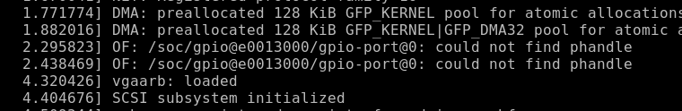


To debug the issue above, add `dump_stack()` around where the issue happens.

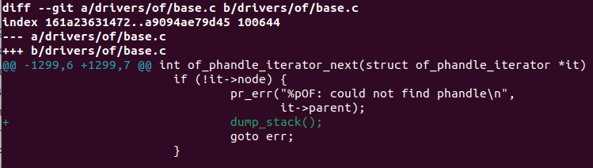


After adding `dump_stack()`, output shows function trace:

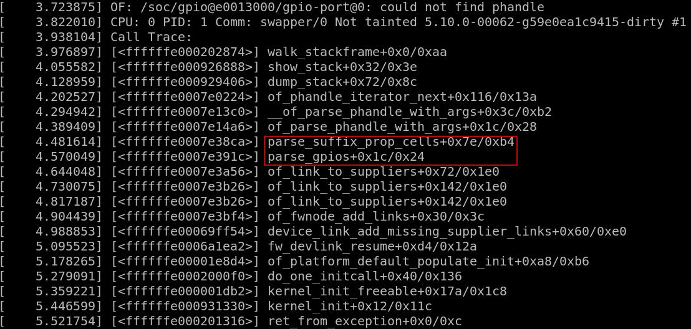

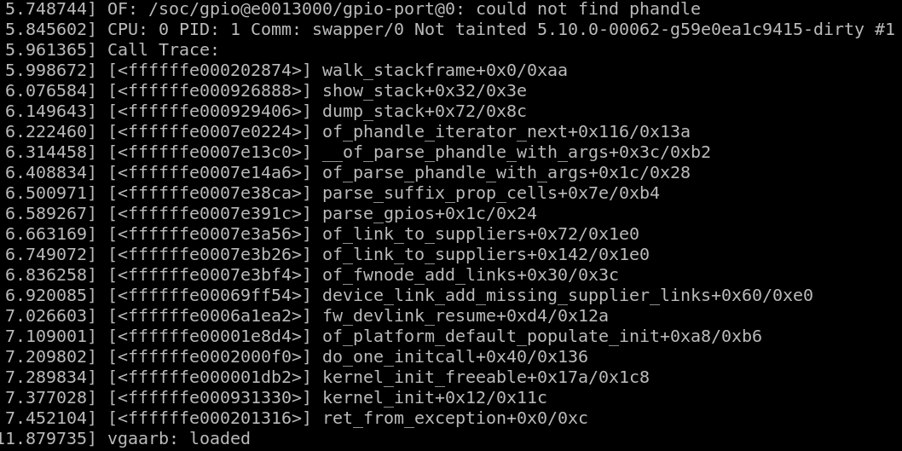


# objdump

What is this? seems very useful for kernel debugging

This is the **binutil** tools


# devmem

The `devmem` tool is often used for simpler command-line operations involving `/dev/mem`.

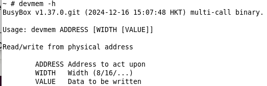


Read 32-bit width register in address `0xe00310058`:

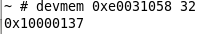


# mdio-tools

mdio-tools provide essential capabilities for managing and debugging devices on the MDIO bus.

The tool interacts with the `mdio-netlink` kernel module, which facilitates communication between user-space applications and the MDIO bus. This module handles multiple operations, stores intermediate values, and supports looping constructs, making it more powerful than traditional APIs that only supported single register reads or writes.

libmnl:

```bash
git clone https://github.com/justmirror/libmnl.git
cd libmnl
./autogen.sh 
CC=/opt/riscv64-lp64d/bin/riscv64-unknown-linux-gnu-gcc ./configure --host=riscv64-unknown-linux-gnu --prefix=/usr/local # specify the installation location
make

# install libmnl
make install DESTDIR=/opt/riscv64-lp64d/sysroot
ls /opt/riscv64-lp64d/sysroot/usr/local/lib/pkgconfig/ # make sure pkg-config can work with the lib
cat /opt/riscv64-lp64d/sysroot/usr/local/lib/pkgconfig/libmnl.pc # check the pkg-config file
```


**cross-compile** for embedded system:

```bash
git clone https://github.com/wkz/mdio-tools.git
cd mdio-tools
./autogen.sh
CC=/opt/riscv64-lp64d/bin/riscv64-unknown-linux-gnu-gcc PKG_CONFIG_PATH=/opt/riscv64-lp64d/sysroot/usr/local/lib/pkgconfig ./configure --host=riscv64-unknown-linux-gnu --prefix=/usr
make all
# The full installation path will be `$DESTDIR ## $--prefix` if specified in `./configure`
# Or, the default commbination: `$DESTDIR/user/local`
# Or, even not specifying DESTDIR: `/user/local`
make install DESTDIR=/absolute/address/of/target/rootfs
```

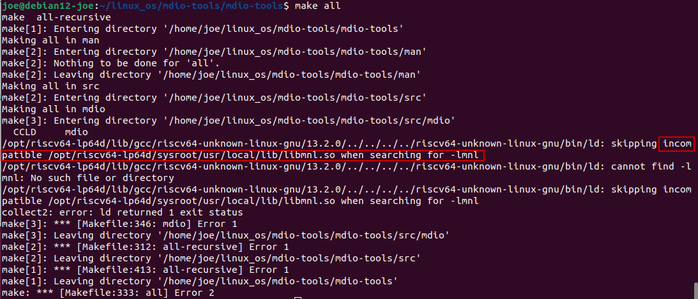

The `libmnl` may not be in correct form

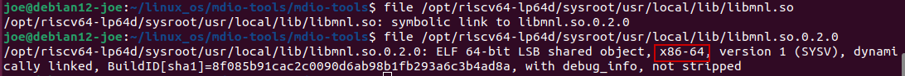

Correct this:

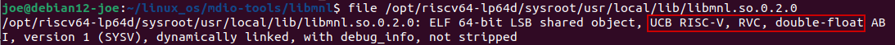

Check the mdio-tools installed correctly in rootfs:

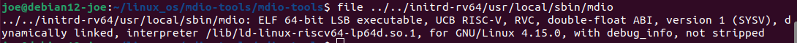

Check dynamic libraries needed:

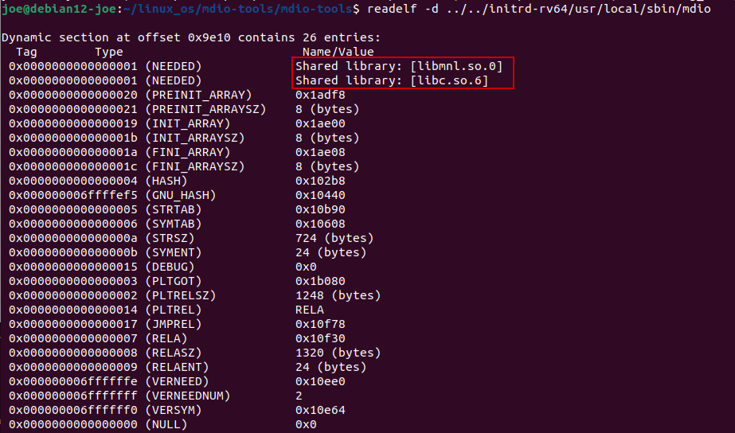

Find the missing lib and copy it to the rootfs:

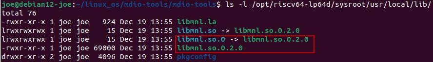

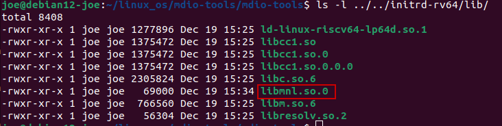

Need to add `mdio-netlink` module:

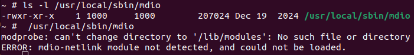

Compile the `mdio-netlink` kernel module in `kernel` and then install it to rootfs

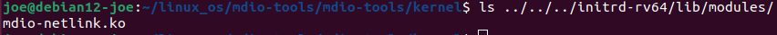

There are issues for kernel module probe. See **08_kernel_module.md** for further info.


## mdio usage

`mdio -h`: to get the help text


# Kernel Headers

Kernel headers are **a set of C header files** that define the interfaces between user-space applications (including kernel modules) and the kernel. These headers contain definitions for **system calls**, **kernel functions**, **data structures**, and **constants** that the kernel module needs to interact with the kernel. 

They are essential for compiling any code that interfaces with the kernel, such as drivers, loadable kernel modules, and certain utilities.


Install Header files from Kernel source code:

`make headers_install INSTALL_HDR_PATH=/path/to/install/header/files`
