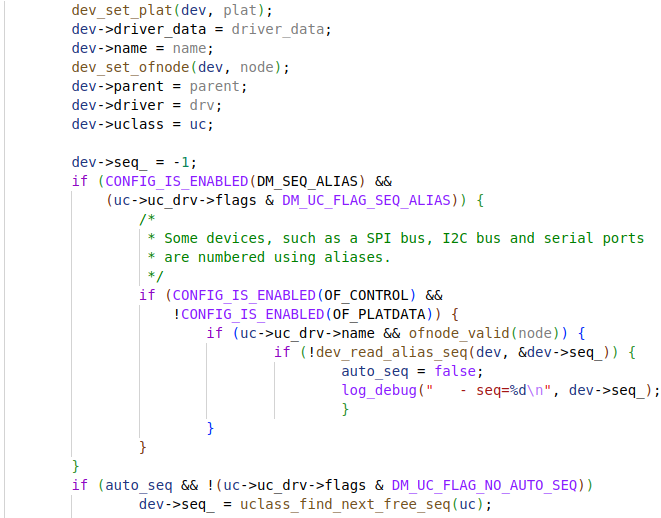
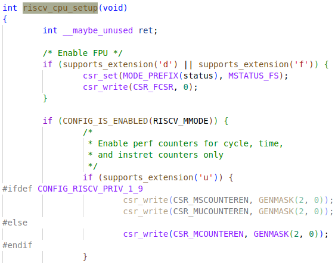
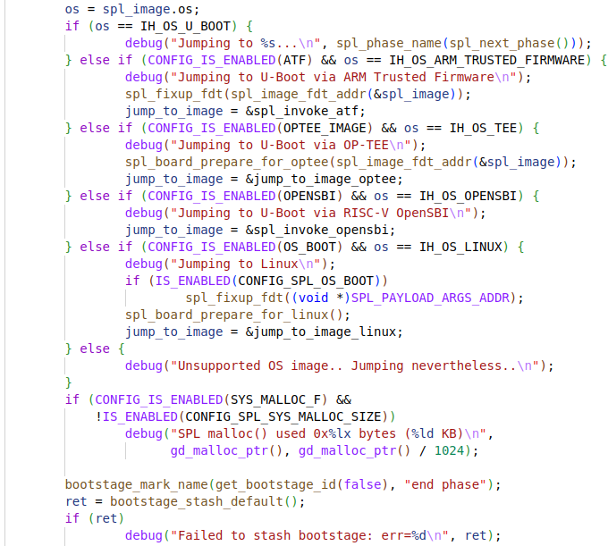
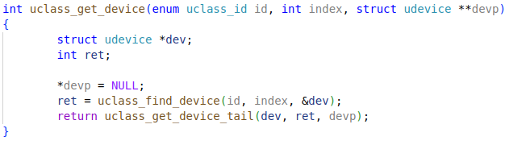
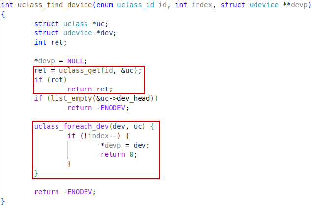
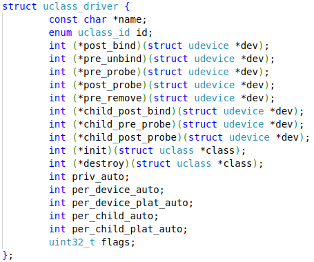
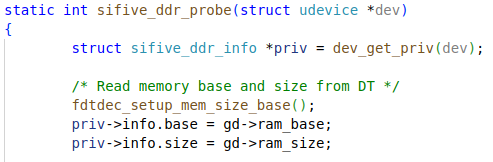

2024年3月19日


## fastboot 协议

fastboot协议是一种通过USB或以太网（UDP）与**引导加载程序**通信的机制。它的设计非常简单，可以在各种设备和运行Linux，macOS或者Windows的主机上使用。实现的基本原理就是PC机通过fastboot协议与bootloader通信。

android系统设计了2种刷机方式：fastboot和recovery。前者是镜像传输＋烧录，后者是通过恢复机制将新镜像作为备份来更新系统。uboot启动时手动进入命令行模式，再执行fastboot命令就可以进入fastboot模式，然后就可以与主机端的fastboot软件配合进行刷机。


# SPL

Stands for **Secondary Program Loader**, comparing to U-Boot proper, which is also called TPL (This is weird for riscv, as there is a OpenSBI before the TPL). This splits U-Boot into two parts: BL0 and BL1. BL0 is normally running in flash in XIP mode. It will initialize DDR and then load the BL1 part into DDR for the rest booting process.

`SPL` -> `OpenSBI` -> `U-Boot` -> `Linux`

There may also be a BootRom before SPL, which resides inside the die, called maskrom


# start.S

Everything starts from `start.S` file as usual.

_start:

`a0`, `a1`  are holding hart id and dtb pointer, when jumped from previous boot program.


Set `trap_entry`


## board_init_f_alloc_reserve

Reserve **global data** just below the CPU stacks, and return the bottom address in `a0`.


## harts_early_init

Something like I/D-cache can be set in SPL (presumably in `spl.c`) or TPL(presumably in `cpu.c`)


## hart_lottery

Pick a hart to initialize global data and run U-Boot, though the lottery way or just choose hart0.


## board_init_f_init_reserve


### global_data

Then store FDT address and boot-hart ID in `global_data` structure.


## debug_uart_init

`CONFIG_DEBUG_UART` should be configured to enable UART output.


## board_init_f


Strongly recommended to architect code here to not depend on the **availability of BSS** in `board_init_f`.

### for spl:

In `arch/riscv/lib/spl.c`, this is SPL-RISCV specific, maybe overwritten by *board-specific* implementation as it's defined as `__weak`.


Seems a more elegant way to use SPL-specific `board_init_f` is the way below in `common/spl/spl.c`, don't know why it was not adopted. Maybe because the target of evolution is not perfect, just adaptation.


### spl_early_init


#### spl_common_init


#### dm_init_and_scan


#### dm_scan


#### dm_extended_scan


#### dm_scan_fdt


#### dm_scan_fdt_node


#### lists_bind_fdt


#### device_bind_with_driver_data


#### device_bind_common





### riscv_cpu_setup




### preloader_console_init


### spl_board_init_f


This functions is defined `__weak`, so board specific impl. can overwrite it easily.

Most importantly, DDR initialization may be put in this function in board-specific implementation, or in SoC-specific.


Here is an example of DDR init. for T-head CPU, in down-stream source code. First, it initializes the DDR device, then enables cache related settings to improve system performance.


Another example from **SiFive** board:


#### spl_dram_init


Example from `fu540` CPU:


See more details about uclass implementation in the dedicated section.


### for non-spl:

This implementation is in `common/board_f.c`


The `Makefile` will only include it for **non-spl** building. `CONFIG_SPL_BUILD` is controlling objects built for SPL or TPL.


#### init_sequence_f

```c
static const init_fnc_t init_sequence_f[] = {
	setup_mon_len,
#ifdef CONFIG_OF_CONTROL
	fdtdec_setup,
#endif
#ifdef CONFIG_TRACE_EARLY
	trace_early_init,
#endif
	initf_malloc,
	log_init,
	initf_bootstage,	/* uses its own timer, so does not need DM */
	event_init,
	bloblist_maybe_init,
	setup_spl_handoff,
#if defined(CONFIG_CONSOLE_RECORD_INIT_F)
	console_record_init,
#endif
	INITCALL_EVENT(EVT_FSP_INIT_F),
	arch_cpu_init,		/* basic arch cpu dependent setup */
	mach_cpu_init,		/* SoC/machine dependent CPU setup */
	initf_dm,
#if defined(CONFIG_BOARD_EARLY_INIT_F)
	board_early_init_f,
#endif
#if defined(CONFIG_PPC) || defined(CONFIG_SYS_FSL_CLK) || defined(CONFIG_M68K)
	/* get CPU and bus clocks according to the environment variable */
	get_clocks,		/* get CPU and bus clocks (etc.) */
#endif
#if !defined(CONFIG_M68K) || (defined(CONFIG_M68K) && !defined(CONFIG_MCFTMR))
	timer_init,		/* initialize timer */
#endif
#if defined(CONFIG_BOARD_POSTCLK_INIT)
	board_postclk_init,
#endif
	env_init,		/* initialize environment */
	init_baud_rate,		/* initialze baudrate settings */
	serial_init,		/* serial communications setup */
	console_init_f,		/* stage 1 init of console */
	display_options,	/* say that we are here */
	display_text_info,	/* show debugging info if required */
	checkcpu,
#if defined(CONFIG_SYSRESET)
	print_resetinfo,
#endif
#if defined(CONFIG_DISPLAY_CPUINFO)
	print_cpuinfo,		/* display cpu info (and speed) */
#endif
#if defined(CONFIG_DTB_RESELECT)
	embedded_dtb_select,
#endif
#if defined(CONFIG_DISPLAY_BOARDINFO)
	show_board_info,
#endif
	INIT_FUNC_WATCHDOG_INIT
	INITCALL_EVENT(EVT_MISC_INIT_F),
	INIT_FUNC_WATCHDOG_RESET
#if CONFIG_IS_ENABLED(SYS_I2C_LEGACY)
	init_func_i2c,
#endif
	announce_dram_init,
	dram_init,		/* configure available RAM banks */
#ifdef CONFIG_POST
	post_init_f,
#endif
	INIT_FUNC_WATCHDOG_RESET
#if defined(CFG_SYS_DRAM_TEST)
	testdram,
#endif /* CFG_SYS_DRAM_TEST */
	INIT_FUNC_WATCHDOG_RESET

#ifdef CONFIG_POST
	init_post,
#endif
	INIT_FUNC_WATCHDOG_RESET
	/*
	 * Now that we have DRAM mapped and working, we can
	 * relocate the code and continue running from DRAM.
	 *
	 * Reserve memory at end of RAM for (top down in that order):
	 *  - area that won't get touched by U-Boot and Linux (optional)
	 *  - kernel log buffer
	 *  - protected RAM
	 *  - LCD framebuffer
	 *  - monitor code
	 *  - board info struct
	 */
	setup_dest_addr,
#if defined(CONFIG_OF_BOARD_FIXUP) && !defined(CONFIG_OF_INITIAL_DTB_READONLY)
	fix_fdt,
#endif
#ifdef CFG_PRAM
	reserve_pram,
#endif
	reserve_round_4k,
	setup_relocaddr_from_bloblist,
	arch_reserve_mmu,
	reserve_video,
	reserve_trace,
	reserve_uboot,
	reserve_malloc,
	reserve_board,
	reserve_global_data,
	reserve_fdt,
#if defined(CONFIG_OF_BOARD_FIXUP) && defined(CONFIG_OF_INITIAL_DTB_READONLY)
	reloc_fdt,
	fix_fdt,
#endif
	reserve_bootstage,
	reserve_bloblist,
	reserve_arch,
	reserve_stacks,
	dram_init_banksize,
	show_dram_config,
	INIT_FUNC_WATCHDOG_RESET
	setup_bdinfo,
	display_new_sp,
	INIT_FUNC_WATCHDOG_RESET
#if !defined(CONFIG_OF_BOARD_FIXUP) || !defined(CONFIG_OF_INITIAL_DTB_READONLY)
	reloc_fdt,
#endif
	reloc_bootstage,
	reloc_bloblist,
	setup_reloc,
#if defined(CONFIG_X86) || defined(CONFIG_ARC)
	copy_uboot_to_ram,
	do_elf_reloc_fixups,
#endif
	clear_bss,
	/*
	 * Deregister all cyclic functions before relocation, so that
	 * gd->cyclic_list does not contain any references to pre-relocation
	 * devices. Drivers will register their cyclic functions anew when the
	 * devices are probed again.
	 *
	 * This should happen as late as possible so that the window where a
	 * watchdog device is not serviced is as small as possible.
	 */
	cyclic_unregister_all,
#if !defined(CONFIG_ARM) && !defined(CONFIG_SANDBOX)
	jump_to_copy,
#endif
	NULL,
};
```


## BSS section clear


## board_init_r


This does not return.


### for spl:

In `common/spl/spl.c`





### spl_set_bd


#### bd_info


### spl_init


#### spl_common_init


### timer_init

The implementation depends on what the actual timer hard is, so it's board-specific.


### spl_soc_init


### spl_board_init


### dram_init


### dram_init_banksize


#### fdtdec_setup_memory_banksize


### for non-spl:

In `common/board_r.c`


#### init_sequence_r

```c
/*
 * Over time we hope to remove these functions with code fragments and
 * stub functions, and instead call the relevant function directly.
 *
 * We also hope to remove most of the driver-related init and do it if/when
 * the driver is later used.
 *
 * TODO: perhaps reset the watchdog in the initcall function after each call?
 */
static init_fnc_t init_sequence_r[] = {
	initr_trace,
	initr_reloc,
	event_init,
	/* TODO: could x86/PPC have this also perhaps? */
#if defined(CONFIG_ARM) || defined(CONFIG_RISCV)
	initr_caches,
	/* Note: For Freescale LS2 SoCs, new MMU table is created in DDR.
	 *	 A temporary mapping of IFC high region is since removed,
	 *	 so environmental variables in NOR flash is not available
	 *	 until board_init() is called below to remap IFC to high
	 *	 region.
	 */
#endif
	initr_reloc_global_data,
#if defined(CONFIG_SYS_INIT_RAM_LOCK) && defined(CONFIG_E500)
	initr_unlock_ram_in_cache,
#endif
	initr_barrier,
	initr_malloc,
	log_init,
	initr_bootstage,	/* Needs malloc() but has its own timer */
#if defined(CONFIG_CONSOLE_RECORD)
	console_record_init,
#endif
#ifdef CONFIG_SYS_NONCACHED_MEMORY
	noncached_init,
#endif
	initr_of_live,
#ifdef CONFIG_DM
	initr_dm,
#endif
#ifdef CONFIG_ADDR_MAP
	init_addr_map,
#endif
#if defined(CONFIG_ARM) || defined(CONFIG_RISCV) || defined(CONFIG_SANDBOX)
	board_init,	/* Setup chipselects */
#endif
	/*
	 * TODO: printing of the clock inforamtion of the board is now
	 * implemented as part of bdinfo command. Currently only support for
	 * davinci SOC's is added. Remove this check once all the board
	 * implement this.
	 */
#ifdef CONFIG_CLOCKS
	set_cpu_clk_info, /* Setup clock information */
#endif
#ifdef CONFIG_EFI_LOADER
	efi_memory_init,
#endif
	initr_binman,
#ifdef CONFIG_FSP_VERSION2
	arch_fsp_init_r,
#endif
	initr_dm_devices,
	stdio_init_tables,
	serial_initialize,
	initr_announce,
	dm_announce,
#if CONFIG_IS_ENABLED(WDT)
	initr_watchdog,
#endif
	INIT_FUNC_WATCHDOG_RESET
	arch_initr_trap,
#if defined(CONFIG_BOARD_EARLY_INIT_R)
	board_early_init_r,
#endif
	INIT_FUNC_WATCHDOG_RESET
#ifdef CONFIG_POST
	post_output_backlog,
#endif
	INIT_FUNC_WATCHDOG_RESET
#if defined(CONFIG_PCI_INIT_R) && defined(CONFIG_SYS_EARLY_PCI_INIT)
	/*
	 * Do early PCI configuration _before_ the flash gets initialised,
	 * because PCU resources are crucial for flash access on some boards.
	 */
	pci_init,
#endif
#ifdef CONFIG_ARCH_EARLY_INIT_R
	arch_early_init_r,
#endif
	power_init_board,
#ifdef CONFIG_MTD_NOR_FLASH
	initr_flash,
#endif
	INIT_FUNC_WATCHDOG_RESET
#if defined(CONFIG_PPC) || defined(CONFIG_M68K) || defined(CONFIG_X86)
	/* initialize higher level parts of CPU like time base and timers */
	cpu_init_r,
#endif
#ifdef CONFIG_EFI_LOADER
	efi_init_early,
#endif
#ifdef CONFIG_CMD_NAND
	initr_nand,
#endif
#ifdef CONFIG_CMD_ONENAND
	initr_onenand,
#endif
#ifdef CONFIG_MMC
	initr_mmc,
#endif
#ifdef CONFIG_XEN
	xen_init,
#endif
#ifdef CONFIG_PVBLOCK
	initr_pvblock,
#endif
	initr_env,
#ifdef CONFIG_SYS_MALLOC_BOOTPARAMS
	initr_malloc_bootparams,
#endif
	INIT_FUNC_WATCHDOG_RESET
	cpu_secondary_init_r,
#if defined(CONFIG_ID_EEPROM)
	mac_read_from_eeprom,
#endif
	INITCALL_EVENT(EVT_SETTINGS_R),
	INIT_FUNC_WATCHDOG_RESET
#if defined(CONFIG_PCI_INIT_R) && !defined(CONFIG_SYS_EARLY_PCI_INIT)
	/*
	 * Do pci configuration
	 */
	pci_init,
#endif
	stdio_add_devices,
	jumptable_init,
#ifdef CONFIG_API
	api_init,
#endif
	console_init_r,		/* fully init console as a device */
#ifdef CONFIG_DISPLAY_BOARDINFO_LATE
	console_announce_r,
	show_board_info,
#endif
#ifdef CONFIG_ARCH_MISC_INIT
	arch_misc_init,		/* miscellaneous arch-dependent init */
#endif
#ifdef CONFIG_MISC_INIT_R
	misc_init_r,		/* miscellaneous platform-dependent init */
#endif
	INIT_FUNC_WATCHDOG_RESET
#ifdef CONFIG_CMD_KGDB
	kgdb_init,
#endif
	interrupt_init,
#if defined(CONFIG_MICROBLAZE) || defined(CONFIG_M68K)
	timer_init,		/* initialize timer */
#endif
#if defined(CONFIG_LED_STATUS)
	initr_status_led,
#endif
	/* PPC has a udelay(20) here dating from 2002. Why? */
#ifdef CONFIG_BOARD_LATE_INIT
	board_late_init,
#endif
#ifdef CONFIG_BITBANGMII
	bb_miiphy_init,
#endif
#ifdef CONFIG_PCI_ENDPOINT
	pci_ep_init,
#endif
#ifdef CONFIG_CMD_NET
	INIT_FUNC_WATCHDOG_RESET
	initr_net,
#endif
#ifdef CONFIG_POST
	initr_post,
#endif
	INIT_FUNC_WATCHDOG_RESET
	INITCALL_EVENT(EVT_LAST_STAGE_INIT),
#if defined(CFG_PRAM)
	initr_mem,
#endif
	run_main_loop,
};
```


# Board Initialization Flow:

start-up flow for boards should apply for both SPL and U-Boot proper

`CONFIG_SPL_FRAMEWORK` is used to confirm to that SPL uses the same function names and roles of each function are the same, although it mostly uses a separate code path.


# uclass

## uclass_get_device




### uclass_find_device




#### uclass_get


##### uclass_find


##### uclass_add


###### lists_uclass_loopup


The macro below in `drivers/ram/ram-uclass.c` will add an  entry to the `__u_boot_list_2_uclass_driver`, with id = `UCLASS_RAM`


###### INIT_LIST_HEAD


#### list_empty


#### uclass_foreach_dev


##### list_for_each_entry


Doubly linked list:


#### struct uclass


##### udevice


##### uclass_driver





### uclass_get_device_tail


## device_probe


### ddr probe


### sifive_ddr_probe




### device tree node


# linker-generated arrays

Find section: `__u_boot_list_2_uclass_driver_1`

## ll_entry_start


## ll_entry_declare


## U_BOOT_DRIVER


### struct driver


## UCLASS_DRIVER


### struct uclass_driver


