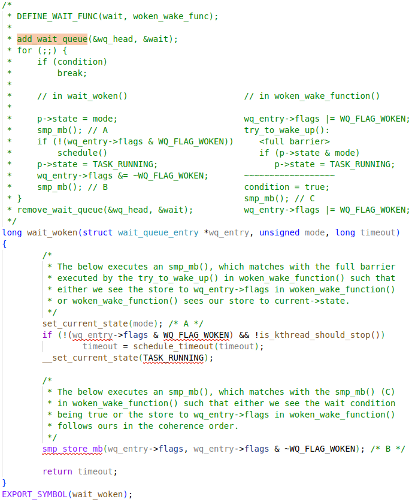

# Brief

A wait queue in the Linux kernel is a fundamental mechanism used to manage processes or thread that need to wait for a resource or event before continuing execution. Instead of busy-waiting (constantly checking if a condition is met), a process can sleep on a wait queue and be efficiently woken up when the resource becomes available.

- A wait queue is essentially a linked list of waiting processes, each represented by a structure that holds a pointer to the process's `task_struct` and a pointer to the next element in the queue.
- Processes added to a wait queue can be in either an (signal) interruptible or uninterruptable sleep state. Interruptible sleep can be interrupted by **signals**, while uninterruptible sleep cannot
- When a process needs to wait (e.g., for I/O or lock), it is added to a wait queue and put to sleep. The scheduler will suspend the process until it its explicitly woken up, usually when the awaited resource is available.
- When the event occurs, the kernel wakes up processes on the wait queue, setting their state to running so they can be scheduled again. The process removes itself from the wait queue when it resumes.
- Wait queues are for synchronizing access to resources and are a **building block** for higher-level synchronization primitives like semaphores.


```c
wait_queue_head_t my_queue;
init_waitqueue_head(&my_queue);

wait_event_interruptible(my_queue, condition_is_true());
/* The process sleeps here until condition_is_true() becomes true */

/* When condition becomes true */
wake_up_interruptable(&my_queue);
```


# wait

## DEFINE_WAIT_FUNC


### `struct` wait_queue_entry


## woken_wake_function


### default_wake_function


### try_to_wake_up

```c
/**
 * try_to_wake_up - wake up a thread
 * @p: the thread to be awakened
 * @state: the mask of task states that can be woken
 * @wake_flags: wake modifier flags (WF_*)
 *
 * Conceptually does:
 *
 *   If (@state & @p->state) @p->state = TASK_RUNNING.
 *
 * If the task was not queued/runnable, also place it back on a runqueue.
 *
 * This function is atomic against schedule() which would dequeue the task.
 *
 * It issues a full memory barrier before accessing @p->state, see the comment
 * with set_current_state().
 *
 * Uses p->pi_lock to serialize against concurrent wake-ups.
 *
 * Relies on p->pi_lock stabilizing:
 *  - p->sched_class
 *  - p->cpus_ptr
 *  - p->sched_task_group
 * in order to do migration, see its use of select_task_rq()/set_task_cpu().
 *
 * Tries really hard to only take one task_rq(p)->lock for performance.
 * Takes rq->lock in:
 *  - ttwu_runnable()    -- old rq, unavoidable, see comment there;
 *  - ttwu_queue()       -- new rq, for enqueue of the task;
 *  - psi_ttwu_dequeue() -- much sadness :-( accounting will kill us.
 *
 * As a consequence we race really badly with just about everything. See the
 * many memory barriers and their comments for details.
 *
 * Return: %true if @p->state changes (an actual wakeup was done),
 *	   %false otherwise.
 */
static int
try_to_wake_up(struct task_struct *p, unsigned int state, int wake_flags)
{
	unsigned long flags;
	int cpu, success = 0;

	preempt_disable();
	if (p == current) {
		/*
		 * We're waking current, this means 'p->on_rq' and 'task_cpu(p)
		 * == smp_processor_id()'. Together this means we can special
		 * case the whole 'p->on_rq && ttwu_runnable()' case below
		 * without taking any locks.
		 *
		 * In particular:
		 *  - we rely on Program-Order guarantees for all the ordering,
		 *  - we're serialized against set_special_state() by virtue of
		 *    it disabling IRQs (this allows not taking ->pi_lock).
		 */
		if (!(p->state & state))
			goto out;

		success = 1;
		trace_sched_waking(p);
		p->state = TASK_RUNNING;
		trace_sched_wakeup(p);
		goto out;
	}

	/*
	 * If we are going to wake up a thread waiting for CONDITION we
	 * need to ensure that CONDITION=1 done by the caller can not be
	 * reordered with p->state check below. This pairs with smp_store_mb()
	 * in set_current_state() that the waiting thread does.
	 */
	raw_spin_lock_irqsave(&p->pi_lock, flags);
	smp_mb__after_spinlock();
	if (!(p->state & state))
		goto unlock;

	trace_sched_waking(p);

	/* We're going to change ->state: */
	success = 1;

	/*
	 * Ensure we load p->on_rq _after_ p->state, otherwise it would
	 * be possible to, falsely, observe p->on_rq == 0 and get stuck
	 * in smp_cond_load_acquire() below.
	 *
	 * sched_ttwu_pending()			try_to_wake_up()
	 *   STORE p->on_rq = 1			  LOAD p->state
	 *   UNLOCK rq->lock
	 *
	 * __schedule() (switch to task 'p')
	 *   LOCK rq->lock			  smp_rmb();
	 *   smp_mb__after_spinlock();
	 *   UNLOCK rq->lock
	 *
	 * [task p]
	 *   STORE p->state = UNINTERRUPTIBLE	  LOAD p->on_rq
	 *
	 * Pairs with the LOCK+smp_mb__after_spinlock() on rq->lock in
	 * __schedule().  See the comment for smp_mb__after_spinlock().
	 *
	 * A similar smb_rmb() lives in try_invoke_on_locked_down_task().
	 */
	smp_rmb();
	if (READ_ONCE(p->on_rq) && ttwu_runnable(p, wake_flags))
		goto unlock;

#ifdef CONFIG_SMP
	/*
	 * Ensure we load p->on_cpu _after_ p->on_rq, otherwise it would be
	 * possible to, falsely, observe p->on_cpu == 0.
	 *
	 * One must be running (->on_cpu == 1) in order to remove oneself
	 * from the runqueue.
	 *
	 * __schedule() (switch to task 'p')	try_to_wake_up()
	 *   STORE p->on_cpu = 1		  LOAD p->on_rq
	 *   UNLOCK rq->lock
	 *
	 * __schedule() (put 'p' to sleep)
	 *   LOCK rq->lock			  smp_rmb();
	 *   smp_mb__after_spinlock();
	 *   STORE p->on_rq = 0			  LOAD p->on_cpu
	 *
	 * Pairs with the LOCK+smp_mb__after_spinlock() on rq->lock in
	 * __schedule().  See the comment for smp_mb__after_spinlock().
	 *
	 * Form a control-dep-acquire with p->on_rq == 0 above, to ensure
	 * schedule()'s deactivate_task() has 'happened' and p will no longer
	 * care about it's own p->state. See the comment in __schedule().
	 */
	smp_acquire__after_ctrl_dep();

	/*
	 * We're doing the wakeup (@success == 1), they did a dequeue (p->on_rq
	 * == 0), which means we need to do an enqueue, change p->state to
	 * TASK_WAKING such that we can unlock p->pi_lock before doing the
	 * enqueue, such as ttwu_queue_wakelist().
	 */
	p->state = TASK_WAKING;

	/*
	 * If the owning (remote) CPU is still in the middle of schedule() with
	 * this task as prev, considering queueing p on the remote CPUs wake_list
	 * which potentially sends an IPI instead of spinning on p->on_cpu to
	 * let the waker make forward progress. This is safe because IRQs are
	 * disabled and the IPI will deliver after on_cpu is cleared.
	 *
	 * Ensure we load task_cpu(p) after p->on_cpu:
	 *
	 * set_task_cpu(p, cpu);
	 *   STORE p->cpu = @cpu
	 * __schedule() (switch to task 'p')
	 *   LOCK rq->lock
	 *   smp_mb__after_spin_lock()		smp_cond_load_acquire(&p->on_cpu)
	 *   STORE p->on_cpu = 1		LOAD p->cpu
	 *
	 * to ensure we observe the correct CPU on which the task is currently
	 * scheduling.
	 */
	if (smp_load_acquire(&p->on_cpu) &&
	    ttwu_queue_wakelist(p, task_cpu(p), wake_flags | WF_ON_CPU))
		goto unlock;

	/*
	 * If the owning (remote) CPU is still in the middle of schedule() with
	 * this task as prev, wait until its done referencing the task.
	 *
	 * Pairs with the smp_store_release() in finish_task().
	 *
	 * This ensures that tasks getting woken will be fully ordered against
	 * their previous state and preserve Program Order.
	 */
	smp_cond_load_acquire(&p->on_cpu, !VAL);

	cpu = select_task_rq(p, p->wake_cpu, SD_BALANCE_WAKE, wake_flags);
	if (task_cpu(p) != cpu) {
		if (p->in_iowait) {
			delayacct_blkio_end(p);
			atomic_dec(&task_rq(p)->nr_iowait);
		}

		wake_flags |= WF_MIGRATED;
		psi_ttwu_dequeue(p);
		set_task_cpu(p, cpu);
	}
#else
	cpu = task_cpu(p);
#endif /* CONFIG_SMP */

	ttwu_queue(p, cpu, wake_flags);
unlock:
	raw_spin_unlock_irqrestore(&p->pi_lock, flags);
out:
	if (success)
		ttwu_stat(p, task_cpu(p), wake_flags);
	preempt_enable();

	return success;
}
```


## add_wait_queue


### struct wait_queue_head


### __add_wait_queue

```c
static inline void __add_wait_queue(struct wait_queue_head *wq_head, struct wait_queue_entry *wq_entry)
{
	list_add(&wq_entry->entry, &wq_head->head);
}
```


## wait_woken



`schedule_timeout` will sleep until timeout, or woken up by signals if `TASK_INTERRUPTIBLE` flag was set by `set_current_state()`.  See `preemption` doc for explanation about scheduling.


# wait queue


## waitqueue_active


## __wake_up


